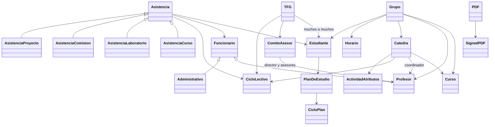
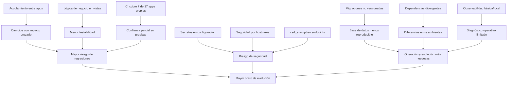

# Entrega 2: Auditoría profunda de diseño, calidad y riesgos

**Curso:** IE0417 - Diseño de Software para Ingeniería  
**Sistema auditado:** EIEInfo  
**Tipo de entrega:** Auditoría profunda de diseño, calidad y riesgos  
**Estudiante:** Erick Vargas Monge  
**Carné:** C08215  
**Fecha:** 16 de junio de 2026  

---

## 1. Alcance y tesis de auditoría

Esta segunda entrega profundiza el diagnóstico inicial de la Entrega 1 mediante una auditoría estática del repositorio. El análisis se realiza sin ejecutar el sistema ni las pruebas, por lo que las conclusiones se basan en evidencia observable directamente en archivos del proyecto.

La tesis principal de esta auditoría es que EIEInfo presenta varios problemas relacionados entre sí: alto acoplamiento entre apps, lógica de negocio distribuida en vistas, formularios y modelos, pruebas parciales, configuración operativa frágil y riesgos de seguridad observables. Estos elementos hacen que los cambios futuros sean más costosos, más difíciles de probar y más riesgosos de operar.

En esta entrega no solo se listan hallazgos, sino que se busca explicar por qué importan, qué atributos de calidad afectan y cómo se relacionan entre sí.

---

---

## 2. Metodología

La auditoría se realizó mediante inspección estática del repositorio. No se ejecutó el sistema ni la suite de pruebas; por lo tanto, los hallazgos se basan en evidencia observable en archivos, rutas, modelos, vistas, formularios, configuración, scripts, Docker y CI/CD.

El análisis se construyó de forma incremental a partir de la Entrega 1. Primero se validaron las evidencias principales y luego se profundizó por secciones: atributos de calidad, auditoría modular, dominio, calidad del código, pruebas, seguridad, operación y hallazgos consolidados.

Para evitar sobreafirmaciones, esta versión aplica las siguientes correcciones metodológicas:

- Se evita usar una cifra anterior incorrecta de apps registradas.
- Se indica que hay 47 entradas totales en `INSTALLED_APPS`, de las cuales 17 son apps propias registradas.
- Se indica que el CI cubre 7 de esas 17 apps propias registradas.
- No se reproducen valores reales de secretos.
- En acciones destructivas sin `require_POST`, se usa `atributos` como evidencia principal.
- En observabilidad, se afirma únicamente que hay observabilidad básica/local y que no se evidencia métricas, health checks o tracing desde el repositorio.
- En seguridad por hostname, se plantea como riesgo si se despliega con hostname distinto, no como afirmación de que producción actual esté necesariamente en modo debug.

---

## 3. Evaluación por atributos de calidad

La evaluación se basa en evidencia validada del repositorio. Se corrige la escala real del sistema: `INSTALLED_APPS` contiene 47 entradas, de las cuales 17 corresponden a apps propias registradas (`src/server/eieinfo/settings.py:44-93`, especialmente `:56-73`). El CI ejecuta cobertura sobre 7 de esas 17 apps propias (`.drone.yml:263-274`).

### 3.1 Mantenibilidad

| Aspecto | Evaluación |
|---|---|
| Definición aplicada | Facilidad para comprender, corregir y evolucionar el sistema sin introducir regresiones. |
| Evaluación del sistema | La mantenibilidad es limitada por vistas extensas, lógica de negocio mezclada con presentación/controlador, código histórico comentado y dependencias transversales entre apps. |
| Fortalezas observadas | El sistema está dividido en apps Django explícitas y registradas, lo que da una base modular inicial (`src/server/eieinfo/settings.py:56-73`). También existen pruebas relevantes en módulos como firma digital (`src/server/firma_digital/tests.py:19-41`). |
| Debilidades observadas | Hay vistas con muchas responsabilidades, por ejemplo `resumen_ciclo` concentra cálculos, consultas y mensajes operativos (`src/server/profesores/views/consejo_asesor.py:224-381`). En TFG, una vista valida reglas, crea entidades, adjunta documentos y envía correos (`src/server/trabajo_final_de_graduacion/views.py:489-648`). También existe código histórico comentado asociado a TFG (`src/server/trabajos_finales/models.py:628-635`; `src/server/estudiantes/views/trabajos_finales.py:217-324`). |
| Evidencia concreta | `src/server/eieinfo/settings.py:44-93`; `src/server/profesores/views/consejo_asesor.py:224-381`; `src/server/trabajo_final_de_graduacion/views.py:489-648`; `src/server/trabajos_finales/models.py:628-635`. |
| Consecuencia técnica | Cambios funcionales requieren leer y modificar bloques grandes, con mayor riesgo de romper reglas de negocio no aisladas. |
| Severidad | Alta |
| Recomendación inicial | Extraer reglas de negocio críticas a servicios de dominio o casos de uso, empezando por TFG y consejo asesor; eliminar o aislar código histórico comentado. |

### 3.2 Modificabilidad

| Aspecto | Evaluación |
|---|---|
| Definición aplicada | Capacidad de introducir cambios localizados sin afectar múltiples módulos no relacionados. |
| Evaluación del sistema | La modificabilidad es baja-media porque cambios en conceptos centrales como estudiante, profesor, ciclo, curso o TFG tienden a atravesar varias apps. |
| Fortalezas observadas | Algunos conceptos están modelados explícitamente, como `Funcionario`, `Profesor`, `Administrativo`, `Estudiante`, `Catedra`, `Grupo` y `TFG`, lo que permite identificar puntos de dominio (`src/server/administrativos/models.py:317-389`; `src/server/profesores/models.py:47-82`; `src/server/estudiantes/models.py:109-144`; `src/server/cursos/models.py:472-575`; `src/server/trabajo_final_de_graduacion/models.py:116-135`). |
| Debilidades observadas | Existen imports directos entre apps de dominio y presentación. `consejo_asesor.py` importa modelos, formularios, vistas y utilidades de varias apps (`src/server/profesores/views/consejo_asesor.py:9-42`). `cursos.models` depende de `administrativos`, `profesores`, `webpage` y utilidades globales (`src/server/cursos/models.py:3-12`). |
| Evidencia concreta | `src/server/profesores/views/consejo_asesor.py:9-42`; `src/server/cursos/models.py:3-12`; `src/server/webpage/misc.py:3-11`. |
| Consecuencia técnica | Un cambio aparentemente local puede requerir ajustes en varias apps, aumentando costo de evolución y probabilidad de regresiones. |
| Severidad | Alta |
| Recomendación inicial | Definir límites de dominio más claros y reemplazar imports transversales por servicios compartidos bien delimitados o interfaces internas. |

### 3.3 Cohesión

| Aspecto | Evaluación |
|---|---|
| Definición aplicada | Grado en que cada módulo agrupa responsabilidades relacionadas y mantiene un propósito claro. |
| Evaluación del sistema | La cohesión es irregular: algunas apps representan conceptos claros, pero varias vistas y formularios mezclan autenticación, sesión, reglas de negocio, persistencia y comunicación. |
| Fortalezas observadas | Apps como `firma_digital` tienen un dominio identificable alrededor de PDFs, firmantes y documentos firmados (`src/server/firma_digital/models.py:57-67`; `src/server/firma_digital/models.py:135-139`). |
| Debilidades observadas | La creación de TFG mezcla validaciones académicas, persistencia, documentos complementarios y notificaciones (`src/server/trabajo_final_de_graduacion/views.py:489-648`). Los formularios de autenticación también administran sesiones manualmente (`src/server/profesores/forms.py:57-79`; `src/server/administrativos/forms.py:46-62`; `src/server/estudiantes/forms.py:91-123`). |
| Evidencia concreta | `src/server/trabajo_final_de_graduacion/views.py:489-648`; `src/server/profesores/forms.py:57-79`; `src/server/administrativos/forms.py:46-62`; `src/server/estudiantes/forms.py:91-123`. |
| Consecuencia técnica | Es más difícil probar, reutilizar o reemplazar una responsabilidad sin tocar otras. |
| Severidad | Alta |
| Recomendación inicial | Separar responsabilidades por capas: formularios para validación de entrada, servicios para reglas de negocio, repositorios/ORM para persistencia y adaptadores para notificaciones. |

### 3.4 Acoplamiento

| Aspecto | Evaluación |
|---|---|
| Definición aplicada | Nivel de dependencia entre módulos, apps y capas del sistema. |
| Evaluación del sistema | El acoplamiento es alto, especialmente entre apps propias y entre vistas, modelos y utilidades. |
| Fortalezas observadas | El uso de Django apps permite al menos identificar unidades de despliegue lógico (`src/server/eieinfo/settings.py:56-73`). |
| Debilidades observadas | `profesores.views.consejo_asesor` importa directamente modelos y utilidades de `administrativos`, `estudiantes`, `laboratorios`, `proyectos`, `cursos` y otras partes de `profesores` (`src/server/profesores/views/consejo_asesor.py:9-42`). `webpage.misc` concentra imports de anuncios, eventos, estudiantes, profesores, laboratorios, proyectos y administrativos (`src/server/webpage/misc.py:3-11`). |
| Evidencia concreta | `src/server/profesores/views/consejo_asesor.py:9-42`; `src/server/webpage/misc.py:3-11`; `src/server/cursos/models.py:3-12`. |
| Consecuencia técnica | Cambios en modelos o utilidades compartidas pueden generar efectos colaterales difíciles de anticipar. |
| Severidad | Alta |
| Recomendación inicial | Mapear dependencias entre apps y priorizar desacoplamiento en módulos núcleo: cursos, profesores, estudiantes, administrativos y TFG. |

### 3.5 Testabilidad

| Aspecto | Evaluación |
|---|---|
| Definición aplicada | Facilidad para verificar reglas y comportamientos mediante pruebas automatizadas confiables. |
| Evaluación del sistema | La testabilidad es parcial. Hay pruebas existentes, pero la cobertura automatizada del CI no alcanza todas las apps propias registradas. |
| Fortalezas observadas | Existen suites relevantes, por ejemplo `firma_digital` tiene pruebas con sesiones y `force_login` (`src/server/firma_digital/tests.py:19-41`). |
| Debilidades observadas | El CI ejecuta cobertura sobre 7 apps propias: `profesores`, `administrativos`, `estudiantes`, `cursos`, `webpage`, `trabajo_final_de_graduacion` y `postulaciones` (`.drone.yml:263-274`), frente a 17 apps propias registradas (`src/server/eieinfo/settings.py:56-73`). También hay apps con archivo de pruebas vacío o mínimo, como `trabajos_finales` (`src/server/trabajos_finales/tests.py:1-3`). Algunos tests dependen de fixtures productivos o IDs fijos (`src/server/proyecto_electrico/tests.py:17-28`). |
| Evidencia concreta | `.drone.yml:263-274`; `src/server/eieinfo/settings.py:56-73`; `src/server/trabajos_finales/tests.py:1-3`; `src/server/proyecto_electrico/tests.py:17-28`. |
| Consecuencia técnica | El CI puede aprobar cambios que rompen apps no incluidas o comportamientos dependientes de datos específicos. |
| Severidad | Alta |
| Recomendación inicial | Ampliar gradualmente la matriz del CI hasta cubrir las 17 apps propias registradas y reemplazar fixtures frágiles por datos de prueba controlados. |

### 3.6 Seguridad básica

| Aspecto | Evaluación |
|---|---|
| Definición aplicada | Protección mínima frente a exposición de secretos, CSRF, sesiones inconsistentes y acciones destructivas indebidas. |
| Evaluación del sistema | La seguridad básica requiere atención prioritaria. Hay controles existentes, pero también configuraciones y endpoints con riesgo. |
| Fortalezas observadas | Existen ajustes de cookies seguras cuando el hostname coincide con el entorno esperado (`src/server/eieinfo/settings.py:475-490`). También hay límites operativos de carga en Nginx (`conf/etc/nginx/sites-available/eieinfo:37-57`). |
| Debilidades observadas | Hay credenciales y claves configuradas directamente en `settings.py`; no se reproducen sus valores reales (`src/server/eieinfo/settings.py:342-344`; `src/server/eieinfo/settings.py:427-429`). Existen vistas con `csrf_exempt` (`src/server/webpage/views.py:375-384`; `src/server/conferencias/views.py:43-60`; `src/server/firma_digital/views.py:410-418`). También hay acciones destructivas sin validación explícita de método POST en `atributos` (`src/server/atributos/views.py:200-213`; `:216-229`; `:296-317`). |
| Evidencia concreta | `src/server/eieinfo/settings.py:342-344`; `src/server/eieinfo/settings.py:427-429`; `src/server/webpage/views.py:375-384`; `src/server/conferencias/views.py:43-60`; `src/server/firma_digital/views.py:410-418`; `src/server/atributos/views.py:200-317`. |
| Consecuencia técnica | Aumenta el riesgo de exposición accidental, solicitudes no protegidas, comportamiento inconsistente de autenticación y modificaciones por métodos no esperados. |
| Severidad | Crítica |
| Recomendación inicial | Mover secretos a variables de entorno, revisar cada `csrf_exempt`, exigir `require_POST` en acciones destructivas y unificar el manejo de sesión/autenticación. |

### 3.7 Consistencia arquitectónica

| Aspecto | Evaluación |
|---|---|
| Definición aplicada | Grado en que el sistema sigue decisiones arquitectónicas uniformes sobre capas, dependencias, configuración, migraciones y dominio. |
| Evaluación del sistema | La consistencia arquitectónica es baja-media: hay estructura Django reconocible, pero varias reglas arquitectónicas no son uniformes. |
| Fortalezas observadas | La configuración central, URLs y apps propias están declaradas de forma explícita (`src/server/eieinfo/settings.py:44-93`; `src/server/eieinfo/urls.py:23-68`). |
| Debilidades observadas | Las migraciones no se tratan como artefactos versionados estables: el README indica marcarlas como `assume-unchanged`, eliminarlas y regenerarlas (`README.md:106-114`), y el CI también borra migraciones antes de generar nuevas (`.drone.yml:97-102`). Además, existen dependencias divergentes entre `requirements.txt` y `docker/django/requirements.txt`, incluyendo fuentes distintas para `django-wiki` (`requirements.txt:46-47`; `docker/django/requirements.txt:51-53`). |
| Evidencia concreta | `README.md:106-114`; `.drone.yml:97-102`; `requirements.txt:46-47`; `docker/django/requirements.txt:12-18`; `docker/django/requirements.txt:51-53`. |
| Consecuencia técnica | Diferentes entornos pueden comportarse distinto, y los cambios de esquema pueden ser difíciles de auditar o reproducir. |
| Severidad | Alta |
| Recomendación inicial | Versionar migraciones como contrato de evolución del esquema y consolidar una única estrategia de dependencias para desarrollo, CI y despliegue. |

### 3.8 Observabilidad operativa

| Aspecto | Evaluación |
|---|---|
| Definición aplicada | Capacidad de diagnosticar fallos, auditar eventos y entender el comportamiento del sistema en operación. |
| Evaluación del sistema | La observabilidad es básica: hay logging configurado, pero también salidas por `print` y no se observa evidencia de métricas, trazas o health checks. |
| Fortalezas observadas | Django tiene configuración de logging con archivos, consola y envío a administradores (`src/server/eieinfo/settings.py:238-293`). La configuración de systemd y Nginx define logs de acceso/error (`conf/etc/systemd/system/eieinfo.service:10-17`; `conf/etc/nginx/sites-available/eieinfo:37-57`). |
| Debilidades observadas | Hay diagnósticos mediante `print`, por ejemplo en vistas de `webpage` y modelos de `estudiantes` (`src/server/webpage/views.py:88-94`; `src/server/webpage/views.py:211-218`; `src/server/estudiantes/models.py:1209-1219`). No se validó evidencia de métricas, tracing distribuido ni endpoint de salud. |
| Evidencia concreta | `src/server/eieinfo/settings.py:238-293`; `conf/etc/systemd/system/eieinfo.service:10-17`; `conf/etc/nginx/sites-available/eieinfo:37-57`; `src/server/webpage/views.py:88-94`; `src/server/webpage/views.py:211-218`; `src/server/estudiantes/models.py:1209-1219`. |
| Consecuencia técnica | Ante fallos en producción, el diagnóstico depende de logs parciales y mensajes no estructurados, lo que retrasa análisis de causa raíz. |
| Severidad | Media |
| Recomendación inicial | Sustituir `print` por logging estructurado, definir eventos operativos clave y agregar health checks/métricas mínimas para rutas críticas. |

---

## 4. Auditoría modular de módulos clave

Nota de escala: `INSTALLED_APPS` contiene 47 entradas, de las cuales 17 son apps propias registradas (`src/server/eieinfo/settings.py:44-93`). El CI cubre 7 de esas 17 apps propias (`.drone.yml:263-274`).

Se seleccionan seis áreas clave para cumplir el alcance de la Entrega 2: el núcleo de configuración/ruteo y cinco módulos funcionales críticos.

### 4.1 `eieinfo`

| Aspecto | Auditoría |
|---|---|
| Responsabilidad principal esperada | Configuración raíz del proyecto Django: apps instaladas, rutas globales, seguridad, logging y parámetros operativos. |
| Responsabilidades reales observadas | Centraliza configuración, ruteo de portales, logging, variables de seguridad, credenciales y comportamiento por hostname. |
| Archivos principales | `src/server/eieinfo/settings.py`, `src/server/eieinfo/urls.py`, `src/server/eieinfo/misc.py`. |
| Dependencias hacia otros módulos | Orquesta rutas hacia múltiples apps propias: `estudiantes`, `profesores`, `administrativos`, `cursos`, `trabajo_final_de_graduacion`, `firma_digital`, entre otras (`src/server/eieinfo/urls.py:23-68`). |
| Fortalezas | Existe una configuración central clara para apps y URLs. Las 17 apps propias están registradas explícitamente (`src/server/eieinfo/settings.py:56-73`). También hay logging configurado (`src/server/eieinfo/settings.py:238-293`). |
| Debilidades | Hay secretos configurados directamente en `settings.py`; se omiten sus valores reales en este documento (`src/server/eieinfo/settings.py:342-344`; `src/server/eieinfo/settings.py:427-429`). La seguridad depende del hostname: si no es `faraday`, se activa `DEBUG=True` y `ALLOWED_HOSTS=['*']` (`src/server/eieinfo/settings.py:475-490`). |
| Riesgos de cambio | Cambios en configuración o ruteo pueden afectar transversalmente a muchos módulos. La divergencia entre entorno esperado y hostname real puede cambiar el perfil de seguridad. |
| Recomendación inicial | Separar secretos a variables de entorno, definir perfiles explícitos de configuración y revisar el orden/alcance de rutas globales. |
| Evidencia | `src/server/eieinfo/settings.py:44-93`, `:238-293`, `:342-344`, `:427-429`, `:475-490`; `src/server/eieinfo/urls.py:23-68`; `.drone.yml:263-274`. |

### 4.2 `profesores`

| Aspecto | Auditoría |
|---|---|
| Responsabilidad principal esperada | Gestionar el portal de profesores, perfiles docentes y funciones académicas asociadas. |
| Responsabilidades reales observadas | Además del portal docente, concentra lógica de consejo asesor, cargas académicas, nombramientos, asistencias, anuncios/eventos y autenticación/sesión. |
| Archivos principales | `src/server/profesores/models.py`, `src/server/profesores/forms.py`, `src/server/profesores/views/consejo_asesor.py`, `src/server/profesores/views/noticias.py`, `src/server/profesores/misc.py`. |
| Dependencias hacia otros módulos | Importa directamente `administrativos`, `estudiantes`, `laboratorios`, `proyectos`, `cursos`, `anuncios`, `eventos` y utilidades de `eieinfo` (`src/server/profesores/views/consejo_asesor.py:9-42`; `src/server/profesores/views/noticias.py:11-18`). |
| Fortalezas | El modelo `Profesor` especializa a `Funcionario`, lo que da una jerarquía de dominio explícita (`src/server/profesores/models.py:47-82`). |
| Debilidades | `consejo_asesor.py` concentra consultas, cálculos de carga, filtros y reglas de gestión en vistas extensas (`src/server/profesores/views/consejo_asesor.py:224-245`; `:1288-1305`). El login combina `django_login` con claves manuales de sesión (`src/server/profesores/forms.py:66-79`). |
| Riesgos de cambio | Modificar reglas de carga, ciclos, asistencias o nombramientos puede impactar varias apps por el acoplamiento directo. |
| Recomendación inicial | Extraer reglas de consejo asesor a servicios de dominio y reducir dependencias directas desde vistas. Unificar el esquema de sesión con el resto del sistema. |
| Evidencia | `src/server/profesores/models.py:47-82`; `src/server/profesores/forms.py:57-79`; `src/server/profesores/views/consejo_asesor.py:9-42`, `:224-245`, `:1288-1305`; `src/server/profesores/views/noticias.py:11-18`. |

### 4.3 `estudiantes`

| Aspecto | Auditoría |
|---|---|
| Responsabilidad principal esperada | Gestionar cuentas, portal estudiantil, información académica del estudiante y procesos asociados. |
| Responsabilidades reales observadas | Además del portal estudiantil, modela estudiantes, planes, asistencias polimórficas, vínculos con cursos, laboratorios, proyectos y funcionarios. |
| Archivos principales | `src/server/estudiantes/models.py`, `src/server/estudiantes/forms.py`, `src/server/estudiantes/views/trabajos_finales.py`. |
| Dependencias hacia otros módulos | Importa utilidades de `eieinfo`, `administrativos`, `cursos`, `laboratorios` y `proyectos` (`src/server/estudiantes/models.py:11-19`). |
| Fortalezas | El modelo `Estudiante` recoge identidad y plan de estudio (`src/server/estudiantes/models.py:109-144`). La jerarquía `Asistencia` permite representar variantes mediante polimorfismo (`src/server/estudiantes/models.py:354-380`; `:458-617`). |
| Debilidades | La app combina identidad, autenticación, dominio académico y asistencias. El login estudiantil escribe sesión manualmente y no muestra `django_login` en el fragmento validado (`src/server/estudiantes/forms.py:101-123`). También existe código histórico comentado de trabajos finales en vistas (`src/server/estudiantes/views/trabajos_finales.py:217-324`). |
| Riesgos de cambio | Cambios en estudiante o asistencia impactan cursos, proyectos, laboratorios, profesores y TFG. La sesión personalizada complica pruebas y control de acceso uniforme. |
| Recomendación inicial | Separar identidad/sesión del dominio académico y revisar qué lógica de trabajos finales debe migrarse o eliminarse. |
| Evidencia | `src/server/estudiantes/models.py:11-19`, `:109-144`, `:354-380`, `:458-617`; `src/server/estudiantes/forms.py:91-123`; `src/server/estudiantes/views/trabajos_finales.py:217-324`. |

### 4.4 `cursos`

| Aspecto | Auditoría |
|---|---|
| Responsabilidad principal esperada | Gestionar cursos, planes de estudio, cátedras, grupos y horarios. |
| Responsabilidades reales observadas | Además de cursos y grupos, conecta carga docente, ciclos, horarios, plan de estudios, estudiantes y acreditación/atributos. |
| Archivos principales | `src/server/cursos/models.py`, `src/server/cursos/forms.py`, `src/server/cursos/urls.py`. |
| Dependencias hacia otros módulos | Importa `administrativos`, `profesores`, `webpage` y utilidades de `eieinfo`; también usa `administrativos.Ciclo` con alias `AdminCiclo` (`src/server/cursos/models.py:3-12`). `Catedra` referencia actividades de `atributos` (`src/server/cursos/models.py:472-485`). |
| Fortalezas | Modela entidades académicas centrales: `Catedra`, `Grupo` y `Ciclo` de plan de estudios (`src/server/cursos/models.py:472-575`; `:827-845`). |
| Debilidades | Hay ambigüedad conceptual con dos clases llamadas `Ciclo`: ciclo lectivo en `administrativos` y bloque de plan de estudios en `cursos` (`src/server/administrativos/models.py:204-226`; `src/server/cursos/models.py:827-845`). |
| Riesgos de cambio | Cambios en cursos o ciclos pueden confundirse entre calendario académico y estructura del plan de estudios. Esto puede introducir errores de dominio difíciles de detectar. |
| Recomendación inicial | Renombrar conceptualmente en documentación y diseño: `CicloLectivo` para `administrativos.Ciclo` y `CicloPlan` o `BloquePlan` para `cursos.Ciclo`. |
| Evidencia | `src/server/cursos/models.py:3-12`, `:472-575`, `:827-845`; `src/server/administrativos/models.py:204-226`. |

### 4.5 `trabajo_final_de_graduacion`

| Aspecto | Auditoría |
|---|---|
| Responsabilidad principal esperada | Gestionar el flujo de Trabajos Finales de Graduación: propuesta, comité asesor, estados, revisión, defensa y comunicación. |
| Responsabilidades reales observadas | Modela TFG, comité asesor, estados y archivos; además, las vistas ejecutan validaciones académicas, creación de objetos, asociación de estudiantes, documentos complementarios y envío de correos. |
| Archivos principales | `src/server/trabajo_final_de_graduacion/models.py`, `src/server/trabajo_final_de_graduacion/views.py`, `src/server/trabajo_final_de_graduacion/forms.py`, `src/server/trabajo_final_de_graduacion/urls.py`. |
| Dependencias hacia otros módulos | Importa `Estudiante`, `Profesor`, `Ciclo` administrativo y utilidades de correo de `eieinfo` (`src/server/trabajo_final_de_graduacion/models.py:1-6`). En vistas consulta comisión de administrativos y estudiantes asociados (`src/server/trabajo_final_de_graduacion/views.py:601-644`). |
| Fortalezas | El dominio nuevo de TFG está explícito: `ComiteAsesor`, relación muchos-a-muchos con estudiantes, archivos y estado (`src/server/trabajo_final_de_graduacion/models.py:116-140`). |
| Debilidades | La vista de creación concentra muchas reglas: validación IE0599, validación de estudiantes adicionales, creación de comité/TFG/documentos y envío de correos (`src/server/trabajo_final_de_graduacion/views.py:489-648`). Hay un bug probable: el modelo define `estudiantes`, pero `NotificarEstudiante()` usa `self.estudiante` (`src/server/trabajo_final_de_graduacion/models.py:124-154`). |
| Riesgos de cambio | Cambiar estados, reglas de propuesta o notificaciones puede romper múltiples pasos del flujo porque están acoplados en una misma vista. El bug `self.estudiante` puede fallar en ejecución si se invoca ese método. |
| Recomendación inicial | Extraer un servicio de caso de uso para creación/revisión de TFG y corregir o eliminar `NotificarEstudiante()` según el modelo real muchos-a-muchos. |
| Evidencia | `src/server/trabajo_final_de_graduacion/models.py:1-6`, `:116-154`; `src/server/trabajo_final_de_graduacion/views.py:489-648`; `src/server/trabajos_finales/models.py:628-635`. |

### 4.6 `firma_digital`

| Aspecto | Auditoría |
|---|---|
| Responsabilidad principal esperada | Gestionar carga, firma, almacenamiento y descarga de documentos PDF firmados. |
| Responsabilidades reales observadas | Administra configuración global de firma, PDFs fuente, PDFs firmados, sesiones de portal, notificaciones y endpoint para recibir PDFs firmados. |
| Archivos principales | `src/server/firma_digital/models.py`, `src/server/firma_digital/views.py`, `src/server/firma_digital/tests.py`, `src/server/firma_digital/misc.py`. |
| Dependencias hacia otros módulos | Usa `User`, contexto administrativo, `Jefatura`, `Funcionario` y `Profesor` (`src/server/firma_digital/views.py:1-36`). El control de acceso revisa claves de sesión `prof_id` y `admn_id` (`src/server/firma_digital/views.py:39-44`). |
| Fortalezas | Tiene modelos explícitos para configuración, PDF fuente y PDF firmado (`src/server/firma_digital/models.py:6-25`; `:57-67`; `:135-139`). También posee pruebas que simulan sesiones de portal con `force_login` y claves propias (`src/server/firma_digital/tests.py:19-41`). |
| Debilidades | Guarda PDFs en `BinaryField` dentro de la base de datos (`src/server/firma_digital/models.py:57-67`; `:135-139`) y lee archivos completos en memoria (`src/server/firma_digital/views.py:312-324`; `:423-431`). El endpoint de guardado de PDF firmado usa `csrf_exempt` (`src/server/firma_digital/views.py:410-418`). |
| Riesgos de cambio | Cambios en sesión, almacenamiento o endpoint externo pueden afectar seguridad, memoria, tamaño de base de datos y compatibilidad con el firmador. |
| Recomendación inicial | Evaluar mover binarios a almacenamiento de archivos, conservar metadatos en base de datos, revisar amenaza/justificación de `csrf_exempt` y formalizar autenticación del endpoint. |
| Evidencia | `src/server/firma_digital/models.py:6-25`, `:57-67`, `:135-139`; `src/server/firma_digital/views.py:1-36`, `:39-44`, `:312-324`, `:410-431`; `src/server/firma_digital/tests.py:19-41`. |

---

## 5. Auditoría del dominio

### 5.1 Entidades principales del dominio

| Entidad | Rol en el dominio | Evidencia |
|---|---|---|
| `Funcionario` | Entidad base para personal de la Escuela. Incluye datos personales, contacto, contraseña, tipo y vínculo opcional con `User`. | `src/server/administrativos/models.py:317-389` |
| `Profesor` | Especialización de `Funcionario` para personal docente. Agrega departamento, categoría, continuidad y carga. | `src/server/profesores/models.py:47-82` |
| `Administrativo` | Especialización de `Funcionario` para personal administrativo. | `src/server/administrativos/models.py:540-552` |
| `Estudiante` | Representa estudiantes, datos de contacto, cuenta activa y plan de estudio asociado. | `src/server/estudiantes/models.py:109-144` |
| `PlanDeEstudio` | Concepto académico usado por estudiantes y ciclos/bloques de plan. | Relación desde `Estudiante.plan_estudio`: `src/server/estudiantes/models.py:142-144` |
| `Curso` | Unidad académica base conectada con cátedras y grupos. | Uso desde `Catedra` y `Grupo`: `src/server/cursos/models.py:472-575` |
| `Catedra` | Instancia de un curso en un ciclo, coordinada por un profesor y asociable a atributos. | `src/server/cursos/models.py:472-485` |
| `Grupo` | Instancia específica de un curso con profesor, cátedra, horarios y estudiantes. | `src/server/cursos/models.py:536-575` |
| `Asistencia` | Asignación de horas de asistencia a estudiantes y funcionarios, con variantes por contexto. | `src/server/estudiantes/models.py:354-380`, `:458-617` |
| `TFG` | Trabajo Final de Graduación, con estudiantes, comité asesor, archivos, estado, ciclo y defensa. | `src/server/trabajo_final_de_graduacion/models.py:124-154` |
| `ComiteAsesor` | Comité asociado a un TFG, compuesto por profesores. | `src/server/trabajo_final_de_graduacion/models.py:116-122` |
| `PDF` / `SignedPDF` | Documentos fuente y firmados para firma digital. | `src/server/firma_digital/models.py:57-67`, `:135-139` |

### 5.2 Relaciones importantes

| Relación | Interpretación | Evidencia |
|---|---|---|
| `Profesor` hereda de `Funcionario` | El profesor es un tipo especializado de funcionario. | `src/server/profesores/models.py:47-48` |
| `Administrativo` hereda de `Funcionario` | El administrativo también es un tipo especializado de funcionario. | `src/server/administrativos/models.py:540-541` |
| `Estudiante` pertenece a `PlanDeEstudio` | El plan de estudio forma parte del estado académico del estudiante. | `src/server/estudiantes/models.py:142-144` |
| `Catedra` conecta `Curso`, `Profesor`, `Ciclo` y atributos | La cátedra une curso, coordinador, ciclo lectivo y actividades de atributos. | `src/server/cursos/models.py:472-485` |
| `Grupo` conecta `Curso`, `Profesor`, `Catedra`, horarios y estudiantes | El grupo representa la oferta concreta del curso. | `src/server/cursos/models.py:536-575` |
| `Asistencia` conecta estudiante, funcionario y ciclo | La asistencia está ligada a un estudiante, funcionario responsable y ciclo. | `src/server/estudiantes/models.py:354-380` |
| Variantes de `Asistencia` conectan con curso, laboratorio, comisión o proyecto | El dominio usa polimorfismo para especializar asistencias. | `src/server/estudiantes/models.py:458-617` |
| `TFG` tiene muchos estudiantes | El modelo define `estudiantes = ManyToManyField(...)`. | `src/server/trabajo_final_de_graduacion/models.py:124-126` |
| `TFG` tiene comité asesor | El TFG referencia un `ComiteAsesor`. | `src/server/trabajo_final_de_graduacion/models.py:129` |
| `ComiteAsesor` referencia profesores | Director, asesor 1 y asesor 2 son `ForeignKey(Profesor)`. | `src/server/trabajo_final_de_graduacion/models.py:116-119` |

### 5.3 Herencias visibles

| Jerarquía | Lectura de dominio | Evidencia |
|---|---|---|
| `Funcionario` → `Profesor` | Un profesor es un funcionario con atributos académicos adicionales. | `src/server/profesores/models.py:47-82` |
| `Funcionario` → `Administrativo` | Un administrativo es un funcionario con información de puesto. | `src/server/administrativos/models.py:540-552` |
| `Asistencia` → `AsistenciaCurso` | Asistencia asociada a un grupo de curso. | `src/server/estudiantes/models.py:458-460` |
| `Asistencia` → `AsistenciaLaboratorio` | Asistencia asociada a un laboratorio. | `src/server/estudiantes/models.py:497-499` |
| `Asistencia` → `AsistenciaComision` | Asistencia asociada a una comisión. | `src/server/estudiantes/models.py:537-539` |
| `Asistencia` → `AsistenciaProyecto` | Asistencia asociada a un proyecto. | `src/server/estudiantes/models.py:577-579` |

### 5.4 Conceptos compartidos

| Concepto | Dónde aparece | Observación |
|---|---|---|
| `Funcionario` | `administrativos`, `profesores`, `firma_digital`, `estudiantes` | Funciona como concepto institucional transversal. |
| `Ciclo` | `administrativos`, `cursos`, `trabajo_final_de_graduacion`, `estudiantes` | Hay dos conceptos con el mismo nombre, pero significados distintos. |
| `Profesor` | `profesores`, `cursos`, `trabajo_final_de_graduacion`, `firma_digital` | Es entidad central para docencia, comité asesor, firma y gestión. |
| `Estudiante` | `estudiantes`, `cursos`, `trabajo_final_de_graduacion` | Participa en plan de estudio, grupos, asistencias y TFG. |
| `Curso` / `Grupo` / `Catedra` | `cursos`, `estudiantes`, `profesores` | Articulan matrícula, docencia, horarios y carga académica. |
| `TFG` | `trabajo_final_de_graduacion`, rastros en `trabajos_finales` | Hay señales de migración o convivencia conceptual entre módulos. |

### 5.5 Ambigüedades o duplicaciones conceptuales

| Ambigüedad | Evidencia | Interpretación |
|---|---|---|
| Dos conceptos llamados `Ciclo` | `administrativos.Ciclo` representa ciclo lectivo: `src/server/administrativos/models.py:204-226`. `cursos.Ciclo` representa bloque de plan de estudios: `src/server/cursos/models.py:827-845`. | No necesariamente es un bug, pero sí una ambigüedad de lenguaje ubicuo. Conviene distinguirlos como `CicloLectivo` y `BloquePlan` o `CicloPlan`. |
| `trabajos_finales` y `trabajo_final_de_graduacion` | Ambas apps están registradas: `src/server/eieinfo/settings.py:58`, `:62`. Además, hay código histórico comentado de TFG en `trabajos_finales`: `src/server/trabajos_finales/models.py:628-635`. | Hay evidencia de transición o duplicación histórica del concepto TFG. La app nueva parece concentrar el dominio activo, pero el módulo antiguo sigue registrado. |
| `TFG.estudiantes` vs `self.estudiante` | El modelo define `estudiantes = ManyToManyField(...)`, pero `NotificarEstudiante()` usa `self.estudiante`: `src/server/trabajo_final_de_graduacion/models.py:124-154`. | Posible bug conceptual: el método asume una relación singular que no existe en el modelo validado. |
| Sesión por roles vinculada al dominio | Profesores y administrativos usan `django_login` más claves de sesión propias; estudiantes usan claves propias en el fragmento validado. | Aunque esto pertenece a autenticación, afecta el dominio porque muchas reglas dependen de `prof_id`, `admn_id` o `est_id`. Evidencia: `src/server/profesores/forms.py:66-79`; `src/server/administrativos/forms.py:49-62`; `src/server/estudiantes/forms.py:101-123`. |

### 5.6 Riesgos del modelo de dominio

| Riesgo | Consecuencia técnica | Evidencia | Recomendación inicial |
|---|---|---|---|
| Lenguaje de dominio ambiguo para `Ciclo` | Un cambio puede confundir ciclo lectivo con bloque de plan de estudios. | `src/server/administrativos/models.py:204-226`; `src/server/cursos/models.py:827-845` | Renombrar en documentación y diseño: `CicloLectivo` y `CicloPlan`/`BloquePlan`. |
| Dominio TFG duplicado o histórico | Puede haber rutas, modelos o conceptos obsoletos que confundan mantenimiento. | `src/server/eieinfo/settings.py:58`, `:62`; `src/server/trabajos_finales/models.py:628-635` | Documentar cuál módulo es fuente de verdad y planificar retiro o aislamiento del módulo histórico. |
| Relaciones muchos-a-muchos tratadas como singulares | Riesgo de error en ejecución y reglas incompletas para TFG con varios estudiantes. | `src/server/trabajo_final_de_graduacion/models.py:124-154` | Corregir `NotificarEstudiante()` para iterar sobre `estudiantes` o eliminarlo si no se usa. |
| Alta centralidad de `Funcionario`, `Profesor`, `Estudiante` y `Ciclo` | Cambios en entidades núcleo pueden propagarse por varias apps. | Imports cruzados en `src/server/profesores/views/consejo_asesor.py:9-42`; `src/server/cursos/models.py:3-12`; `src/server/estudiantes/models.py:11-19` | Definir contratos de dominio y servicios compartidos para evitar dependencia directa entre apps. |
| Polimorfismo útil pero costoso en asistencias | La herencia facilita variantes, pero puede complicar consultas, pruebas y cambios transversales. | `src/server/estudiantes/models.py:354-380`; `:458-617` | Mantener la jerarquía, pero documentar reglas comunes y reglas específicas por variante. |

### 5.7 Diagrama de dominio simplificado

---

## 6. Auditoría de calidad del código

### 6.1 Archivos grandes o con muchas responsabilidades

| Campo | Detalle |
|---|---|
| Título | Vistas extensas que concentran flujos completos de negocio |
| Descripción | Hay archivos de vista que agrupan muchas acciones heterogéneas: filtros, formularios, reglas académicas, cambios de estado, generación de reportes y CRUD. El caso más visible es `consejo_asesor.py`, que contiene numerosas funciones y clases de vista dentro del mismo archivo. |
| Evidencia | `src/server/profesores/views/consejo_asesor.py:66-75` define helpers del módulo; `:224-245` inicia cálculo de resumen de ciclo; `:1288-1305` gestiona solicitudes de asistencias; `:1556-1774` contiene varias clases `CreateView`/`UpdateView`. En TFG, `src/server/trabajo_final_de_graduacion/views.py:479-648` concentra el flujo de envío de propuesta. |
| Consecuencia | Aumenta el costo de lectura, prueba y modificación. Cambiar una regla puede obligar a navegar archivos extensos con responsabilidades mezcladas. |
| Recomendación inicial | Dividir por casos de uso o servicios: consejo asesor, asistencias, cursos/cátedras, nombramientos y reportes. En TFG, extraer el flujo de creación/revisión a un servicio de aplicación. |
| Severidad | Alta |

### 6.2 Lógica de negocio en vistas

| Campo | Detalle |
|---|---|
| Título | Reglas de negocio académicas implementadas directamente en views |
| Descripción | Varias reglas del dominio se ejecutan dentro de vistas en lugar de estar encapsuladas en servicios o métodos de dominio. |
| Evidencia | En TFG, la vista valida IE0599 y estudiantes adicionales (`src/server/trabajo_final_de_graduacion/views.py:489-505`), crea comité y TFG (`:540-564`) y envía correos a estudiantes, comité y encargado de comisión (`:568-648`). En consejo asesor, `resumen_ciclo` calcula profesores, cargas, presupuestos y jornadas dentro de la vista (`src/server/profesores/views/consejo_asesor.py:224-245`). |
| Consecuencia | Las reglas quedan acopladas al flujo HTTP, dificultando pruebas unitarias y reutilización desde otros canales. |
| Recomendación inicial | Crear servicios de dominio para reglas académicas: `crear_solicitud_tfg`, `validar_estudiantes_tfg`, `calcular_resumen_ciclo`, `gestionar_asistencia`. |
| Severidad | Alta |

### 6.3 Lógica de autenticación o sesión en forms

| Campo | Detalle |
|---|---|
| Título | Formularios que validan credenciales y escriben sesión manualmente |
| Descripción | Los formularios de login no solo validan datos; también obtienen usuarios, verifican contraseñas, llaman parcialmente a `django_login` y escriben claves propias en `request.session`. |
| Evidencia | Profesores: verifica contraseña y luego escribe `prof_id`, `last_login`, `is_logged` y expiración (`src/server/profesores/forms.py:57-79`). Administrativos: usa `django_login` y claves `admn_id`, `last_login`, `is_logged` (`src/server/administrativos/forms.py:46-62`). Estudiantes: escribe `last_login`, `is_logged`, expiración y `est_id` (`src/server/estudiantes/forms.py:91-123`). |
| Consecuencia | Se genera un esquema híbrido de autenticación. Las reglas de acceso dependen de claves manuales distintas por rol, lo que complica pruebas, auditoría y consistencia de seguridad. |
| Recomendación inicial | Centralizar autenticación/autorización por rol en una capa común, reduciendo la escritura manual de sesión desde formularios. |
| Severidad | Alta |

### 6.4 Código histórico comentado

| Campo | Detalle |
|---|---|
| Título | Código legado de TFG permanece comentado en módulos activos |
| Descripción | Hay bloques grandes de código comentado relacionados con Trabajos Finales de Graduación en la app antigua `trabajos_finales` y en vistas estudiantiles. |
| Evidencia | `src/server/trabajos_finales/models.py:628-635` conserva funciones comentadas de rutas de archivos TFG; el mismo archivo contiene un modelo comentado de `TrabajoFinalGraduacion` desde `:706` en adelante. `src/server/estudiantes/views/trabajos_finales.py:217-324` contiene flujo comentado de TFG. |
| Consecuencia | El código comentado dificulta identificar cuál implementación es vigente, especialmente porque también existe `trabajo_final_de_graduacion` como app registrada. |
| Recomendación inicial | Documentar la app fuente de verdad para TFG y eliminar o archivar el código histórico fuera del código productivo. |
| Severidad | Media |

### 6.5 Excepciones amplias o silenciosas

| Campo | Detalle |
|---|---|
| Título | Uso frecuente de `except`, `BaseException` o capturas amplias |
| Descripción | Se observan capturas amplias que ocultan la causa precisa del error. En algunos casos se registra un mensaje genérico; en otros se hace `pass`. |
| Evidencia | `src/server/profesores/misc.py:64-70` captura cualquier excepción y hace `pass`. `src/server/webpage/misc.py:45-49`, `:58-62` y `:70-73` usan `except` amplio para búsquedas de contenido. Formularios de login capturan `BaseException` para credenciales incorrectas (`src/server/profesores/forms.py:52-55`; `src/server/administrativos/forms.py:41-44`). |
| Consecuencia | Errores reales de programación, base de datos o configuración pueden presentarse como estados esperados, reduciendo la observabilidad y dificultando el diagnóstico. |
| Recomendación inicial | Reemplazar capturas amplias por excepciones específicas (`DoesNotExist`, errores de conexión, errores de validación) y registrar contexto técnico sin exponer datos sensibles. |
| Severidad | Alta |

### 6.6 Duplicación por portales de rol

| Campo | Detalle |
|---|---|
| Título | Lógica repetida para profesores y administrativos |
| Descripción | Los portales de profesor y administrativo implementan flujos muy similares para anuncios y eventos, cambiando principalmente contexto, template y clave de sesión. |
| Evidencia | En profesores, `mis_anuncios`, `eliminar_anuncio` y `mis_eventos` usan `CrearContextoProfesor`, `context['profesor']` y `prof_id` (`src/server/profesores/views/noticias.py:26-67`, `:77-99`). En administrativos, las funciones equivalentes usan `CrearContextoAdministrativo`, `context['administrativo']` y `admn_id` (`src/server/administrativos/views/noticias.py:30-70`, `:90-110`). Además, `eliminar_evento` en administrativos obtiene un `Anuncio` dentro de una función de evento, lo cual parece una inconsistencia de copia y requiere revisión (`src/server/administrativos/views/noticias.py:80-87`). |
| Consecuencia | Cambios en anuncios/eventos deben duplicarse por rol. La duplicación aumenta el riesgo de divergencias y errores de copia. |
| Recomendación inicial | Extraer vistas, mixins o servicios compartidos parametrizados por tipo de funcionario y contexto de rol. Revisar específicamente `eliminar_evento`. |
| Severidad | Media |

### 6.7 Convenciones inconsistentes

| Campo | Detalle |
|---|---|
| Título | Mezcla de estilos de nombres y convenciones Python/Django |
| Descripción | El código mezcla `snake_case`, `PascalCase`, nombres abreviados y métodos con mayúscula inicial. Esto no impide ejecución, pero reduce consistencia y predictibilidad. |
| Evidencia | En `consejo_asesor.py` aparecen `def T(...)` y `def ObtenerCiclo(...)` (`src/server/profesores/views/consejo_asesor.py:66-75`). En `cursos.models` se usan métodos como `Search`, `ProgramaPDF` y `Actualizar` (`src/server/cursos/models.py:157-160`, `:289-291`, `:853-855`). En contraste, TFG usa funciones en `snake_case` como `enviar_correo_tfg` (`src/server/trabajo_final_de_graduacion/views.py:84-90`). |
| Consecuencia | La lectura del código exige recordar estilos distintos por módulo. Esto aumenta fricción para nuevos mantenedores y reduce coherencia arquitectónica. |
| Recomendación inicial | Definir una guía mínima de convenciones para código nuevo. No renombrar masivamente de inmediato; aplicar normalización al tocar módulos por mantenimiento real. |
| Severidad | Media |

### 6.8 Mezcla de responsabilidades en modelos

| Campo | Detalle |
|---|---|
| Título | Modelos con lógica de presentación, búsqueda, PDF y correo |
| Descripción | Algunos modelos no solo representan datos; también contienen búsquedas, generación de PDF o envío de correos. |
| Evidencia | `cursos.models` incluye `Search` y `ProgramaPDF` (`src/server/cursos/models.py:157-160`, `:289-291`). `estudiantes.models` importa utilidades de correo y LaTeX (`src/server/estudiantes/models.py:11-12`) y define métodos de envío de correo (`src/server/estudiantes/models.py:234-241`). |
| Consecuencia | Los modelos se vuelven dependientes de infraestructura externa, plantillas o generación de documentos, complicando pruebas unitarias puras. |
| Recomendación inicial | Mantener en modelos las invariantes esenciales y mover generación de documentos/correos a servicios o adaptadores. |
| Severidad | Media |

### 6.9 Posible bug conceptual en TFG

| Campo | Detalle |
|---|---|
| Título | Método de TFG asume estudiante singular aunque el modelo define varios estudiantes |
| Descripción | El modelo `TFG` define una relación muchos-a-muchos llamada `estudiantes`, pero `NotificarEstudiante()` usa `self.estudiante`, atributo no observado en el modelo validado. |
| Evidencia | `estudiantes = models.ManyToManyField(...)` está en `src/server/trabajo_final_de_graduacion/models.py:124-126`; `NotificarEstudiante()` usa `self.estudiante.EnviarEmail(...)` en `src/server/trabajo_final_de_graduacion/models.py:149-154`. |
| Consecuencia | Si el método se ejecuta, puede fallar en tiempo de ejecución o reflejar una regla antigua incompatible con el modelo actual. |
| Recomendación inicial | Corregir el método para iterar sobre `self.estudiantes.all()` o eliminarlo si ya no se usa. |
| Severidad | Alta |

---

## 7. Auditoría de pruebas y confiabilidad

### 7.1 Lectura general

El sistema tiene una base de pruebas automatizadas, pero la confianza que entrega el CI es parcial. La configuración validada muestra 47 entradas totales en `INSTALLED_APPS`, con 17 apps propias registradas (`src/server/eieinfo/settings.py:44-93`, especialmente `:56-73`). Sin embargo, el CI ejecuta pruebas con cobertura solo para 7 de esas 17 apps propias: `profesores`, `administrativos`, `estudiantes`, `cursos`, `webpage`, `trabajo_final_de_graduacion` y `postulaciones` (`.drone.yml:263-274`).

Esto significa que el resultado exitoso del CI no equivale a confianza completa sobre el sistema. Hay apps registradas que pueden romperse sin ser detectadas automáticamente por esa línea de pruebas.

### 7.2 Qué cubre el CI

| Elemento | Evaluación |
|---|---|
| Apps cubiertas por CI | `profesores`, `administrativos`, `estudiantes`, `cursos`, `webpage`, `trabajo_final_de_graduacion`, `postulaciones`. |
| Evidencia | `.drone.yml:263-274` ejecuta `coverage run --source=profesores,administrativos,estudiantes,cursos,webpage,trabajo_final_de_graduacion,postulaciones manage.py test profesores administrativos estudiantes cursos webpage trabajo_final_de_graduacion postulaciones`. |
| Interpretación | El CI cubre módulos centrales del sistema, incluyendo portales principales y TFG nuevo. |
| Límite | No cubre todas las apps propias registradas; cubre 7 de 17. |

### 7.3 Apps propias registradas que quedan fuera del CI

| App propia registrada fuera del CI | Evidencia de registro | Observación |
|---|---|---|
| `anuncios` | `src/server/eieinfo/settings.py:60` | Queda fuera de la línea activa de `coverage run`. |
| `inventario` | `src/server/eieinfo/settings.py:61` | Queda fuera de la línea activa de `coverage run`. |
| `trabajos_finales` | `src/server/eieinfo/settings.py:62` | App histórica de TFG; no cubierta por CI. |
| `conferencias` | `src/server/eieinfo/settings.py:63` | Queda fuera de la línea activa de `coverage run`. |
| `eventos` | `src/server/eieinfo/settings.py:64` | Queda fuera de la línea activa de `coverage run`. |
| `alumni` | `src/server/eieinfo/settings.py:68` | Queda fuera de la línea activa de `coverage run`. |
| `laboratorios` | `src/server/eieinfo/settings.py:69` | Queda fuera de la línea activa de `coverage run`. |
| `proyectos` | `src/server/eieinfo/settings.py:70` | Queda fuera de la línea activa de `coverage run`. |
| `atributos` | `src/server/eieinfo/settings.py:71` | Hay una línea comentada para probar `atributos`, pero no está activa (`.drone.yml:272-273`). |
| `firma_digital` | `src/server/eieinfo/settings.py:72` | Tiene pruebas en el repositorio, pero no aparece en la ejecución activa del CI. |

### 7.4 Hallazgos

| Hallazgo | Evidencia | Consecuencia | Recomendación | Severidad |
|---|---|---|---|---|
| Cobertura parcial del CI sobre apps propias | 17 apps propias registradas en `src/server/eieinfo/settings.py:56-73`; CI cubre 7 apps en `.drone.yml:263-274`. | Un build exitoso puede no detectar regresiones en 10 apps propias registradas. | Ampliar el CI gradualmente hasta cubrir las 17 apps propias o justificar explícitamente exclusiones temporales. | Alta |
| Apps con pruebas fuera del CI | `firma_digital` tiene helpers de prueba y sesiones simuladas en `src/server/firma_digital/tests.py:19-41`, pero no aparece en `.drone.yml:263-274`. | Puede existir una suite útil que no protege automáticamente los cambios en integración continua. | Incluir `firma_digital` en la línea de `manage.py test` y en `--source` de coverage. | Alta |
| Pruebas vacías o mínimas | `src/server/trabajos_finales/tests.py:1-3` solo contiene el import comentado y el comentario estándar de Django. | La app registrada `trabajos_finales` no aporta confianza automatizada real, aunque sigue instalada. | Decidir si la app es histórica; si sigue activa, agregar pruebas mínimas de rutas/modelos. Si es legado, planificar retiro. | Media |
| Dependencia de fixtures y datos fijos | `.drone.yml:227-258` genera fixtures con `dumpdata`; `src/server/proyecto_electrico/tests.py:17-28` usa `fixtures = ["prod"]` e IDs fijos de sesión. | Las pruebas pueden depender de datos productivos o de identificadores específicos, reduciendo reproducibilidad. | Reemplazar fixtures pesados o productivos por factories/datos mínimos controlados. Evitar IDs fijos. | Alta |
| Pruebas adaptadas a sesiones híbridas | `src/server/firma_digital/tests.py:19-41` usa `force_login(user)` y además escribe `admn_id` o `prof_id` en sesión. | Las pruebas reflejan que autenticación y autorización dependen tanto de Django Auth como de claves manuales por rol. | Centralizar helpers de autenticación de pruebas y reducir dependencia de claves manuales dispersas. | Media |
| Comentarios de pruebas no activas en CI | `.drone.yml:263-273` conserva comandos individuales comentados y solo deja activa una línea agregada de coverage. | Puede haber confusión sobre qué se prueba realmente y qué quedó como intención histórica. | Mantener el archivo CI alineado con la política real de pruebas; eliminar comandos obsoletos o documentar por qué están comentados. | Baja |
| Regeneración de migraciones en CI reduce confiabilidad histórica | El CI borra migraciones y ejecuta `makemigrations` (`.drone.yml:97-102`); el README también indica borrar/regenerar migraciones (`README.md:106-114`). | Las pruebas validan el estado actual de modelos, pero no necesariamente la evolución versionada del esquema. | Versionar migraciones como parte del contrato de confiabilidad y probar migraciones existentes. | Alta |

### 7.5 Impacto sobre la confianza del sistema

El sistema no está sin pruebas; existen pruebas y el CI cubre módulos importantes. Sin embargo, la confianza es incompleta por tres razones principales:

1. El CI cubre solo 7 de 17 apps propias registradas.
2. Algunas apps fuera del CI sí parecen tener pruebas, por lo que el problema no es solo ausencia de tests, sino desconexión entre pruebas existentes y ejecución automática.
3. El uso de fixtures, IDs fijos y sesiones híbridas hace que parte de la confiabilidad dependa de datos o convenciones internas difíciles de ver desde la interfaz pública del sistema.

En términos de riesgo, esto significa que el CI sirve como señal parcial de salud, pero todavía no como garantía fuerte de regresión para todo EIEInfo.

---

## 8. Auditoría de seguridad y operación

### 8.1 Hallazgos

| Hallazgo | Tipo | Descripción | Evidencia | Consecuencia | Recomendación inicial | Severidad | Alcance |
|---|---|---|---|---|---|---|---|
| Secretos definidos en `settings.py` | Seguridad / configuración | El archivo de configuración contiene credenciales SMTP y llaves de servicios externos directamente en código. No se reproducen los valores reales. | Variables SMTP en `src/server/eieinfo/settings.py:342-344`; variables de API externa en `src/server/eieinfo/settings.py:427-429`. | Riesgo de exposición accidental en repositorio, respaldos, logs, revisiones o entornos de desarrollo. También dificulta rotación de secretos. | Mover secretos a variables de entorno o gestor de secretos. Mantener valores sensibles fuera del repositorio y rotarlos si ya fueron expuestos. | Crítica | Sistémico |
| Configuración dependiente del hostname | Seguridad / operación | El modo de seguridad depende de que `socket.gethostname()` sea un valor específico. Si el hostname no coincide, el sistema entra en configuración local/desarrollo. | `src/server/eieinfo/settings.py:475-490`. | Un despliegue con hostname distinto puede activar una configuración más permisiva sin que el cambio sea obvio. | Sustituir lógica por perfiles explícitos: `DJANGO_ENV=production/staging/development`, con validación obligatoria al iniciar. | Alta | Sistémico |
| `DEBUG` y `ALLOWED_HOSTS` permisivos fuera del hostname esperado | Seguridad / configuración | En la rama alternativa al hostname esperado se configura `DEBUG=True` y `ALLOWED_HOSTS=['*']`. | `src/server/eieinfo/settings.py:486-490`. | Si esa rama se usa fuera de desarrollo, puede exponer trazas de error y aceptar hosts no controlados. | Fallar el arranque si no existe configuración explícita de ambiente. En producción, exigir `DEBUG=False` y lista cerrada de hosts. | Crítica | Sistémico |
| Uso de `csrf_exempt` en endpoints sensibles | Seguridad web | Hay vistas marcadas como exentas de CSRF. Algunas corresponden a login o APIs que reciben datos externos, incluyendo guardado de PDF firmado. | `src/server/webpage/views.py:375-384`; `src/server/conferencias/views.py:43-60`; `src/server/firma_digital/views.py:410-418`. | Aumenta la superficie de ataque si no existe una autenticación alternativa fuerte y documentada para cada endpoint. | Revisar caso por caso. Reemplazar `csrf_exempt` por protección CSRF cuando sea posible; si se mantiene, documentar amenaza, autenticación y restricciones. | Alta | Local con impacto sistémico |
| Acciones destructivas sin `require_POST` en `atributos` | Seguridad web / integridad | Varias vistas eliminan objetos o relaciones sin una restricción explícita de método POST. | `eliminar_actividad`: `src/server/atributos/views.py:200-213`; `eliminar_actividad_rubrica`: `:216-229`; `eliminar_rubrica`: `:296-308`; `eliminar_criterio`: `:310-317`. | Permite que acciones destructivas puedan ejecutarse mediante métodos no esperados si la ruta es alcanzable. Esto aumenta el riesgo de errores operativos o abuso. | Agregar `@require_POST`, confirmar permisos y usar formularios con CSRF para operaciones destructivas. | Alta | Local |
| PDFs almacenados en `BinaryField` | Operación / almacenamiento | El módulo de firma digital almacena PDF fuente y PDF firmado como binarios en base de datos. | `PDF.data = BinaryField`: `src/server/firma_digital/models.py:57-67`; `SignedPDF.data = BinaryField`: `src/server/firma_digital/models.py:135-139`. | La base de datos puede crecer rápidamente, complicando respaldos, restauraciones, rendimiento y monitoreo. | Evaluar almacenamiento de archivos en filesystem controlado u object storage, dejando metadatos y permisos en base de datos. | Media-Alta | Local con impacto operativo |
| Lectura completa de PDFs en memoria | Operación / rendimiento | Los PDFs se leen completos con `.read()` antes de guardarse o procesarse. | Carga de PDF: `src/server/firma_digital/views.py:312-324`; recepción de PDF firmado: `src/server/firma_digital/views.py:423-431`. | Archivos grandes o cargas concurrentes pueden aumentar consumo de memoria del proceso Django/Gunicorn. | Usar manejo por chunks cuando aplique, mantener límites estrictos y alinear límites de aplicación, Nginx y configuración de firma. | Media | Local |
| Logging local basado en archivos | Observabilidad / operación | Django registra errores y debug en archivos locales bajo `/var/info/logs`; Gunicorn y Nginx también escriben logs locales. | Django logging: `src/server/eieinfo/settings.py:238-293`; Gunicorn/systemd: `conf/etc/systemd/system/eieinfo.service:10-17`; Nginx: `conf/etc/nginx/sites-available/eieinfo:37-38`. | Hay trazabilidad básica, pero el diagnóstico depende de acceso al servidor y archivos locales. Puede ser insuficiente para correlación, alertas o análisis histórico. | Estandarizar logging estructurado y centralizado; definir retención, rotación, alertas y campos mínimos por evento. | Media | Sistémico |
| Uso de `print` para diagnóstico operativo | Observabilidad / calidad operativa | Se observan salidas con `print` en código de aplicación. | `src/server/webpage/views.py:88-94`; `src/server/webpage/views.py:211-218`; `src/server/estudiantes/models.py:1209-1219`. | Los mensajes pueden perderse, mezclarse con salida de proceso o no integrarse con el logging configurado. | Reemplazar `print` por `logger` con niveles (`debug`, `info`, `warning`, `error`) y contexto útil. | Media | Sistémico |
| No se observa health check de aplicación, métricas o tracing | Observabilidad / confiabilidad | En la evidencia revisada no aparece un endpoint de salud de Django ni integración clara con métricas/tracing. El `healthcheck` observado corresponde al contenedor de base de datos. | Healthcheck de DB en `docker-compose.yml:22-23`; dependencia de app con DB saludable en `docker-compose.yml:75-78`; rutas principales sin endpoint de salud explícito en `src/server/eieinfo/urls.py:23-68`. | La operación puede saber si la base de datos está lista, pero no necesariamente si la aplicación Django está saludable desde el punto de vista funcional. | Agregar endpoint `/health/` o equivalente, métricas mínimas y, si el entorno lo justifica, tracing para rutas críticas. | Media | Sistémico |
| Despliegue con Nginx, Gunicorn/systemd y Docker/Drone con responsabilidades mezcladas | Operación / despliegue | El sistema tiene configuración de producción tradicional con Nginx y Gunicorn/systemd, y además pipeline Docker/Drone para construir, levantar contenedores, preparar datos y probar URLs. | Gunicorn/systemd: `conf/etc/systemd/system/eieinfo.service:10-17`; Nginx proxy y límites: `conf/etc/nginx/sites-available/eieinfo:40-57`; Drone construye y levanta contenedores: `.drone.yml:24-47`; Drone prueba URLs con `curl`: `.drone.yml:109-120`. | Hay buena base operativa, pero la mezcla de preparación de ambiente, copia de settings, copia de credenciales, migraciones y pruebas en el pipeline aumenta complejidad y riesgo de divergencia entre entornos. | Separar claramente pipeline de CI, configuración de entorno, secretos y despliegue. Documentar qué pasos son de prueba y cuáles son de producción. | Media-Alta | Sistémico |
| Regeneración de migraciones en pipeline | Operación / confiabilidad | El pipeline borra migraciones generadas y vuelve a ejecutar `makemigrations`. | `.drone.yml:97-102`; también se indica flujo similar en `README.md:106-114`. | Reduce la trazabilidad de evolución del esquema y puede ocultar diferencias entre migraciones versionadas y estado actual de modelos. | Versionar migraciones como contrato operativo y probarlas como parte del despliegue. | Alta | Sistémico |
| Credenciales de entorno Docker/Drone definidas en archivos de operación | Seguridad / operación | Archivos de Docker/Drone contienen variables y comandos con credenciales de base de datos de entorno local/pruebas. No se reproducen valores reales. | Variables DB en `docker-compose.yml:14-19`; comandos de preparación DB en `.drone.yml:95-96`. | Aunque sean credenciales de prueba, normaliza el manejo de secretos en archivos versionados y puede causar reutilización insegura. | Mover credenciales incluso de prueba a `.env` no versionado o secretos del CI; usar valores rotables y documentar alcance. | Media | Sistémico |

---

## 9. Registro consolidado de hallazgos priorizados

| ID | Prioridad | Hallazgo | Tipo | Atributos afectados | Evidencia | Consecuencia | Recomendación inicial |
|---|---|---|---|---|---|---|---|
| H-01 | Crítica | Secretos definidos directamente en configuración | Sistémico | Seguridad básica, mantenibilidad, operación | Variables SMTP en `src/server/eieinfo/settings.py:342-344`; variables de API externa en `src/server/eieinfo/settings.py:427-429`. No se reproducen valores reales. | Riesgo de exposición accidental, rotación difícil y propagación de secretos a entornos no controlados. | Mover secretos a variables de entorno o gestor de secretos; rotar credenciales expuestas. |
| H-02 | Crítica | Perfil de seguridad dependiente del hostname | Sistémico | Seguridad básica, consistencia arquitectónica, operación | `src/server/eieinfo/settings.py:475-490` cambia configuración según `socket.gethostname()`. En la rama alternativa activa `DEBUG=True` y `ALLOWED_HOSTS=['*']`. | Un despliegue con hostname distinto puede ejecutar configuración permisiva sin intención explícita. | Usar perfiles explícitos por ambiente (`production`, `staging`, `development`) y fallar el arranque si faltan variables obligatorias. |
| H-03 | Alta | Acoplamiento fuerte entre apps propias | Sistémico | Modificabilidad, acoplamiento, mantenibilidad, testabilidad | `src/server/profesores/views/consejo_asesor.py:9-42`; `src/server/cursos/models.py:3-12`; `src/server/webpage/misc.py:3-11`. | Cambios en entidades núcleo pueden propagarse a múltiples módulos y generar regresiones difíciles de aislar. | Mapear dependencias entre apps y extraer servicios compartidos o interfaces internas para conceptos transversales. |
| H-04 | Alta | Lógica de negocio concentrada en vistas | Sistémico | Cohesión, mantenibilidad, testabilidad, modificabilidad | TFG valida, crea objetos y envía correos en `src/server/trabajo_final_de_graduacion/views.py:489-648`; consejo asesor calcula resumen de ciclo en `src/server/profesores/views/consejo_asesor.py:224-381`. | Las reglas quedan acopladas a HTTP, lo que dificulta pruebas unitarias y reutilización. | Extraer casos de uso y servicios de dominio para TFG, consejo asesor, asistencias y cálculos académicos. |
| H-05 | Alta | Sesiones híbridas y personalizadas por rol | Sistémico | Seguridad básica, consistencia arquitectónica, testabilidad | Profesores: `src/server/profesores/forms.py:57-79`; administrativos: `src/server/administrativos/forms.py:46-62`; estudiantes: `src/server/estudiantes/forms.py:91-123`; firma digital valida `prof_id`/`admn_id` en `src/server/firma_digital/views.py:39-44`. | El control de acceso depende de claves manuales dispersas, además de Django Auth en algunos roles. | Centralizar autenticación/autorización por rol y reducir escritura manual de sesión en formularios. |
| H-06 | Alta | Uso de `csrf_exempt` en endpoints sensibles | Local con impacto sistémico | Seguridad básica, operación | `src/server/webpage/views.py:375-384`; `src/server/conferencias/views.py:43-60`; `src/server/firma_digital/views.py:410-418`. | Aumenta superficie de ataque si no existe autenticación alternativa fuerte y documentada por endpoint. | Revisar cada `csrf_exempt`; removerlo donde sea posible o documentar protección alternativa. |
| H-07 | Alta | Acciones destructivas sin restricción explícita `require_POST` | Local | Seguridad básica, confiabilidad, consistencia arquitectónica | En `atributos`: `eliminar_actividad` (`src/server/atributos/views.py:200-213`), `eliminar_actividad_rubrica` (`:216-229`), `eliminar_rubrica` (`:296-308`) y `eliminar_criterio` (`:310-317`). | Operaciones destructivas podrían ejecutarse por métodos no esperados si la ruta es alcanzable. | Agregar `@require_POST`, validar permisos y usar formularios protegidos con CSRF. |
| H-08 | Alta | Migraciones no tratadas como contrato versionado estable | Sistémico | Confiabilidad, operación, consistencia arquitectónica | README indica marcar/borrar migraciones y regenerarlas (`README.md:106-114`); CI borra migraciones y ejecuta `makemigrations` (`.drone.yml:97-102`). | Dificulta reproducir la evolución del esquema y auditar cambios de base de datos. | Versionar migraciones y probarlas como parte del flujo de CI/despliegue. |
| H-09 | Alta | CI cubre solo 7 de 17 apps propias registradas | Sistémico | Testabilidad, confiabilidad, mantenibilidad | 17 apps propias registradas en `src/server/eieinfo/settings.py:56-73`; CI ejecuta pruebas para 7 apps en `.drone.yml:263-274`. | Un pipeline exitoso no garantiza ausencia de regresiones en las 10 apps propias fuera del CI. | Ampliar cobertura del CI gradualmente o documentar exclusiones con riesgo aceptado. |
| H-10 | Alta | Apps con pruebas existentes fuera del CI | Sistémico | Testabilidad, confiabilidad, operación | `firma_digital` tiene helpers de prueba en `src/server/firma_digital/tests.py:19-41`, pero no aparece en la línea activa del CI (`.drone.yml:263-274`). | Pruebas útiles no protegen automáticamente los cambios. | Incluir `firma_digital` en `manage.py test` y en `coverage --source`. |
| H-11 | Alta | Ambigüedad conceptual entre dos clases `Ciclo` | Sistémico | Consistencia arquitectónica, modificabilidad, dominio | `administrativos.Ciclo` representa ciclo lectivo (`src/server/administrativos/models.py:204-226`); `cursos.Ciclo` representa bloque de plan (`src/server/cursos/models.py:827-845`). | Puede confundirse calendario académico con estructura del plan de estudios. | Nombrar explícitamente en diseño y documentación como `CicloLectivo` y `CicloPlan`/`BloquePlan`. |
| H-12 | Alta | Posible bug conceptual en `TFG.NotificarEstudiante` | Local | Correctitud, confiabilidad, dominio | `TFG` define `estudiantes = ManyToManyField(...)` (`src/server/trabajo_final_de_graduacion/models.py:124-126`), pero `NotificarEstudiante()` usa `self.estudiante` (`:149-154`). | Si se invoca, puede fallar en ejecución o aplicar una regla antigua incompatible con TFG de varios estudiantes. | Corregir para iterar sobre `self.estudiantes.all()` o eliminar el método si está obsoleto. |
| H-13 | Media-Alta | PDFs guardados como `BinaryField` y leídos completos en memoria | Local con impacto operativo | Operación, rendimiento, seguridad básica | `PDF.data` y `SignedPDF.data` en `src/server/firma_digital/models.py:57-67`, `:135-139`; lectura completa en `src/server/firma_digital/views.py:312-324`, `:423-431`. | Crecimiento de base de datos y presión de memoria ante archivos grandes o concurrencia. | Evaluar almacenamiento externo de archivos y procesamiento por chunks con límites alineados. |
| H-14 | Media-Alta | Dependencias divergentes entre entornos | Sistémico | Consistencia arquitectónica, operación, mantenibilidad | `requirements.txt:46-47`; `docker/django/requirements.txt:12-18`; `docker/django/requirements.txt:51-53`. | Diferentes ambientes pueden instalar paquetes o fuentes distintas, generando fallos no reproducibles. | Consolidar estrategia de dependencias y separar solo lo estrictamente necesario por entorno. |
| H-15 | Media | Duplicación por portales de rol | Sistémico | Mantenibilidad, cohesión, modificabilidad | Profesores: `src/server/profesores/views/noticias.py:26-67`, `:77-99`; administrativos: `src/server/administrativos/views/noticias.py:30-70`, `:90-110`. | Cambios en anuncios/eventos deben replicarse por rol y pueden divergir. | Extraer vistas/mixins/servicios compartidos parametrizados por rol. |
| H-16 | Media | Código histórico comentado asociado a TFG | Local con impacto sistémico | Mantenibilidad, consistencia arquitectónica, dominio | `src/server/trabajos_finales/models.py:628-635`; bloques comentados en `src/server/estudiantes/views/trabajos_finales.py:217-324`; ambas apps TFG están registradas en `src/server/eieinfo/settings.py:58`, `:62`. | Dificulta identificar la fuente de verdad del dominio TFG. | Documentar qué módulo es vigente y retirar o archivar el código histórico. |
| H-17 | Media | Observabilidad básica/local con diagnósticos no estructurados | Sistémico | Observabilidad operativa, confiabilidad, operación | Logging local en `src/server/eieinfo/settings.py:238-293`; logs de Gunicorn en `conf/etc/systemd/system/eieinfo.service:10-17`; logs de Nginx en `conf/etc/nginx/sites-available/eieinfo:37-38`; uso de `print` en `src/server/webpage/views.py:88-94`, `:211-218` y `src/server/estudiantes/models.py:1209-1219`. | Hay trazabilidad básica, pero el diagnóstico depende de archivos locales y mensajes no estructurados. | Reemplazar `print` por logging estructurado y definir eventos operativos clave. |
| H-18 | Media | Pruebas con fixtures o IDs fijos | Local con impacto sistémico | Testabilidad, confiabilidad | CI genera fixtures con `dumpdata` en `.drone.yml:227-258`; `src/server/proyecto_electrico/tests.py:17-28` usa fixture `prod` e IDs fijos de sesión. | Las pruebas pueden depender de datos específicos y ser menos reproducibles. | Usar factories o datos mínimos controlados; evitar IDs fijos. |
| H-19 | Baja | Comandos de prueba comentados o históricos en CI | Local | Mantenibilidad, operación | `.drone.yml:263-273` contiene comandos individuales comentados junto a la línea agregada activa de coverage. | Puede generar confusión sobre qué se ejecuta realmente y qué quedó como intención histórica. | Limpiar comandos obsoletos o documentar explícitamente por qué permanecen comentados. |

---

## 10. Relación entre problemas locales y sistémicos

Los hallazgos de esta entrega no deben interpretarse como problemas aislados. Algunos son locales, porque aparecen en archivos o módulos específicos, mientras que otros son sistémicos, porque afectan la forma general en que el sistema evoluciona, se prueba, se despliega o se opera.

### 10.1 Problemas locales

Se consideran problemas locales aquellos que se ubican en un módulo o archivo concreto. Por ejemplo:

- uso de `csrf_exempt` en vistas específicas;
- acciones destructivas en `atributos`;
- posible bug conceptual en `TFG.NotificarEstudiante`;
- almacenamiento y lectura de PDFs en `firma_digital`;
- código histórico comentado asociado a TFG.

Aunque sean locales, algunos tienen impacto sistémico si afectan seguridad, datos institucionales o flujos críticos.

### 10.2 Problemas sistémicos

Se consideran problemas sistémicos aquellos que afectan varias áreas del sistema o su capacidad de evolucionar. Entre ellos destacan:

- acoplamiento entre apps propias;
- lógica de negocio concentrada en vistas;
- CI limitado a 7 de 17 apps propias registradas;
- configuración sensible y seguridad dependiente del hostname;
- migraciones no tratadas como contrato versionado estable;
- dependencias divergentes entre entornos;
- observabilidad básica/local.

Estos problemas aumentan el costo de cambio porque no se limitan a una sola función, sino que influyen en la arquitectura, pruebas, seguridad y operación del sistema.

### 10.3 Mapa causal de riesgos

### 10.4 Lectura sistémica

El acoplamiento entre apps aumenta el riesgo de regresiones cruzadas. Ese riesgo se vuelve más relevante porque el CI no cubre todas las apps propias registradas. A su vez, la lógica de negocio en vistas dificulta aislar pruebas unitarias y entender el impacto real de cada cambio.

En paralelo, los secretos en configuración, la seguridad por hostname y el uso de `csrf_exempt` muestran una debilidad en la gestión de configuración y seguridad. No se trata únicamente de líneas específicas, sino de una estrategia que debería ser más explícita y menos dependiente de condiciones implícitas.

Finalmente, las migraciones no versionadas, las dependencias divergentes y la observabilidad básica/local afectan la operación. Esto puede complicar despliegues, diagnósticos y recuperación ante fallos.

---

## 11. Respuestas a preguntas orientadoras

### 11.1 ¿Qué problemas son locales y cuáles son sistémicos?

Los problemas locales son aquellos concentrados en archivos o módulos específicos, como `csrf_exempt` en ciertas vistas, acciones destructivas en `atributos`, PDFs en `firma_digital` o el posible bug en `TFG.NotificarEstudiante`.

Los problemas sistémicos son los que afectan la evolución general del sistema: acoplamiento entre apps, configuración por hostname, secretos en settings, CI parcial, migraciones no versionadas y dependencias divergentes.

### 11.2 ¿Qué partes del sistema serían más costosas de cambiar?

Las partes más costosas de cambiar serían `cursos`, `profesores`, `estudiantes`, `trabajo_final_de_graduacion`, `firma_digital` y el núcleo `eieinfo`. Estos módulos concentran relaciones, reglas de negocio, configuración o flujos críticos.

### 11.3 ¿Dónde existe mayor acoplamiento estructural?

El mayor acoplamiento se observa alrededor de `administrativos`, `cursos`, `profesores`, `estudiantes`, `webpage` y `trabajo_final_de_graduacion`. Estos módulos importan o comparten entidades centrales como `Funcionario`, `Profesor`, `Estudiante`, `Curso`, `Ciclo`, `Grupo` y `TFG`.

### 11.4 ¿Qué decisiones de diseño parecen haber envejecido mal?

Parecen haber envejecido mal la configuración por hostname, la gestión de secretos dentro de settings, la regeneración de migraciones, la coexistencia de apps históricas de TFG, el uso de sesiones manuales por rol y la concentración de reglas de negocio en vistas extensas.

### 11.5 ¿Qué riesgos afectan la evolución futura del sistema?

Los principales riesgos para la evolución futura son: cambios con impacto cruzado por acoplamiento, bajo nivel de confianza por cobertura parcial de CI, dificultad para reproducir el esquema de base de datos, inseguridad por configuración implícita, ambigüedades de dominio y observabilidad limitada para diagnosticar incidentes.

---

## 12. Conclusiones

La auditoría profunda muestra que EIEInfo es un sistema institucional amplio y funcional, pero con riesgos relevantes en seguridad, mantenibilidad, reproducibilidad y operación.

Los hallazgos más críticos se concentran en la gestión de configuración y seguridad: secretos visibles o versionados, configuración dependiente del hostname y uso de excepciones de seguridad como `csrf_exempt`. Estos hallazgos tienen prioridad alta porque pueden afectar directamente la operación segura del sistema.

También se observan riesgos importantes para la evolución futura: acoplamiento entre apps, lógica de negocio concentrada en vistas, pruebas parciales y migraciones no versionadas o regeneradas dinámicamente. Estos problemas no necesariamente detienen el funcionamiento actual del sistema, pero aumentan el costo y riesgo de cada cambio.

Finalmente, la coexistencia de elementos históricos, duplicaciones conceptuales y observabilidad limitada indica que el sistema ha crecido de forma orgánica. La mejora recomendada no es reescribir el sistema desde cero, sino avanzar de forma gradual: primero seguridad y configuración, luego reproducibilidad de base de datos, después pruebas, modularidad y observabilidad.

---

