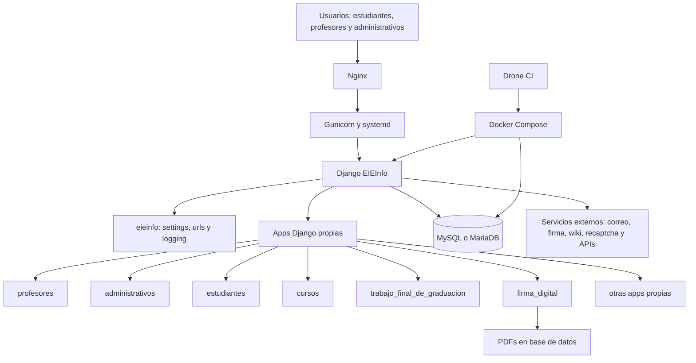
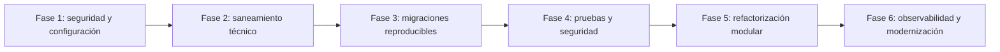
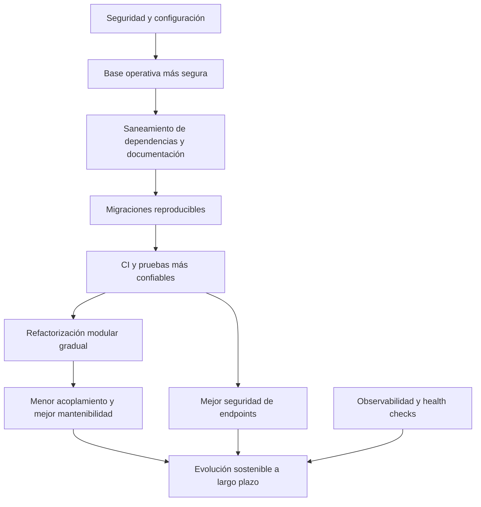

# Informe final de auditoría y propuesta de evolución del sistema EIEInfo

## 1. Portada

**Curso:** IE0417 - Diseño de Software para Ingeniería  
**Sistema auditado:** EIEInfo  
**Tipo de entrega:** Entrega 3 - Informe final de auditoría y propuesta de evolución  
**Estudiante:** Erick Vargas Monge  
**Carné:** C08215  
**Fecha:** Junio de 2026  

---

## 2. Resumen ejecutivo final

EIEInfo es un sistema funcional, amplio y con valor institucional claro. El repositorio evidencia una aplicación Django que integra múltiples procesos académicos y administrativos de la Escuela, con módulos para estudiantes, profesores, cursos, trabajos finales de graduación, firma digital, publicaciones y gestión operativa.

La arquitectura actual puede entenderse como un monolito modular Django. Esta decisión sigue siendo razonable para el contexto del sistema: permite mantener una base única de datos, flujos integrados y despliegue relativamente directo. Por eso, no se recomienda una reescritura total ni una migración automática a microservicios. El problema principal no es que EIEInfo sea un monolito, sino que sus límites internos se han debilitado con el tiempo.

Las fortalezas más importantes son su organización inicial por apps Django, la existencia de modelos de dominio explícitos, integración con CI/CD, configuración de despliegue observable con Docker, Nginx y Gunicorn, y una base de pruebas ya presente en algunos módulos. Estas capacidades deben preservarse y usarse como punto de partida para la evolución.

Los riesgos principales se concentran en seguridad, configuración, reproducibilidad y mantenibilidad. La auditoría identificó secretos en configuración, dependencia del hostname para definir comportamiento de ambiente, uso de excepciones como `csrf_exempt`, migraciones tratadas como artefactos regenerables, cobertura parcial del CI, lógica de negocio concentrada en vistas y alto acoplamiento entre apps.

La estrategia recomendada es una evolución incremental. Primero se deben contener riesgos críticos; luego sanear configuración, dependencias y migraciones; después fortalecer pruebas y seguridad; finalmente abordar modularidad, observabilidad y modernización progresiva.

---

## 3. Introducción

Este documento corresponde a la Entrega 3 del proyecto de auditoría de diseño del sistema EIEInfo. Su objetivo es cerrar el diagnóstico acumulado de las Entregas 1 y 2 y convertirlo en una propuesta de evolución arquitectónica viable.

La pregunta principal de esta entrega es: **si EIEInfo debe seguir evolucionando durante los próximos años, qué debería hacerse primero, qué después y bajo qué estrategia**.

La respuesta propuesta es una evolución gradual del sistema existente. EIEInfo debe preservar su base funcional, su organización por apps Django y su valor institucional, pero necesita fortalecer seguridad, configuración, pruebas, migraciones, modularidad y observabilidad para reducir el riesgo de cambios futuros.

Esta propuesta no plantea una reescritura total. La recomendación central es evolucionar el monolito Django actual hacia un monolito modular más disciplinado, con límites internos claros, reglas técnicas mínimas y una hoja de ruta incremental.

---

## 4. Metodología

La propuesta se construye a partir de la auditoría acumulada de las Entregas 1 y 2. La Entrega 2 profundizó el análisis con evidencia concreta del repositorio, incluyendo configuración, modelos, vistas, formularios, pruebas, CI/CD, Docker, Nginx, Gunicorn y dependencias.

El análisis se realizó mediante inspección estática del repositorio. No se ejecutó el sistema ni se asumieron comportamientos no observables desde los archivos revisados. Cuando se mencionan riesgos de seguridad, se citan únicamente rutas y líneas donde se observa la configuración o patrón problemático. No se reproducen valores reales de secretos; cualquier valor sensible se considera `[VALOR REDACTADO]`.

La propuesta de evolución sigue cuatro principios:

1. No reescribir el sistema desde cero.
2. Reducir primero riesgos críticos de seguridad y operación.
3. Fortalecer pruebas y reproducibilidad antes de refactorizar módulos centrales.
4. Evolucionar el monolito Django hacia un monolito modular con límites internos más claros.

---

## 5. Síntesis del diagnóstico acumulado

### 5.1 Fortalezas rescatables

| Fortaleza | Evidencia | Valor para la evolución |
|---|---|---|
| Organización por apps Django | `src/server/eieinfo/settings.py:56-73` | Permite evolucionar hacia un monolito modular sin reescritura total. |
| Modelos de dominio explícitos | `src/server/profesores/models.py:47-82`; `src/server/estudiantes/models.py:109-144`; `src/server/cursos/models.py:472-575`; `src/server/trabajo_final_de_graduacion/models.py:116-154` | Hay conceptos institucionales ya modelados: profesor, estudiante, curso, cátedra, grupo y TFG. |
| Despliegue observable en repositorio | `conf/etc/systemd/system/eieinfo.service:10-17`; `conf/etc/nginx/sites-available/eieinfo:37-57`; `docker-compose.yml:5-85` | Existe una base operativa para ordenar despliegue y ambientes. |
| CI/CD existente | `.drone.yml:1-18`; `.drone.yml:263-274` | Hay una base para ampliar cobertura y automatizar validaciones. |
| Pruebas en algunos módulos | `src/server/firma_digital/tests.py:19-41` | Permite ampliar pruebas existentes en lugar de empezar desde cero. |

### 5.2 Riesgos principales identificados

| Riesgo | Evidencia | Lectura |
|---|---|---|
| Secretos en configuración | `src/server/eieinfo/settings.py:342-344`; `src/server/eieinfo/settings.py:427-429` | Deben salir del repositorio y pasar a variables de entorno o gestor de secretos. |
| Configuración dependiente del hostname | `src/server/eieinfo/settings.py:475-490` | El ambiente debe ser explícito, no inferido por nombre de servidor. |
| Alto acoplamiento entre apps | `src/server/profesores/views/consejo_asesor.py:9-42`; `src/server/cursos/models.py:3-12`; `src/server/webpage/misc.py:3-11` | Cambios locales pueden propagarse a varias apps. |
| Lógica de negocio en vistas | `src/server/trabajo_final_de_graduacion/views.py:489-648`; `src/server/profesores/views/consejo_asesor.py:224-381` | Las reglas quedan acopladas al flujo HTTP. |
| CI parcial | `.drone.yml:263-274`; `src/server/eieinfo/settings.py:56-73` | El CI cubre 7 de 17 apps propias registradas. |
| Migraciones regeneradas | `README.md:106-114`; `.drone.yml:97-102` | El esquema de base de datos no se trata como contrato versionado estable. |
| Observabilidad básica/local | `src/server/eieinfo/settings.py:238-293`; `src/server/webpage/views.py:88-94`; `src/server/estudiantes/models.py:1209-1219` | Hay logging, pero también `print` y no se observa health check de aplicación desde el repositorio. |

### 5.3 Hallazgos críticos y altos que guían la Entrega 3

| ID | Hallazgo | Prioridad |
|---|---|---|
| H-01 | Secretos definidos directamente en configuración. | Crítica |
| H-02 | Perfil de seguridad dependiente del hostname. | Crítica |
| H-03 | Acoplamiento fuerte entre apps propias. | Alta |
| H-04 | Lógica de negocio concentrada en vistas. | Alta |
| H-05 | Sesiones híbridas y personalizadas por rol. | Alta |
| H-06 | Uso de `csrf_exempt` en endpoints sensibles. | Alta |
| H-07 | Acciones destructivas sin restricción explícita `require_POST`. | Alta |
| H-08 | Migraciones no tratadas como contrato versionado estable. | Alta |
| H-09 | CI cubre solo 7 de 17 apps propias registradas. | Alta |
| H-11 | Ambigüedad conceptual entre dos clases `Ciclo`. | Alta |
| H-12 | Posible bug conceptual en `TFG.NotificarEstudiante`. | Alta |

### 5.4 Qué conviene preservar

| Elemento | Razón para preservarlo |
|---|---|
| Monolito Django | Es una base razonable para un sistema institucional integrado. |
| Apps Django existentes | Ya expresan una separación funcional inicial. |
| Modelos de dominio | Contienen conceptos institucionales importantes que deben evolucionar, no descartarse. |
| CI/CD existente | Aunque parcial, es una base para ampliar validaciones. |
| Despliegue con Nginx y Gunicorn | Es una arquitectura operativa conocida y observable. |
| Docker/Drone | Facilitan reproducibilidad si se ordenan configuración, secretos y dependencias. |

### 5.5 Qué conviene reestructurar gradualmente

| Elemento | Motivo |
|---|---|
| Configuración y secretos | Deben dejar de depender de archivos versionados y hostname. |
| Migraciones | Deben pasar a ser artefactos versionados y probados. |
| Pruebas y CI | Deben cubrir progresivamente las 17 apps propias registradas. |
| Lógica de negocio en vistas | Debe migrar hacia servicios de aplicación o dominio. |
| Dependencias entre apps | Deben reducirse mediante límites internos y servicios compartidos. |
| Observabilidad | Debe pasar de logging local y `print` a logging consistente y health checks básicos. |

---

## 6. Arquitectura actual

### 6.1 Tipo de arquitectura predominante

EIEInfo sigue una arquitectura predominante de **monolito modular Django**, organizada alrededor de apps Django registradas en `INSTALLED_APPS`. La estructura no corresponde a microservicios; comparte proyecto, configuración, base de datos y despliegue.

La configuración muestra 47 entradas en `INSTALLED_APPS`, de las cuales 17 corresponden a apps propias registradas (`src/server/eieinfo/settings.py:44-93`, especialmente `:56-73`).

### 6.2 Stack tecnológico principal

| Componente | Evidencia | Observación |
|---|---|---|
| Django | `requirements.txt:1-2`; `docker/django/requirements.txt:1-2` | Framework web principal. |
| Base de datos MySQL/MariaDB | `README.md:48`; `docker-compose.yml:5-28`; `requirements.txt:27` | El README menciona MySQL y Docker usa MariaDB. |
| Gunicorn | `conf/etc/systemd/system/eieinfo.service:10-17` | Servidor WSGI para despliegue. |
| Nginx | `conf/etc/nginx/sites-available/eieinfo:37-57`; `docker-compose.yml:30-45` | Proxy reverso y servidor de archivos estáticos/media. |
| Docker | `docker-compose.yml:5-85`; `docker/django/Dockerfile:1-40` | Entorno contenedorizado observable. |
| Drone CI | `.drone.yml:1-18`; `.drone.yml:263-274` | Pipeline de integración continua. |

### 6.3 Componentes principales

| Componente | Rol actual |
|---|---|
| Proyecto `eieinfo` | Configuración, URLs globales, logging, seguridad y parámetros operativos. |
| Apps Django propias | Módulos funcionales del sistema académico-administrativo. |
| Base de datos relacional | Persistencia central del sistema. |
| Nginx | Proxy, archivos estáticos/media y límites operativos. |
| Gunicorn/systemd | Ejecución del proceso Django en despliegue tradicional. |
| Docker/Drone | Construcción, pruebas, levantamiento de servicios y validaciones automatizadas. |

### 6.4 Módulos Django más relevantes

| Módulo | Responsabilidad observada |
|---|---|
| `eieinfo` | Configuración raíz, URLs, logging y seguridad. |
| `profesores` | Portal docente, consejo asesor, carga académica y sesión de profesores. |
| `administrativos` | Funcionarios administrativos, ciclos lectivos y portal administrativo. |
| `estudiantes` | Estudiantes, plan de estudio, asistencias y portal estudiantil. |
| `cursos` | Cursos, cátedras, grupos, horarios y conceptos asociados al plan. |
| `trabajo_final_de_graduacion` | Flujo nuevo de TFG, comité asesor, estudiantes, documentos y estados. |
| `firma_digital` | PDFs, documentos firmados, integración con firmador y sesiones por rol. |

### 6.5 Base de datos esperada

El repositorio apunta a una base de datos relacional compatible con MySQL/MariaDB. El README menciona MySQL (`README.md:48`) y la configuración Docker levanta un servicio MariaDB (`docker-compose.yml:5-28`). La dependencia `mysqlclient` aparece en los archivos de dependencias (`requirements.txt:27`).

Esta base de datos funciona como persistencia central del monolito. En la arquitectura actual no se observa separación de bases de datos por módulo.

### 6.6 Despliegue observable

| Elemento | Evidencia | Lectura |
|---|---|---|
| Gunicorn/systemd | `conf/etc/systemd/system/eieinfo.service:10-17` | Hay configuración tradicional de servicio para ejecutar la aplicación Django. |
| Nginx | `conf/etc/nginx/sites-available/eieinfo:37-57` | Nginx opera como proxy y define logs, límites y timeouts. |
| Docker Compose | `docker-compose.yml:5-85` | Hay entorno contenedorizado con base de datos, Nginx y Django/Gunicorn. |
| Dockerfile Django | `docker/django/Dockerfile:1-40` | Construye el contenedor de aplicación y prepara entorno Python. |
| Dockerfile Nginx | `docker/nginx/Dockerfile:1-7` | Define imagen de Nginx para el entorno Docker. |

### 6.7 CI/CD observable

| Elemento | Evidencia | Lectura |
|---|---|---|
| Pipeline Drone | `.drone.yml:1-18` | El repositorio contiene pipeline de Drone. |
| Construcción y levantamiento de contenedores | `.drone.yml:24-47` | El CI construye y levanta servicios con Docker. |
| Preparación de datos y migraciones | `.drone.yml:78-102` | El pipeline prepara entorno, copia configuración y regenera migraciones. |
| Smoke tests por HTTP | `.drone.yml:109-120` | El CI hace validaciones básicas con `curl`. |
| Pruebas con cobertura | `.drone.yml:263-274` | El CI cubre 7 de 17 apps propias registradas. |

### 6.8 Dependencias externas visibles

| Dependencia o integración | Evidencia | Observación |
|---|---|---|
| Correo SMTP | `src/server/eieinfo/settings.py:341-355` | Hay configuración de correo; los valores sensibles se consideran `[VALOR REDACTADO]`. |
| Firma digital | `src/server/eieinfo/settings.py:546-547`; `src/server/firma_digital/views.py:410-431` | Existe integración relacionada con firma y recepción de PDFs firmados. |
| Wiki | `src/server/eieinfo/settings.py:51-55`; `requirements.txt:46` | Se observa integración con `django-wiki`. |
| Recaptcha | `requirements.txt:9`; `src/server/eieinfo/settings.py:88`; `src/server/eieinfo/settings.py:491` | Hay dependencia y configuración de recaptcha. |
| Let's Encrypt | `requirements.txt:10`; `src/server/eieinfo/settings.py:90`; `conf/etc/nginx/sites-available/eieinfo:15-25` | Hay soporte visible para certificados. |
| Martor/Imgur | `src/server/eieinfo/settings.py:416-457` | Hay configuración relacionada con editor Markdown e imágenes; valores sensibles se consideran `[VALOR REDACTADO]`. |

### 6.9 Diagrama de arquitectura actual



### 6.10 Fortalezas de la arquitectura actual

- La arquitectura monolítica modular es adecuada para un sistema institucional integrado.
- Hay una separación inicial por apps Django.
- Existen modelos de dominio explícitos.
- Hay despliegue observable con Nginx, Gunicorn/systemd y Docker.
- Existe CI/CD con Drone.
- Hay pruebas presentes en algunos módulos.

### 6.11 Problemas de la arquitectura actual

- Configuración sensible y secretos dentro de archivos de configuración.
- Configuración de ambiente dependiente del hostname.
- Alto acoplamiento entre apps propias.
- Reglas de negocio concentradas en vistas.
- Migraciones tratadas como regenerables.
- CI con cobertura parcial de apps propias.
- Observabilidad básica/local.
- Dependencias divergentes entre entornos.

---

## 7. Arquitectura objetivo

### 7.1 Descripción general

La arquitectura objetivo propuesta es un **monolito modular Django evolucionado**, con límites internos más claros y una separación gradual entre capa web, servicios de aplicación, dominio e infraestructura.

No se propone reescribir EIEInfo desde cero. Tampoco se propone dividirlo automáticamente en microservicios. La prioridad es mejorar seguridad, reproducibilidad, pruebas y modularidad dentro del sistema existente.

### 7.2 Principios de diseño propuestos

| Principio | Aplicación en EIEInfo |
|---|---|
| Evolución incremental | Cambiar por fases, priorizando riesgos críticos antes de refactors profundos. |
| Configuración explícita | Usar variables de entorno y perfiles de ambiente, no hostname. |
| Secretos fuera del repositorio | Ningún secreto real debe estar versionado. |
| Reglas fuera de vistas | Las vistas deben delegar reglas en servicios de aplicación. |
| Migraciones versionadas | La base de datos debe evolucionar mediante migraciones revisadas y trazables. |
| Pruebas antes de refactor | Fortalecer CI antes de modificar módulos críticos. |
| Modularidad pragmática | Reducir acoplamiento sin partir el sistema en servicios distribuidos. |
| Observabilidad operativa | Sustituir `print` por logging y agregar health checks básicos. |

### 7.3 Nuevos componentes o capas recomendadas

| Capa o componente | Responsabilidad |
|---|---|
| Capa web | Vistas, formularios, templates y serialización de entrada/salida. |
| Servicios de aplicación | Casos de uso como crear TFG, validar estudiantes, calcular resumen de ciclo o gestionar notificaciones. |
| Dominio | Modelos, invariantes y conceptos centrales. |
| Infraestructura | Correo, firma digital, almacenamiento de archivos, configuración, logging y adaptadores externos. |
| Configuración por ambiente | Variables de entorno, valores no sensibles por defecto y validación de configuración obligatoria. |
| Pruebas/CI | Validación automatizada por apps, migraciones y seguridad básica. |
| Observabilidad | Logging consistente, health checks básicos y eventos operativos clave. |

### 7.4 Qué se preserva de la arquitectura actual

| Elemento preservado | Justificación |
|---|---|
| Django como framework principal | Ya estructura el sistema y permite evolucionar sin reescritura. |
| Base de datos central | Simplifica consistencia transaccional y evita complejidad distribuida innecesaria. |
| Organización por apps | Es una base útil para modularidad interna. |
| Despliegue con Nginx/Gunicorn | Es una ruta operativa observable y conocida. |
| Pipeline CI/CD | Puede fortalecerse sin reemplazarlo completamente. |
| Modelos de dominio existentes | Representan conocimiento institucional acumulado. |

### 7.5 Qué se cambia gradualmente

| Elemento | Cambio propuesto |
|---|---|
| Secretos y configuración | Externalizarlos y validar ambiente explícito. |
| Flujo de migraciones | Versionar migraciones reales y dejar de regenerarlas como práctica normal. |
| Cobertura de CI | Ampliar de 7 de 17 apps propias hacia cobertura completa o exclusiones justificadas. |
| Lógica de negocio en vistas | Extraer reglas críticas hacia servicios de aplicación. |
| Manejo de sesiones por rol | Centralizar autenticación y autorización de forma gradual. |
| Dependencias cruzadas entre apps | Reducir imports directos y definir servicios compartidos. |
| Observabilidad | Agregar logging consistente y health checks básicos. |

### 7.6 Diferencias entre arquitectura actual y objetivo

| Dimensión | Arquitectura actual | Arquitectura objetivo |
|---|---|---|
| Configuración | Centralizada en `settings.py` y dependiente del hostname. | Explícita por ambiente y basada en variables externas. |
| Secretos | Observables en configuración. | Fuera del repositorio y redactados en documentación. |
| Lógica de negocio | Concentrada en vistas y formularios. | Delegada a servicios de aplicación. |
| Módulos | Apps Django con acoplamiento cruzado. | Apps con límites internos y dependencias justificadas. |
| Migraciones | Regeneradas en README/CI. | Versionadas y probadas. |
| Pruebas | CI parcial. | CI ampliado progresivamente. |
| Observabilidad | Logging local y `print`. | Logging consistente y health checks. |
| Despliegue | Funcional, pero con responsabilidades mezcladas. | Más explícito, reproducible y documentado. |

### 7.7 Trade-offs o costos de transición

| Trade-off | Descripción |
|---|---|
| Mayor disciplina de configuración | Variables obligatorias y perfiles explícitos agregan control, pero requieren documentación y cuidado operativo. |
| Refactor gradual más lento | Extraer servicios toma más tiempo que modificar vistas directamente, pero reduce riesgo futuro. |
| CI más completo puede tardar más | Ampliar pruebas aumenta tiempo de ejecución, pero mejora confianza. |
| Migraciones versionadas exigen orden histórico | Puede requerirse limpiar deuda acumulada antes de lograr reproducibilidad completa. |
| Modularidad requiere gobierno técnico | Sin revisión y lineamientos, los imports cruzados pueden volver a crecer. |

### 7.8 Diagrama de arquitectura objetivo

flowchart TD
    U[Usuarios institucionales] --> N[Nginx]
    N --> G[Gunicorn]
    G --> DJ[Django EIEInfo como monolito modular]

    DJ --> WEB[Capa web: views, forms y templates]
    WEB --> APP[Capa de servicios de aplicación]
    APP --> DOM[Capa de dominio: modelos e invariantes]
    DOM --> ORM[Django ORM]
    ORM --> DB[(MySQL o MariaDB)]

    APP --> AUTH[Servicio común de autenticación y roles]
    APP --> NOTIF[Adaptador de notificaciones y correo]
    APP --> FILES[Adaptador de archivos y PDFs]
    APP --> SIGN[Adaptador de firma digital]

    DJ --> CFG[Configuración por ambiente]
    CFG --> ENV[Variables de entorno y secretos externos]

    DJ --> OBS[Logging consistente y health checks]

    CI[CI/CD] --> TESTS[Pruebas por apps]
    CI --> MIG[Migraciones versionadas]
    CI --> SEC[Validaciones de seguridad básica]
    CI --> DEP[Dependencias consolidadas]
```
## 8. Comparación entre arquitectura actual y arquitectura objetivo

| Aspecto | Situación actual | Problema asociado | Propuesta objetivo | Beneficio esperado | Costo o trade-off |
|---|---|---|---|---|---|
| Configuración y secretos | Secretos y configuración sensible en `settings.py`; ambiente por hostname. | Exposición y configuración permisiva accidental. | Variables de entorno, gestor de secretos y perfiles explícitos. | Despliegues más seguros y predecibles. | Ajustar CI, Docker y despliegue. |
| Módulos Django | 17 apps propias registradas con dependencias cruzadas. | Alto acoplamiento. | Monolito modular con límites internos y servicios compartidos. | Cambios más localizados. | Refactor gradual y disciplina de diseño. |
| Lógica de negocio | Reglas en vistas de TFG y consejo asesor. | Baja testabilidad y cohesión. | Servicios de aplicación. | Reglas reutilizables y testeables. | Requiere pruebas antes de extraer lógica. |
| Pruebas y CI | CI cubre 7 de 17 apps propias. | Confianza parcial. | Ampliar cobertura gradualmente. | Menos regresiones no detectadas. | Más tiempo y estabilización de pruebas. |
| Migraciones | Borrado/regeneración en README y CI. | Baja reproducibilidad del esquema. | Migraciones versionadas y probadas. | Base de datos trazable. | Ordenar deuda histórica. |
| Despliegue | Nginx, Gunicorn/systemd, Docker/Drone con mezcla de responsabilidades. | Divergencia entre entornos. | Separar CI, configuración, migraciones y despliegue. | Operación más clara. | Requiere documentación y ajustes de pipeline. |
| Observabilidad | Logging local y uso de `print`. | Diagnóstico limitado. | Logging consistente y health checks. | Mejor operación. | Definir formato y eventos. |
| Dependencias | Divergencias entre requirements. | Builds no reproducibles. | Estrategia única de dependencias. | Ambientes consistentes. | Validar compatibilidad. |
| Seguridad en endpoints | `csrf_exempt` y acciones destructivas sin `require_POST`. | Superficie de ataque mayor. | Revisiones, CSRF, `require_POST` y justificación de excepciones. | Mayor seguridad web. | Ajustar integraciones existentes. |
| Documentación técnica | README y CI conservan prácticas frágiles o históricas. | Ambigüedad operativa. | Documentación mínima viva. | Mejor transferencia y mantenimiento. | Mantenerla actualizada. |

---

## 9. Hoja de ruta de evolución

### 9.1 Resumen de fases

| Fase | Nombre | Prioridad | Esfuerzo relativo |
|---|---|---|---|
| 1 | Contención de riesgos críticos | Crítica | Medio |
| 2 | Saneamiento técnico inicial | Alta | Medio |
| 3 | Reproducibilidad de base de datos | Alta | Alto |
| 4 | Fortalecimiento de pruebas y seguridad | Alta | Alto |
| 5 | Refactorización modular gradual | Media-Alta | Alto |
| 6 | Modernización progresiva y observabilidad | Media | Medio |

### 9.2 Diagrama de hoja de ruta



### 9.3 Fases propuestas

| Fase | Objetivo | Alcance | Acciones principales | Beneficio esperado | Riesgos | Dependencias | Esfuerzo relativo | Prioridad | Hallazgos atendidos |
|---|---|---|---|---|---|---|---|---|---|
| 1. Contención de riesgos críticos | Reducir riesgos urgentes de seguridad y configuración. | Secretos, ambiente, `DEBUG`, `ALLOWED_HOSTS`, CSRF y acciones destructivas. | Externalizar secretos, reemplazar hostname por ambiente explícito, revisar `csrf_exempt`, agregar `require_POST`. | Menor riesgo de exposición y configuración insegura. | Romper despliegue si faltan variables. | Ninguna. | Medio | Crítica | H-01, H-02, H-06, H-07 |
| 2. Saneamiento técnico inicial | Ordenar entornos y dependencias. | Dependencias, documentación, CI y configuración. | Consolidar requirements, limpiar comandos históricos, documentar ejecución, pruebas y despliegue. | Ambientes más reproducibles. | Incompatibilidades al ordenar dependencias. | Fase 1. | Medio | Alta | H-14, H-19 |
| 3. Reproducibilidad de base de datos | Tratar migraciones como contrato versionado. | Migraciones, CI y datos de prueba. | Detener borrado de migraciones, versionarlas y probarlas. | Esquema trazable y despliegues confiables. | Deuda histórica de migraciones. | Fase 2. | Alto | Alta | H-08, H-18 |
| 4. Fortalecimiento de pruebas y seguridad | Aumentar confianza antes de refactorizar. | CI, apps propias, sesiones y endpoints críticos. | Ampliar CI de 7 a 17 apps propias, incluir `firma_digital`, probar seguridad básica. | Menos regresiones. | Suite lenta o frágil. | Fases 1 y 3. | Alto | Alta | H-05, H-09, H-10, H-18 |
| 5. Refactorización modular gradual | Reducir acoplamiento y extraer reglas de negocio. | `profesores`, `estudiantes`, `cursos`, TFG y firma digital. | Crear servicios de aplicación, reducir imports cruzados, documentar dominio. | Mejor mantenibilidad y testabilidad. | Riesgo si se cambia comportamiento sin pruebas. | Fase 4. | Alto | Media-Alta | H-03, H-04, H-11, H-12, H-15, H-16 |
| 6. Modernización progresiva y observabilidad | Mejorar operación y diagnóstico. | Logging, health checks, PDFs y documentación viva. | Reemplazar `print`, agregar health check, evaluar almacenamiento de PDFs. | Diagnóstico más rápido y operación más estable. | Ruido operativo o migración compleja de archivos. | Puede iniciar después de Fase 2; cambios de PDFs después de Fase 4. | Medio | Media | H-13, H-17 |

### 9.4 Lectura estratégica de la ruta

Primero deben atenderse los riesgos que pueden afectar operación segura: secretos, configuración, CSRF y acciones destructivas. Después conviene estabilizar entornos, dependencias y migraciones. Solo entonces es prudente ampliar pruebas y comenzar refactorización modular. La modernización operativa puede avanzar en paralelo, pero los cambios de almacenamiento o comportamiento crítico deben esperar una base de pruebas más sólida.

---

## 10. Intervenciones prioritarias

| ID | Nombre | Problema que atiende | Hallazgos relacionados | Descripción de la acción | Beneficio esperado | Riesgo de implementación | Esfuerzo relativo | Prioridad | Dependencias | Criterio de éxito |
|---|---|---|---|---|---|---|---|---|---|---|
| INT-01 | Externalizar secretos | Secretos definidos directamente en configuración. | H-01 | Mover credenciales SMTP, llaves externas y credenciales operativas a variables de entorno o gestor de secretos. El repositorio debe conservar solo nombres de variables y valores de ejemplo no sensibles. | Reduce exposición accidental y facilita rotación. | Despliegues pueden fallar si faltan variables obligatorias. | Medio | Crítica | Ninguna | El sistema inicia sin secretos reales en archivos versionados y falla explícitamente si falta una variable requerida. |
| INT-02 | Configuración explícita por ambiente | Configuración dependiente del hostname y rama permisiva con `DEBUG=True` y `ALLOWED_HOSTS=['*']`. | H-02 | Reemplazar lógica por hostname con `DJANGO_ENV`, `DEBUG`, `ALLOWED_HOSTS`, `DATABASE_URL` o variables equivalentes. Separar perfiles `development`, `staging` y `production`. | Reduce riesgo de producción mal configurada. | Requiere ajustar CI, Docker y despliegue. | Medio | Crítica | INT-01 | Producción no depende del hostname y no puede iniciar con `DEBUG=True` sin configuración explícita. |
| INT-03 | Endurecer endpoints sensibles | `csrf_exempt` y acciones destructivas sin restricción explícita de método. | H-06, H-07 | Revisar cada `csrf_exempt`; removerlo cuando no sea necesario. En endpoints externos, documentar mecanismo alternativo de autenticación. Agregar `require_POST` a acciones destructivas de `atributos`. | Menor superficie de ataque y operaciones destructivas más controladas. | Puede romper integraciones existentes si dependían de solicitudes sin CSRF. | Medio | Alta | INT-02 recomendado | Las acciones destructivas rechazan GET y cada `csrf_exempt` queda eliminado o justificado. |
| INT-04 | Versionar migraciones reales | Migraciones borradas o regeneradas en README/CI. | H-08 | Detener borrado de migraciones en CI. Revisar estado actual, conservar migraciones como artefactos versionados y probar aplicación de migraciones en pipeline. | Mayor reproducibilidad del esquema y trazabilidad de cambios. | Puede revelar deuda histórica de migraciones difícil de ordenar. | Alto | Alta | INT-07 | El CI usa migraciones existentes y no ejecuta borrado/regeneración como flujo normal. |
| INT-05 | Ampliar cobertura del CI | CI cubre 7 de 17 apps propias registradas. | H-09, H-10, H-18 | Incluir progresivamente apps propias faltantes, empezando por `firma_digital`, `atributos`, `trabajos_finales` si sigue registrada, y módulos con endpoints críticos. Sustituir datos frágiles por fixtures controlados o factories. | Mayor confianza ante cambios y regresiones. | La suite puede volverse lenta o inestable si se agregan pruebas frágiles sin limpieza. | Alto | Alta | INT-04 recomendado | El CI reporta pruebas para más apps propias y documenta exclusiones temporales si quedan pendientes. |
| INT-06 | Extraer lógica de negocio desde vistas | Reglas académicas y flujos críticos concentrados en vistas. | H-04 | Crear servicios de aplicación para casos como creación de TFG, validaciones de estudiantes, notificaciones y resumen de ciclo. Mantener vistas como capa HTTP delgada. | Mejora testabilidad, cohesión y modificabilidad. | Riesgo de cambiar comportamiento si se extrae lógica sin pruebas suficientes. | Alto | Alta | INT-05 | Los flujos críticos tienen servicios testeables y las vistas delegan reglas principales. |
| INT-07 | Ordenar dependencias y documentación técnica | Dependencias divergentes y documentación que refuerza prácticas frágiles. | H-14, H-19 | Consolidar estrategia de dependencias entre `requirements.txt` y Docker. Documentar instalación, variables, pruebas, migraciones y despliegue real. Eliminar o explicar comandos históricos del CI. | Ambientes más reproducibles y menor ambigüedad operativa. | Actualizar dependencias puede revelar incompatibilidades. | Medio | Alta | INT-01, INT-02 | Existe una guía técnica mínima y una fuente clara para dependencias por ambiente. |
| INT-08 | Logging estructurado y health checks | Observabilidad básica/local y uso de `print`. | H-17 | Reemplazar `print` por `logger`; definir eventos operativos clave; agregar endpoint `/health/` o equivalente para validar aplicación, no solo base de datos. | Diagnóstico más rápido y operación más confiable. | Puede generar ruido si no se definen niveles y formato. | Medio | Media | INT-02 | Hay health check de aplicación y los diagnósticos relevantes usan logging, no `print`. |
| INT-09 | Documentar dominio TFG y conceptos duplicados | Ambigüedad entre dos `Ciclo`, coexistencia de `trabajos_finales` y `trabajo_final_de_graduacion`, posible bug conceptual en TFG. | H-11, H-12, H-16 | Documentar fuente de verdad para TFG. Nombrar explícitamente `CicloLectivo` frente a `CicloPlan` o `BloquePlan`. Revisar `TFG.NotificarEstudiante` frente a la relación muchos-a-muchos. | Menos ambigüedad conceptual y menor riesgo de errores al modificar dominio académico. | Puede requerir decisiones de negocio o validación con usuarios del sistema. | Medio | Alta | INT-05 recomendado | El documento de dominio identifica fuente de verdad, conceptos duplicados y regla correcta para estudiantes de TFG. |
| INT-10 | Lineamientos de modularidad | Alto acoplamiento entre apps y duplicación por portales de rol. | H-03, H-05, H-15 | Definir reglas internas: imports permitidos, servicios compartidos, manejo común de sesión/autorización y criterios para nuevas dependencias entre apps. Aplicar primero en cambios nuevos. | Reduce crecimiento de deuda arquitectónica y guía refactors graduales. | Puede ser ignorado si no se integra a revisión de código. | Medio | Media-Alta | INT-07 | Nuevos cambios siguen lineamientos documentados y no agregan imports cruzados sin justificación. |

---

## 11. Propuesta de gobierno técnico

El gobierno técnico propuesto define reglas mínimas para que la evolución de EIEInfo sea sostenible. No busca burocratizar el desarrollo, sino evitar que los riesgos identificados en la Entrega 2 sigan creciendo con cada cambio.

| Área | Regla propuesta | Problema que previene | Beneficio | Cómo verificar cumplimiento |
|---|---|---|---|---|
| Manejo de secretos | Ningún secreto real debe quedar versionado en `settings.py`, Docker, Drone, README ni archivos de configuración. Se deben usar variables de entorno o un gestor de secretos. | Exposición de credenciales y dificultad para rotarlas. | Reduce riesgo de filtración y permite rotación controlada. | Revisión de PR, escaneo de secretos antes de integrar cambios y validación de que el sistema arranca solo con variables externas. |
| Configuración por ambiente | La configuración debe depender de variables explícitas como `DJANGO_ENV`, no del hostname del servidor. Producción debe fallar si faltan variables obligatorias. | Configuración permisiva accidental por no coincidir el hostname esperado. | Despliegues más predecibles y seguros. | Revisar que no existan ramas de configuración basadas en hostname y que `DEBUG`, `ALLOWED_HOSTS` y credenciales vengan del ambiente. |
| Criterios para aceptar cambios | Un cambio solo debe aceptarse si declara impacto, módulos afectados, pruebas ejecutadas, migraciones incluidas si aplican y riesgos operativos. | Cambios locales que afectan múltiples apps sin visibilidad por alto acoplamiento. | Mejora trazabilidad y reduce regresiones. | Plantilla de PR o checklist de revisión técnica con campos obligatorios. |
| Estrategia mínima de pruebas | Todo cambio debe incluir pruebas del módulo afectado o justificar explícitamente por qué no aplica. El CI debe ampliarse progresivamente hasta cubrir las 17 apps propias registradas. | Confianza parcial del CI, que actualmente cubre 7 de 17 apps propias. | Mayor seguridad ante cambios y detección temprana de regresiones. | CI debe ejecutar pruebas de apps afectadas; cobertura de apps registradas debe revisarse periódicamente. |
| Revisión técnica de código | Todo cambio en vistas, modelos, configuración, migraciones, autenticación o endpoints debe pasar por revisión de otra persona. | Lógica de negocio en vistas, sesiones híbridas, `csrf_exempt` y acciones destructivas sin controles. | Mejora calidad y reduce errores en zonas críticas. | Checklist de revisión: seguridad, pruebas, dependencias, migraciones, modularidad y observabilidad. |
| Lineamientos de modularidad | Nuevos imports cruzados entre apps propias deben justificarse. La lógica compartida debe ir en servicios o módulos comunes bien delimitados, no en vistas extensas. | Alto acoplamiento entre apps y reglas de negocio acopladas al flujo HTTP. | Cambios más localizados y arquitectura más comprensible. | Revisión de imports en PR y mapa periódico de dependencias entre apps. |
| Manejo de migraciones | Las migraciones deben versionarse y revisarse como parte del cambio. No se debe borrar ni regenerar migraciones como flujo normal de CI o desarrollo. | Pérdida de trazabilidad del esquema y despliegues menos reproducibles. | Base de datos más auditable y evolución controlada. | CI debe aplicar migraciones existentes; revisión de PR debe incluir archivos de migración cuando cambian modelos. |
| Documentación mínima requerida | Cambios en configuración, despliegue, dependencias, dominio o flujos críticos deben actualizar documentación técnica. | Documentación desalineada o que conserva prácticas frágiles. | Facilita mantenimiento y transferencia de conocimiento. | Revisión de PR debe confirmar si README, guía operativa o documento de arquitectura requieren actualización. |
| Seguridad en endpoints | Toda acción destructiva debe exigir método POST y protección CSRF, salvo excepción documentada. Todo `csrf_exempt` debe tener justificación, alcance y mecanismo alternativo de protección. | Superficie de ataque por endpoints exentos de CSRF y operaciones destructivas por métodos no esperados. | Reduce riesgo de abuso o errores operativos. | Revisión de rutas/vistas nuevas; pruebas que verifiquen rechazo de métodos no permitidos. |
| Observabilidad y operación | No se deben agregar nuevos `print` para diagnóstico. Los eventos relevantes deben usar logging con nivel apropiado. Los flujos críticos deben tener señales operativas mínimas. | Observabilidad básica/local y mensajes no estructurados difíciles de diagnosticar. | Diagnóstico más rápido y operación más estable. | Revisión de código para evitar `print`; pruebas o verificación manual del logging y health check en despliegue. |

---

## 12. Riesgos de transición

| Riesgo | Descripción | Mitigación |
|---|---|---|
| Ruptura de despliegue por variables faltantes | Externalizar secretos y configuración puede causar fallos si el ambiente no está completo. | Definir variables obligatorias, valores de ejemplo no sensibles y validación temprana. |
| Refactors que cambien comportamiento | Extraer lógica de vistas puede alterar reglas académicas. | Aumentar pruebas antes de refactorizar y avanzar por caso de uso. |
| Migraciones históricas difíciles de ordenar | La deuda de migraciones puede requerir trabajo manual. | Auditar estado actual, crear una línea base y probar migraciones en entorno controlado. |
| CI más lento o frágil | Ampliar pruebas puede exponer dependencia de datos fijos. | Priorizar pruebas críticas, reemplazar fixtures frágiles y estabilizar por fases. |
| Resistencia a nuevos lineamientos | El equipo puede seguir agregando acoplamiento si no hay revisión. | Incorporar checklist de PR y criterios mínimos de aceptación. |
| Cambios en endpoints externos | Remover `csrf_exempt` puede afectar integraciones. | Revisar caso por caso y documentar autenticación alternativa cuando aplique. |
| Convivencia temporal de código viejo y nuevo | Durante la refactorización gradual pueden coexistir vistas con lógica antigua y servicios nuevos. | Definir criterios de migración por caso de uso y evitar duplicar reglas sin documentación. |
| Modernización de PDFs y archivos | Cambiar almacenamiento de PDFs puede afectar rendimiento, permisos y compatibilidad. | Diseñar migración controlada, mantener metadatos en base de datos y probar descarga/firma antes de reemplazar el flujo actual. |

---

## 13. Criterios de éxito

| Área | Criterio de éxito |
|---|---|
| Seguridad y secretos | No hay secretos reales versionados y producción no depende del hostname. |
| Configuración | `DEBUG`, `ALLOWED_HOSTS`, base de datos y servicios externos se configuran por ambiente explícito. |
| CI | La cobertura de CI aumenta progresivamente desde 7 de 17 apps propias hacia una cobertura completa o con exclusiones justificadas. |
| Migraciones | El pipeline aplica migraciones versionadas y deja de borrarlas o regenerarlas como flujo normal. |
| Modularidad | Nuevas reglas de negocio se implementan en servicios o módulos de aplicación, no directamente en vistas extensas. |
| Dominio | TFG, `CicloLectivo` y `CicloPlan` o `BloquePlan` quedan documentados como conceptos diferenciados. |
| Seguridad web | Acciones destructivas rechazan métodos no permitidos y cada `csrf_exempt` tiene justificación explícita. |
| Observabilidad | Existe health check de aplicación y se reemplazan diagnósticos con `print` por logging. |
| Documentación | README o documentación técnica describe configuración, pruebas, migraciones, despliegue y gobierno mínimo. |
| Evolución sostenible | Los cambios nuevos indican impacto, pruebas, migraciones y riesgos antes de integrarse. |

---

## 14. Conclusiones

EIEInfo debe seguir evolucionando como un sistema institucional valioso, no como un sistema a reemplazar por completo. Su arquitectura monolítica Django es una base razonable, siempre que se fortalezcan sus límites internos, su seguridad, su reproducibilidad y su capacidad de prueba.

La prioridad inicial debe ser seguridad y configuración: secretos, ambiente explícito, CSRF y acciones destructivas. Después debe atenderse la reproducibilidad técnica: dependencias, migraciones y documentación operativa. Luego conviene ampliar pruebas para poder refactorizar con menor riesgo. Finalmente, el sistema puede avanzar hacia una modularidad más clara, servicios de aplicación, mejor observabilidad y documentación de dominio.

Si el sistema tuviera que seguir evolucionando durante los próximos años, la estrategia recomendada sería: primero contener riesgos críticos, después estabilizar la base técnica, luego fortalecer pruebas y CI, y finalmente refactorizar gradualmente los módulos más acoplados. Esta ruta permite preservar el valor institucional de EIEInfo mientras reduce el costo y riesgo de cambios futuros.

La evolución propuesta es gradual, viable y alineada con el estado real del repositorio. No requiere una reescritura total, pero sí requiere disciplina técnica sostenida: manejo correcto de secretos, configuración explícita, migraciones versionadas, pruebas más amplias, lineamientos de modularidad y observabilidad operativa mínima.

---

## 15. Anexos

### 15.1 Trazabilidad con Entrega 2

| Tema | Hallazgos relacionados |
|---|---|
| Secretos y configuración | H-01, H-02 |
| Seguridad en endpoints | H-06, H-07 |
| Acoplamiento y modularidad | H-03, H-15 |
| Lógica de negocio en vistas | H-04 |
| Sesiones por rol | H-05 |
| Migraciones | H-08 |
| Pruebas y CI | H-09, H-10, H-18 |
| Dominio TFG y Ciclo | H-11, H-12, H-16 |
| Dependencias | H-14 |
| Observabilidad | H-17 |

### 15.2 Mapa causal de evolución



### 15.3 Respuesta explícita a la pregunta central

Si EIEInfo debe seguir evolucionando durante los próximos años, lo primero debe ser reducir riesgos críticos de seguridad y configuración. Después debe estabilizarse la base técnica: dependencias, documentación, migraciones y CI. Con esa base más confiable, el equipo puede refactorizar gradualmente los módulos más acoplados y extraer lógica de negocio hacia servicios. La estrategia debe ser evolutiva, por fases, sin reescritura total y con gobierno técnico mínimo para evitar que la deuda vuelva a crecer.
