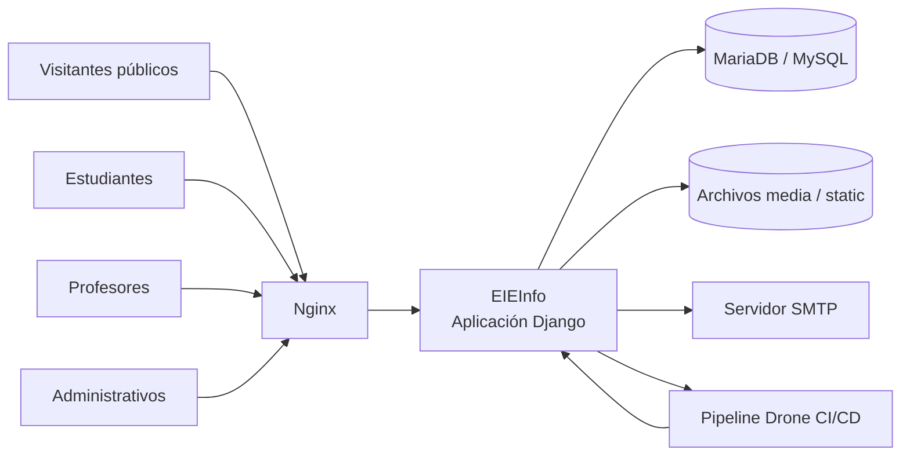
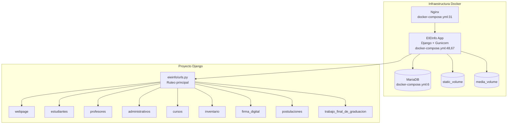

# Auditoría de diseño de software del sistema EIEInfo

## Entrega 1: Levantamiento del sistema y diagnóstico inicial

**Curso:** IE0417 - Diseño de Software para Ingeniería  
**Sistema auditado:** EIEInfo  
**Tipo de entrega:** Levantamiento del sistema y diagnóstico inicial  
**Estudiante:** Erick Vargas Monge  
**Carné:** C08215  
**Fecha:** 8 de junio de 2026  

---

## 1. Introducción

Este documento presenta un levantamiento inicial del sistema EIEInfo a partir de evidencia verificable encontrada en el repositorio. El análisis no se basa únicamente en el README, sino también en archivos de configuración, rutas, modelos, pruebas, scripts Docker, pipeline CI/CD y estructura general del proyecto.

La finalidad de esta entrega es responder qué sistema se tiene enfrente, cómo está organizado técnicamente y cuáles son sus principales riesgos preliminares desde una perspectiva de diseño de software. Los hallazgos documentados corresponden a observaciones iniciales y pueden ser refinados en etapas posteriores de auditoría.

---

## 2. Metodología de levantamiento

El levantamiento se realizó mediante inspección estática del repositorio. Se revisaron los siguientes elementos:

- Estructura general de carpetas bajo `src/server`.
- Configuración principal de Django en `src/server/eieinfo/settings.py`.
- Ruteo principal y rutas por módulo en archivos `urls.py`.
- Modelos Django definidos en archivos `models.py`.
- Carpetas `migrations/`.
- Archivos de pruebas `tests.py`.
- Dependencias en `requirements.txt` y `docker/django/requirements.txt`.
- Configuración Docker en `docker-compose.yml` y scripts bajo `docker/django/`.
- Pipeline CI/CD en `.drone.yml`.

Las afirmaciones técnicas se documentan con rutas y líneas cuando existe evidencia directa. Cuando la evidencia corresponde a ausencia de archivos, se indica explícitamente.

---

## 3. Ficha técnica del sistema

| Aspecto | Descripción | Evidencia |
|---|---|---|
| Tipo de sistema | Aplicación web institucional monolítica con modularización por apps Django. | `src/server/eieinfo/settings.py:44` |
| Framework principal | Django 4.1.3. | `requirements.txt:2` |
| Base de datos | MariaDB/MySQL. | `requirements.txt:27`, `docker-compose.yml:6` |
| Módulos principales | `estudiantes`, `profesores`, `administrativos`, `cursos`, `inventario`, `firma_digital`, `postulaciones`, entre otros. | `src/server/eieinfo/settings.py:56-73` |
| Servidor de aplicación | Gunicorn dentro del servicio Docker de la aplicación. | `docker-compose.yml:67` |
| Servidor web | nginx como servicio separado. | `docker-compose.yml:31` |
| CI/CD | Pipeline Drone con pasos de base de datos, migraciones, pruebas/cobertura y despliegue SSH. | `.drone.yml:1`, `.drone.yml:273`, `.drone.yml:344` |
| Pruebas | Existen pruebas Django distribuidas en varios módulos. | `src/server/trabajo_final_de_graduacion/tests.py:43` |

---

## 4. Mapa general del sistema

El sistema se organiza como una aplicación web Django con múltiples apps internas. La entrada HTTP se canaliza mediante `eieinfo/urls.py`, que delega rutas hacia módulos funcionales. La aplicación se despliega con nginx, Gunicorn y MariaDB mediante Docker Compose.

### 4.1 Diagrama de contexto

### 4.2 Diagrama de módulos y contenedores

### 4.3 Componentes principales

| Capa | Componentes | Evidencia |
|---|---|---|
| Entrada HTTP | Archivo raíz de rutas `eieinfo/urls.py`. | `src/server/eieinfo/urls.py:23` |
| Portal público | `webpage`, `anuncios`, `eventos`, `proyectos`, `laboratorios`, `cursos`. | `src/server/eieinfo/urls.py:37-47`, `src/server/eieinfo/urls.py:62` |
| Usuarios estudiantes | Módulo `estudiantes` con subrutas para home, cursos, asistencias, trámites, bodega y práctica profesional. | `src/server/estudiantes/urls.py:10-45` |
| Usuarios profesores | Módulo `profesores` con subrutas por áreas funcionales. | `src/server/profesores/urlpatterns/cursos.py:8`, `src/server/profesores/urlpatterns/consejo_asesor.py:8` |
| Administración académica | `administrativos`, `cursos`, `proyectos`, `laboratorios`, `trabajo_final_de_graduacion`. | `src/server/eieinfo/urls.py:33`, `src/server/eieinfo/urls.py:47`, `src/server/eieinfo/urls.py:68` |
| Persistencia | Modelos Django distribuidos por app. | `src/server/estudiantes/models.py:109`, `src/server/trabajo_final_de_graduacion/models.py:124` |
| Infraestructura | Docker Compose con MariaDB, nginx y aplicación Django/Gunicorn. | `docker-compose.yml:6`, `docker-compose.yml:31`, `docker-compose.yml:48` |

### 4.1 Diagrama de contexto

### 4.2 Diagrama de módulos y contenedores

### 4.3 Componentes principales

| Capa | Componentes | Evidencia |
|---|---|---|
| Entrada HTTP | Archivo raíz de rutas `eieinfo/urls.py`. | `src/server/eieinfo/urls.py:23` |
| Portal público | `webpage`, `anuncios`, `eventos`, `proyectos`, `laboratorios`, `cursos`. | `src/server/eieinfo/urls.py:37-47`, `src/server/eieinfo/urls.py:62` |
| Usuarios estudiantes | Módulo `estudiantes` con subrutas para home, cursos, asistencias, trámites, bodega y práctica profesional. | `src/server/estudiantes/urls.py:10-45` |
| Usuarios profesores | Módulo `profesores` con subrutas por áreas funcionales. | `src/server/profesores/urlpatterns/cursos.py:8`, `src/server/profesores/urlpatterns/consejo_asesor.py:8` |
| Administración académica | `administrativos`, `cursos`, `proyectos`, `laboratorios`, `trabajo_final_de_graduacion`. | `src/server/eieinfo/urls.py:33`, `src/server/eieinfo/urls.py:47`, `src/server/eieinfo/urls.py:68` |
| Persistencia | Modelos Django distribuidos por app. | `src/server/estudiantes/models.py:109`, `src/server/trabajo_final_de_graduacion/models.py:124` |
| Infraestructura | Docker Compose con MariaDB, nginx y aplicación Django/Gunicorn. | `docker-compose.yml:6`, `docker-compose.yml:31`, `docker-compose.yml:48` |

## 5. Inventario funcional

| Área funcional | Funciones observadas | Evidencia |
|---|---|---|
| Portal institucional | Inicio, búsqueda, contacto, publicaciones, personal, estudios, recursos y páginas estáticas. | `src/server/webpage/urls.py:10-56` |
| Cursos y planes | Listado de cursos, detalle, planes de estudio y horarios por ciclo. | `src/server/cursos/urls.py:8-18` |
| Estudiantes | Portal de estudiante, cursos, asistencias, trámites, bodega, proyecto eléctrico y práctica profesional. | `src/server/estudiantes/urls.py:10-45` |
| Profesores | Cursos, cátedras, proyectos, publicaciones, laboratorios, consejo asesor y asistencias. | `src/server/profesores/urlpatterns/cursos.py:13-43`, `src/server/profesores/urlpatterns/consejo_asesor.py:13-168` |
| Inventario | Gestión de bodega, grupos, funcionarios y préstamos. | `src/server/inventario/urls.py:6-29` |
| Firma digital | Solicitudes, carga de PDF, documentos firmados y operaciones AJAX. | `src/server/firma_digital/urls.py:7-50` |
| Postulaciones | Formulario, listado, detalle y exportación de postulantes. | `src/server/postulaciones/urls.py` |
| Trabajos finales | TFG, comités, revisiones, defensas y documentos complementarios. | `src/server/trabajo_final_de_graduacion/models.py:86-280` |

---

## 6. Hallazgos iniciales

| ID | Hallazgo | Descripción | Evidencia | Impacto | Criticidad |
|---|---|---|---|---|---|
| H01 | Monolito Django modular | El sistema está organizado como un único proyecto Django con múltiples apps funcionales registradas centralmente. | `src/server/eieinfo/settings.py:44`, `src/server/eieinfo/settings.py:56-73` | Cambios globales de configuración o despliegue pueden afectar a todos los módulos. | Media |
| H02 | Acoplamiento entre dominios | Varias apps importan directamente modelos de otras apps, lo que reduce independencia modular. | `src/server/cursos/models.py:3`, `src/server/profesores/views/consejo_asesor.py:9-20` | Aumenta el riesgo de regresiones cruzadas y dificulta evolución por módulos. | Alta |
| H03 | Ruteo raíz extenso | El archivo raíz de rutas concentra inclusiones de muchas áreas funcionales. | `src/server/eieinfo/urls.py:23-68` | El ruteo principal se convierte en un punto sensible de mantenimiento. | Media |
| H04 | Submodularización interna en apps grandes | Apps como `estudiantes` y `profesores` dividen rutas por subáreas funcionales. | `src/server/estudiantes/urls.py:10-45`, `src/server/profesores/urlpatterns/cursos.py:8` | Mejora la organización local, aunque no elimina acoplamiento entre dominios. | Baja |
| H05 | Ausencia de migraciones versionadas reales | Las carpetas `migrations/` contienen únicamente `__init__.py`; no se encontraron archivos `0001_initial.py` o `0002_*.py`. Esta evidencia corresponde a ausencia de archivos. | Evidencia por ausencia en `src/server/*/migrations/`; modelos existentes en `src/server/estudiantes/models.py:109`, `src/server/trabajo_final_de_graduacion/models.py:124` | Compromete trazabilidad y reproducibilidad del esquema de base de datos. | Alta |
| H06 | Migraciones generadas durante ejecución o preparación | Scripts y pipeline ejecutan `makemigrations`; Docker también ejecuta `migrate` al iniciar. | `.drone.yml:100`, `docker/django/migraciones.sh:7-9`, `docker-compose.yml:65` | Mezcla generación/evolución de esquema con ejecución operativa. | Alta |
| H07 | Configuración sensible visible o referenciada | Existen configuraciones sensibles visibles o referenciadas en archivos del repositorio. No se reproducen valores sensibles en este documento. | `src/server/eieinfo/settings.py:344`, `docker-compose.yml:15-18`, `src/server/eieinfo/settings.py:525` | Riesgo de exposición de secretos y dificultad de rotación segura. | Alta |
| H08 | Configuración dependiente del hostname | La configuración cambia a modo desarrollo si el hostname no es `faraday`. | `src/server/eieinfo/settings.py:480`, `src/server/eieinfo/settings.py:488`, `src/server/eieinfo/settings.py:490` | Riesgo de despliegue con `DEBUG=True` y `ALLOWED_HOSTS=['*']` si el entorno no coincide. | Alta |
| H09 | Cobertura CI parcial | El pipeline ejecuta cobertura sobre un subconjunto de apps, no sobre todos los módulos registrados. | `.drone.yml:273`, `src/server/eieinfo/settings.py:56-73` | Regresiones en módulos fuera del conjunto probado pueden pasar inadvertidas. | Media |
| H10 | Uso de `csrf_exempt` | Varias vistas desactivan protección CSRF. | `src/server/webpage/views.py:375`, `src/server/conferencias/views.py:43`, `src/server/firma_digital/views.py:410` | Posible superficie de ataque si las vistas procesan acciones sensibles. | Alta |
| H11 | Dependencias divergentes | `requirements.txt` y `docker/django/requirements.txt` usan referencias distintas para `django-wiki`. | `requirements.txt:46`, `docker/django/requirements.txt:52` | Riesgo de diferencias entre ambientes local, Docker y CI. | Media |
| H12 | Deuda técnica histórica | Hay señales de compatibilidad antigua y comandos/rutas comentadas. | `src/server/eieinfo/settings.py:4`, `src/server/eieinfo/settings.py:20`, `src/server/estudiantes/urls.py:32-33`, `.drone.yml:374-377` | Aumenta costo de mantenimiento y requiere distinguir deuda activa de comentarios obsoletos. | Media |

---

## 7. Matriz preliminar de riesgos

| Riesgo identificado | Posible causa | Impacto | Probabilidad | Prioridad preliminar | Hallazgos asociados |
|---|---|---|---|---|---|
| Exposición o uso inadecuado de configuración sensible | Configuración sensible visible o referenciada en archivos del repositorio. | Alto | Alta | Alta | H07 |
| Base de datos no reproducible desde el repositorio | Ausencia de migraciones versionadas y generación de migraciones durante ejecución/preparación. | Alto | Alta | Alta | H05, H06 |
| Despliegue con configuración insegura | Activación de modo desarrollo según hostname distinto de `faraday`. | Alto | Media | Alta | H08 |
| Regresiones cruzadas entre módulos | Acoplamiento directo entre apps y ruteo centralizado extenso. | Medio | Alta | Alta | H02, H03 |
| Fallos no detectados por pruebas automatizadas | Cobertura CI concentrada en un subconjunto de apps. | Medio | Media | Media | H09 |
| Riesgo de ataques CSRF en vistas específicas | Uso de `csrf_exempt` en varias vistas. | Alto | Media | Alta | H10 |
| Diferencias entre ambientes de ejecución | Dependencias divergentes entre archivos de requerimientos. | Medio | Media | Media | H11 |
| Dificultad de mantenimiento evolutivo | Deuda técnica histórica, compatibilidad antigua y comandos/rutas comentadas. | Medio | Media | Media | H12 |
| Complejidad para modificar dominios funcionales | Monolito modular con acoplamientos entre apps. | Medio | Media | Media | H01, H02, H04 |

---

## 8. Respuestas a preguntas orientadoras

### 8.1 ¿Qué tan centralizado o fragmentado está el sistema?

El sistema presenta una combinación de centralización y fragmentación. Por un lado, está centralizado porque funciona como un único proyecto Django, con configuración principal en `src/server/eieinfo/settings.py` y ruteo raíz en `src/server/eieinfo/urls.py`. Esta estructura confirma una arquitectura monolítica, donde varios dominios funcionales comparten el mismo proyecto, configuración, despliegue y base de datos.

Por otro lado, también existe fragmentación funcional, ya que el sistema está dividido en múltiples apps Django como `estudiantes`, `profesores`, `cursos`, `inventario`, `firma_digital`, `postulaciones` y `trabajo_final_de_graduacion`. Esta modularización ayuda a separar áreas funcionales, pero la presencia de importaciones directas entre apps muestra que la separación no es completamente independiente.

### 8.2 ¿Cuáles módulos concentran más responsabilidad?

Los módulos que parecen concentrar más responsabilidad son `estudiantes`, `profesores`, `cursos`, `firma_digital`, `inventario` y `trabajo_final_de_graduacion`. Esto se observa por la cantidad de rutas, subrutas, modelos y funciones asociadas a cada uno.

El módulo `estudiantes` concentra funcionalidades relacionadas con portal de estudiante, cursos, asistencias, trámites, bodega, proyecto eléctrico y práctica profesional. El módulo `profesores` concentra cursos, cátedras, proyectos, publicaciones, laboratorios, consejo asesor y asistencias. `trabajo_final_de_graduacion` también representa un dominio importante porque contiene modelos asociados a TFG, comités, revisiones, defensas y documentos complementarios.

### 8.3 ¿Qué partes parecen más activas y cuáles más legadas?

Las partes más activas parecen ser las relacionadas con módulos funcionales principales, rutas de estudiantes, profesores, firma digital, inventario, postulaciones y trabajos finales. Estas áreas tienen rutas, vistas, modelos y funcionalidades observables dentro del repositorio.

Las partes más legadas se observan en señales de compatibilidad histórica y comentarios dentro del código. Por ejemplo, `src/server/eieinfo/settings.py` conserva referencias históricas asociadas a Django 1.9.1, mientras que existen rutas o comandos comentados en archivos como `src/server/estudiantes/urls.py` y `.drone.yml`. Esto sugiere que el sistema ha evolucionado con el tiempo y conserva decisiones o fragmentos asociados a etapas anteriores del desarrollo.

### 8.4 ¿Qué señales hay de crecimiento orgánico y deuda técnica?

Una señal clara de crecimiento orgánico es la cantidad de apps funcionales registradas dentro del mismo proyecto Django. El sistema parece haber incorporado nuevas áreas conforme surgieron necesidades institucionales, por ejemplo estudiantes, profesores, cursos, inventario, postulaciones, firma digital y trabajos finales.

También se observan señales de deuda técnica en el acoplamiento entre dominios, el ruteo raíz extenso, la ausencia de migraciones versionadas reales, la generación de migraciones durante ejecución o preparación, dependencias divergentes entre ambientes y configuración dependiente del hostname. Estas condiciones no necesariamente impiden el funcionamiento del sistema, pero sí pueden aumentar el costo de mantenimiento y dificultar una evolución controlada.

### 8.5 ¿Dónde se observan los primeros riesgos de mantenimiento o evolución?

Los primeros riesgos de mantenimiento o evolución se observan principalmente en cinco áreas:

1. **Base de datos:** no se encontraron migraciones versionadas reales, lo que dificulta reproducir el esquema desde el repositorio.
2. **Despliegue:** existen scripts que generan o aplican migraciones durante ejecución o preparación, lo cual puede producir diferencias entre ambientes.
3. **Seguridad:** se observan configuraciones sensibles visibles o referenciadas y uso de `csrf_exempt` en varias vistas.
4. **Configuración:** el comportamiento del sistema depende del hostname, lo cual puede activar configuraciones de desarrollo en ambientes no esperados.
5. **Mantenibilidad modular:** existen importaciones directas entre apps y un ruteo raíz extenso, lo cual aumenta el riesgo de regresiones cruzadas.

Estos riesgos deben analizarse con mayor profundidad en la siguiente etapa de auditoría.

---

## 9. Conclusiones

EIEInfo es una aplicación web institucional amplia, construida como un proyecto Django monolítico con modularización por apps. La estructura permite separar áreas funcionales como estudiantes, profesores, cursos, inventario, postulaciones y firma digital. Sin embargo, la evidencia muestra acoplamientos frecuentes entre dominios mediante importaciones directas y una concentración importante de rutas en el archivo principal del proyecto.

Los riesgos más relevantes del diagnóstico inicial se concentran en la gestión de base de datos, la configuración de seguridad, el manejo de configuración sensible, la cobertura de pruebas y la reproducibilidad del despliegue. En particular, la ausencia de migraciones versionadas junto con scripts que generan migraciones durante ejecución o preparación constituye un punto crítico para la evolución controlada del modelo de datos.

Para las siguientes fases de auditoría, conviene profundizar en dependencias entre módulos, flujos de autenticación y autorización, alcance real de las pruebas, manejo de configuración sensible y estrategia de migraciones/despliegue.

---

## 10. Anexos

### Anexo A. Evidencia de migraciones

Se encontraron carpetas `migrations/` en las siguientes apps:

- `src/server/administrativos/migrations/`
- `src/server/alumni/migrations/`
- `src/server/anuncios/migrations/`
- `src/server/atributos/migrations/`
- `src/server/conferencias/migrations/`
- `src/server/cursos/migrations/`
- `src/server/estudiantes/migrations/`
- `src/server/eventos/migrations/`
- `src/server/firma_digital/migrations/`
- `src/server/inventario/migrations/`
- `src/server/laboratorios/migrations/`
- `src/server/postulaciones/migrations/`
- `src/server/profesores/migrations/`
- `src/server/proyectos/migrations/`
- `src/server/trabajo_final_de_graduacion/migrations/`
- `src/server/trabajos_finales/migrations/`
- `src/server/webpage/migrations/`

Cada carpeta contiene únicamente `__init__.py`. No se encontraron archivos `0001_initial.py` ni `0002_*.py`. Esta es evidencia por ausencia de archivos reales de migración.

### Anexo B. Comandos de migración observados

| Archivo | Línea | Comando |
|---|---:|---|
| `.drone.yml` | 100 | `python src/server/manage.py makemigrations` |
| `.drone.yml` | 101 | `python src/server/manage.py showmigrations` |
| `.drone.yml` | 102 | `python src/server/manage.py migrate --noinput` comentado |
| `docker/django/migraciones.sh` | 7 | `python src/server/manage.py makemigrations` |
| `docker/django/migraciones.sh` | 8 | `python src/server/manage.py showmigrations` |
| `docker/django/migraciones.sh` | 9 | `python src/server/manage.py migrate --noinput` |
| `docker-compose.yml` | 65 | Ejecuta `/home/eieinfo/info/migraciones.sh` |

### Anexo C. Archivos principales revisados

- `src/server/eieinfo/settings.py`
- `src/server/eieinfo/urls.py`
- `src/server/estudiantes/urls.py`
- `src/server/profesores/urlpatterns/`
- `src/server/*/models.py`
- `src/server/*/tests.py`
- `requirements.txt`
- `docker/django/requirements.txt`
- `docker-compose.yml`
- `docker/django/migraciones.sh`
- `.drone.yml`
