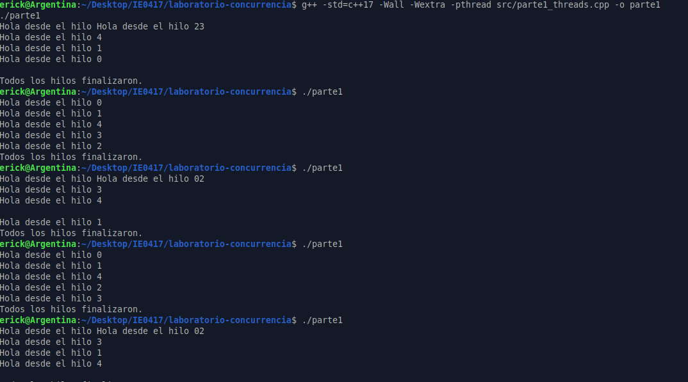
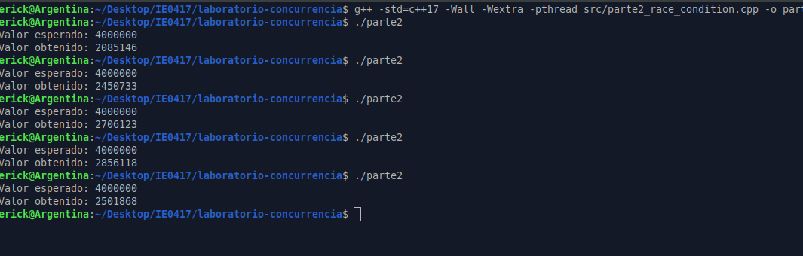
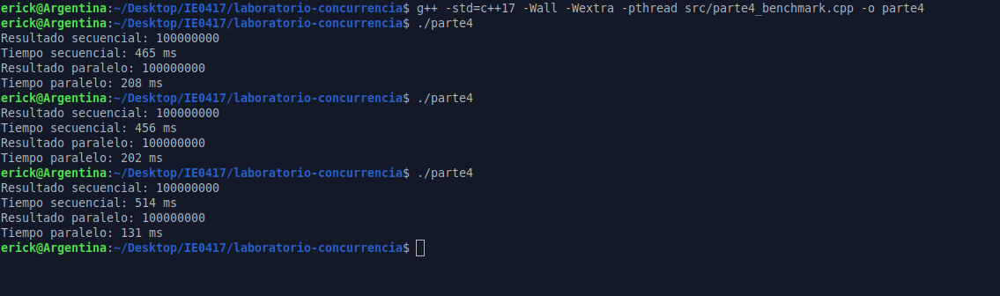
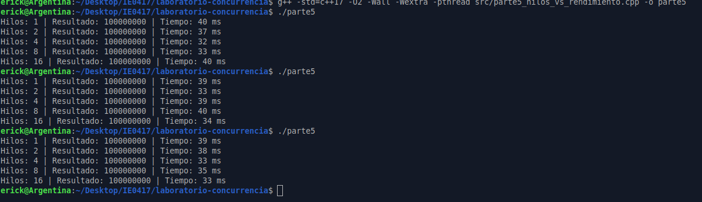
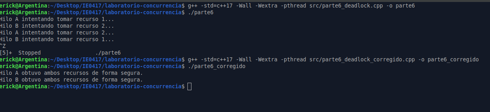

# Resultados y análisis

## Parte 1: Creación básica de hilos

### Compilación

```bash
g++ -std=c++17 -Wall -Wextra -pthread src/parte1_threads.cpp -o parte1
```

### Ejecución

```bash
./parte1
```

### Resultados observados

El programa se ejecutó 5 veces. En cada ejecución se crearon 5 hilos, cada uno mostrando un mensaje con su identificador.

#### Ejecución 1

```text
Hola desde el hilo Hola desde el hilo 23
Hola desde el hilo 4
Hola desde el hilo 1
Hola desde el hilo 0

Todos los hilos finalizaron.
```

#### Ejecución 2

```text
Hola desde el hilo 0
Hola desde el hilo 1
Hola desde el hilo 4
Hola desde el hilo 3
Hola desde el hilo 2
Todos los hilos finalizaron.
```

#### Ejecución 3

```text
Hola desde el hilo Hola desde el hilo 02
Hola desde el hilo 3
Hola desde el hilo 4

Hola desde el hilo 1
Todos los hilos finalizaron.
```

#### Ejecución 4

```text
Hola desde el hilo 0
Hola desde el hilo 1
Hola desde el hilo 4
Hola desde el hilo 2
Hola desde el hilo 3
Todos los hilos finalizaron.
```

#### Ejecución 5

```text
Hola desde el hilo Hola desde el hilo 02
Hola desde el hilo 3
Hola desde el hilo 1
Hola desde el hilo 4

Todos los hilos finalizaron.
```

---



### Análisis

#### 1. ¿Los mensajes aparecen siempre en el mismo orden?

No, los mensajes no aparecen siempre en el mismo orden. En algunas ejecuciones los hilos imprimieron en orden diferente, por ejemplo una vez apareció primero el hilo 0, luego el 1, después el 4, el 3 y el 2. En otra ejecución, algunos mensajes incluso se mezclaron en la misma línea.

Esto muestra que, aunque los hilos se crean en un orden específico dentro del `for`, eso no garantiza que se ejecuten o impriman en ese mismo orden.

#### 2. ¿Por qué podría cambiar el orden de impresión?

El orden puede cambiar porque los hilos son planificados por el sistema operativo. Cuando se crean varios hilos, el sistema decide cuál hilo recibe tiempo de CPU en cada momento.

Además, como todos los hilos escriben en `std::cout`, pueden ocurrir escrituras casi al mismo tiempo. Por eso algunas líneas salieron mezcladas, como:

```text
Hola desde el hilo Hola desde el hilo 23
```

Esto ocurre porque no se está protegiendo la salida de consola con un mecanismo de sincronización como un mutex.

#### 3. ¿Qué función cumple join()?

La función `join()` hace que el hilo principal espere a que cada hilo termine su ejecución antes de continuar.

En este programa, `main()` crea los hilos y luego usa `join()` para esperar a que todos finalicen. Después de eso se imprime:

```text
Todos los hilos finalizaron.
```

Esto garantiza que el programa principal no termine antes de que los hilos secundarios hayan completado su trabajo.

#### 4. ¿Qué podría pasar si no se llama a join()?

Si no se llama a `join()`, el programa principal podría terminar antes de que los hilos finalicen. Además, en C++, si un objeto `std::thread` sigue activo y se destruye sin haber llamado a `join()` o `detach()`, el programa puede terminar abruptamente.

Por eso, usar `join()` es importante para asegurar que los hilos terminen correctamente y que el programa tenga un cierre ordenado.

---

### Reflexión de la parte 1

Esta primera parte permitió observar que crear hilos en C++ es relativamente directo usando `std::thread`, pero también mostró que la ejecución concurrente no sigue necesariamente el orden en que los hilos fueron creados.

El resultado más llamativo fue que algunos mensajes se imprimieron mezclados. Esto evidencia que varios hilos pueden acceder al mismo recurso, en este caso la consola, al mismo tiempo. Aunque en esta parte no se corrige ese comportamiento, sirve como una introducción a los problemas de concurrencia que se trabajan en las siguientes partes del laboratorio.

---

## Parte 2: Condición de carrera

### Compilación

```bash
g++ -std=c++17 -Wall -Wextra -pthread src/parte2_race_condition.cpp -o parte2
```

### Ejecución

```bash
./parte2
```

### Resultados observados

El programa se ejecutó 5 veces. En todas las ejecuciones el valor esperado era `4000000`, ya que se usaron 4 hilos y cada uno debía incrementar el contador 1000000 veces.

| Ejecución | Valor esperado | Valor obtenido |
|---|---:|---:|
| 1 | 4000000 | 2085146 |
| 2 | 4000000 | 2450733 |
| 3 | 4000000 | 2706123 |
| 4 | 4000000 | 2856118 |
| 5 | 4000000 | 2501868 |

---




### Análisis

#### 1. ¿El valor obtenido siempre coincide con el valor esperado?

No, el valor obtenido no coincide con el valor esperado. En todas las ejecuciones el resultado fue menor que `4000000`.

Además, el valor obtenido cambió entre ejecuciones. Por ejemplo, en una ejecución se obtuvo `2085146`, mientras que en otra se obtuvo `2856118`. Esto muestra que el comportamiento no es determinista.

#### 2. ¿Por qué se pierden incrementos?

Se pierden incrementos porque varios hilos acceden al mismo tiempo a la variable global `contador`.

Cuando dos o más hilos leen el mismo valor de `contador` antes de que alguno lo actualice, ambos pueden calcular el mismo resultado y escribirlo de nuevo. Esto provoca que algunos incrementos se sobrescriban y no se reflejen en el valor final.

Por ejemplo, si dos hilos leen `contador = 10`, ambos pueden calcular `11` y ambos escribir `11`. Aunque dos hilos hicieron un incremento, el contador solo aumentó una vez.

#### 3. ¿La operación contador++ es realmente una sola operación a nivel de CPU?

No. Aunque en C++ se escribe como una sola instrucción, `contador++` no necesariamente se ejecuta como una única operación indivisible a nivel de CPU.

En general, esta operación implica varios pasos:

```text
1. Leer el valor actual de contador.
2. Incrementar el valor.
3. Escribir el nuevo valor en memoria.
```

Si varios hilos hacen esos pasos al mismo tiempo sin sincronización, pueden interferir entre sí.

#### 4. ¿Qué problema de concurrencia se está observando?

Se está observando una condición de carrera. Esto ocurre cuando varios hilos acceden a un recurso compartido al mismo tiempo y al menos uno de ellos lo modifica.

En este caso, el recurso compartido es la variable global `contador`. Como los hilos la modifican sin usar un mecanismo de sincronización, el resultado final depende del orden en que el sistema operativo ejecuta los hilos. Por eso el valor cambia entre ejecuciones y no coincide con el resultado esperado.

---

### Reflexión de la parte 2

Esta parte permitió observar un problema real de concurrencia. Aunque el programa parece sencillo, el uso de varios hilos modificando una misma variable compartida provocó resultados incorrectos.

El punto más importante es que `contador++` no debe asumirse como una operación segura cuando varios hilos la ejecutan al mismo tiempo. Sin sincronización, los hilos pueden interferir entre sí y perder incrementos. Esto explica por qué el valor final fue menor que el esperado en todas las ejecuciones.	


---

## Parte 3: Corrección usando mutex

### Compilación

```bash
g++ -std=c++17 -Wall -Wextra -pthread src/parte3_mutex.cpp -o parte3
```

### Ejecución

```bash
./parte3
```

### Resultados observados

El programa se ejecutó 5 veces. En todas las ejecuciones el valor esperado era `4000000`, ya que se usaron 4 hilos y cada uno debía incrementar el contador 1000000 veces.

| Ejecución | Valor esperado | Valor obtenido |
|---|---:|---:|
| 1 | 4000000 | 4000000 |
| 2 | 4000000 | 4000000 |
| 3 | 4000000 | 4000000 |
| 4 | 4000000 | 4000000 |
| 5 | 4000000 | 4000000 |

---

### Comparación con la Parte 2

En la Parte 2, el valor obtenido no coincidía con el esperado porque varios hilos modificaban la variable `contador` al mismo tiempo sin ningún mecanismo de sincronización. Esto provocaba una condición de carrera y se perdían incrementos.

En esta parte, el resultado fue correcto en todas las ejecuciones. La diferencia principal es que ahora se protegió el acceso a `contador` usando un `std::mutex` y `std::lock_guard`.

---


### Análisis

#### 1. ¿Qué cambió con respecto al programa anterior?

Con respecto al programa anterior, se agregó un `std::mutex` llamado `mtx` y se utilizó `std::lock_guard` dentro de la función `incrementar`.

En la Parte 2, todos los hilos podían ejecutar `contador++` al mismo tiempo. En esta parte, solo un hilo puede entrar a la sección crítica a la vez, por lo que el incremento se realiza de forma segura.

---

#### 2. ¿Qué hace std::mutex?

`std::mutex` es un mecanismo de exclusión mutua. Su función es proteger una sección crítica del código para que solo un hilo pueda ejecutarla en un momento determinado.

En este programa, el mutex protege la variable compartida `contador`. Cuando un hilo entra a la sección donde se incrementa el contador, bloquea el mutex. Mientras el mutex está bloqueado, los demás hilos deben esperar.

---

#### 3. ¿Qué hace std::lock_guard?

`std::lock_guard` es una forma segura y automática de manejar un mutex. Cuando se crea un `std::lock_guard`, este bloquea el mutex. Cuando el `lock_guard` sale de su ámbito, libera automáticamente el mutex.

En este programa se usó así:

```cpp
std::lock_guard<std::mutex> lock(mtx);
contador++;
```

Esto evita tener que llamar manualmente a `mtx.lock()` y `mtx.unlock()`. También reduce el riesgo de olvidar liberar el mutex.

---

#### 4. ¿Por qué ahora el resultado sí debería ser correcto?

Ahora el resultado debería ser correcto porque el acceso a `contador` está protegido. Aunque hay varios hilos ejecutándose, solo uno puede modificar el contador a la vez.

Esto evita que dos hilos lean el mismo valor y escriban resultados duplicados. Por esa razón, no se pierden incrementos y el valor final coincide con el esperado.

---

#### 5. ¿Qué desventaja podría tener proteger cada incremento individual con un mutex?

La desventaja es que proteger cada incremento individual puede afectar el rendimiento. Cada vez que un hilo quiere incrementar el contador, debe bloquear y desbloquear el mutex.

Como hay 4 hilos y cada uno hace 1000000 incrementos, el mutex se usa millones de veces. Esto agrega sobrecarga y puede hacer que el programa sea más lento, aunque el resultado sea correcto.

Una alternativa más eficiente sería que cada hilo use una variable local para acumular sus incrementos y luego actualice el contador global una sola vez al final, protegiendo solo esa actualización con el mutex.

---

### Reflexión de la parte 3

Esta parte mostró cómo corregir una condición de carrera usando sincronización. En la Parte 2, el resultado cambiaba en cada ejecución porque los hilos modificaban una variable compartida sin control. En cambio, al usar `std::mutex` y `std::lock_guard`, el valor obtenido fue correcto en todas las ejecuciones.

También se pudo observar que la sincronización ayuda a mantener la consistencia de los datos, pero puede tener un costo de rendimiento. Por eso, aunque usar mutex resuelve el problema de concurrencia, también es importante pensar en qué tan grande debe ser la sección crítica y cuántas veces se bloquea el recurso compartido.

---

## Parte 4: Mini benchmark secuencial vs. paralelo

### Compilación

```bash
g++ -std=c++17 -O2 -Wall -Wextra -pthread src/parte4_benchmark.cpp -o parte4
```

### Ejecución

```bash
./parte4
```

### Resultados observados

El programa se ejecutó 3 veces. En cada ejecución se calculó la suma de un vector de `100000000` elementos, primero de forma secuencial y luego de forma paralela usando 4 hilos.

| Ejecución | Resultado secuencial | Tiempo secuencial | Resultado paralelo | Tiempo paralelo | ¿Cuál fue más rápido? |
|---|---:|---:|---:|---:|---|
| 1 | 100000000 | 465 ms | 100000000 | 208 ms | Paralelo |
| 2 | 100000000 | 456 ms | 100000000 | 202 ms | Paralelo |
| 3 | 100000000 | 514 ms | 100000000 | 131 ms | Paralelo |

---



### Análisis

#### 1. ¿El resultado secuencial y el paralelo son iguales?

Sí, el resultado secuencial y el resultado paralelo fueron iguales en las tres ejecuciones.

En todos los casos se obtuvo:

```text
100000000
```

Esto confirma que ambas versiones calcularon correctamente la suma del vector.

---

#### 2. ¿La versión paralela siempre fue más rápida?

Sí, en estas pruebas la versión paralela siempre fue más rápida que la versión secuencial.

Por ejemplo, en la primera ejecución la versión secuencial tardó `465 ms`, mientras que la versión paralela tardó `208 ms`. En la tercera ejecución, la diferencia fue todavía mayor, ya que la versión secuencial tardó `514 ms` y la paralela `131 ms`.

Sin embargo, esto no significa que la versión paralela siempre será más rápida en todos los casos. Depende del tamaño del problema, la cantidad de hilos, la cantidad de núcleos disponibles y el costo de crear y administrar los hilos.

---

#### 3. ¿Por qué dividir el vector en bloques permite paralelizar el trabajo?

Dividir el vector en bloques permite que cada hilo trabaje sobre una parte diferente del vector. En lugar de que un solo hilo sume todos los elementos, varios hilos suman distintas secciones al mismo tiempo.

En este caso, cada hilo calcula una suma parcial. Después de que todos los hilos terminan, el programa suma esos resultados parciales para obtener la suma total.

Esto funciona bien porque la suma de cada bloque es independiente de las demás.

---

#### 4. ¿Qué costos adicionales tiene la versión paralela?

La versión paralela tiene costos adicionales relacionados con la creación y administración de hilos. También existe un costo por dividir el trabajo, almacenar resultados parciales y esperar a que todos los hilos terminen usando `join()`.

Además, el sistema operativo debe planificar los hilos y asignarles tiempo de CPU. Si hay demasiados hilos o si la tarea es muy pequeña, ese costo puede ser mayor que el beneficio de paralelizar.

---

#### 5. ¿Qué podría pasar si el vector fuera muy pequeño?

Si el vector fuera muy pequeño, la versión paralela podría no ser más rápida. Incluso podría ser más lenta que la versión secuencial.

Esto ocurriría porque el trabajo a realizar sería tan pequeño que el costo de crear hilos, dividir el vector y sincronizar la finalización de los hilos podría superar el tiempo ahorrado por ejecutar la suma en paralelo.

En general, la paralelización tiene más sentido cuando la tarea es suficientemente grande para compensar el costo adicional de administrar hilos.

---

### Reflexión de la parte 4

Esta parte permitió comparar de forma práctica una ejecución secuencial contra una ejecución paralela. En las pruebas realizadas, ambas versiones produjeron el mismo resultado, pero la versión paralela fue más rápida.

El resultado muestra que dividir una tarea grande entre varios hilos puede mejorar el rendimiento. Sin embargo, también queda claro que el paralelismo no es gratuito, ya que crear y administrar hilos tiene un costo. Por eso, antes de paralelizar una tarea, es importante analizar si el tamaño del problema justifica ese costo.

---

## Parte 5: Cantidad de hilos vs. rendimiento

### Compilación

```bash
g++ -std=c++17 -O2 -Wall -Wextra -pthread src/parte5_hilos_vs_rendimiento.cpp -o parte5
```

### Ejecución

```bash
./parte5
```

### Resultados observados

El programa se ejecutó 3 veces. En cada ejecución se calculó la suma de un vector de `100000000` elementos usando diferentes cantidades de hilos: 1, 2, 4, 8 y 16.

#### Ejecución 1

| Cantidad de hilos | Resultado | Tiempo obtenido |
|---:|---:|---:|
| 1 | 100000000 | 40 ms |
| 2 | 100000000 | 37 ms |
| 4 | 100000000 | 32 ms |
| 8 | 100000000 | 33 ms |
| 16 | 100000000 | 40 ms |

#### Ejecución 2

| Cantidad de hilos | Resultado | Tiempo obtenido |
|---:|---:|---:|
| 1 | 100000000 | 39 ms |
| 2 | 100000000 | 33 ms |
| 4 | 100000000 | 39 ms |
| 8 | 100000000 | 40 ms |
| 16 | 100000000 | 34 ms |

#### Ejecución 3

| Cantidad de hilos | Resultado | Tiempo obtenido |
|---:|---:|---:|
| 1 | 100000000 | 39 ms |
| 2 | 100000000 | 38 ms |
| 4 | 100000000 | 33 ms |
| 8 | 100000000 | 35 ms |
| 16 | 100000000 | 33 ms |

---

### Resumen de mejores tiempos

| Cantidad de hilos | Mejor tiempo observado |
|---:|---:|
| 1 | 39 ms |
| 2 | 33 ms |
| 4 | 32 ms |
| 8 | 33 ms |
| 16 | 33 ms |

---





### Análisis

#### 1. ¿Cuál cantidad de hilos produjo el mejor tiempo?

El mejor tiempo observado fue con **4 hilos**, con un tiempo de `32 ms` en la primera ejecución.

Sin embargo, los tiempos con 8 y 16 hilos también fueron cercanos en algunas ejecuciones, llegando a `33 ms`. Esto muestra que hay variación entre ejecuciones y que el rendimiento no depende únicamente de aumentar la cantidad de hilos.

---

#### 2. ¿El tiempo mejoró siempre al aumentar los hilos?

No, el tiempo no mejoró siempre al aumentar los hilos.

Por ejemplo, en la primera ejecución:

```text
1 hilo  -> 40 ms
2 hilos -> 37 ms
4 hilos -> 32 ms
8 hilos -> 33 ms
16 hilos -> 40 ms
```

Al pasar de 1 a 4 hilos sí hubo mejora, pero al usar 8 hilos el tiempo aumentó ligeramente, y con 16 hilos volvió a ser similar al caso de 1 hilo.

Esto demuestra que más hilos no siempre significan mejor rendimiento.

---

#### 3. ¿Cuántos núcleos tiene la computadora donde se ejecutó el programa?

Para saber la cantidad de núcleos disponibles se puede usar el comando:

```bash
nproc
```

Resultado obtenido:

```text
2
```

Este dato es importante porque el rendimiento de los hilos depende de la cantidad de núcleos disponibles en la computadora o máquina virtual.

---

#### 4. ¿Qué ocurre cuando se usan más hilos que núcleos disponibles?

Cuando se usan más hilos que núcleos disponibles, el sistema operativo debe alternar la ejecución de los hilos. Esto significa que no todos los hilos pueden ejecutarse realmente al mismo tiempo.

En ese caso, puede aumentar el costo de planificación y cambio de contexto. Por eso, usar demasiados hilos puede dejar de mejorar el rendimiento e incluso hacerlo peor.

---

#### 5. ¿Qué relación tiene esto con el context switching?

El `context switching` ocurre cuando el sistema operativo detiene temporalmente la ejecución de un hilo y cambia a otro. Para hacer esto, debe guardar el estado del hilo actual y restaurar el estado del siguiente hilo.

Cuando hay muchos hilos compitiendo por pocos núcleos, puede haber más cambios de contexto. Esto agrega sobrecarga y puede reducir la eficiencia del programa.

---

#### 6. ¿Por qué la versión con 16 hilos podría no ser la mejor?

La versión con 16 hilos podría no ser la mejor porque crear y administrar muchos hilos tiene un costo. Además, si la máquina no tiene suficientes núcleos para ejecutar todos esos hilos en paralelo, el sistema operativo debe alternar entre ellos.

En esta práctica, con 16 hilos se obtuvo `40 ms` en una ejecución, que fue peor que usar 4 hilos. Esto muestra que, después de cierto punto, agregar más hilos puede aumentar la sobrecarga sin aportar una mejora real.

---

### Conclusión breve

En esta parte se observó que aumentar la cantidad de hilos puede mejorar el rendimiento hasta cierto punto, pero no garantiza una mejora continua. En las pruebas realizadas, el mejor tiempo fue con 4 hilos, mientras que con 8 y 16 hilos los tiempos no siempre fueron mejores.

Esto demuestra que el número de hilos debe elegirse considerando la cantidad de núcleos disponibles y el costo de administrar los hilos. Para una tarea grande como sumar un vector de muchos elementos, el paralelismo puede ayudar, pero usar demasiados hilos puede introducir sobrecarga adicional.

---

### Reflexión de la parte 5

Esta parte permitió comprobar que el paralelismo tiene límites prácticos. Aunque dividir el trabajo entre varios hilos puede reducir el tiempo de ejecución, el beneficio no crece indefinidamente.

Los resultados muestran que hay un punto donde agregar más hilos ya no mejora el rendimiento de forma clara. Esto puede deberse al costo de crear hilos, al context switching y a la cantidad de núcleos disponibles. Por eso, en un programa real no conviene usar una cantidad arbitraria de hilos, sino probar y ajustar según el hardware y el tipo de tarea.


---

## Parte 6: Ejemplo simple de deadlock

### Compilación

```bash
g++ -std=c++17 -Wall -Wextra -pthread src/parte6_deadlock.cpp -o parte6
```

### Ejecución

```bash
./parte6
```

### Resultado observado

```text
Hilo A intentando tomar recurso 1...
Hilo B intentando tomar recurso 2...
Hilo A intentando tomar recurso 2...
Hilo B intentando tomar recurso 1...
```

Después de imprimir esos mensajes, el programa no terminó normalmente. Se quedó bloqueado, por lo que fue necesario detenerlo manualmente.

---



### Análisis

#### 1. ¿El programa termina normalmente?

No, el programa no termina normalmente. Se queda bloqueado después de que ambos hilos intentan tomar el segundo recurso.

Esto ocurre porque cada hilo ya tomó un recurso y está esperando que el otro libere el recurso que necesita.

---

#### 2. ¿Qué recurso tomó primero el hilo A?

El hilo A tomó primero `recurso1`.

Esto se observa en el código:

```cpp
recurso1.lock();
```

Luego el hilo A espera un momento y después intenta tomar `recurso2`.

---

#### 3. ¿Qué recurso tomó primero el hilo B?

El hilo B tomó primero `recurso2`.

Esto se observa en el código:

```cpp
recurso2.lock();
```

Luego el hilo B espera un momento y después intenta tomar `recurso1`.

---

#### 4. ¿Por qué ninguno de los dos hilos puede continuar?

Ninguno de los dos hilos puede continuar porque cada uno está esperando un recurso que está en manos del otro.

El hilo A tiene `recurso1` y espera `recurso2`. Al mismo tiempo, el hilo B tiene `recurso2` y espera `recurso1`.

Como ninguno libera el recurso que ya tomó, ambos quedan bloqueados indefinidamente.

---

#### 5. ¿Qué significa espera circular?

La espera circular ocurre cuando dos o más hilos forman una cadena de dependencias donde cada hilo espera un recurso que tiene otro hilo.

En este caso, la espera circular es:

```text
Hilo A tiene recurso1 y espera recurso2.
Hilo B tiene recurso2 y espera recurso1.
```

Esto produce un deadlock, porque ninguno puede avanzar.

---

#### 6. ¿Cómo se podría evitar este problema?

Una forma de evitar este problema es asegurarse de que todos los hilos tomen los recursos en el mismo orden. Por ejemplo, ambos hilos podrían tomar primero `recurso1` y luego `recurso2`.

Otra forma más segura es usar `std::scoped_lock`, que permite bloquear varios mutex al mismo tiempo de forma coordinada. Esta fue la solución usada en la versión corregida.

---

## Parte 6: Versión corregida del deadlock

### Compilación

```bash
g++ -std=c++17 -Wall -Wextra -pthread src/parte6_deadlock_corregido.cpp -o parte6_corregido
```

### Ejecución

```bash
./parte6_corregido
```

### Resultado observado

```text
Hilo A obtuvo ambos recursos de forma segura.
Hilo B obtuvo ambos recursos de forma segura.
```

### Explicación

En la versión corregida se utilizó `std::scoped_lock` para tomar ambos recursos de manera segura:

```cpp
std::scoped_lock lock(recurso1, recurso2);
```

Con esto, cada hilo intenta adquirir ambos mutex de forma coordinada. Así se evita que un hilo tome un recurso y luego quede esperando indefinidamente por otro recurso que ya fue tomado por otro hilo.

---

### Pregunta final: ¿Por qué std::scoped_lock ayuda a evitar este deadlock?

`std::scoped_lock` ayuda a evitar el deadlock porque bloquea varios mutex al mismo tiempo usando una estrategia segura. En lugar de tomar `recurso1` y `recurso2` manualmente en órdenes diferentes, `std::scoped_lock` administra la adquisición de ambos recursos.

Además, libera automáticamente los mutex cuando sale del ámbito de la función, por lo que también reduce el riesgo de olvidar llamar a `unlock()`.

En esta práctica, el programa corregido sí terminó normalmente, mostrando que ambos hilos pudieron obtener los recursos sin quedarse bloqueados.

---

### Reflexión de la parte 6

Esta parte permitió observar un deadlock de forma práctica. El problema apareció porque dos hilos tomaron recursos en diferente orden y luego quedaron esperando entre sí.

También se comprobó que el problema puede corregirse usando una estrategia más segura para adquirir los mutex. En este caso, `std::scoped_lock` permitió bloquear ambos recursos sin generar una espera circular.

Esta parte muestra que la sincronización no solo sirve para evitar condiciones de carrera, sino que también debe usarse con cuidado para no introducir bloqueos permanentes en el programa.


---

# Parte 7: Reflexión final

## 1. ¿Cuál fue la diferencia más clara que observó entre ejecución secuencial y ejecución con hilos?

La diferencia más clara fue que en la ejecución secuencial las instrucciones se realizan en un orden más predecible, una después de otra. En cambio, al usar hilos, varias tareas pueden avanzar al mismo tiempo o de forma intercalada, por lo que el orden de ejecución ya no depende solamente del orden en que aparece el código.

Esto se observó desde la primera parte del laboratorio, donde los mensajes de los hilos no siempre aparecieron en el mismo orden. Incluso algunos mensajes se mezclaron en la salida de la terminal, lo cual mostró que varios hilos podían intentar escribir al mismo tiempo.

En la parte del benchmark también se observó una diferencia importante: la versión paralela pudo ejecutar la suma del vector en menos tiempo que la versión secuencial, porque el trabajo se dividió entre varios hilos.

---

## 2. ¿Qué es una condición de carrera?

Una condición de carrera ocurre cuando dos o más hilos acceden al mismo recurso compartido al mismo tiempo y al menos uno de ellos modifica ese recurso.

El problema es que el resultado final depende del orden en que los hilos sean ejecutados por el sistema operativo. Como ese orden puede cambiar entre ejecuciones, el programa puede producir resultados incorrectos o no deterministas.

En el laboratorio, la condición de carrera se observó cuando varios hilos incrementaban la variable global `contador` sin ningún mecanismo de sincronización.

---

## 3. ¿Por qué contador++ puede fallar cuando muchos hilos lo ejecutan al mismo tiempo?

Aunque `contador++` parece una sola instrucción en C++, realmente implica varios pasos a nivel de ejecución:

```text
1. Leer el valor actual de contador.
2. Incrementar ese valor.
3. Escribir el nuevo valor en memoria.
```

Si varios hilos hacen esos pasos al mismo tiempo, pueden leer el mismo valor antes de que otro hilo lo actualice. Por ejemplo, si dos hilos leen `contador = 10`, ambos pueden calcular `11` y ambos escribir `11`. Aunque hubo dos incrementos, el contador solo aumentó una vez.

Por eso en la Parte 2 el valor esperado era `4000000`, pero los valores obtenidos fueron menores y cambiaron en cada ejecución.

---

## 4. ¿Qué problema resuelve un mutex?

Un mutex resuelve el problema de acceso simultáneo a una sección crítica. Permite asegurar que solo un hilo a la vez pueda ejecutar una parte del código que modifica un recurso compartido.

En este laboratorio, el mutex se usó para proteger el acceso a la variable `contador`. Al usarlo, los hilos ya no podían ejecutar `contador++` al mismo tiempo. Esto evitó la condición de carrera y permitió obtener el valor correcto en todas las ejecuciones de la Parte 3.

---

## 5. ¿Qué ventaja tiene std::lock_guard sobre llamar manualmente a lock() y unlock()?

`std::lock_guard` tiene la ventaja de que bloquea el mutex al crearse y lo libera automáticamente cuando sale del ámbito donde fue declarado.

Esto reduce el riesgo de errores. Si se usan manualmente `lock()` y `unlock()`, existe la posibilidad de olvidar liberar el mutex, especialmente si ocurre un error, una excepción o una salida anticipada de la función.

Con `std::lock_guard`, el código queda más seguro y más simple:

```cpp
std::lock_guard<std::mutex> lock(mtx);
contador++;
```

En este caso, no hay que llamar manualmente a `unlock()`.

---

## 6. ¿Por qué más hilos no siempre significan mejor rendimiento?

Más hilos no siempre significan mejor rendimiento porque crear y administrar hilos tiene un costo. Además, si hay más hilos que núcleos disponibles, el sistema operativo debe alternar entre ellos mediante cambios de contexto.

En la Parte 5 se observó que aumentar la cantidad de hilos no siempre redujo el tiempo de ejecución. Por ejemplo, usar 4 hilos produjo uno de los mejores tiempos, pero usar 16 hilos no siempre fue mejor.

Esto muestra que existe un punto donde agregar más hilos deja de aportar beneficios y puede incluso aumentar la sobrecarga del sistema.

---

## 7. ¿Qué es un deadlock?

Un deadlock es una situación en la que dos o más hilos quedan bloqueados indefinidamente porque cada uno está esperando un recurso que está en manos de otro hilo.

En la Parte 6, el hilo A tomó primero `recurso1` y luego intentó tomar `recurso2`. Al mismo tiempo, el hilo B tomó primero `recurso2` y luego intentó tomar `recurso1`. Como ninguno liberó el recurso que ya tenía, ambos quedaron esperando entre sí y el programa no terminó.

Esto es un ejemplo de espera circular.

---

## 8. ¿Qué buenas prácticas aplicaría al programar con hilos?

Al programar con hilos aplicaría varias buenas prácticas. Primero, evitaría compartir datos entre hilos si no es necesario. Si un recurso debe compartirse, usaría mecanismos de sincronización como `std::mutex`, `std::lock_guard` o `std::scoped_lock`.

También trataría de mantener las secciones críticas lo más pequeñas posible, para reducir el tiempo en que un recurso permanece bloqueado. Además, evitaría tomar varios mutex en órdenes distintos, porque eso puede producir deadlocks.

Otra buena práctica sería ajustar la cantidad de hilos según la cantidad de núcleos disponibles y el tipo de tarea. No usaría muchos hilos solo porque sí, ya que eso puede empeorar el rendimiento.

---

## 9. ¿En qué tipo de programas reales podría ser útil la programación concurrente?

La programación concurrente es útil en programas que deben manejar varias tareas al mismo tiempo, aunque no necesariamente ejecutarlas todas en paralelo.

Por ejemplo, un servidor web puede atender varias solicitudes de usuarios al mismo tiempo. Una aplicación con interfaz gráfica puede responder al usuario mientras guarda archivos o descarga información en segundo plano. También un programa de comunicación puede recibir datos, procesarlos y mostrar resultados sin bloquear toda la aplicación.

En general, la concurrencia es útil cuando se necesita mejorar la capacidad de respuesta de un sistema.

---

## 10. ¿En qué tipo de programas reales podría ser útil la programación paralela?

La programación paralela es útil cuando se tiene una tarea grande que puede dividirse en partes independientes y ejecutarse al mismo tiempo.

Por ejemplo, procesamiento de imágenes, simulaciones científicas, análisis de grandes cantidades de datos, entrenamiento de modelos de inteligencia artificial, renderizado de gráficos o cálculos numéricos intensivos.

En estos casos, dividir el trabajo entre varios núcleos o procesadores puede reducir el tiempo total de ejecución, siempre que el tamaño de la tarea justifique el costo de crear y administrar los hilos.

---

## Conclusión general

En este laboratorio se practicaron conceptos fundamentales de programación concurrente y paralela en C++. Se inició con la creación básica de hilos usando `std::thread`, y luego se observó que el orden de ejecución no siempre es predecible.

También se comprobó que compartir datos entre hilos sin sincronización puede producir condiciones de carrera. En la Parte 2, el contador global produjo resultados incorrectos, mientras que en la Parte 3 el uso de `std::mutex` y `std::lock_guard` permitió corregir el problema.

Además, el benchmark permitió observar que la ejecución paralela puede mejorar el rendimiento, pero también que más hilos no siempre implican mejores tiempos. Finalmente, la parte de deadlock mostró que los mecanismos de sincronización deben usarse con cuidado, porque un mal orden en la toma de recursos puede bloquear el programa completamente.

En general, el laboratorio ayudó a entender que los hilos son una herramienta poderosa, pero requieren una buena planificación para evitar errores de concurrencia y problemas de rendimiento.