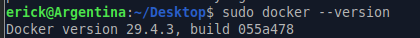
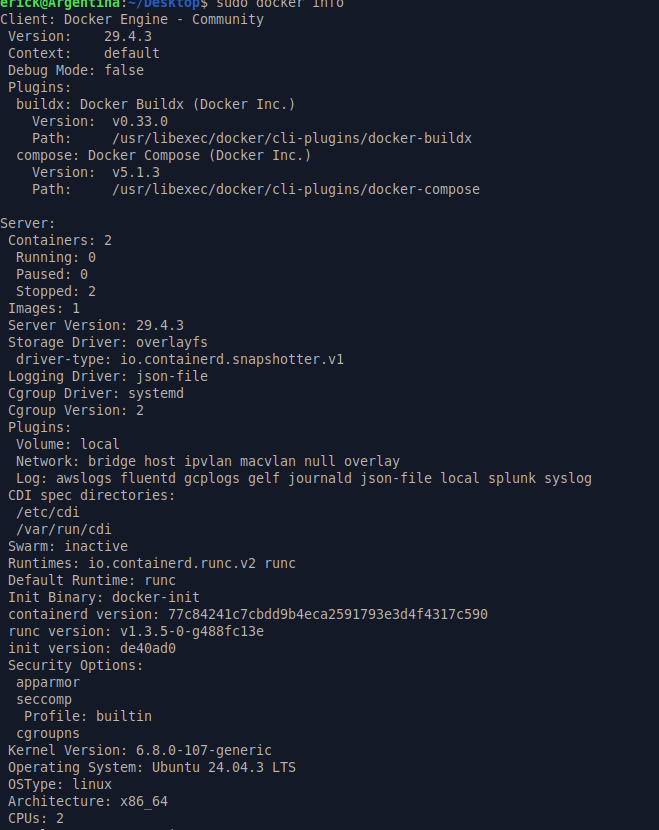
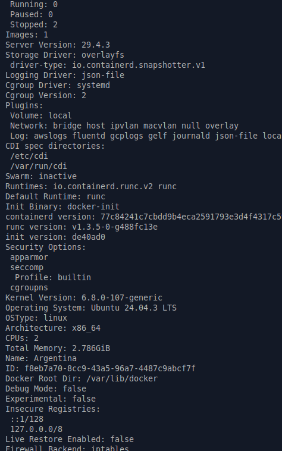
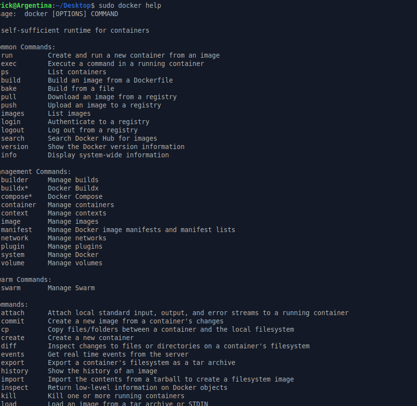
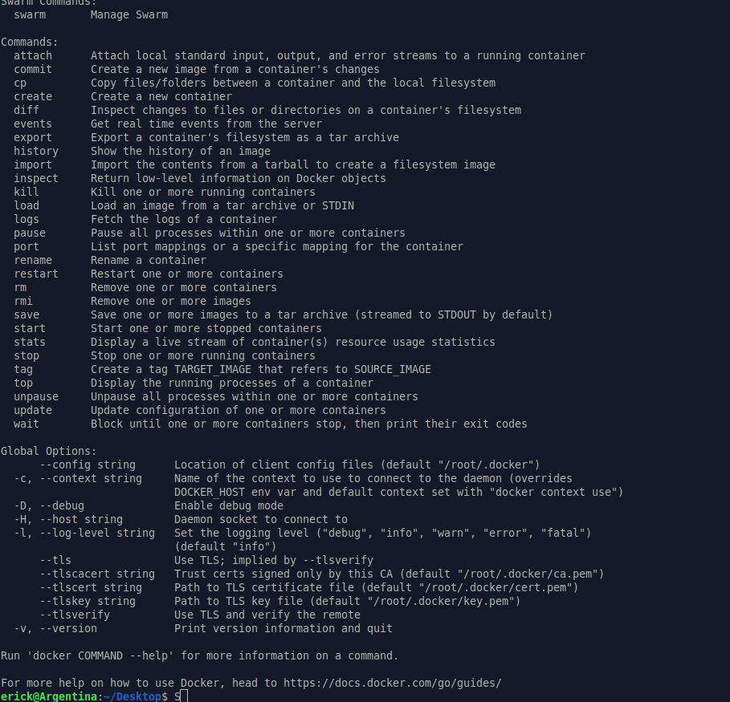
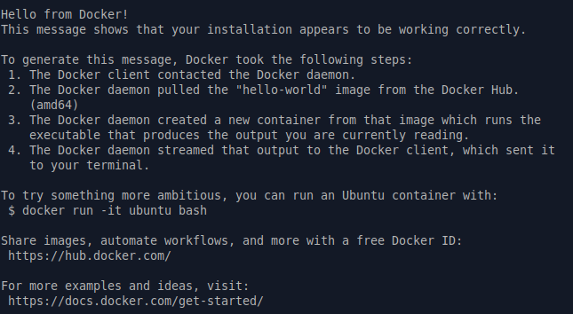

# Parte 1: Verificación de instalación de Docker

---

## Sistema operativo utilizado

El laboratorio se realizó en Ubuntu 24.04.3 LTS dentro de una máquina virtual.

---

## Versión de Docker instalada

### Comando ejecutado

```bash
sudo docker --version
```

### Resultado obtenido

```text
Docker version 29.4.3, build 055a478
```



### Explicación

El comando `docker --version` permite consultar la versión de Docker instalada en el sistema. En este caso, se confirmó que Docker Engine está instalado en la versión 29.4.3.

---

## Información general de Docker

### Comando ejecutado

```bash
sudo docker info
```

### Resultado parcial obtenido




```text
Client: Docker Engine - Community
 Version:    29.4.3
 Context:    default
 Debug Mode: false
 Plugins:
  buildx: Docker Buildx (Docker Inc.)
    Version:  v0.33.0
    Path:     /usr/libexec/docker/cli-plugins/docker-buildx
  compose: Docker Compose (Docker Inc.)
    Version:  v5.1.3
    Path:     /usr/libexec/docker/cli-plugins/docker-compose

Server:
 Containers: 2
  Running: 0
  Paused: 0
  Stopped: 2
 Images: 1
 Server Version: 29.4.3
 Storage Driver: overlayfs
  driver-type: io.containerd.snapshotter.v1
 Logging Driver: json-file
 Cgroup Driver: systemd
 Cgroup Version: 2
 Plugins:
  Volume: local
  Network: bridge host ipvlan macvlan null overlay
  Log: awslogs fluentd gcplogs gelf journald json-file local splunk syslog
 Swarm: inactive
 Runtimes: io.containerd.runc.v2 runc
 Default Runtime: runc
 Kernel Version: 6.8.0-107-generic
 Operating System: Ubuntu 24.04.3 LTS
 OSType: linux
 Architecture: x86_64
 CPUs: 2
 Total Memory: 2.786GiB
 Name: Argentina
 Docker Root Dir: /var/lib/docker
 Debug Mode: false
 Experimental: false
 Firewall Backend: iptables
```

### Explicación

El comando `docker info` muestra información general sobre la instalación y el estado actual de Docker. Entre los datos más importantes se encuentran la versión del cliente y del servidor, la cantidad de contenedores e imágenes existentes, el sistema operativo, la arquitectura, los drivers utilizados, el runtime de contenedores y el estado general del entorno.

En este caso, el resultado confirma que Docker está instalado correctamente, que el daemon está activo y que el sistema puede administrar imágenes y contenedores. También se observa que existen 2 contenedores detenidos y 1 imagen descargada.

---

## Ayuda general de Docker

### Comando ejecutado

```bash
sudo docker help
```

### Resultado parcial obtenido





```text
Usage:  docker [OPTIONS] COMMAND

A self-sufficient runtime for containers

Common Commands:
  run         Create and run a new container from an image
  exec        Execute a command in a running container
  ps          List containers
  build       Build an image from a Dockerfile
  bake        Build from a file
  pull        Download an image from a registry
  push        Upload an image to a registry
  images      List images
  login       Authenticate to a registry
  logout      Log out from a registry
  search      Search Docker Hub for images
  version     Show the Docker version information
  info        Display system-wide information

Management Commands:
  builder     Manage builds
  buildx*     Docker Buildx
  compose*    Docker Compose
  container   Manage containers
  context     Manage contexts
  image       Manage images
  manifest    Manage Docker image manifests and manifest lists
  network     Manage networks
  plugin      Manage plugins
  system      Manage Docker
  volume      Manage volumes
```

### Explicación

El comando `docker help` muestra una lista de comandos disponibles en Docker y una breve descripción de su función. Esto es útil cuando se está empezando a trabajar con Docker, ya que permite identificar comandos comunes como `run`, `exec`, `ps`, `build`, `pull`, `images`, `network` y `volume`.

---

## Prueba adicional con hello-world

### Comando ejecutado

```bash
sudo docker run hello-world
```

### Resultado obtenido



```text
Hello from Docker!
This message shows that your installation appears to be working correctly.
```

### Explicación

El comando `docker run hello-world` ejecuta un contenedor de prueba a partir de la imagen `hello-world`. Si la imagen no está descargada en el sistema, Docker la descarga desde Docker Hub y luego crea un contenedor para ejecutarla.

El mensaje obtenido confirma que la instalación funciona correctamente, ya que Docker pudo comunicarse con el daemon, descargar la imagen, crear el contenedor y mostrar el resultado en la terminal.

---

## Preguntas de reflexión

### 1. ¿Qué diferencia hay entre instalar Docker y tener Docker ejecutándose correctamente?

Instalar Docker significa que los paquetes y herramientas necesarias están presentes en el sistema. Sin embargo, eso no garantiza que Docker pueda ejecutar contenedores. Para que Docker funcione correctamente, también debe estar activo el servicio o daemon de Docker, ya que este es el encargado de crear, ejecutar, detener y administrar los contenedores.

En este caso, se comprobó que Docker no solo estaba instalado, sino que también estaba funcionando correctamente porque el comando `docker info` mostró información del servidor de Docker y el comando `docker run hello-world` ejecutó un contenedor de prueba exitosamente.

### 2. ¿Qué información útil muestra el comando docker info?

El comando `docker info` muestra información importante sobre el entorno de Docker. Por ejemplo, permite ver la versión del cliente y del servidor, la cantidad de contenedores e imágenes, el sistema operativo utilizado, la arquitectura del sistema, el driver de almacenamiento, el driver de logs, el runtime de contenedores y el directorio raíz donde Docker almacena sus datos.

Esta información es útil para verificar el estado de Docker y también para diagnosticar posibles problemas de configuración.

### 3. ¿Por qué Docker necesita un servicio o daemon ejecutándose en segundo plano?

Docker necesita un daemon ejecutándose en segundo plano porque el comando `docker` que se usa en la terminal funciona como cliente. Ese cliente envía instrucciones al daemon, y el daemon es quien realmente se encarga de administrar los contenedores, imágenes, redes y volúmenes.

Por esta razón, aunque Docker esté instalado, si el daemon no está activo no sería posible ejecutar contenedores correctamente.

---

## Reflexión personal

Esta primera parte del laboratorio permitió comprobar que Docker quedó instalado y funcionando correctamente en el sistema. La verificación es importante porque evita avanzar con las demás actividades sin tener listo el ambiente de trabajo.

Además, los comandos utilizados muestran información básica pero necesaria para entender el estado de Docker. Por ejemplo, `docker --version` confirma la versión instalada, `docker info` permite revisar el estado general del entorno y `docker help` sirve como referencia para conocer los comandos disponibles. También se ejecutó `hello-world`, lo cual permitió confirmar de manera práctica que Docker puede descargar una imagen, crear un contenedor y ejecutarlo correctamente.

En general, esta etapa funciona como una prueba inicial antes de empezar a crear y administrar contenedores más complejos durante el laboratorio.