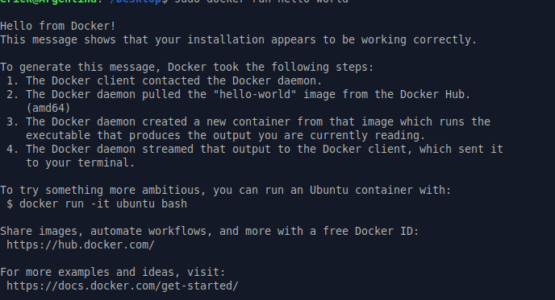
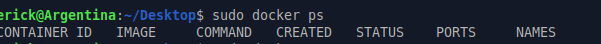
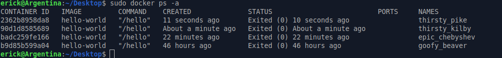

# Parte 2: Primer contenedor

## Objetivo

Ejecutar el primer contenedor usando una imagen existente desde Docker Hub y observar la diferencia entre los contenedores activos y los contenedores detenidos.

---

## Ejecución del contenedor hello-world

### Comando ejecutado

```bash
sudo docker run hello-world
```

### Resultado obtenido



```text
Hello from Docker!
This message shows that your installation appears to be working correctly.

To generate this message, Docker took the following steps:
 1. The Docker client contacted the Docker daemon.
 2. The Docker daemon pulled the "hello-world" image from the Docker Hub.
    (amd64)
 3. The Docker daemon created a new container from that image which runs the
    executable that produces the output you are currently reading.
 4. The Docker daemon streamed that output to the Docker client, which sent it
    to your terminal.
```

### Explicación

El comando `docker run hello-world` crea y ejecuta un contenedor a partir de la imagen `hello-world`. Esta imagen se utiliza como una prueba básica para verificar que Docker puede descargar imágenes, crear contenedores y ejecutar procesos dentro de ellos.

En este caso, Docker ejecutó correctamente el contenedor y mostró el mensaje `Hello from Docker!`, lo cual confirma que la instalación está funcionando correctamente.

Si la imagen `hello-world` no estaba descargada previamente en el sistema, Docker la buscó en Docker Hub, la descargó y luego creó el contenedor a partir de ella. Este comportamiento permite ejecutar aplicaciones sin tener que instalar manualmente todas sus dependencias en el sistema operativo anfitrión.

---

## Consulta de contenedores en ejecución

### Comando ejecutado

```bash
sudo docker ps
```

### Resultado obtenido



```text
CONTAINER ID   IMAGE     COMMAND   CREATED   STATUS    PORTS     NAMES
```

### Explicación

El comando `docker ps` muestra únicamente los contenedores que se encuentran en ejecución en ese momento.

En este caso, no apareció ningún contenedor activo porque el contenedor `hello-world` terminó su ejecución inmediatamente después de imprimir el mensaje en la terminal.

---

## Consulta de todos los contenedores

### Comando ejecutado

```bash
sudo docker ps -a
```

### Resultado obtenido



```text
CONTAINER ID   IMAGE         COMMAND    CREATED              STATUS                          PORTS     NAMES
2362b8958da8   hello-world   "/hello"   11 seconds ago       Exited (0) 10 seconds ago                 thirsty_pike
90d1d8585689   hello-world   "/hello"   About a minute ago   Exited (0) About a minute ago             thirsty_kilby
badc259fe166   hello-world   "/hello"   22 minutes ago       Exited (0) 22 minutes ago                 epic_chebyshev
b9d85b599a04   hello-world   "/hello"   46 hours ago         Exited (0) 46 hours ago                   goofy_beaver
```

### Explicación

El comando `docker ps -a` muestra todos los contenedores del sistema, tanto los que están en ejecución como los que ya finalizaron.

En este caso, se observan varios contenedores creados a partir de la imagen `hello-world`. Todos aparecen con el estado `Exited (0)`, lo cual indica que terminaron correctamente. El código `0` normalmente representa una finalización exitosa del proceso.

Esto explica por qué los contenedores no aparecen con `docker ps`, pero sí aparecen con `docker ps -a`.

---

## Diferencia entre docker ps y docker ps -a

La diferencia principal es que `docker ps` solo muestra los contenedores que están activos en ese momento, mientras que `docker ps -a` muestra todos los contenedores, incluyendo los que ya terminaron su ejecución.

En esta práctica, `docker ps` no mostró ningún contenedor porque `hello-world` finaliza después de imprimir su mensaje. En cambio, `docker ps -a` sí mostró los contenedores `hello-world` que fueron ejecutados anteriormente y que quedaron registrados como contenedores detenidos.

---

## Preguntas de reflexión

### 1. ¿Qué es la imagen hello-world?

La imagen `hello-world` es una imagen pequeña de prueba proporcionada por Docker. Su propósito es verificar que Docker está instalado y funcionando correctamente.

Esta imagen no ejecuta una aplicación compleja, sino un programa sencillo que imprime un mensaje en la terminal y luego termina su ejecución.

### 2. ¿El contenedor quedó ejecutándose después de imprimir el mensaje?

No. El contenedor no quedó ejecutándose después de imprimir el mensaje. El contenedor `hello-world` ejecutó su tarea, mostró el mensaje en la terminal y luego finalizó.

Por esta razón, no aparece en la salida de `docker ps`, ya que ese comando solo muestra contenedores activos.

### 3. ¿Por qué aparece en docker ps -a pero no necesariamente en docker ps?

Aparece en `docker ps -a` porque ese comando muestra todos los contenedores, incluyendo los que ya finalizaron. En cambio, `docker ps` solo muestra los contenedores que están corriendo en ese momento.

Como `hello-world` termina inmediatamente después de mostrar el mensaje, queda registrado como un contenedor detenido con estado `Exited (0)`.

### 4. ¿Qué demuestra este primer ejemplo sobre Docker?

Este primer ejemplo demuestra el flujo básico de trabajo de Docker. Primero, el cliente de Docker se comunica con el daemon. Luego, Docker busca la imagen necesaria, la descarga si no está disponible localmente, crea un contenedor a partir de esa imagen y ejecuta el proceso definido.

También demuestra que un contenedor no necesariamente queda activo permanentemente. Algunos contenedores ejecutan una tarea específica y terminan cuando esa tarea finaliza.

---

## Reflexión personal

Esta parte permitió ejecutar el primer contenedor en Docker y comprobar de forma práctica cómo funciona el proceso básico de ejecución. Aunque `hello-world` es un ejemplo sencillo, ayuda a entender que Docker trabaja a partir de imágenes y que los contenedores son instancias creadas desde esas imágenes.

También fue útil comparar los comandos `docker ps` y `docker ps -a`, porque permitió observar que no todos los contenedores quedan activos después de ejecutarse. En este caso, los contenedores de `hello-world` finalizaron correctamente y quedaron registrados como contenedores detenidos.

Además, esta práctica muestra que Docker puede descargar imágenes desde Docker Hub y ejecutarlas en el sistema sin necesidad de instalar manualmente la aplicación dentro del sistema operativo anfitrión.