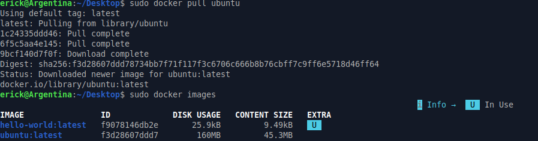
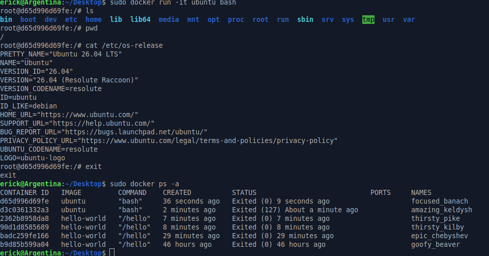
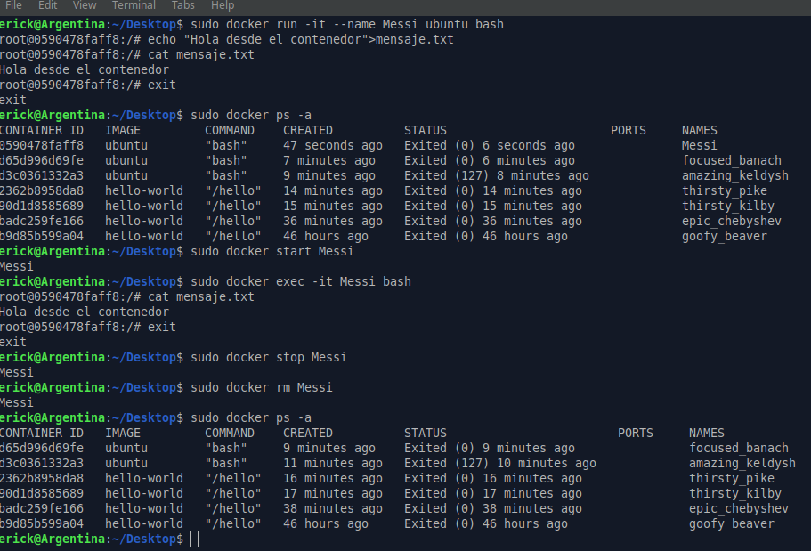

# Parte 3: Imágenes y contenedores

## Objetivo

Comprender la diferencia entre una imagen y un contenedor mediante el uso de una imagen de Ubuntu descargada desde Docker Hub y la ejecución de un contenedor interactivo.

---

## Descarga de la imagen Ubuntu

### Comando ejecutado

```bash
sudo docker pull ubuntu
```

### Resultado obtenido



```text
Using default tag: latest
latest: Pulling from library/ubuntu
1c24335ddd46: Pull complete 
6f5c5aa4e145: Pull complete 
9bcf140d7f0f: Download complete 
Digest: sha256:f3d28607ddd78734bb7f71f117f3c6706c666b8b76cbff7c9ff6e5718d46ff64
Status: Downloaded newer image for ubuntu:latest
docker.io/library/ubuntu:latest
```

### Explicación

El comando `docker pull ubuntu` descarga la imagen de Ubuntu desde Docker Hub. Como no se especificó una versión particular, Docker utilizó la etiqueta por defecto `latest`.

Una imagen en Docker funciona como una plantilla que contiene el sistema de archivos y las dependencias necesarias para crear contenedores. En este caso, la imagen descargada permite crear contenedores basados en Ubuntu.

---

## Listado de imágenes disponibles

### Comando ejecutado

```bash
sudo docker images
```

### Resultado obtenido

```text
IMAGE                ID             DISK USAGE   CONTENT SIZE   EXTRA
hello-world:latest   f9078146db2e       25.9kB         9.49kB    U   
ubuntu:latest        f3d28607ddd7        160MB         45.3MB        
```

### Explicación

El comando `docker images` muestra las imágenes disponibles localmente en el sistema. En este caso, aparecen las imágenes `hello-world:latest` y `ubuntu:latest`.

Esto confirma que la imagen de Ubuntu fue descargada correctamente y que está disponible para crear contenedores a partir de ella.

---

## Ejecución de un contenedor interactivo de Ubuntu

### Comando ejecutado

```bash
sudo docker run -it ubuntu bash
```

### Explicación

El comando `docker run -it ubuntu bash` crea y ejecuta un contenedor a partir de la imagen `ubuntu`.

La opción `-it` permite abrir una sesión interactiva dentro del contenedor. Esto significa que se puede escribir comandos directamente en una terminal del contenedor. El comando `bash` indica que se desea iniciar una consola Bash dentro del contenedor.

Al ejecutar este comando, el prompt cambió de:

```text
erick@Argentina:~/Desktop$
```

a:

```text
root@d65d996d69fe:/#
```

Esto indica que ya no se estaba trabajando directamente en la terminal del sistema anfitrión, sino dentro del contenedor de Ubuntu. El valor `d65d996d69fe` corresponde al identificador del contenedor.

---

## Comandos ejecutados dentro del contenedor

### Comando ejecutado

```bash
ls
```

### Resultado obtenido

```text
bin  boot  dev  etc  home  lib  lib64  media  mnt  opt  proc  root  run  sbin  srv  sys  tmp  usr  var
```

### Explicación

El comando `ls` muestra el contenido del directorio actual. En este caso, se observaron carpetas típicas de un sistema Linux, como `bin`, `etc`, `home`, `usr`, `var` y `root`.

Esto demuestra que el contenedor tiene su propio sistema de archivos basado en Ubuntu.

---

### Comando ejecutado

```bash
pwd
```

### Resultado obtenido

```text
/
```

### Explicación

El comando `pwd` muestra la ubicación actual dentro del sistema de archivos. En este caso, el resultado `/` indica que la terminal se encontraba en el directorio raíz del contenedor.

---

### Comando ejecutado

```bash
cat /etc/os-release
```

### Resultado obtenido




```text
PRETTY_NAME="Ubuntu 26.04 LTS"
NAME="Ubuntu"
VERSION_ID="26.04"
VERSION="26.04 (Resolute Raccoon)"
VERSION_CODENAME=resolute
ID=ubuntu
ID_LIKE=debian
HOME_URL="https://www.ubuntu.com/"
SUPPORT_URL="https://help.ubuntu.com/"
BUG_REPORT_URL="https://bugs.launchpad.net/ubuntu/"
PRIVACY_POLICY_URL="https://www.ubuntu.com/legal/terms-and-policies/privacy_policy"
UBUNTU_CODENAME=resolute
LOGO=ubuntu-logo
```

### Explicación

El comando `cat /etc/os-release` muestra información sobre el sistema operativo dentro del contenedor. En este caso, se confirmó que el contenedor está basado en Ubuntu 26.04 LTS.

Esto permite observar que el contenedor puede parecer un sistema Linux completo, aunque realmente no es una máquina virtual completa.

---

## Salida del contenedor

### Comando ejecutado

```bash
exit
```

### Resultado obtenido

```text
exit
```

### Explicación

El comando `exit` cierra la sesión interactiva dentro del contenedor. Al salir, se regresa a la terminal del sistema anfitrión.

Después de salir, el contenedor ya no queda ejecutándose, porque el proceso principal que se estaba ejecutando era `bash`. Cuando se cerró Bash, el contenedor finalizó.

---

## Consulta de contenedores después de salir

### Comando ejecutado

```bash
sudo docker ps -a
```

### Resultado obtenido


```text
CONTAINER ID   IMAGE         COMMAND    CREATED          STATUS                            PORTS     NAMES
d65d996d69fe   ubuntu        "bash"     36 seconds ago   Exited (0) 9 seconds ago                    focused_banach
d3c0361332a3   ubuntu        "bash"     2 minutes ago    Exited (127) About a minute ago             amazing_keldysh
2362b8958da8   hello-world   "/hello"   7 minutes ago    Exited (0) 7 minutes ago                    thirsty_pike
90d1d8585689   hello-world   "/hello"   8 minutes ago    Exited (0) 8 minutes ago                    thirsty_kilby
badc259fe166   hello-world   "/hello"   29 minutes ago   Exited (0) 29 minutes ago                   epic_chebyshev
b9d85b599a04   hello-world   "/hello"   46 hours ago     Exited (0) 46 hours ago                     goofy_beaver
```

### Explicación

El comando `docker ps -a` muestra todos los contenedores existentes, incluyendo los que ya finalizaron.

En este caso, se observa el contenedor de Ubuntu llamado `focused_banach`, creado a partir de la imagen `ubuntu`, con el comando `"bash"` y estado `Exited (0)`. Esto indica que el contenedor terminó correctamente después de salir con `exit`.

También aparece un contenedor anterior llamado `amazing_keldysh` con estado `Exited (127)`. Esto ocurrió porque en un primer intento se escribió incorrectamente el comando:

```bash
cat/etc/os-release
```

El comando correcto era:

```bash
cat /etc/os-release
```

El código `127` indica que hubo un error al ejecutar un comando dentro del contenedor. Luego se repitió el procedimiento correctamente y el contenedor finalizó con `Exited (0)`.

---

## Preguntas de reflexión

### 1. ¿La imagen Ubuntu es lo mismo que una máquina virtual Ubuntu?

No. La imagen de Ubuntu no es lo mismo que una máquina virtual Ubuntu. Una máquina virtual incluye su propio sistema operativo completo y funciona sobre un hipervisor. En cambio, un contenedor comparte el kernel del sistema anfitrión y solo incluye el sistema de archivos, librerías y herramientas necesarias para ejecutar procesos.

Por eso, el contenedor es más ligero que una máquina virtual.

### 2. ¿Por qué el contenedor puede parecer un sistema Linux si no es una máquina virtual completa?

El contenedor puede parecer un sistema Linux porque tiene una estructura de archivos similar, con carpetas como `/bin`, `/etc`, `/usr`, `/home` y `/var`. Además, permite ejecutar comandos como `ls`, `pwd` y `cat`.

Sin embargo, no es una máquina virtual completa porque no tiene su propio kernel. El contenedor utiliza el kernel del sistema anfitrión y mantiene aislado su entorno de ejecución.

### 3. ¿Qué significa que el contenedor comparta el kernel con el host?

Significa que el contenedor no ejecuta un sistema operativo completo separado del anfitrión. En lugar de eso, utiliza el mismo kernel del sistema host, pero mantiene aislados sus procesos, archivos, red y configuración.

Esto permite que los contenedores sean más livianos y rápidos de iniciar que una máquina virtual.

### 4. ¿Qué diferencia hay entre una imagen descargada y un contenedor creado?

Una imagen descargada es una plantilla estática que contiene lo necesario para crear contenedores. Por ejemplo, la imagen `ubuntu:latest` queda almacenada en el sistema y puede usarse muchas veces.

Un contenedor, en cambio, es una instancia creada a partir de una imagen. Puede estar en ejecución o detenido. En esta práctica, la imagen `ubuntu` se utilizó para crear un contenedor interactivo donde se ejecutó Bash.

---

## Reflexión personal

Esta parte permitió entender mejor la diferencia entre una imagen y un contenedor. La imagen de Ubuntu funciona como una plantilla descargada desde Docker Hub, mientras que el contenedor es una instancia creada a partir de esa imagen.

También fue útil entrar al contenedor de forma interactiva, porque permitió observar que dentro del contenedor existe un sistema de archivos parecido al de Linux. Al ejecutar comandos como `ls`, `pwd` y `cat /etc/os-release`, se pudo comprobar que el contenedor tiene su propio entorno basado en Ubuntu.

Además, el error inicial al escribir `cat/etc/os-release` ayudó a notar que dentro del contenedor los comandos se ejecutan igual que en una terminal Linux normal. Al corregir el comando y salir con `exit`, el contenedor finalizó correctamente con estado `Exited (0)`.

---

## Administración de contenedores

## Objetivo

Aprender a crear, nombrar, iniciar, acceder, detener y eliminar contenedores en Docker.

---


## Creación de un contenedor con nombre

### Comando ejecutado

```bash
sudo docker run -it --name Messi ubuntu bash
```

### Resultado obtenido

```text
root@0590478faff8:/#
```

### Explicación

El comando `docker run -it --name Messi ubuntu bash` crea y ejecuta un contenedor a partir de la imagen `ubuntu`.

La opción `--name Messi` permite asignarle un nombre personalizado al contenedor. Esto facilita su administración, ya que luego se puede hacer referencia al contenedor usando el nombre `Messi` en lugar de utilizar su identificador.

La opción `-it` permite abrir una terminal interactiva dentro del contenedor, y `bash` indica que se desea ejecutar una consola Bash.

---

## Creación de un archivo dentro del contenedor

### Comando ejecutado

```bash
echo "Hola desde el contenedor">mensaje.txt
```

### Verificación del archivo

```bash
cat mensaje.txt
```

### Resultado obtenido

```text
Hola desde el contenedor
```

### Explicación

El comando `echo "Hola desde el contenedor">mensaje.txt` crea un archivo llamado `mensaje.txt` dentro del contenedor y escribe el texto indicado en él.

Luego, el comando `cat mensaje.txt` permite verificar el contenido del archivo. En este caso, se confirmó que el archivo fue creado correctamente dentro del contenedor.

---

## Salida del contenedor

### Comando ejecutado

```bash
exit
```

### Resultado obtenido

```text
exit
```

### Explicación

El comando `exit` cierra la sesión interactiva dentro del contenedor. Al salir, el proceso principal del contenedor, que en este caso era `bash`, finaliza. Por esta razón, el contenedor queda detenido.

---

## Verificación del contenedor creado

### Comando ejecutado

```bash
sudo docker ps -a
```

### Resultado obtenido

```text
CONTAINER ID   IMAGE         COMMAND    CREATED          STATUS                       PORTS     NAMES
0590478faff8   ubuntu        "bash"     47 seconds ago   Exited (0) 6 seconds ago               Messi
d65d996d69fe   ubuntu        "bash"     7 minutes ago    Exited (0) 6 minutes ago               focused_banach
d3c0361332a3   ubuntu        "bash"     9 minutes ago    Exited (127) 8 minutes ago             amazing_keldysh
2362b8958da8   hello-world   "/hello"   14 minutes ago   Exited (0) 14 minutes ago              thirsty_pike
90d1d8585689   hello-world   "/hello"   15 minutes ago   Exited (0) 15 minutes ago              thirsty_kilby
badc259fe166   hello-world   "/hello"   36 minutes ago   Exited (0) 36 minutes ago              epic_chebyshev
b9d85b599a04   hello-world   "/hello"   46 hours ago     Exited (0) 46 hours ago                goofy_beaver
```

### Explicación

El comando `docker ps -a` muestra todos los contenedores, tanto los que están ejecutándose como los que están detenidos.

En este caso, se observa el contenedor llamado `Messi`, creado a partir de la imagen `ubuntu`. Su estado es `Exited (0)`, lo cual indica que el contenedor terminó correctamente después de salir con `exit`.

---

## Inicio de un contenedor existente

### Comando ejecutado

```bash
sudo docker start Messi
```

### Resultado obtenido

```text
Messi
```

### Explicación

El comando `docker start Messi` inicia un contenedor que ya existe. A diferencia de `docker run`, este comando no crea un contenedor nuevo, sino que vuelve a iniciar el contenedor llamado `Messi`.

Esto es importante porque permite conservar el estado interno del contenedor mientras no haya sido eliminado.

---

## Acceso a un contenedor en ejecución

### Comando ejecutado

```bash
sudo docker exec -it Messi bash
```

### Resultado obtenido

```text
root@0590478faff8:/#
```

### Explicación

El comando `docker exec -it Messi bash` permite ejecutar una nueva consola Bash dentro del contenedor `Messi`, que ya estaba iniciado.

Este comando es útil cuando se necesita entrar a un contenedor que ya está corriendo para revisar archivos, ejecutar comandos o hacer pruebas.

---

## Verificación de persistencia dentro del mismo contenedor

### Comando ejecutado

```bash
cat mensaje.txt
```

### Resultado obtenido

```text
Hola desde el contenedor
```

### Explicación

Al volver a entrar al contenedor `Messi`, el archivo `mensaje.txt` seguía existiendo. Esto ocurrió porque se estaba usando el mismo contenedor, no uno nuevo.

Esto demuestra que los datos creados dentro de un contenedor pueden mantenerse mientras el contenedor exista. Sin embargo, si el contenedor se elimina, esos datos internos también se pierden, a menos que se utilicen volúmenes.

---

## Detención del contenedor

### Comando ejecutado

```bash
sudo docker stop Messi
```

### Resultado obtenido

```text
Messi
```

### Explicación

El comando `docker stop Messi` detiene el contenedor llamado `Messi`. Esto no elimina el contenedor, solo detiene su ejecución.

Después de detenerlo, el contenedor todavía puede volver a iniciarse con `docker start Messi`, siempre y cuando no haya sido eliminado.

---

## Eliminación del contenedor

### Comando ejecutado

```bash
sudo docker rm Messi
```

### Resultado obtenido

```text
Messi
```

### Explicación

El comando `docker rm Messi` elimina el contenedor llamado `Messi`. A diferencia de `docker stop`, este comando borra el contenedor del sistema.

Una vez eliminado, ya no se puede iniciar nuevamente con `docker start`, porque el contenedor dejó de existir.

---

## Verificación final

### Comando ejecutado

```bash
sudo docker ps -a
```

### Resultado obtenido

```text
CONTAINER ID   IMAGE         COMMAND    CREATED          STATUS                        PORTS     NAMES
d65d996d69fe   ubuntu        "bash"     9 minutes ago    Exited (0) 9 minutes ago                focused_banach
d3c0361332a3   ubuntu        "bash"     11 minutes ago   Exited (127) 10 minutes ago             amazing_keldysh
2362b8958da8   hello-world   "/hello"   16 minutes ago   Exited (0) 16 minutes ago               thirsty_pike
90d1d8585689   hello-world   "/hello"   17 minutes ago   Exited (0) 17 minutes ago               thirsty_kilby
badc259fe166   hello-world   "/hello"   38 minutes ago   Exited (0) 38 minutes ago               epic_chebyshev
b9d85b599a04   hello-world   "/hello"   46 hours ago     Exited (0) 46 hours ago                 goofy_beaver
```

### Explicación

Después de ejecutar `docker rm Messi`, el contenedor `Messi` ya no aparece en la lista de contenedores. Esto confirma que fue eliminado correctamente.

---

## Diferencia entre docker run y docker start

El comando `docker run` crea un contenedor nuevo a partir de una imagen y lo ejecuta. En cambio, `docker start` inicia un contenedor que ya fue creado anteriormente.

En esta práctica, `docker run` se usó para crear el contenedor `Messi`, mientras que `docker start Messi` se usó para volver a iniciar ese mismo contenedor después de haber salido de él.

---

## Uso de docker exec

El comando `docker exec` permite ejecutar comandos dentro de un contenedor que ya está en ejecución. En este caso, se utilizó:

```bash
sudo docker exec -it Messi bash
```

Esto permitió entrar nuevamente al contenedor `Messi` y verificar que el archivo `mensaje.txt` seguía existiendo.

---




## Diferencia entre detener y eliminar un contenedor

Detener un contenedor significa parar su ejecución, pero mantenerlo guardado en el sistema. Un contenedor detenido puede volver a iniciarse con `docker start`.

Eliminar un contenedor significa borrarlo del sistema. Una vez eliminado, ya no se puede iniciar nuevamente y los datos internos creados dentro de ese contenedor se pierden, a menos que se hayan guardado en un volumen.

---

## Preguntas de reflexión

### 1. ¿Qué ventaja tiene asignar nombres a los contenedores?

Asignar nombres a los contenedores facilita su administración. Es más sencillo usar un nombre como `Messi` que recordar un identificador largo generado automáticamente por Docker.

Además, el nombre se puede usar en comandos como `docker start`, `docker stop`, `docker exec` y `docker rm`.

### 2. ¿Qué diferencia hay entre crear un contenedor nuevo y reiniciar uno existente?

Crear un contenedor nuevo significa generar una nueva instancia a partir de una imagen. En cambio, reiniciar un contenedor existente significa volver a ejecutar una instancia que ya había sido creada antes.

En esta práctica, al reiniciar el contenedor `Messi`, el archivo `mensaje.txt` seguía existiendo porque era el mismo contenedor. Si se hubiera creado un contenedor nuevo desde la imagen `ubuntu`, ese archivo no habría estado presente.

### 3. ¿Qué sucede con los datos creados dentro de un contenedor si este se elimina?

Si los datos fueron creados únicamente dentro del sistema de archivos del contenedor, se pierden cuando el contenedor se elimina.

En esta práctica, el archivo `mensaje.txt` se mantuvo mientras el contenedor `Messi` existía. Sin embargo, después de eliminar el contenedor con `docker rm Messi`, ese archivo también dejó de estar disponible.

### 4. ¿Por qué se dice que los contenedores son desechables?

Se dice que los contenedores son desechables porque pueden crearse, detenerse, eliminarse y volver a crearse con facilidad a partir de una imagen.

La idea es que un contenedor no debería ser tratado como un ambiente permanente. Si se necesita conservar información importante, lo correcto es usar mecanismos de persistencia como volúmenes.

---

## Reflexión personal

Esta parte permitió entender mejor cómo se administra el ciclo de vida de un contenedor. Al crear el contenedor `Messi`, entrar a él, crear un archivo y luego volver a iniciarlo, se pudo comprobar que los datos internos se mantienen mientras se use el mismo contenedor.

También quedó clara la diferencia entre detener y eliminar. Detener un contenedor solo pausa su ejecución, mientras que eliminarlo borra la instancia del sistema. Esto demuestra por qué Docker trabaja con contenedores que pueden ser temporales y por qué más adelante será importante usar volúmenes cuando se quiera conservar información.