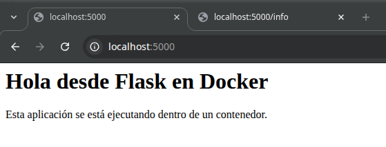
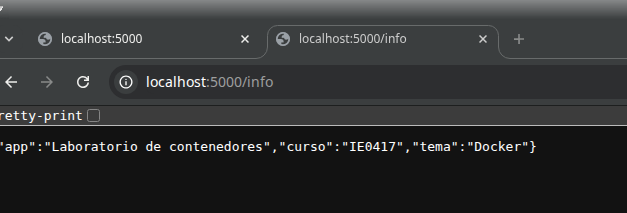
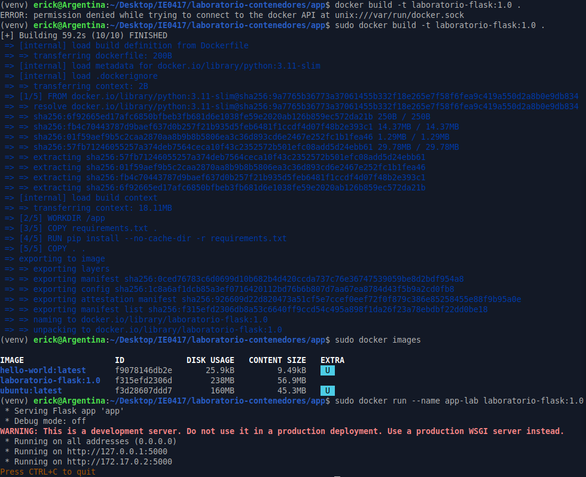
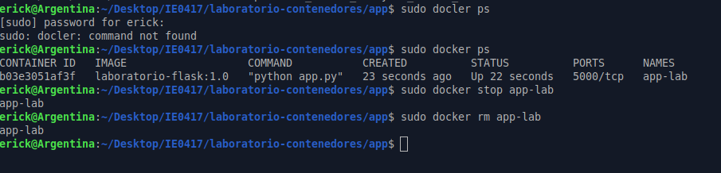

# Parte 4: Crear una aplicación sencilla

## Objetivo

Crear una aplicación web mínima con Flask y probarla localmente antes de ejecutarla dentro de un contenedor.

---

## Archivos creados

Dentro de la carpeta `app/` se crearon los siguientes archivos:

```text
app/
├── app.py
└── requirements.txt
```

---

## Archivo requirements.txt

### Contenido

```text
flask
```

### Explicación

El archivo `requirements.txt` contiene las dependencias necesarias para ejecutar la aplicación. En este caso, solo se utiliza Flask, que es el framework web usado para crear las rutas de la aplicación.

---

## Archivo app.py

### Contenido

```python
from flask import Flask
import os

app = Flask(__name__)

@app.route("/")
def home():
    mensaje = os.environ.get("MENSAJE", "Hola desde Flask en Docker")
    return f"""
    <h1>{mensaje}</h1>
    <p>Esta aplicación se está ejecutando dentro de un contenedor.</p>
    """

@app.route("/info")
def info():
    return {
        "app": "Laboratorio de contenedores",
        "curso": "IE0417",
        "tema": "Docker"
    }

if __name__ == "__main__":
    app.run(host="0.0.0.0", port=5000)
```

### Explicación

Esta aplicación utiliza Flask para crear un servidor web sencillo. Tiene dos rutas principales:

- `/`: muestra un mensaje en formato HTML.
- `/info`: devuelve información de la aplicación en formato JSON.

También se utiliza la variable de entorno `MENSAJE`. Si esta variable no existe, se muestra el mensaje por defecto `"Hola desde Flask en Docker"`.

---

## Instalación de dependencias

### Comando ejecutado

```bash
pip install -r requirements.txt
```

### Resultado obtenido

```text
Requirement already satisfied: flask in ./venv/lib/python3.12/site-packages
Requirement already satisfied: blinker>=1.9.0
Requirement already satisfied: click>=8.1.3
Requirement already satisfied: itsdangerous>=2.2.0
Requirement already satisfied: jinja2>=3.1.2
Requirement already satisfied: markupsafe>=2.1.1
Requirement already satisfied: werkzeug>=3.1.0
```

### Explicación

Este comando instala las dependencias definidas en `requirements.txt`. En este caso, Flask ya se encontraba instalado dentro del entorno virtual, por lo que el sistema mostró que los paquetes ya estaban satisfechos.

---

## Ejecución local de la aplicación

### Comando ejecutado

```bash
python app.py
```

### Resultado obtenido

```text
 * Serving Flask app 'app'
 * Debug mode: off
WARNING: This is a development server. Do not use it in a production deployment.
 * Running on all addresses (0.0.0.0)
 * Running on http://127.0.0.1:5000
 * Running on http://192.168.60.128:5000
Press CTRL+C to quit
```

### Explicación

El comando `python app.py` ejecuta la aplicación Flask localmente. El servidor queda escuchando en el puerto `5000`, por lo que se puede acceder desde el navegador usando `http://localhost:5000`.

El mensaje `Running on all addresses (0.0.0.0)` indica que la aplicación acepta conexiones desde cualquier interfaz de red disponible. Esto es importante porque más adelante la aplicación se ejecutará dentro de un contenedor y deberá poder recibir conexiones desde fuera del contenedor.

---

## Prueba de la ruta principal

### Dirección visitada

```text
http://localhost:5000
```

### Resultado esperado

```html
<h1>Hola desde Flask en Docker</h1>
<p>Esta aplicación se está ejecutando dentro de un contenedor.</p>
```

### Explicación

La ruta `/` muestra un mensaje HTML generado por la función `home()` de Flask. Este mensaje puede cambiarse más adelante usando una variable de entorno.

---

## Prueba de la ruta /info

### Dirección visitada

```text
http://localhost:5000/info
```

### Resultado obtenido

```json
{"app":"Laboratorio de contenedores","curso":"IE0417","tema":"Docker"}
```

### Explicación

La ruta `/info` devuelve un objeto JSON con información básica de la aplicación. En este caso, se muestra el nombre de la aplicación, el curso y el tema del laboratorio.

---





## Preguntas de reflexión

### 1. ¿Qué hace Flask en esta aplicación?

Flask permite crear una aplicación web sencilla en Python. En este caso, se usa para definir rutas y responder solicitudes desde el navegador. La ruta `/` devuelve contenido HTML y la ruta `/info` devuelve información en formato JSON.

### 2. ¿Para qué sirve el archivo requirements.txt?

El archivo `requirements.txt` sirve para listar las dependencias necesarias para ejecutar la aplicación. Esto permite instalar los paquetes requeridos de forma sencilla con `pip install -r requirements.txt`.

También es útil al trabajar con Docker, porque el Dockerfile puede usar este archivo para instalar automáticamente las dependencias dentro de la imagen.

### 3. ¿Por qué una aplicación dentro de un contenedor debe escuchar en 0.0.0.0?

Una aplicación dentro de un contenedor debe escuchar en `0.0.0.0` para aceptar conexiones desde fuera del contenedor. Si escuchara solo en `localhost` o `127.0.0.1`, la aplicación quedaría limitada al interior del contenedor y no sería accesible desde la máquina anfitriona aunque se publique el puerto.

### 4. ¿Qué diferencia hay entre ejecutar la aplicación localmente y ejecutarla dentro de Docker?

Al ejecutar la aplicación localmente, se utiliza directamente el Python y las dependencias instaladas en el sistema o en un entorno virtual. En cambio, al ejecutarla dentro de Docker, la aplicación corre en un contenedor con su propio entorno, definido por una imagen.

La ventaja de Docker es que permite empaquetar la aplicación junto con sus dependencias, de manera que pueda ejecutarse de forma similar en diferentes máquinas.

---

## Reflexión personal

Esta parte permitió crear una aplicación web sencilla con Flask y comprobar que funciona localmente antes de usar Docker. La prueba en el navegador confirmó que la ruta `/info` devuelve correctamente los datos de la aplicación en formato JSON.

También fue importante entender el uso de `host="0.0.0.0"`, ya que esto será necesario cuando la aplicación se ejecute dentro de un contenedor. Aunque en esta etapa todavía se ejecutó de forma local, ya se dejó preparada para funcionar correctamente con Docker.	


---

# Parte 5: Construcción de una imagen con Dockerfile

## Objetivo

Construir una imagen personalizada usando un archivo `Dockerfile` y ejecutar una aplicación Flask dentro de un contenedor.

---

## Archivo Dockerfile

Dentro de la carpeta `app/` se creó un archivo llamado `Dockerfile`, sin extensión.

### Contenido del Dockerfile

```dockerfile
FROM python:3.11-slim

WORKDIR /app

COPY requirements.txt .

RUN pip install --no-cache-dir -r requirements.txt

COPY . .

EXPOSE 5000

CMD ["python", "app.py"]
```

---

## Explicación de las instrucciones del Dockerfile

### FROM

La instrucción `FROM python:3.11-slim` indica la imagen base que se usará para construir la nueva imagen. En este caso, se utiliza una imagen oficial de Python en su versión 3.11 y en variante `slim`, que es más ligera porque incluye menos componentes innecesarios.

### WORKDIR

La instrucción `WORKDIR /app` define el directorio de trabajo dentro del contenedor. Esto significa que las instrucciones siguientes se ejecutarán dentro de la carpeta `/app`.

### COPY requirements.txt .

La instrucción `COPY requirements.txt .` copia el archivo `requirements.txt` desde la máquina anfitriona hacia el directorio de trabajo dentro del contenedor.

Este archivo se copia primero para instalar las dependencias antes de copiar el resto del código.

### RUN

La instrucción `RUN pip install --no-cache-dir -r requirements.txt` instala las dependencias de Python indicadas en `requirements.txt`.

En este caso, se instala Flask. La opción `--no-cache-dir` evita guardar archivos temporales de caché, lo cual ayuda a mantener la imagen más limpia.

### COPY . .

La instrucción `COPY . .` copia el resto de los archivos de la carpeta actual hacia el directorio `/app` dentro del contenedor.

Esto incluye archivos como `app.py`, `requirements.txt` y el propio `Dockerfile`.

### EXPOSE

La instrucción `EXPOSE 5000` documenta que la aplicación dentro del contenedor utiliza el puerto 5000.

Esta instrucción no publica el puerto automáticamente hacia la máquina anfitriona, pero indica cuál puerto usa la aplicación dentro del contenedor.

### CMD

La instrucción `CMD ["python", "app.py"]` define el comando que se ejecutará por defecto cuando se inicie el contenedor.

En este caso, se ejecuta la aplicación Flask con Python.

---

## Construcción de la imagen

### Comando ejecutado

```bash
sudo docker build -t laboratorio-flask:1.0 .
```

### Resultado obtenido

```text
[+] Building 59.2s (10/10) FINISHED
 => [internal] load build definition from Dockerfile
 => [internal] load metadata for docker.io/library/python:3.11-slim
 => [1/5] FROM docker.io/library/python:3.11-slim
 => [2/5] WORKDIR /app
 => [3/5] COPY requirements.txt .
 => [4/5] RUN pip install --no-cache-dir -r requirements.txt
 => [5/5] COPY . .
 => exporting to image
 => => naming to docker.io/library/laboratorio-flask:1.0
```

### Explicación

El comando `docker build` construye una imagen a partir del `Dockerfile`.

La opción `-t laboratorio-flask:1.0` asigna un nombre y una etiqueta a la imagen. En este caso, el nombre de la imagen es `laboratorio-flask` y la versión o etiqueta es `1.0`.

El punto `.` indica que el contexto de construcción es la carpeta actual, es decir, la carpeta `app/`.

---

## Listado de imágenes

### Comando ejecutado

```bash
sudo docker images
```

### Resultado obtenido

```text
IMAGE                   ID             DISK USAGE   CONTENT SIZE   EXTRA
hello-world:latest      f9078146db2e       25.9kB         9.49kB    U   
laboratorio-flask:1.0   f315efd2306d        238MB         56.9MB        
ubuntu:latest           f3d28607ddd7        160MB         45.3MB    U
```

### Explicación

El comando `docker images` muestra las imágenes disponibles localmente en el sistema.

En este caso, se observa que la imagen `laboratorio-flask:1.0` fue creada correctamente. También aparecen las imágenes utilizadas anteriormente en el laboratorio, como `hello-world` y `ubuntu`.

---

## Ejecución del contenedor

### Comando ejecutado

```bash
sudo docker run --name app-lab laboratorio-flask:1.0
```

### Resultado obtenido

```text
 * Serving Flask app 'app'
 * Debug mode: off
WARNING: This is a development server. Do not use it in a production deployment.
 * Running on all addresses (0.0.0.0)
 * Running on http://127.0.0.1:5000
 * Running on http://172.17.0.2:5000
Press CTRL+C to quit
```

### Explicación

El comando `docker run --name app-lab laboratorio-flask:1.0` crea y ejecuta un contenedor a partir de la imagen `laboratorio-flask:1.0`.

La opción `--name app-lab` asigna el nombre `app-lab` al contenedor, lo cual facilita detenerlo o eliminarlo posteriormente.

El resultado muestra que la aplicación Flask se ejecutó correctamente dentro del contenedor y quedó escuchando en el puerto 5000.

---

## Verificación del contenedor en ejecución

### Comando ejecutado

```bash
sudo docker ps
```

### Resultado obtenido

```text
CONTAINER ID   IMAGE                   COMMAND           CREATED          STATUS          PORTS      NAMES
b03e3051af3f   laboratorio-flask:1.0   "python app.py"   23 seconds ago   Up 22 seconds   5000/tcp   app-lab
```

### Explicación

El comando `docker ps` muestra los contenedores que están en ejecución.

En este caso, se observa que el contenedor `app-lab` estaba activo, usando la imagen `laboratorio-flask:1.0` y ejecutando el comando `python app.py`.

---

## Detención del contenedor

### Comando ejecutado

```bash
sudo docker stop app-lab
```

### Resultado obtenido

```text
app-lab
```

### Explicación

El comando `docker stop app-lab` detiene el contenedor llamado `app-lab`.

Detener un contenedor significa parar su ejecución, pero no eliminarlo del sistema.

---

## Eliminación del contenedor

### Comando ejecutado

```bash
sudo docker rm app-lab
```

### Resultado obtenido

```text
app-lab
```

### Explicación

El comando `docker rm app-lab` elimina el contenedor llamado `app-lab`.

Una vez eliminado, el contenedor ya no puede reiniciarse, aunque la imagen `laboratorio-flask:1.0` sigue existiendo y puede usarse para crear nuevos contenedores.

---

## Diferencia entre el nombre de la imagen y el nombre del contenedor

El nombre de la imagen fue:

```text
laboratorio-flask:1.0
```

Ese nombre representa la plantilla usada para crear contenedores.

El nombre del contenedor fue:

```text
app-lab
```

Ese nombre representa una instancia creada a partir de la imagen.

Una misma imagen puede usarse para crear muchos contenedores distintos, cada uno con su propio nombre, estado y ciclo de vida.

---






## Preguntas de reflexión

### 1. ¿Qué es una imagen base?

Una imagen base es la imagen inicial sobre la cual se construye una imagen personalizada.

En este caso, la imagen base fue `python:3.11-slim`. Esta imagen ya incluye Python, por lo que permite ejecutar la aplicación Flask sin instalar Python manualmente desde cero.

### 2. ¿Por qué se usa una imagen slim?

Se usa una imagen `slim` porque es más ligera que una imagen completa. Incluye lo necesario para ejecutar Python, pero evita componentes adicionales que no son necesarios para esta aplicación.

Esto ayuda a reducir el tamaño de la imagen final y hace que la construcción y distribución sean más eficientes.

### 3. ¿Por qué se copian primero las dependencias y luego el resto del código?

Se copian primero las dependencias para aprovechar la caché de capas de Docker.

Si el archivo `requirements.txt` no cambia, Docker puede reutilizar la capa donde ya se instalaron las dependencias. Así, cuando solo cambia el código de la aplicación, no es necesario reinstalar Flask desde cero.

### 4. ¿Qué diferencia hay entre RUN y CMD?

`RUN` se ejecuta durante la construcción de la imagen. En este caso, se usó para instalar las dependencias con `pip`.

`CMD` se ejecuta cuando se inicia un contenedor a partir de la imagen. En este caso, se usó para ejecutar la aplicación Flask con `python app.py`.

### 5. ¿Qué pasaría si se elimina la imagen pero no el Dockerfile?

Si se elimina la imagen, ya no se podrían crear contenedores a partir de ella mientras no se vuelva a construir.

Sin embargo, si el `Dockerfile` y los archivos de la aplicación siguen existiendo, la imagen puede reconstruirse ejecutando nuevamente:

```bash
sudo docker build -t laboratorio-flask:1.0 .
```

---

## Reflexión personal

Esta parte permitió construir una imagen personalizada usando un `Dockerfile`. A diferencia de las partes anteriores, donde se usaron imágenes ya existentes como `hello-world` o `ubuntu`, aquí se creó una imagen propia para ejecutar una aplicación Flask.

También se pudo observar la diferencia entre una imagen y un contenedor. La imagen `laboratorio-flask:1.0` funciona como plantilla, mientras que el contenedor `app-lab` fue una instancia ejecutada a partir de esa imagen.

Finalmente, esta práctica ayudó a entender la importancia del `Dockerfile`, ya que permite describir de forma ordenada cómo preparar el entorno de ejecución de una aplicación.