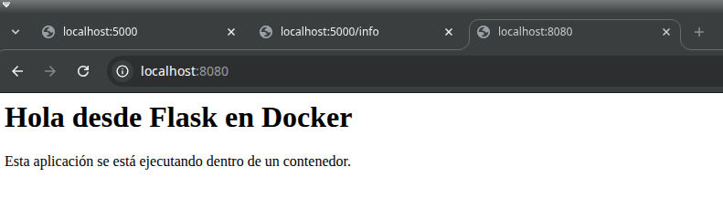
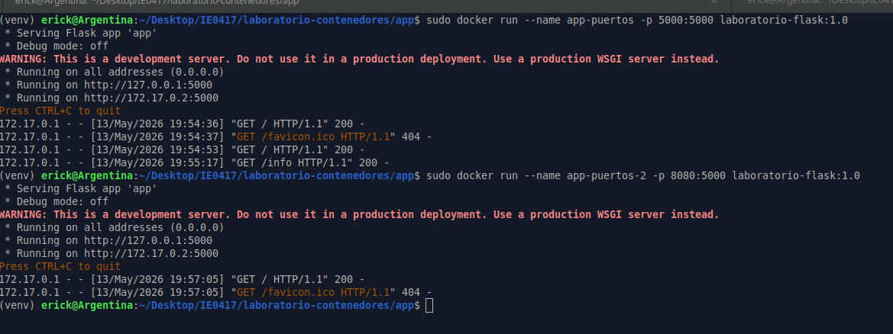
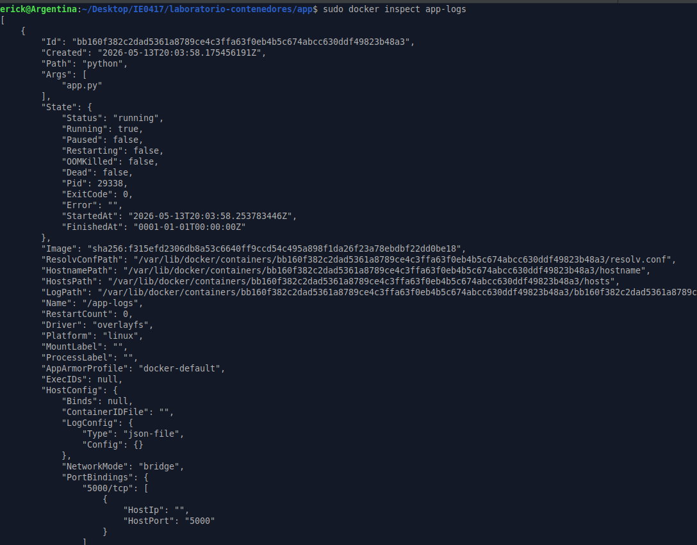
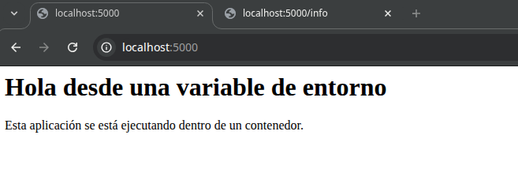
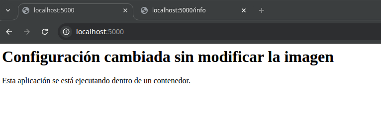

# Parte 7: Publicación de puertos

## Objetivo

Comprender cómo exponer una aplicación que corre dentro de un contenedor para poder accederla desde la máquina anfitriona mediante el navegador.

---

## Ejecución de la aplicación publicando el puerto 5000

### Comando ejecutado

```bash
sudo docker run --name app-puertos -p 5000:5000 laboratorio-flask:1.0
```

### Resultado obtenido

```text
 * Serving Flask app 'app'
 * Debug mode: off
WARNING: This is a development server. Do not use it in a production deployment.
 * Running on all addresses (0.0.0.0)
 * Running on http://127.0.0.1:5000
 * Running on http://172.17.0.2:5000
Press CTRL+C to quit
172.17.0.1 - - [13/May/2026 19:54:36] "GET / HTTP/1.1" 200 -
172.17.0.1 - - [13/May/2026 19:54:37] "GET /favicon.ico HTTP/1.1" 404 -
172.17.0.1 - - [13/May/2026 19:54:53] "GET / HTTP/1.1" 200 -
172.17.0.1 - - [13/May/2026 19:55:17] "GET /info HTTP/1.1" 200 -
```

### Explicación

El comando `docker run --name app-puertos -p 5000:5000 laboratorio-flask:1.0` crea y ejecuta un contenedor llamado `app-puertos` a partir de la imagen `laboratorio-flask:1.0`.

La opción `-p 5000:5000` publica el puerto del contenedor hacia la máquina anfitriona. El primer `5000` corresponde al puerto del host y el segundo `5000` corresponde al puerto interno del contenedor.

Esto significa que cuando se accede desde el navegador a:

```text
http://localhost:5000
```

la solicitud llega al puerto 5000 de la máquina anfitriona y Docker la redirige al puerto 5000 dentro del contenedor, donde está corriendo la aplicación Flask.

---

## Prueba en el navegador usando localhost:5000

### Dirección visitada

```text
http://localhost:5000
```

### Resultado obtenido

```text
Hola desde Flask en Docker

Esta aplicación se está ejecutando dentro de un contenedor.
```

### Explicación

Al visitar `http://localhost:5000`, se mostró la página principal de la aplicación Flask. Esto confirma que el contenedor estaba ejecutando correctamente la aplicación y que el puerto fue publicado hacia la máquina anfitriona.

---

## Prueba de la ruta /info

### Dirección visitada

```text
http://localhost:5000/info
```

### Resultado obtenido

```json
{"app":"Laboratorio de contenedores","curso":"IE0417","tema":"Docker"}
```

### Explicación

La ruta `/info` devuelve información básica de la aplicación en formato JSON. La respuesta obtenida confirma que también se pudo acceder correctamente a otra ruta de la aplicación desde el navegador.

---

## Detención y eliminación del primer contenedor

### Comandos ejecutados

```bash
sudo docker stop app-puertos
sudo docker rm app-puertos
```

### Explicación

El comando `docker stop app-puertos` detiene el contenedor que estaba ejecutando la aplicación. Luego, `docker rm app-puertos` elimina el contenedor del sistema.

Esto fue necesario antes de ejecutar otro contenedor usando el mismo nombre o antes de liberar el puerto utilizado.

---

## Ejecución de la aplicación usando otro puerto del host

### Comando ejecutado

```bash
sudo docker run --name app-puertos-2 -p 8080:5000 laboratorio-flask:1.0
```

### Resultado obtenido

```text
 * Serving Flask app 'app'
 * Debug mode: off
WARNING: This is a development server. Do not use it in a production deployment.
 * Running on all addresses (0.0.0.0)
 * Running on http://127.0.0.1:5000
 * Running on http://172.17.0.2:5000
Press CTRL+C to quit
172.17.0.1 - - [13/May/2026 19:57:05] "GET / HTTP/1.1" 200 -
172.17.0.1 - - [13/May/2026 19:57:05] "GET /favicon.ico HTTP/1.1" 404 -
```

### Explicación

En este caso se usó el mapeo:

```bash
-p 8080:5000
```

El primer número, `8080`, corresponde al puerto de la máquina anfitriona. El segundo número, `5000`, corresponde al puerto interno del contenedor.

Esto significa que la aplicación sigue corriendo dentro del contenedor en el puerto 5000, pero desde la máquina anfitriona se accede mediante el puerto 8080.

---

## Prueba en el navegador usando localhost:8080

### Dirección visitada

```text
http://localhost:8080
```

### Resultado obtenido

```text
Hola desde Flask en Docker

Esta aplicación se está ejecutando dentro de un contenedor.
```

### Explicación

Al visitar `http://localhost:8080`, se mostró nuevamente la página principal de la aplicación Flask. Esto confirma que el puerto del host puede cambiar sin modificar el puerto interno donde escucha la aplicación dentro del contenedor.

---

## Diferencia entre -p 5000:5000 y -p 8080:5000

El mapeo:

```bash
-p 5000:5000
```

significa que el puerto 5000 del host se conecta con el puerto 5000 del contenedor.

El mapeo:

```bash
-p 8080:5000
```

significa que el puerto 8080 del host se conecta con el puerto 5000 del contenedor.

En ambos casos, la aplicación Flask sigue escuchando dentro del contenedor en el puerto 5000. Lo que cambia es el puerto que se usa desde la máquina anfitriona para acceder a la aplicación.

---

## Puerto del host y puerto del contenedor

En Docker, al usar la opción `-p`, la estructura general es:

```bash
-p PUERTO_HOST:PUERTO_CONTENEDOR
```

Por ejemplo:

```bash
-p 8080:5000
```

significa:

```text
Puerto del host: 8080
Puerto del contenedor: 5000
```

El puerto del host es el que se usa desde el navegador en la máquina anfitriona. El puerto del contenedor es el puerto donde la aplicación escucha internamente dentro del contenedor.

---







## Preguntas de reflexión

### 1. ¿Por qué no basta con que la aplicación escuche en el puerto 5000 dentro del contenedor?

No basta porque el contenedor tiene su propio entorno de red aislado. Aunque la aplicación escuche en el puerto 5000 dentro del contenedor, ese puerto no queda disponible automáticamente para la máquina anfitriona.

Para poder acceder desde el navegador del host, es necesario publicar el puerto usando la opción `-p`.

### 2. ¿Qué función cumple el mapeo de puertos?

El mapeo de puertos permite conectar un puerto de la máquina anfitriona con un puerto interno del contenedor.

Gracias a esto, una aplicación que corre dentro de un contenedor puede ser accedida desde fuera del contenedor, por ejemplo desde el navegador del host.

### 3. ¿Cuál es la diferencia entre el puerto del host y el puerto del contenedor?

El puerto del host es el puerto que se usa desde la máquina anfitriona. Por ejemplo, en `http://localhost:8080`, el puerto del host es `8080`.

El puerto del contenedor es el puerto donde la aplicación escucha dentro del contenedor. En esta práctica, Flask escucha dentro del contenedor en el puerto `5000`.

### 4. ¿Qué pasaría si dos contenedores intentan usar el mismo puerto del host?

Si dos contenedores intentan usar el mismo puerto del host al mismo tiempo, Docker no lo permite porque ese puerto ya estaría ocupado.

Por ejemplo, si un contenedor ya está usando `-p 5000:5000`, otro contenedor no puede usar también el puerto `5000` del host. Para resolverlo, se puede detener el primer contenedor o usar otro puerto del host, como `8080`.

---

## Reflexión personal

Esta parte permitió entender cómo una aplicación dentro de un contenedor puede hacerse accesible desde la máquina anfitriona. La aplicación Flask ya escuchaba en el puerto 5000 dentro del contenedor, pero fue necesario publicar ese puerto para poder entrar desde el navegador.

También fue útil probar dos mapeos distintos. Con `-p 5000:5000`, se accedió desde `localhost:5000`, mientras que con `-p 8080:5000`, se accedió desde `localhost:8080`. Esto demuestra que el puerto interno de la aplicación puede mantenerse igual, mientras que el puerto usado en el host puede cambiar según sea necesario.	

---

# Parte 8: Logs e inspección de contenedores

## Objetivo

Aprender a observar el comportamiento de un contenedor usando comandos de logs, inspección y monitoreo de recursos.

---

## Ejecución del contenedor en segundo plano

### Comando ejecutado

```bash
sudo docker run -d --name app-logs -p 5000:5000 laboratorio-flask:1.0
```

### Explicación

El comando `docker run -d --name app-logs -p 5000:5000 laboratorio-flask:1.0` crea y ejecuta un contenedor llamado `app-logs` a partir de la imagen `laboratorio-flask:1.0`.

La opción `-d` ejecuta el contenedor en segundo plano, es decir, la terminal queda libre después de iniciar el contenedor.

La opción `-p 5000:5000` publica el puerto 5000 del contenedor en el puerto 5000 de la máquina anfitriona. Esto permite acceder a la aplicación desde el navegador usando:

```text
http://localhost:5000
```

---

## Revisión de logs del contenedor

### Comando ejecutado

```bash
sudo docker logs app-logs
```

### Resultado esperado

```text
 * Serving Flask app 'app'
 * Debug mode: off
WARNING: This is a development server. Do not use it in a production deployment.
 * Running on all addresses (0.0.0.0)
 * Running on http://127.0.0.1:5000
 * Running on http://172.17.0.2:5000
```

### Explicación

El comando `docker logs app-logs` muestra los mensajes generados por el contenedor. En este caso, permite ver la salida de Flask, incluyendo que la aplicación está corriendo y escuchando en el puerto 5000.

Los logs son útiles porque permiten revisar qué está haciendo una aplicación dentro de un contenedor sin necesidad de entrar directamente a él.

---

## Seguimiento de logs en tiempo real

### Comando ejecutado

```bash
sudo docker logs -f app-logs
```

### Explicación

El comando `docker logs -f app-logs` permite seguir los logs del contenedor en tiempo real.

La opción `-f` significa `follow`, por lo que la terminal queda mostrando nuevos mensajes conforme ocurren. Esto es útil para observar solicitudes HTTP cuando se visita la aplicación desde el navegador.

Por ejemplo, al entrar a:

```text
http://localhost:5000
```

o a:

```text
http://localhost:5000/info
```

pueden aparecer registros como:

```text
"GET / HTTP/1.1" 200 -
"GET /info HTTP/1.1" 200 -
```

Para salir de esta vista en tiempo real se puede presionar:

```text
Ctrl + C
```

---

## Inspección del contenedor

### Comando ejecutado

```bash
sudo docker inspect app-logs
```

### Resultado parcial obtenido

```text
"Id": "bb160f382c2dad5361a8789ce4c3ffa63f0eb4b5c674abcc630ddf49823b48a3",
"Path": "python",
"Args": [
    "app.py"
],
"State": {
    "Status": "running",
    "Running": true,
    "Paused": false,
    "Restarting": false,
    "OOMKilled": false,
    "Dead": false,
    "Pid": 29338,
    "ExitCode": 0
},
"Name": "/app-logs",
"Image": "sha256:f315efd2306db8a53c6640ff9ccd54c495a898f1da26f23a78ebdbf22dd0be18",
"NetworkMode": "bridge",
"PortBindings": {
    "5000/tcp": [
        {
            "HostIp": "",
            "HostPort": "5000"
        }
    ]
},
"Cmd": [
    "python",
    "app.py"
],
"Image": "laboratorio-flask:1.0",
"WorkingDir": "/app"
```

### Explicación

El comando `docker inspect app-logs` muestra información detallada del contenedor en formato JSON.

En el resultado se puede observar que el contenedor estaba en estado `running`, que ejecutaba el comando `python app.py`, que fue creado a partir de la imagen `laboratorio-flask:1.0` y que su directorio de trabajo dentro del contenedor era `/app`.

También se observa que el contenedor usaba la red tipo `bridge` y que el puerto interno `5000/tcp` estaba publicado en el puerto `5000` del host.

---

## Revisión del uso de recursos

### Comando ejecutado

```bash
sudo docker stats
```

### Resultado obtenido

```text
CONTAINER ID   NAME       CPU %     MEM USAGE / LIMIT     MEM %     NET I/O           BLOCK I/O        PIDS
bb160f382c2d   app-logs   0.01%     24.45MiB / 2.786GiB   0.86%     6.95kB / 1.96kB   2.81MB / 147kB   3
```

### Explicación

El comando `docker stats` muestra en tiempo real el consumo de recursos de los contenedores activos.

En este caso, el contenedor `app-logs` estaba usando aproximadamente `0.01%` de CPU y `24.45 MiB` de memoria, lo que representaba alrededor de `0.86%` de la memoria disponible. También se mostraron datos de entrada y salida de red, operaciones de disco y cantidad de procesos.

Para salir de esta vista se presionó:

```text
Ctrl + C
```

---

## Detención del contenedor

### Comando ejecutado

```bash
sudo docker stop app-logs
```

### Resultado obtenido

```text
app-logs
```

### Explicación

El comando `docker stop app-logs` detiene el contenedor llamado `app-logs`.

Esto finaliza la ejecución de la aplicación Flask dentro del contenedor, pero el contenedor sigue existiendo hasta que se elimine.

---

## Eliminación del contenedor

### Comando ejecutado

```bash
sudo docker rm app-logs
```

### Resultado obtenido

```text
app-logs
```




### Explicación

El comando `docker rm app-logs` elimina el contenedor detenido del sistema.

La imagen `laboratorio-flask:1.0` no se elimina con este comando, por lo que se puede volver a crear otro contenedor a partir de la misma imagen cuando sea necesario.

---

## Preguntas de reflexión

### 1. ¿Por qué los logs son importantes al trabajar con contenedores?

Los logs son importantes porque permiten observar lo que ocurre dentro de un contenedor sin necesidad de entrar directamente a él. En una aplicación web, los logs pueden mostrar si el servidor inició correctamente, si hubo errores y qué solicitudes recibió la aplicación.

En esta práctica, los logs permitieron comprobar que Flask estaba ejecutándose y recibiendo solicitudes desde el navegador.

### 2. ¿Qué diferencia hay entre ver logs históricos y logs en tiempo real?

Ver logs históricos con `docker logs app-logs` muestra los mensajes que el contenedor ya generó hasta ese momento.

En cambio, `docker logs -f app-logs` permite seguir los logs en tiempo real. Esto es útil para observar eventos conforme ocurren, por ejemplo cuando se visita una ruta desde el navegador.

### 3. ¿Qué información útil se puede obtener con docker inspect?

Con `docker inspect` se puede obtener información detallada del contenedor, como su identificador, estado, imagen usada, comando ejecutado, variables de entorno, configuración de red, puertos publicados, rutas internas y configuración general.

En esta práctica, `docker inspect` permitió confirmar que el contenedor `app-logs` estaba activo, que ejecutaba `python app.py`, que usaba la imagen `laboratorio-flask:1.0` y que el puerto `5000/tcp` estaba publicado hacia el host.

### 4. ¿Por qué es importante observar el consumo de recursos?

Es importante observar el consumo de recursos porque permite identificar si un contenedor está usando demasiada CPU, memoria, red o disco. Esto ayuda a detectar problemas de rendimiento y a verificar que una aplicación está funcionando de forma adecuada.

En esta práctica, `docker stats` mostró que el contenedor `app-logs` consumía muy poca CPU y una cantidad moderada de memoria, lo cual era esperado para una aplicación Flask sencilla.

---

## Reflexión personal

Esta parte permitió entender cómo revisar el comportamiento de un contenedor después de iniciarlo en segundo plano. Al usar `docker logs`, se pudo observar la salida generada por Flask. Con `docker inspect`, se obtuvo información más detallada sobre la configuración interna del contenedor, incluyendo su estado, imagen, comando de ejecución, red y puertos.

También fue útil usar `docker stats`, ya que permitió observar el consumo de recursos del contenedor en tiempo real. Esto es importante porque en aplicaciones reales no basta con que un contenedor esté ejecutándose, también es necesario revisar si está usando recursos de forma adecuada.

Finalmente, se detuvo y eliminó el contenedor `app-logs`, lo cual ayuda a mantener limpio el ambiente de trabajo y evita dejar contenedores innecesarios en ejecución.	


---

# Parte 9: Variables de entorno

## Objetivo

Configurar el comportamiento de un contenedor usando variables de entorno, sin modificar el código fuente ni reconstruir la imagen.

---

## Primera ejecución con variable de entorno

### Comando ejecutado

```bash
sudo docker run --name app-env -p 5000:5000 -e MENSAJE="Hola desde una variable de entorno" laboratorio-flask:1.0
```

### Resultado observado en el navegador

```text
Hola desde una variable de entorno

Esta aplicación se está ejecutando dentro de un contenedor.
```

### Explicación

El comando ejecuta un contenedor llamado `app-env` a partir de la imagen `laboratorio-flask:1.0`.

La opción `-e MENSAJE="Hola desde una variable de entorno"` define una variable de entorno dentro del contenedor. En este caso, la aplicación Flask lee la variable `MENSAJE` mediante `os.environ.get()` y muestra su contenido en la página principal.

Esto permitió cambiar el mensaje mostrado por la aplicación sin modificar el archivo `app.py`.

---

## Detención y eliminación del primer contenedor

### Comandos ejecutados

```bash
sudo docker stop app-env
sudo docker rm app-env
```

### Explicación

Después de probar la primera configuración, se detuvo y eliminó el contenedor `app-env`. Esto fue necesario para liberar el nombre del contenedor y el puerto 5000 del host antes de ejecutar una nueva configuración.

---

## Segunda ejecución con otra variable de entorno

### Comando ejecutado

```bash
sudo docker run --name app-env-2 -p 5000:5000 -e MENSAJE="Configuración cambiada sin modificar la imagen" laboratorio-flask:1.0
```

### Resultado observado en el navegador

```text
Configuración cambiada sin modificar la imagen

Esta aplicación se está ejecutando dentro de un contenedor.
```

### Explicación

En esta segunda ejecución se creó otro contenedor llamado `app-env-2`, usando la misma imagen `laboratorio-flask:1.0`.

La diferencia fue el valor asignado a la variable de entorno `MENSAJE`. Al cambiar este valor, la aplicación mostró un texto diferente en el navegador, sin necesidad de modificar el código ni reconstruir la imagen.

---

## Función de la opción -e

La opción `-e` permite definir variables de entorno dentro del contenedor al momento de ejecutarlo.

La estructura general es:

```bash
-e NOMBRE_VARIABLE="valor"
```

En este caso se usó:

```bash
-e MENSAJE="Hola desde una variable de entorno"
```

y luego:

```bash
-e MENSAJE="Configuración cambiada sin modificar la imagen"
```

La aplicación utiliza esa variable para definir el mensaje que se muestra en la página principal.

---

## Qué cambió en la aplicación

Lo que cambió fue el texto mostrado en la página principal. En lugar de mostrar el mensaje por defecto:

```text
Hola desde Flask en Docker
```

la aplicación mostró los valores definidos mediante la variable de entorno `MENSAJE`.

Primero mostró:

```text
Hola desde una variable de entorno
```

y luego:

```text
Configuración cambiada sin modificar la imagen
```

---

## Por qué no fue necesario reconstruir la imagen

No fue necesario reconstruir la imagen porque la aplicación ya estaba programada para leer el valor de la variable de entorno `MENSAJE`.

La imagen `laboratorio-flask:1.0` se mantuvo igual. Lo único que cambió fue la configuración entregada al contenedor al momento de ejecutarlo.

Esto demuestra que una misma imagen puede reutilizarse con diferentes configuraciones.




---

## Preguntas de reflexión

### 1. ¿Por qué es útil configurar aplicaciones mediante variables de entorno?

Configurar aplicaciones mediante variables de entorno es útil porque permite cambiar ciertos comportamientos sin modificar el código fuente ni reconstruir la imagen.

Esto facilita usar la misma aplicación en diferentes ambientes, por ejemplo desarrollo, pruebas o producción, cambiando solo valores de configuración.

### 2. ¿Qué tipo de información podría configurarse así?

Mediante variables de entorno se podrían configurar mensajes, nombres de ambientes, puertos, rutas, direcciones de servicios externos, nombres de bases de datos, usuarios o parámetros generales de la aplicación.

También se pueden usar para configurar información sensible, aunque en casos reales es mejor manejar contraseñas y secretos con herramientas más seguras.

### 3. ¿Por qué no es buena práctica guardar contraseñas directamente dentro del código?

No es buena práctica guardar contraseñas directamente dentro del código porque pueden quedar expuestas en el repositorio, en la imagen de Docker o en copias del proyecto.

Además, si una contraseña cambia, habría que modificar el código y volver a construir la imagen. Es mejor separar la configuración sensible del código fuente.

### 4. ¿Qué ventaja tiene usar la misma imagen con diferentes configuraciones?

La ventaja es que una misma imagen puede reutilizarse en varios escenarios sin cambios internos. Por ejemplo, se puede usar la misma imagen para desarrollo y producción, cambiando únicamente las variables de entorno.

Esto hace que el despliegue sea más flexible y evita crear muchas imágenes distintas para cambios pequeños de configuración.

---

## Reflexión personal

Esta parte permitió comprobar que las variables de entorno son una forma práctica de configurar una aplicación dentro de Docker. Al cambiar el valor de `MENSAJE`, la aplicación mostró textos diferentes en el navegador sin modificar el archivo `app.py`.

También se entendió mejor la diferencia entre imagen y contenedor. La imagen `laboratorio-flask:1.0` se mantuvo igual, pero cada contenedor se ejecutó con una configuración diferente. Esto es útil porque permite reutilizar la misma imagen en distintos contextos.