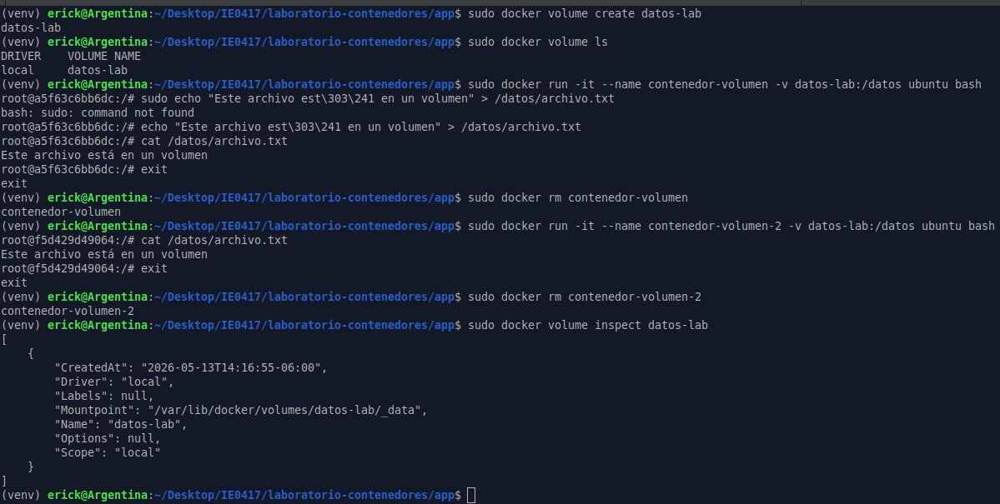
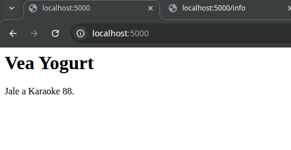

# Parte 10: Persistencia con volúmenes

## Objetivo

Comprender por qué los datos creados dentro de un contenedor pueden perderse al eliminarlo y cómo los volúmenes permiten mantener información fuera del ciclo de vida del contenedor.

---

## Creación de un volumen

### Comando ejecutado

```bash
sudo docker volume create datos-lab
```

### Resultado obtenido

```text
datos-lab
```

### Explicación

El comando `docker volume create datos-lab` crea un volumen administrado por Docker llamado `datos-lab`.

Un volumen permite guardar datos fuera del sistema de archivos interno del contenedor. Esto significa que la información puede mantenerse aunque el contenedor sea eliminado.

---

## Listado de volúmenes

### Comando ejecutado

```bash
sudo docker volume ls
```

### Resultado obtenido

```text
DRIVER    VOLUME NAME
local     datos-lab
```

### Explicación

El comando `docker volume ls` muestra los volúmenes existentes en el sistema.

En este caso, se confirmó que el volumen `datos-lab` fue creado correctamente y que utiliza el driver local de Docker.

---

## Ejecución de un contenedor con volumen montado

### Comando ejecutado

```bash
sudo docker run -it --name contenedor-volumen -v datos-lab:/datos ubuntu bash
```

### Explicación

Este comando crea y ejecuta un contenedor interactivo llamado `contenedor-volumen` usando la imagen `ubuntu`.

La opción `-v datos-lab:/datos` monta el volumen `datos-lab` dentro del contenedor en la ruta `/datos`.

Esto significa que cualquier archivo creado dentro de `/datos` no se guarda únicamente dentro del contenedor, sino en el volumen administrado por Docker.

---

## Creación de un archivo dentro del volumen

### Comando ejecutado dentro del contenedor

```bash
echo "Este archivo está en un volumen" > /datos/archivo.txt
```

### Verificación del archivo

```bash
cat /datos/archivo.txt
```

### Resultado obtenido

```text
Este archivo está en un volumen
```

### Explicación

El comando `echo` escribió el texto dentro del archivo `/datos/archivo.txt`. Como la carpeta `/datos` estaba asociada al volumen `datos-lab`, el archivo quedó guardado en el volumen y no solamente dentro del contenedor.

Luego, con `cat /datos/archivo.txt`, se verificó que el archivo fue creado correctamente.

---

## Salida y eliminación del primer contenedor

### Comandos ejecutados

```bash
exit
sudo docker rm contenedor-volumen
```

### Resultado obtenido

```text
contenedor-volumen
```

### Explicación

Primero se salió del contenedor con `exit`. Luego se eliminó el contenedor usando `docker rm contenedor-volumen`.

Aunque el contenedor fue eliminado, el volumen `datos-lab` no fue eliminado. Por eso, los datos guardados en `/datos` deberían seguir disponibles.

---

## Creación de un segundo contenedor usando el mismo volumen

### Comando ejecutado

```bash
sudo docker run -it --name contenedor-volumen-2 -v datos-lab:/datos ubuntu bash
```

### Explicación

Este comando creó un nuevo contenedor llamado `contenedor-volumen-2`, usando nuevamente la imagen `ubuntu` y montando el mismo volumen `datos-lab` en la ruta `/datos`.

La idea era comprobar si el archivo creado en el primer contenedor seguía disponible en un contenedor diferente.

---

## Verificación del archivo en el segundo contenedor

### Comando ejecutado dentro del contenedor

```bash
cat /datos/archivo.txt
```

### Resultado obtenido

```text
Este archivo está en un volumen
```

### Explicación

El archivo `archivo.txt` seguía existiendo dentro de `/datos`, aunque el primer contenedor ya había sido eliminado.

Esto confirma que el archivo no dependía del contenedor original, sino del volumen `datos-lab`.

---

## Eliminación del segundo contenedor

### Comandos ejecutados

```bash
exit
sudo docker rm contenedor-volumen-2
```

### Resultado obtenido

```text
contenedor-volumen-2
```

### Explicación

Después de verificar que el archivo seguía existiendo, se salió del segundo contenedor y se eliminó con `docker rm`.

Al igual que antes, eliminar el contenedor no elimina automáticamente el volumen.

---

## Inspección del volumen

### Comando ejecutado

```bash
sudo docker volume inspect datos-lab
```

### Resultado obtenido

```text
[
    {
        "CreatedAt": "2026-05-13T14:16:55-06:00",
        "Driver": "local",
        "Labels": null,
        "Mountpoint": "/var/lib/docker/volumes/datos-lab/_data",
        "Name": "datos-lab",
        "Options": null,
        "Scope": "local"
    }
]
```

### Explicación

El comando `docker volume inspect datos-lab` muestra información detallada sobre el volumen.

En el resultado se observa que el volumen se llama `datos-lab`, usa el driver `local` y su punto de montaje en el host es:

```text
/var/lib/docker/volumes/datos-lab/_data
```

Esto indica dónde Docker almacena internamente los datos del volumen en la máquina anfitriona.



---

## Preguntas de reflexión

### 1. ¿Qué problema resuelven los volúmenes?

Los volúmenes resuelven el problema de la pérdida de datos cuando un contenedor se elimina.

Normalmente, los archivos creados dentro del sistema de archivos interno de un contenedor se pierden al eliminarlo. Con un volumen, los datos se guardan fuera del contenedor y pueden reutilizarse en otros contenedores.

### 2. ¿El volumen pertenece a un contenedor específico?

No. El volumen no pertenece a un contenedor específico.

En esta práctica, el volumen `datos-lab` fue usado primero por `contenedor-volumen` y luego por `contenedor-volumen-2`. Aunque el primer contenedor fue eliminado, el volumen siguió existiendo y pudo montarse en otro contenedor.

### 3. ¿Qué diferencia hay entre eliminar un contenedor y eliminar un volumen?

Eliminar un contenedor borra la instancia del contenedor, pero no necesariamente elimina los volúmenes asociados.

Eliminar un volumen sí borra el almacenamiento persistente administrado por Docker. Por eso, si se elimina el volumen `datos-lab`, también se perderían los archivos guardados dentro de él.

### 4. ¿Para qué casos reales se usarían volúmenes?

Los volúmenes se usarían en casos donde una aplicación necesita conservar datos. Por ejemplo, bases de datos, archivos subidos por usuarios, configuraciones, logs persistentes o información generada por una aplicación.

También son útiles cuando se quiere actualizar o reemplazar un contenedor sin perder la información importante.

---

## Reflexión personal

Esta parte permitió comprobar de forma práctica la utilidad de los volúmenes en Docker. Al crear un archivo dentro de `/datos`, eliminar el primer contenedor y luego montar el mismo volumen en otro contenedor, se pudo verificar que la información seguía disponible.

Esto muestra que los contenedores pueden ser temporales, pero los datos importantes deben guardarse en un mecanismo externo como los volúmenes. También quedó claro que eliminar un contenedor no elimina automáticamente el volumen, lo cual permite reutilizar la información en nuevos contenedores.

---

# Parte 11: Bind mounts

## Objetivo

Comprender la diferencia entre un volumen administrado por Docker y un bind mount, donde una carpeta local del host se monta directamente dentro del contenedor.

---

## Ejecución del contenedor con bind mount

### Comando ejecutado

```bash
sudo docker run --name app-bind -p 5000:5000 -v "$(pwd)":/app laboratorio-flask:1.0
```

### Explicación

Este comando ejecuta un contenedor llamado `app-bind` a partir de la imagen `laboratorio-flask:1.0`.

La opción:

```bash
-v "$(pwd)":/app
```

monta la carpeta actual del host dentro del contenedor en la ruta `/app`.

En este caso, como el comando se ejecutó desde la carpeta `app/`, el contenido local de esa carpeta quedó disponible dentro del contenedor. Esto incluye archivos como `app.py`, `requirements.txt` y `Dockerfile`.

La opción:

```bash
-p 5000:5000
```

publica el puerto `5000` del contenedor en el puerto `5000` de la máquina anfitriona, permitiendo acceder a la aplicación desde el navegador mediante `localhost:5000`.

---

## Prueba inicial en el navegador

### Dirección visitada

```text
http://localhost:5000
```

### Resultado observado

```text
Hola desde Flask en Docker

Esta aplicación se está ejecutando dentro de un contenedor.
```

### Explicación

Al visitar `http://localhost:5000`, se comprobó que la aplicación Flask estaba funcionando dentro del contenedor.

En esta primera prueba se observó el mensaje original de la aplicación antes de modificar el archivo local `app.py`.

---

## Modificación del archivo local

### Archivo modificado

```text
app.py
```

### Cambio realizado

Se modificó el mensaje mostrado en la ruta principal de la aplicación. El texto original se cambió por:

```text
Vea Yogurt

Jale a Karaoke 88.
```

### Explicación

Como la carpeta local estaba montada dentro del contenedor mediante un bind mount, los cambios hechos en `app.py` desde la máquina host quedaron disponibles para el contenedor.

Sin embargo, como la aplicación Flask no estaba ejecutándose en modo debug con recarga automática, fue necesario detener y volver a ejecutar el contenedor para observar el cambio en el navegador.

---

## Detención y eliminación del primer contenedor

### Comandos ejecutados

```bash
sudo docker stop app-bind
sudo docker rm app-bind
```

### Explicación

El contenedor `app-bind` se detuvo y luego se eliminó para poder ejecutar nuevamente la aplicación con los cambios realizados en el archivo local.

Detener el contenedor finaliza su ejecución, mientras que eliminarlo borra esa instancia del sistema. La imagen `laboratorio-flask:1.0` sigue existiendo y puede usarse para crear otro contenedor.

---

## Segunda ejecución usando el mismo bind mount

### Comando ejecutado

```bash
sudo docker run --name app-bind-2 -p 5000:5000 -v "$(pwd)":/app laboratorio-flask:1.0
```

### Explicación

Este comando volvió a ejecutar la aplicación usando la misma carpeta local montada en `/app`.

Al usar el bind mount, el contenedor tomó el contenido actualizado del archivo `app.py` desde la máquina host. Por eso, no fue necesario reconstruir la imagen para ver el cambio realizado en el código.

---

## Verificación del cambio en el navegador

### Dirección visitada

```text
http://localhost:5000
```

### Resultado observado

```text
Vea Yogurt

Jale a Karaoke 88.
```

### Explicación

Al abrir nuevamente la aplicación en el navegador, se observó el cambio realizado en el archivo `app.py`. La página ya no mostró el mensaje original de Flask, sino el nuevo texto agregado desde la máquina host.

Esto confirma que el contenedor estaba usando la carpeta local montada desde el host mediante el bind mount. Por lo tanto, el contenido ejecutado no venía solamente de los archivos copiados originalmente dentro de la imagen, sino de la carpeta local compartida con el contenedor.

---

## Detención y eliminación del segundo contenedor

### Comandos ejecutados

```bash
sudo docker stop app-bind-2
sudo docker rm app-bind-2
```

### Explicación

Después de verificar el cambio en el navegador, se detuvo y eliminó el segundo contenedor para limpiar el ambiente de trabajo.

Esto evita dejar contenedores ejecutándose innecesariamente y libera el puerto `5000` del host.

---

## Diferencia entre datos-lab:/datos y "$(pwd)":/app

El montaje:

```bash
-v datos-lab:/datos
```

usa un volumen administrado por Docker. En ese caso, Docker decide dónde almacenar los datos en el host y el usuario normalmente no trabaja directamente con esa ruta.

En cambio, el montaje:

```bash
-v "$(pwd)":/app
```

usa un bind mount. Esto significa que una carpeta específica del host, en este caso la carpeta actual, se monta directamente dentro del contenedor.

La diferencia principal es que el volumen es gestionado por Docker, mientras que el bind mount depende directamente de una ruta existente en la máquina host.

---

## Qué ocurrió al modificar el código local

Al modificar el archivo `app.py` en la máquina host y volver a ejecutar el contenedor con el bind mount, la aplicación mostró el cambio realizado.

Esto ocurrió porque el contenedor estaba usando el archivo local montado en `/app`. Por lo tanto, el contenido no venía únicamente de la imagen construida, sino de la carpeta local compartida con el contenedor.

---

## Por qué esto puede ser útil durante el desarrollo

Los bind mounts son útiles durante el desarrollo porque permiten modificar archivos en la máquina host y probar esos cambios dentro del contenedor sin reconstruir la imagen cada vez.

Esto facilita el trabajo cuando se está programando, ya que se puede editar el código con Visual Studio Code en el host y ejecutarlo dentro de un ambiente controlado por Docker.

---



## Preguntas de reflexión

### 1. ¿Qué diferencia hay entre un volumen y un bind mount?

Un volumen es administrado por Docker y se almacena en una ruta interna controlada por Docker. Se usa principalmente para persistir datos de forma independiente del contenedor.

Un bind mount monta una carpeta específica del host dentro del contenedor. En este caso, el usuario controla directamente la carpeta local que se comparte con el contenedor.

En resumen, el volumen es más conveniente para guardar datos persistentes de una aplicación, mientras que el bind mount es más útil cuando se quiere compartir archivos del proyecto entre el host y el contenedor.

### 2. ¿Cuál parece más conveniente para desarrollo?

Para desarrollo parece más conveniente el bind mount, porque permite editar archivos localmente y ver esos cambios reflejados dentro del contenedor.

Esto evita tener que reconstruir la imagen cada vez que se modifica el código fuente. En esta práctica, se modificó `app.py` desde la máquina host y luego el contenedor pudo usar ese archivo actualizado.

### 3. ¿Cuál parece más conveniente para datos persistentes de una aplicación?

Para datos persistentes parece más conveniente usar volúmenes, porque Docker los administra de forma más ordenada y separada del código fuente.

Por ejemplo, una base de datos debería guardar su información en un volumen, no necesariamente en una carpeta del proyecto. Esto permite eliminar o reemplazar contenedores sin perder los datos importantes.

### 4. ¿Qué riesgos podría tener montar carpetas del host dentro del contenedor?

Montar carpetas del host dentro del contenedor puede ser riesgoso porque el contenedor puede leer o modificar archivos reales de la máquina anfitriona.

Si se monta una carpeta importante por error, una aplicación dentro del contenedor podría alterar archivos del sistema o del proyecto. Por eso se debe tener cuidado con la ruta que se comparte y evitar montar directorios sensibles del sistema.

---

## Reflexión personal

Esta parte permitió entender que no todos los montajes en Docker funcionan igual. En la parte anterior se usó un volumen administrado por Docker para guardar datos persistentes. En cambio, en esta parte se usó un bind mount para compartir directamente una carpeta local con el contenedor.

El bind mount resultó útil para desarrollo, porque permitió modificar el código desde el host y luego ejecutar el contenedor usando esos archivos actualizados. Esto muestra cómo Docker puede usarse no solo para ejecutar aplicaciones, sino también para trabajar en ellas durante el proceso de desarrollo.

También quedó claro que los bind mounts deben usarse con cuidado, ya que el contenedor tiene acceso directo a archivos del host. Por eso, es importante montar solamente las carpetas necesarias para cada caso.