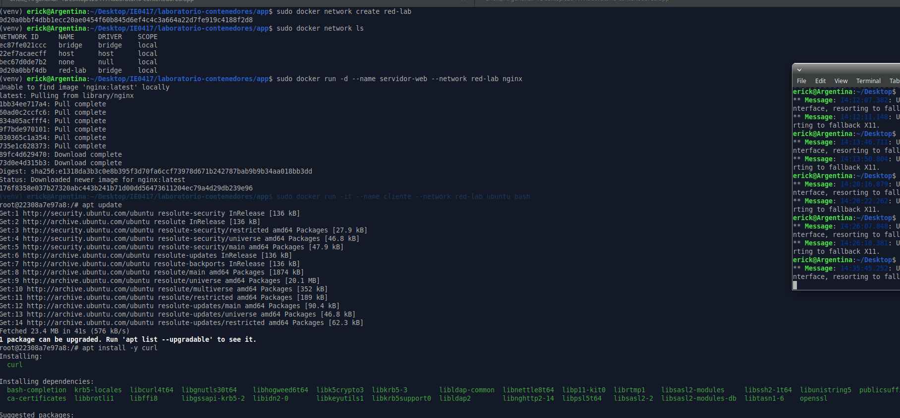
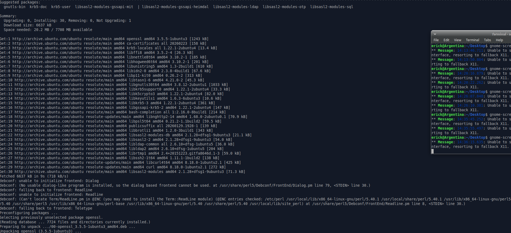
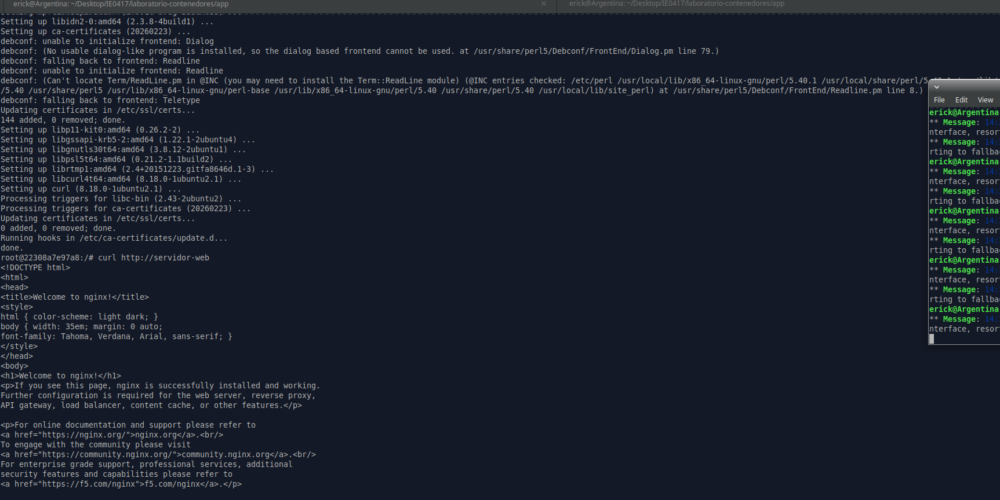
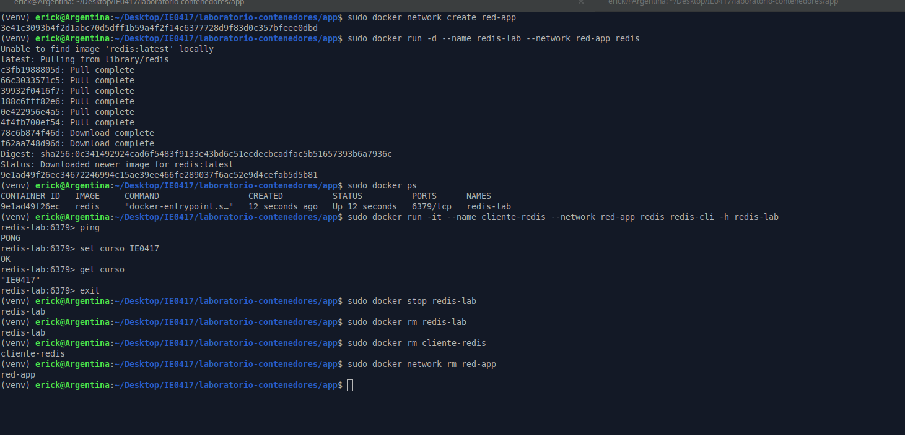

# Parte 12: Redes de Docker

## Objetivo

Crear una red personalizada en Docker y comunicar contenedores entre sí usando el nombre del contenedor como referencia.

---

## Creación de una red personalizada

### Comando ejecutado

```bash
sudo docker network create red-lab
```

### Resultado obtenido

```text
0d20a0bbf4dbb1ecc20ae0454f60b845d6ef4c4c3a664a22d7fe919c4188f2d8
```

### Explicación

El comando `docker network create red-lab` crea una red personalizada llamada `red-lab`.

Una red en Docker permite que varios contenedores puedan comunicarse entre sí. Al crear una red personalizada, los contenedores conectados a esa red pueden encontrarse usando sus nombres, sin necesidad de conocer directamente sus direcciones IP.

---

## Listado de redes disponibles

### Comando ejecutado

```bash
sudo docker network ls
```

### Resultado obtenido

```text
NETWORK ID     NAME      DRIVER    SCOPE
ec87fe021ccc   bridge    bridge    local
22ef7acaecff   host      host      local
bec67d0de7b2   none      null      local
0d20a0bbf4db   red-lab   bridge    local
```

### Explicación

El comando `docker network ls` muestra las redes disponibles en Docker.

En el resultado se observan las redes por defecto `bridge`, `host` y `none`, además de la red personalizada `red-lab`, creada para esta práctica.

La red `red-lab` usa el driver `bridge`, lo que permite comunicación entre contenedores dentro del mismo host.

---

## Ejecución del contenedor servidor con Nginx

### Comando ejecutado

```bash
sudo docker run -d --name servidor-web --network red-lab nginx
```

### Resultado obtenido

```text
Unable to find image 'nginx:latest' locally
latest: Pulling from library/nginx
1bb34ee717a4: Pull complete 
60ad0c2ccfc6: Pull complete 
834a05acfff4: Pull complete 
9f7bde970101: Pull complete 
030365c1a354: Pull complete 
735e1c628373: Pull complete 
89fc4d629470: Download complete 
73d0e4d315b3: Download complete 
Digest: sha256:e1318da3b3c0e8b395f3d70fa6ccf73978d671b242787bab9b9b34aa018bb3dd
Status: Downloaded newer image for nginx:latest
176f8358e037b27320abc443b241b71d00dd56473611204ec79a4d29db239e96
```

### Explicación

Este comando crea y ejecuta un contenedor llamado `servidor-web` usando la imagen `nginx`.

La opción `-d` ejecuta el contenedor en segundo plano. La opción `--network red-lab` conecta el contenedor a la red personalizada `red-lab`.

Como la imagen `nginx:latest` no estaba descargada localmente, Docker la descargó desde Docker Hub antes de crear el contenedor.

---

## Ejecución del contenedor cliente

### Comando ejecutado

```bash
sudo docker run -it --name cliente --network red-lab ubuntu bash
```

### Resultado obtenido

```text
root@22308a7e97a8:/#
```

### Explicación

Este comando crea y ejecuta un contenedor interactivo llamado `cliente` usando la imagen `ubuntu`.

La opción `--network red-lab` conecta este contenedor a la misma red donde se encuentra el contenedor `servidor-web`.

Esto permite que el contenedor `cliente` pueda comunicarse con el contenedor `servidor-web` usando su nombre.

---

## Instalación de curl dentro del contenedor cliente

### Comandos ejecutados dentro del contenedor

```bash
apt update
apt install -y curl
```

### Explicación

Dentro del contenedor `cliente` se instaló `curl`, una herramienta de línea de comandos que permite hacer solicitudes HTTP.

Primero se ejecutó `apt update` para actualizar la lista de paquetes disponibles. Luego se ejecutó `apt install -y curl` para instalar `curl` sin pedir confirmación manual.

Durante la instalación se descargaron e instalaron varias dependencias necesarias para que `curl` pudiera funcionar correctamente.

---

## Prueba de conexión hacia el servidor web

### Comando ejecutado dentro del contenedor cliente

```bash
curl http://servidor-web
```

### Resultado obtenido

```html
<!DOCTYPE html>
<html>
<head>
<title>Welcome to nginx!</title>
<style>
html { color-scheme: light dark; }
body { width: 35em; margin: 0 auto;
font-family: Tahoma, Verdana, Arial, sans-serif; }
</style>
</head>
<body>
<h1>Welcome to nginx!</h1>
<p>If you see this page, nginx is successfully installed and working.
Further configuration is required for the web server, reverse proxy, 
API gateway, load balancer, content cache, or other features.</p>

<p><em>Thank you for using nginx.</em></p>
</body>
</html>
```

### Explicación

El comando `curl http://servidor-web` realizó una solicitud HTTP desde el contenedor `cliente` hacia el contenedor `servidor-web`.

La respuesta recibida fue la página de bienvenida de Nginx, lo cual confirma que el contenedor cliente pudo comunicarse correctamente con el servidor web.

Lo importante es que no se usó una dirección IP, sino el nombre del contenedor `servidor-web`. Esto fue posible porque ambos contenedores estaban conectados a la misma red de Docker, `red-lab`.

---

## Salida del contenedor cliente

### Comando ejecutado

```bash
exit
```

### Resultado obtenido

```text
exit
```

### Explicación

El comando `exit` cerró la sesión interactiva dentro del contenedor `cliente`.

Al salir, se regresó a la terminal de la máquina anfitriona.

---

## Detención y eliminación de contenedores

### Comandos ejecutados

```bash
sudo docker stop servidor-web
sudo docker rm servidor-web
sudo docker rm cliente
```

### Resultado obtenido

```text
servidor-web
servidor-web
cliente
```

### Explicación

Primero se detuvo el contenedor `servidor-web` usando `docker stop`.

Luego se eliminaron los contenedores `servidor-web` y `cliente` usando `docker rm`.

Durante la limpieza se ejecutaron algunos comandos sin `sudo`, por lo que apareció un error de permisos:

```text
permission denied while trying to connect to the docker API at unix:///var/run/docker.sock
```

Esto ocurrió porque el usuario actual no tenía permiso para conectarse directamente al daemon de Docker sin usar `sudo`. Al repetir los comandos con `sudo`, la eliminación se realizó correctamente.

---

## Eliminación de la red personalizada

### Comando ejecutado

```bash
sudo docker network rm red-lab
```

### Resultado obtenido

```text
red-lab
```


### Explicación

El comando `docker network rm red-lab` eliminó la red personalizada creada para la práctica.

Esto se realizó después de detener y eliminar los contenedores que estaban conectados a esa red.

---

## Qué es una red en Docker

Una red en Docker es un mecanismo que permite conectar contenedores entre sí o con otros entornos. Cada contenedor puede estar conectado a una o varias redes, dependiendo de la configuración.

Docker crea una red `bridge` por defecto, pero también permite crear redes personalizadas. Las redes personalizadas son útiles porque permiten que los contenedores se comuniquen por nombre, lo cual facilita la conexión entre servicios.

---

## Qué hace docker network create

El comando `docker network create` crea una nueva red en Docker.

En este caso, se creó la red:

```text
red-lab
```

Esta red permitió conectar el contenedor `servidor-web` y el contenedor `cliente` para que pudieran comunicarse entre sí.

---

## Qué significa conectar contenedores a la misma red

Conectar contenedores a la misma red significa colocarlos dentro de un mismo espacio de comunicación.

En esta práctica, tanto `servidor-web` como `cliente` fueron conectados a `red-lab`. Gracias a eso, el contenedor `cliente` pudo acceder al servidor Nginx usando:

```text
http://servidor-web
```

sin necesidad de usar una dirección IP.

---

## Por qué se pudo usar el nombre servidor-web

Se pudo usar el nombre `servidor-web` porque Docker proporciona resolución de nombres dentro de redes personalizadas.

Cuando dos contenedores están en la misma red de Docker, Docker permite que uno encuentre al otro usando el nombre del contenedor. En este caso, `servidor-web` actuó como nombre de host dentro de la red `red-lab`.

---





## Preguntas de reflexión

### 1. ¿Por qué los contenedores necesitan redes?

Los contenedores necesitan redes para comunicarse con otros contenedores, con la máquina anfitriona o con servicios externos.

En aplicaciones reales, es común que una aplicación web necesite comunicarse con una base de datos, una API, un servidor de caché u otro servicio. Las redes de Docker permiten organizar esa comunicación de forma controlada.

### 2. ¿Qué ventaja tiene usar nombres de contenedor en lugar de direcciones IP?

Usar nombres de contenedor es más práctico que usar direcciones IP porque los nombres son más fáciles de recordar y no cambian de la misma forma que una IP interna.

Además, Docker puede asignar direcciones IP dinámicamente a los contenedores. Si se dependiera de una IP fija, la configuración podría fallar al recrear contenedores. En cambio, usar nombres como `servidor-web` hace que la comunicación sea más clara y flexible.

### 3. ¿Qué diferencia hay entre publicar un puerto hacia el host y comunicarse dentro de una red Docker?

Publicar un puerto hacia el host permite acceder a un contenedor desde la máquina anfitriona, por ejemplo desde un navegador usando `localhost`.

En cambio, comunicarse dentro de una red Docker permite que los contenedores se comuniquen entre sí internamente, sin exponer necesariamente sus puertos al host.

En esta práctica, el cliente pudo acceder a Nginx usando `http://servidor-web` dentro de la red `red-lab`, sin que fuera necesario publicar el puerto 80 de Nginx hacia el host.

### 4. ¿Qué ejemplos reales podrían usar una red Docker?

Una red Docker podría usarse en una aplicación web conectada a una base de datos, por ejemplo una aplicación Flask comunicándose con PostgreSQL o MySQL.

También podría usarse en arquitecturas con varios servicios, como una API, un servidor web, una base de datos, un sistema de caché como Redis y un servicio de mensajería. Cada servicio puede correr en su propio contenedor, pero todos pueden comunicarse dentro de una red Docker.

---

## Reflexión personal

Esta parte permitió entender cómo los contenedores pueden comunicarse entre sí dentro de una red personalizada de Docker. Al crear la red `red-lab` y conectar tanto el contenedor `servidor-web` como el contenedor `cliente`, fue posible hacer una solicitud HTTP desde Ubuntu hacia Nginx usando solo el nombre del contenedor.

El resultado de `curl http://servidor-web` mostró la página de bienvenida de Nginx, lo cual confirmó que la comunicación funcionó correctamente. Esto ayuda a entender cómo se conectan servicios en aplicaciones reales, donde normalmente una aplicación necesita comunicarse con otros componentes como bases de datos, servidores web o servicios internos.

También se observó que usar nombres de contenedor es más cómodo que depender de direcciones IP, porque Docker puede resolver esos nombres automáticamente dentro de una red personalizada. 


---

# Parte 13: Comunicación entre servicios

## Objetivo

Comprender cómo una aplicación o servicio puede comunicarse con otro contenedor dentro de una red Docker, usando Redis como ejemplo de servicio externo.

---

## Creación de una red para la aplicación

### Comando ejecutado

```bash
sudo docker network create red-app
```

### Resultado obtenido

```text
3e41c3093b4f2d1abc70d5dff1b59a4f2f14c6377728d9f83d0c357bfeee0dbd
```

### Explicación

El comando `docker network create red-app` crea una red personalizada llamada `red-app`.

Esta red permite conectar varios contenedores entre sí. En esta práctica, se utilizó para conectar un contenedor con Redis y otro contenedor cliente que se comunica con él.

---

## Ejecución del contenedor Redis

### Comando ejecutado

```bash
sudo docker run -d --name redis-lab --network red-app redis
```

### Resultado obtenido

```text
Unable to find image 'redis:latest' locally
latest: Pulling from library/redis
c3fb1988805d: Pull complete 
66c3033571c5: Pull complete 
39932f0416f7: Pull complete 
188c6fff82e6: Pull complete 
0e422956e4a5: Pull complete 
4f4fb700ef54: Pull complete 
78c6b874f46d: Download complete 
f62aa748d96d: Download complete 
Digest: sha256:0c341492924cad6f5483f9133e43bd6c51ecdecbcadfac5b51657393b6a7936c
Status: Downloaded newer image for redis:latest
9e1ad49f26ec34672246994c15ae39ee466fe289037f6ac52e9d4cefab5d5b81
```

### Explicación

Este comando crea y ejecuta un contenedor llamado `redis-lab` usando la imagen `redis`.

La opción `-d` ejecuta el contenedor en segundo plano. La opción `--network red-app` conecta el contenedor a la red personalizada `red-app`.

Como la imagen `redis:latest` no estaba descargada localmente, Docker la descargó desde Docker Hub antes de crear el contenedor.

---

## Verificación del contenedor Redis

### Comando ejecutado

```bash
sudo docker ps
```

### Resultado obtenido

```text
CONTAINER ID   IMAGE     COMMAND                  CREATED          STATUS          PORTS      NAMES
9e1ad49f26ec   redis     "docker-entrypoint.s…"   12 seconds ago   Up 12 seconds   6379/tcp   redis-lab
```

### Explicación

El comando `docker ps` muestra los contenedores que están en ejecución.

En este caso, se observa que el contenedor `redis-lab` estaba activo, usando la imagen `redis` y escuchando internamente en el puerto `6379/tcp`, que es el puerto típico de Redis.

---

## Ejecución de un cliente Redis

### Comando ejecutado

```bash
sudo docker run -it --name cliente-redis --network red-app redis redis-cli -h redis-lab
```

### Resultado obtenido

```text
redis-lab:6379>
```

### Explicación

Este comando crea un contenedor llamado `cliente-redis`, conectado a la misma red `red-app`.

La imagen usada también fue `redis`, pero en este caso no se levantó un servidor Redis. En su lugar, se ejecutó el comando:

```bash
redis-cli -h redis-lab
```

Este comando abre un cliente de Redis y se conecta al servidor llamado `redis-lab`.

La conexión funcionó porque ambos contenedores estaban dentro de la misma red Docker y Docker pudo resolver el nombre `redis-lab`.

---

## Prueba de conexión con PING

### Comando ejecutado dentro del cliente Redis

```text
ping
```

### Resultado obtenido

```text
PONG
```

### Explicación

El comando `ping` permite verificar si el cliente puede comunicarse correctamente con el servidor Redis.

La respuesta `PONG` confirma que el cliente `cliente-redis` logró conectarse al servidor `redis-lab`.

---

## Escritura de un valor en Redis

### Comando ejecutado

```text
set curso IE0417
```

### Resultado obtenido

```text
OK
```

### Explicación

El comando `set curso IE0417` guarda un valor en Redis.

En este caso, se creó una clave llamada `curso` con el valor `IE0417`. La respuesta `OK` indica que Redis guardó el valor correctamente.

---

## Lectura de un valor en Redis

### Comando ejecutado

```text
get curso
```

### Resultado obtenido

```text
"IE0417"
```

### Explicación

El comando `get curso` consulta el valor almacenado en la clave `curso`.

La respuesta `"IE0417"` confirma que el valor se guardó y se pudo recuperar correctamente desde Redis.

---

## Salida del cliente Redis

### Comando ejecutado

```text
exit
```

### Explicación

El comando `exit` cierra la sesión del cliente Redis y finaliza el contenedor interactivo `cliente-redis`.

---

## Limpieza de contenedores y red

### Comandos ejecutados

```bash
sudo docker stop redis-lab
sudo docker rm redis-lab
sudo docker rm cliente-redis
sudo docker network rm red-app
```

### Resultado obtenido

```text
redis-lab
redis-lab
cliente-redis
red-app
```

### Explicación

Primero se detuvo el contenedor `redis-lab`, que estaba ejecutándose en segundo plano. Luego se eliminaron los contenedores `redis-lab` y `cliente-redis`.

Finalmente, se eliminó la red personalizada `red-app`, ya que no era necesaria después de terminar la práctica.

---

## Qué es Redis en este ejemplo

Redis es un servicio de almacenamiento en memoria que permite guardar y consultar datos usando una estructura de clave y valor.

En esta práctica, Redis se usó como ejemplo de un servicio externo al que otro contenedor puede conectarse. Aunque el ejemplo fue sencillo, representa una situación común donde una aplicación necesita comunicarse con otro servicio, como una base de datos o un sistema de caché.

---

## Qué representa redis-lab

`redis-lab` representa el contenedor que ejecuta el servidor Redis.

También funciona como nombre de host dentro de la red `red-app`. Por eso, el cliente pudo conectarse usando:

```bash
redis-cli -h redis-lab
```

sin necesidad de conocer la dirección IP interna del contenedor.

---

## Cómo se conectó el cliente al servidor

El cliente se conectó al servidor Redis usando el comando:

```bash
redis-cli -h redis-lab
```

Esto fue posible porque tanto `cliente-redis` como `redis-lab` estaban conectados a la misma red Docker, llamada `red-app`.

Docker permitió resolver el nombre `redis-lab` dentro de esa red y dirigir la conexión hacia el contenedor correcto.

---

## Qué significa recibir PONG

Recibir `PONG` significa que el servidor Redis respondió correctamente al comando `ping`.

Esto confirma que la conexión entre el cliente y el servidor estaba funcionando.

---

## Enseñanza del ejemplo

Este ejemplo muestra cómo varios contenedores pueden trabajar juntos dentro de una misma red Docker.

El contenedor `redis-lab` funcionó como servidor, mientras que el contenedor `cliente-redis` actuó como cliente. La comunicación se realizó usando el nombre del contenedor, no una dirección IP.

Esto es parecido a una aplicación real donde una aplicación web se conecta a una base de datos o a un servicio de caché.

---



## Preguntas de reflexión

### 1. ¿Por qué una aplicación web podría necesitar comunicarse con una base de datos?

Una aplicación web podría necesitar comunicarse con una base de datos para guardar y consultar información. Por ejemplo, usuarios, productos, configuraciones, resultados, sesiones o registros generados por la aplicación.

Sin una base de datos, muchos datos importantes se perderían cuando la aplicación se detenga o se reinicie.

### 2. ¿Por qué ambos contenedores deben estar en la misma red?

Ambos contenedores deben estar en la misma red para que puedan comunicarse entre sí de forma directa.

En esta práctica, el cliente pudo conectarse a Redis usando el nombre `redis-lab` porque ambos contenedores estaban en la red `red-app`. Si estuvieran en redes separadas, el cliente no podría resolver ese nombre ni conectarse fácilmente al servidor.

### 3. ¿Qué ventaja tiene separar servicios en contenedores distintos?

Separar servicios en contenedores distintos permite organizar mejor una aplicación. Cada contenedor puede encargarse de una función específica, por ejemplo una aplicación web, una base de datos, un servidor web o un sistema de caché.

Esto facilita actualizar, reiniciar o reemplazar un servicio sin afectar necesariamente a los demás. También permite reutilizar imágenes ya existentes, como `redis` o `nginx`.

### 4. ¿Qué limitación tiene hacerlo manualmente con varios comandos docker run?

La principal limitación es que se vuelve más difícil administrar varios contenedores manualmente. Hay que recordar los nombres, redes, puertos, variables de entorno y comandos necesarios para cada servicio.

En aplicaciones más grandes, ejecutar todo con varios comandos `docker run` puede ser desordenado. Para esos casos, normalmente se utilizan herramientas como Docker Compose, que permiten definir varios servicios en un archivo de configuración.

---

## Reflexión personal

Esta parte permitió entender cómo una aplicación puede comunicarse con otro servicio dentro de Docker. Aunque se usó Redis de forma sencilla, el ejemplo representa una situación real donde una aplicación necesita conectarse a una base de datos o a un servicio externo.

El resultado `PONG` confirmó que el cliente pudo comunicarse con el servidor Redis. Además, al guardar y consultar el valor `curso`, se comprobó que la conexión no solo existía, sino que también permitía enviar comandos y recibir respuestas.

También quedó claro que las redes de Docker facilitan la comunicación entre contenedores usando nombres, lo cual es más práctico que depender de direcciones IP internas.