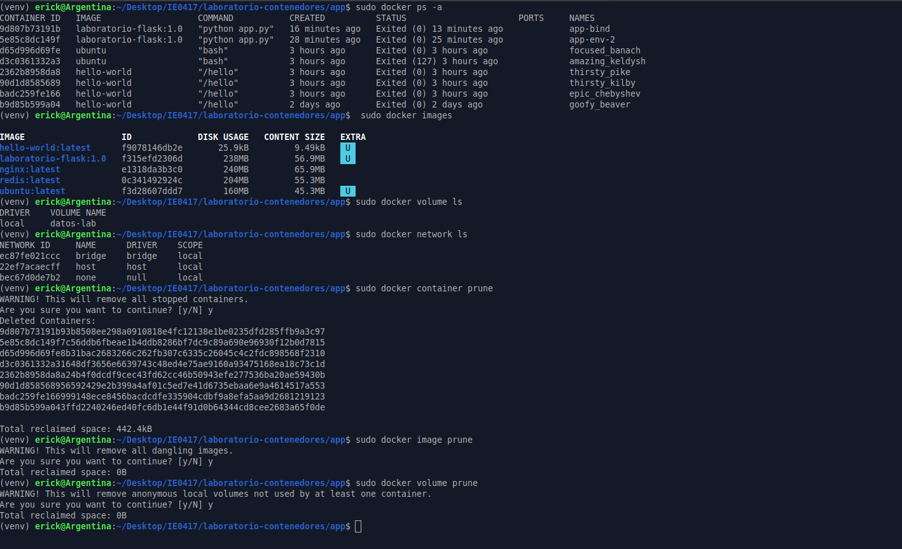
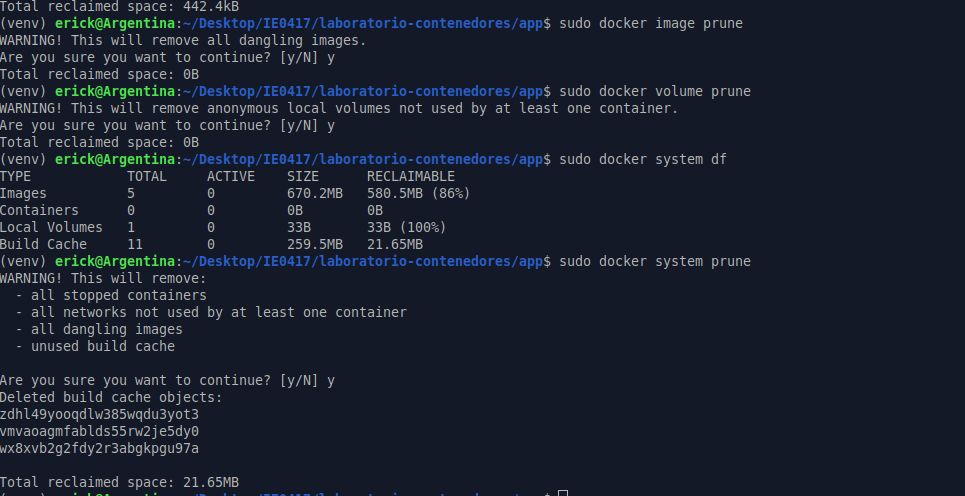

# Parte 14: Limpieza del ambiente

## Objetivo

Aprender a revisar y limpiar recursos de Docker que ya no se utilizan, como contenedores detenidos, imágenes, volúmenes, redes y caché de construcción.

---

## Listado de contenedores

### Comando ejecutado

```bash
sudo docker ps -a
```

### Resultado obtenido

```text
CONTAINER ID   IMAGE                   COMMAND           CREATED          STATUS                    PORTS     NAMES
9d807b73191b   laboratorio-flask:1.0   "python app.py"   16 minutes ago   Exited (0) 13 minutes ago             app-bind
5e85c8dc149f   laboratorio-flask:1.0   "python app.py"   28 minutes ago   Exited (0) 25 minutes ago             app-env-2
d65d996d69fe   ubuntu                  "bash"            3 hours ago      Exited (0) 3 hours ago                focused_banach
d3c0361332a3   ubuntu                  "bash"            3 hours ago      Exited (127) 3 hours ago              amazing_keldysh
2362b8958da8   hello-world             "/hello"          3 hours ago      Exited (0) 3 hours ago                thirsty_pike
90d1d8585689   hello-world             "/hello"          3 hours ago      Exited (0) 3 hours ago                thirsty_kilby
badc259fe166   hello-world             "/hello"          3 hours ago      Exited (0) 3 hours ago                epic_chebyshev
b9d85b599a04   hello-world             "/hello"          2 days ago       Exited (0) 2 days ago                 goofy_beaver
```

### Explicación

El comando `docker ps -a` muestra todos los contenedores existentes en el sistema, tanto los que están ejecutándose como los que están detenidos.

En este caso, se observaron varios contenedores detenidos de prácticas anteriores, como contenedores de `hello-world`, `ubuntu` y de la imagen `laboratorio-flask:1.0`.

---

## Listado de imágenes

### Comando ejecutado

```bash
sudo docker images
```

### Resultado obtenido

```text
IMAGE                   ID             DISK USAGE   CONTENT SIZE   EXTRA
hello-world:latest      f9078146db2e       25.9kB         9.49kB    U
laboratorio-flask:1.0   f315efd2306d        238MB         56.9MB    U
nginx:latest            e1318da3b3c0        240MB         65.9MB
redis:latest            0c341492924c        204MB         55.3MB
ubuntu:latest           f3d28607ddd7        160MB         45.3MB    U
```

### Explicación

El comando `docker images` muestra las imágenes descargadas o construidas localmente.

En este caso, se observaron imágenes usadas durante el laboratorio, como `hello-world`, `ubuntu`, `nginx`, `redis` y la imagen personalizada `laboratorio-flask:1.0`.

---

## Listado de volúmenes

### Comando ejecutado

```bash
sudo docker volume ls
```

### Resultado obtenido

```text
DRIVER    VOLUME NAME
local     datos-lab
```

### Explicación

El comando `docker volume ls` muestra los volúmenes existentes en Docker.

En este caso, se observó el volumen `datos-lab`, creado durante la parte de persistencia con volúmenes.

---

## Listado de redes

### Comando ejecutado

```bash
sudo docker network ls
```

### Resultado obtenido

```text
NETWORK ID     NAME      DRIVER    SCOPE
ec87fe021ccc   bridge    bridge    local
22ef7acaecff   host      host      local
bec67d0de7b2   none      null      local
```

### Explicación

El comando `docker network ls` muestra las redes disponibles en Docker.

En este caso, se observaron las redes por defecto de Docker: `bridge`, `host` y `none`. Las redes personalizadas usadas en las partes anteriores ya habían sido eliminadas.

---

## Eliminación de contenedores detenidos

### Comando ejecutado

```bash
sudo docker container prune
```

### Resultado obtenido

```text
WARNING! This will remove all stopped containers.
Are you sure you want to continue? [y/N] y

Deleted Containers:
9d807b73191b93b8508ee298a0910818e4fc12138e1be0235dfd285ffb9a3c97
5e85c8dc149f7c56ddb6fbeae1b4ddb8286bf7dc9c89a690e96930f12b0d7815
d65d996d69fe8b31bac2683266c262fb307c6335c26045c4c2fdc898568f2310
d3c0361332a31648df3656e6639743c48ed4e75ae9160a93475168ea18c73c1d
2362b8958da8a24b4f0dcdf9cec43fd62cc46b50943efe277536ba20ae59430b
90d1d858568956592429e2b399a4af01c5ed7e41d6735ebaa6e9a4614517a553
badc259fe166999148ece8456bacdcfe335904cdbf9a8efa5aa9d2681219123
b9d85b599a043ffd2240246ed40fc6db1e44f91d0b64344cd8cee2683a65f0de

Total reclaimed space: 442.4kB
```

### Explicación

El comando `docker container prune` elimina todos los contenedores detenidos.

Docker mostró una advertencia antes de continuar, ya que esta acción borra contenedores que ya no están en ejecución. Después de confirmar con `y`, se eliminaron los contenedores detenidos y se recuperaron `442.4kB` de espacio.

---

## Eliminación de imágenes no utilizadas

### Comando ejecutado

```bash
sudo docker image prune
```

### Resultado obtenido

```text
WARNING! This will remove all dangling images.
Are you sure you want to continue? [y/N] y
Total reclaimed space: 0B
```

### Explicación

El comando `docker image prune` elimina imágenes colgantes, es decir, imágenes sin etiqueta o que ya no están asociadas directamente a una imagen útil.

En este caso, Docker no recuperó espacio porque no había imágenes colgantes para eliminar.

---

## Eliminación de volúmenes no utilizados

### Comando ejecutado

```bash
sudo docker volume prune
```

### Resultado obtenido

```text
WARNING! This will remove anonymous local volumes not used by at least one container.
Are you sure you want to continue? [y/N] y
Total reclaimed space: 0B
```

### Explicación

El comando `docker volume prune` elimina volúmenes locales anónimos que no están siendo utilizados por ningún contenedor.

En este caso, no se recuperó espacio. El volumen `datos-lab` no fue eliminado porque es un volumen con nombre, no un volumen anónimo.

---

## Revisión del espacio utilizado por Docker

### Comando ejecutado

```bash
sudo docker system df
```

### Resultado obtenido

```text
TYPE            TOTAL     ACTIVE    SIZE      RECLAIMABLE
Images          5         0         670.2MB   580.5MB (86%)
Containers      0         0         0B        0B
Local Volumes   1         0         33B       33B (100%)
Build Cache     11        0         259.5MB   21.65MB
```

### Explicación

El comando `docker system df` muestra un resumen del espacio usado por Docker.

En este caso, se observó que había 5 imágenes ocupando `670.2MB`, ningún contenedor activo o detenido, 1 volumen local y caché de construcción. Esta información permite identificar qué recursos están ocupando espacio y cuánto se podría recuperar.

---

## Limpieza general del sistema

### Comando ejecutado

```bash
sudo docker system prune
```

### Resultado obtenido

```text
WARNING! This will remove:
  - all stopped containers
  - all networks not used by at least one container
  - all dangling images
  - unused build cache

Are you sure you want to continue? [y/N] y

Deleted build cache objects:
zdhl49yoqd1w385wqdu3yot3
vmvaoagmfablds55rv2je5dy0
wx8xvb2g2fdy2r3abgkpgu97a

Total reclaimed space: 21.65MB
```

### Explicación

El comando `docker system prune` realiza una limpieza general de recursos no utilizados. Puede eliminar contenedores detenidos, redes no utilizadas, imágenes colgantes y caché de construcción.

En este caso, se eliminaron objetos de caché de construcción y se recuperaron `21.65MB` de espacio.

No se ejecutó `docker system prune -a`, porque ese comando puede eliminar más recursos, incluyendo imágenes no usadas, y debe utilizarse con cuidado.

---




## Preguntas de reflexión

### 1. ¿Por qué es importante limpiar contenedores e imágenes que ya no se utilizan?

Es importante porque Docker puede acumular contenedores detenidos, imágenes descargadas, volúmenes y caché de construcción. Aunque algunos recursos ocupen poco espacio, con el tiempo pueden consumir almacenamiento innecesario.

Limpiar el ambiente también ayuda a mantener el sistema más ordenado y evita confusiones al listar contenedores, imágenes o redes.

### 2. ¿Qué diferencia hay entre eliminar un contenedor y eliminar una imagen?

Eliminar un contenedor borra una instancia creada a partir de una imagen. En cambio, eliminar una imagen borra la plantilla usada para crear contenedores.

Una imagen puede usarse para crear varios contenedores. Por eso, aunque se eliminen contenedores, la imagen puede seguir existiendo en el sistema.

### 3. ¿Qué precaución se debe tener al usar comandos prune?

Los comandos `prune` eliminan recursos automáticamente, por lo que se debe revisar bien qué se está borrando antes de confirmar.

Por ejemplo, `docker container prune` elimina todos los contenedores detenidos, y `docker system prune` puede eliminar redes no usadas, imágenes colgantes y caché. Si se usa `docker system prune -a`, se pueden eliminar incluso imágenes no usadas que tal vez se necesiten después.

### 4. ¿Qué información útil muestra docker system df?

El comando `docker system df` muestra cuánto espacio está usando Docker en imágenes, contenedores, volúmenes y caché de construcción.

También indica cuánto espacio puede recuperarse. Esto es útil para decidir si es necesario limpiar el ambiente.

---

## Reflexión personal

Esta parte permitió cerrar el laboratorio dejando el ambiente de Docker más limpio. Al inicio se observaron varios contenedores detenidos creados durante las prácticas anteriores. Luego, con `docker container prune`, se eliminaron esos contenedores y se redujo la cantidad de recursos acumulados.

También se revisaron las imágenes, volúmenes y redes existentes. Esto permitió ver que Docker conserva muchos recursos aunque los contenedores ya no estén activos. Finalmente, con `docker system df` se pudo revisar el espacio ocupado por Docker y con `docker system prune` se eliminó caché de construcción no utilizada.

En general, esta parte muestra que trabajar con Docker no solo implica crear y ejecutar contenedores, sino también administrar y limpiar el ambiente para evitar acumulación de recursos innecesarios.