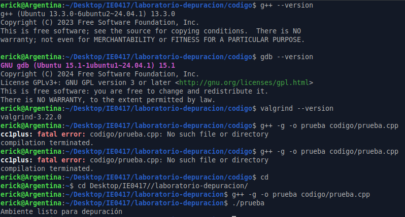

# Parte 1: Instalación y verificación del ambiente

## 1.1 Objetivo

Verificar que el ambiente de trabajo cuenta con las herramientas necesarias para compilar, ejecutar y depurar programas escritos en C++.

En esta parte se revisó la instalación de las herramientas `g++`, `gdb` y `valgrind`. Además, se compiló y ejecutó un programa sencillo de prueba para confirmar que el ambiente funciona correctamente.

---

## 1.2 Sistema operativo utilizado

Se utilizó Ubuntu 24.04.1 en la máquina de trabajo.

---

## 1.3 Verificación de herramientas

### Versión de `g++`

Se ejecutó el siguiente comando:

```bash
g++ --version
```

Resultado obtenido:

```bash
g++ (Ubuntu 13.3.0-6ubuntu2~24.04.1) 13.3.0
Copyright (C) 2023 Free Software Foundation, Inc.
This is free software; see the source for copying conditions.  There is NO
warranty; not even for MERCHANTABILITY or FITNESS FOR A PARTICULAR PURPOSE.
```

### Versión de `gdb`

Se ejecutó el siguiente comando:

```bash
gdb --version
```

Resultado obtenido:

```bash
GNU gdb (Ubuntu 15.1-1ubuntu1~24.04.1) 15.1
Copyright (C) 2024 Free Software Foundation, Inc.
License GPLv3+: GNU GPL version 3 or later <http://gnu.org/licenses/gpl.html>
This is free software: you are free to change and redistribute it.
There is NO WARRANTY, to the extent permitted by law.
```

### Versión de `valgrind`

Se ejecutó el siguiente comando:

```bash
valgrind --version
```

Resultado obtenido:

```bash
valgrind-3.22.0
```

---

## 1.4 Programa de prueba

Se creó el archivo `codigo/prueba.cpp` con el siguiente contenido:

```cpp
#include <iostream>

int main() {
    std::cout << "Ambiente listo para depuración" << std::endl;
    return 0;
}
```

---

## 1.5 Compilación del programa

Inicialmente se intentó compilar el programa desde la carpeta `codigo/` usando el siguiente comando:

```bash
g++ -g -o prueba codigo/prueba.cpp
```

El resultado fue el siguiente error:

```bash
cc1plus: fatal error: codigo/prueba.cpp: No such file or directory
compilation terminated.
```

Este error ocurrió porque la terminal estaba ubicada dentro de la carpeta `codigo/`. Al usar la ruta `codigo/prueba.cpp` desde esa ubicación, el sistema intentó buscar el archivo en una ruta incorrecta, equivalente a:

```bash
laboratorio-depuracion/codigo/codigo/prueba.cpp
```

Como esa ruta no existe, el compilador no encontró el archivo.

Luego se volvió a la carpeta raíz del laboratorio:

```bash
cd ~/Desktop/IE0417/laboratorio-depuracion/
```

Desde esa ubicación, el programa se compiló correctamente con:

```bash
g++ -g -o prueba codigo/prueba.cpp
```

---

## 1.6 Ejecución del programa

Después de compilar correctamente, se ejecutó el programa con:

```bash
./prueba
```

Resultado obtenido:

```bash
Ambiente listo para depuración
```

Esto confirma que el programa fue compilado y ejecutado correctamente.

---

## 1.7 Evidencia de terminal

La siguiente imagen muestra la verificación de las herramientas, el error inicial de ruta y la compilación correcta del programa de prueba.



---

## 1.8 Evidencia completa de la terminal

A continuación se muestra la salida obtenida en la terminal durante la verificación del ambiente, la compilación y la ejecución del programa de prueba:

```bash
erick@Argentina:~/Desktop/IE0417/laboratorio-depuracion/codigo$ g++ --version
g++ (Ubuntu 13.3.0-6ubuntu2~24.04.1) 13.3.0
Copyright (C) 2023 Free Software Foundation, Inc.
This is free software; see the source for copying conditions.  There is NO
warranty; not even for MERCHANTABILITY or FITNESS FOR A PARTICULAR PURPOSE.

erick@Argentina:~/Desktop/IE0417/laboratorio-depuracion/codigo$ gdb --version
GNU gdb (Ubuntu 15.1-1ubuntu1~24.04.1) 15.1
Copyright (C) 2024 Free Software Foundation, Inc.
License GPLv3+: GNU GPL version 3 or later <http://gnu.org/licenses/gpl.html>
This is free software: you are free to change and redistribute it.
There is NO WARRANTY, to the extent permitted by law.

erick@Argentina:~/Desktop/IE0417/laboratorio-depuracion/codigo$ valgrind --version
valgrind-3.22.0

erick@Argentina:~/Desktop/IE0417/laboratorio-depuracion/codigo$ g++ -g -o prueba codigo/prueba.cpp
cc1plus: fatal error: codigo/prueba.cpp: No such file or directory
compilation terminated.

erick@Argentina:~/Desktop/IE0417/laboratorio-depuracion/codigo$ g++ -g -o prueba codigo/prueba.cpp
cc1plus: fatal error: codigo/prueba.cpp: No such file or directory
compilation terminated.

erick@Argentina:~/Desktop/IE0417/laboratorio-depuracion/codigo$ cd
erick@Argentina:~$ cd Desktop/IE0417//laboratorio-depuracion/
erick@Argentina:~/Desktop/IE0417/laboratorio-depuracion$ g++ -g -o prueba codigo/prueba.cpp
erick@Argentina:~/Desktop/IE0417/laboratorio-depuracion$ ./prueba
Ambiente listo para depuración
```

---

## 1.9 Explicación de las herramientas

### ¿Para qué sirve `g++`?

`g++` es el compilador de C++. Su función es traducir el código fuente escrito en C++ a un archivo ejecutable que pueda correr en el sistema operativo.

En este laboratorio se usa para compilar los programas antes de ejecutarlos o analizarlos con herramientas de depuración.

### ¿Para qué sirve `gdb`?

`gdb` es una herramienta de depuración. Permite ejecutar un programa paso a paso, colocar puntos de interrupción, inspeccionar variables y revisar el estado del programa mientras se ejecuta.

Esta herramienta es útil cuando un programa falla o cuando se necesita entender cómo cambian las variables durante la ejecución.

### ¿Para qué sirve `valgrind`?

`valgrind` es una herramienta de análisis que permite detectar problemas relacionados con la memoria. Algunos ejemplos son pérdidas de memoria, accesos inválidos, uso de memoria no inicializada o errores al liberar memoria dinámica.

Es especialmente útil en programas de C++ donde se usa memoria dinámica con `new`, `delete`, `new[]` o `delete[]`.

---

## 1.10 Preguntas de reflexión

### 1. ¿Para qué sirve `g++`?

`g++` sirve para compilar programas escritos en C++. Esto significa que convierte el código fuente en un archivo ejecutable que puede ser ejecutado por el sistema operativo.

También permite usar opciones adicionales, como `-g`, que agrega información de depuración al programa compilado.

### 2. ¿Para qué sirve `gdb`?

`gdb` sirve para depurar programas. Permite ejecutar el programa de manera controlada, detenerlo en puntos específicos, revisar el valor de variables, ejecutar línea por línea y analizar el flujo de ejecución.

Esto ayuda a encontrar errores que no siempre son evidentes al ejecutar el programa normalmente.

### 3. ¿Para qué sirve `valgrind`?

`valgrind` sirve para analizar el comportamiento de un programa, especialmente el uso de memoria. Permite encontrar problemas como pérdidas de memoria, accesos fuera de límites, uso de memoria no inicializada o liberación incorrecta de memoria.

En C++ es muy útil porque el programador muchas veces debe manejar memoria dinámica manualmente.

### 4. ¿Por qué se recomienda compilar con `-g` al depurar?

Se recomienda compilar con `-g` porque esta opción agrega símbolos de depuración al ejecutable.

Estos símbolos permiten que herramientas como `gdb` relacionen el programa ejecutable con el código fuente original. Gracias a esto, se pueden ver nombres de variables, funciones y líneas del archivo fuente durante la depuración.

Sin `-g`, el programa puede ejecutarse, pero la depuración sería menos clara y más difícil de interpretar.

### 5. ¿Qué diferencia hay entre compilar un programa y depurarlo?

Compilar un programa significa transformar el código fuente en un archivo ejecutable. En esta etapa, el compilador revisa errores de sintaxis y genera el archivo que luego puede ejecutarse.

Depurar un programa significa analizar su comportamiento durante la ejecución. La depuración permite encontrar errores que pueden aparecer aunque el programa compile correctamente, como errores lógicos, fallos de ejecución o problemas de memoria.

Por eso, que un programa compile no significa necesariamente que esté correcto.

---

## 1.11 Reflexión breve

En esta primera parte se verificó que el ambiente de trabajo cuenta con las herramientas necesarias para realizar el laboratorio. Se comprobó que `g++`, `gdb` y `valgrind` están instalados correctamente y que es posible compilar y ejecutar un programa sencillo en C++.

También se observó la importancia de ejecutar los comandos desde la ubicación correcta en la terminal. El primer intento de compilación falló no porque el código estuviera mal, sino porque se usó una ruta incorrecta para acceder al archivo fuente. Este tipo de error es común al trabajar desde terminal y muestra la importancia de entender la estructura de carpetas del proyecto.

Finalmente, esta parte permitió confirmar que el entorno está listo para continuar con los ejercicios de depuración, análisis de memoria y análisis de hilos.