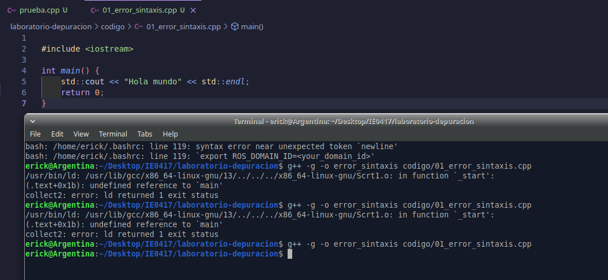
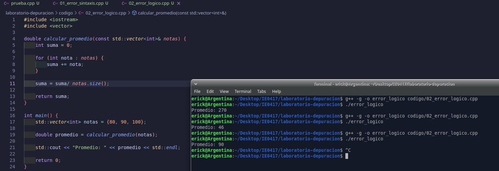

# Parte 2: Tipos de errores

## 2.1 Objetivo

Identificar distintos tipos de errores comunes en programas escritos en C++.

En esta parte se analiza un error de sintaxis. Este tipo de error normalmente es detectado antes de que el programa pueda ejecutarse, ya sea durante la compilación o durante la etapa de enlace del programa.

---

## 2.2 Ejercicio 1: Error de sintaxis

### Código original

El archivo trabajado fue:

```bash
codigo/01_error_sintaxis.cpp
```

El código original indicado en el enunciado era el siguiente:

```cpp
#include <iostream>

int main() {
    std::cout << "Hola mundo" << std::endl
    return 0;
}
```

Este programa tenía un error intencional, ya que faltaba el punto y coma `;` al final de la línea donde se imprime el mensaje `"Hola mundo"`.

---

## 2.3 Comando de compilación

Se intentó compilar el programa con el siguiente comando:

```bash
g++ -g -o error_sintaxis codigo/01_error_sintaxis.cpp
```

---

## 2.4 Resultado observado

Al intentar compilar el programa, se obtuvo el siguiente mensaje en la terminal:

```bash
erick@Argentina:~/Desktop/IE0417/laboratorio-depuracion$ g++ -g -o error_sintaxis codigo/01_error_sintaxis.cpp
/usr/bin/ld: /usr/lib/gcc/x86_64-linux-gnu/13/../../../x86_64-linux-gnu/Scrt1.o: in function `_start':
(.text+0x1b): undefined reference to `main'
collect2: error: ld returned 1 exit status

erick@Argentina:~/Desktop/IE0417/laboratorio-depuracion$ g++ -g -o error_sintaxis codigo/01_error_sintaxis.cpp
/usr/bin/ld: /usr/lib/gcc/x86_64-linux-gnu/13/../../../x86_64-linux-gnu/Scrt1.o: in function `_start':
(.text+0x1b): undefined reference to `main'
collect2: error: ld returned 1 exit status
```

El error principal mostrado fue:

```bash
undefined reference to `main'
```

Este mensaje indica que el enlazador no pudo encontrar correctamente la función principal del programa. En C++, todo programa ejecutable necesita una función `main`, ya que esta es el punto de inicio de ejecución.

Después de revisar el archivo y corregir el código, se volvió a compilar:

```bash
erick@Argentina:~/Desktop/IE0417/laboratorio-depuracion$ g++ -g -o error_sintaxis codigo/01_error_sintaxis.cpp
```

En este último intento ya no apareció ningún mensaje de error, lo que indica que el programa compiló correctamente.

---

## 2.5 Línea donde estaba el error

El problema estaba relacionado con la estructura básica del programa y con la línea donde se imprimía el mensaje en pantalla.

La línea del `std::cout` debía terminar con punto y coma:

```cpp
std::cout << "Hola mundo" << std::endl;
```

Además, se verificó que la función principal estuviera escrita correctamente como:

```cpp
int main() {
```

---

## 2.6 Causa del error

La causa del error fue una escritura incorrecta del código fuente. En el código del enunciado faltaba el punto y coma `;` después de `std::endl`.

En C++, el punto y coma se usa para terminar instrucciones. Si se omite, el compilador no puede interpretar correctamente dónde finaliza una instrucción.

También se revisó que la función principal estuviera definida correctamente como `main`, ya que el mensaje mostrado por la terminal indicaba que el enlazador no encontraba el punto de entrada del programa.

---

## 2.7 Código corregido

El código corregido fue el siguiente:

```cpp
#include <iostream>

int main() {
    std::cout << "Hola mundo" << std::endl;
    return 0;
}
```

---

## 2.8 Evidencia del código corregido

La siguiente imagen muestra el código corregido en el editor:



---

## 2.9 Compilación corregida

Después de corregir el código, se compiló nuevamente con:

```bash
g++ -g -o error_sintaxis codigo/01_error_sintaxis.cpp
```

Resultado obtenido:

```bash
erick@Argentina:~/Desktop/IE0417/laboratorio-depuracion$ g++ -g -o error_sintaxis codigo/01_error_sintaxis.cpp
```

Como no apareció ningún mensaje de error, la compilación fue exitosa.

---

## 2.10 Ejecución del programa corregido

Luego de compilar correctamente, el programa se puede ejecutar con:

```bash
./error_sintaxis
```

Resultado esperado:

```bash
Hola mundo
```

---

## 2.11 Herramienta usada para detectar el error

La herramienta usada fue `g++`.

En este caso, `g++` permitió detectar que el programa no podía generar correctamente el ejecutable. El error fue reportado durante el proceso de compilación y enlace.

---

## 2.12 Explicación del problema

Este error corresponde a un problema de sintaxis, porque el código no estaba escrito de acuerdo con las reglas del lenguaje C++.

Aunque el programa era muy pequeño, el error impedía generar correctamente el ejecutable. Esto demuestra que incluso un detalle pequeño, como olvidar un punto y coma o escribir incorrectamente la función principal, puede impedir que el programa compile.

---

## 2.13 Corrección realizada

La corrección consistió en agregar el punto y coma al final de la instrucción `std::cout` y verificar que la función principal estuviera correctamente escrita como `main`.

La línea corregida fue:

```cpp
std::cout << "Hola mundo" << std::endl;
```

---

## 2.14 Evidencia de que el programa corregido funciona

La compilación final no mostró errores:

```bash
erick@Argentina:~/Desktop/IE0417/laboratorio-depuracion$ g++ -g -o error_sintaxis codigo/01_error_sintaxis.cpp
```

Esto indica que el código corregido ya puede convertirse en un ejecutable.

Al ejecutar el programa, el resultado esperado es:

```bash
Hola mundo
```

---

## 2.15 Preguntas de reflexión

### 1. ¿Este error fue detectado antes o durante la ejecución?

Este error fue detectado antes de la ejecución, durante el proceso de compilación y enlace. El programa no llegó a ejecutarse porque primero era necesario corregir el código fuente.

---

### 2. ¿Qué herramienta detectó el error?

La herramienta que detectó el error fue `g++`.

En este caso, el compilador y el enlazador mostraron mensajes de error indicando que el programa no podía generar correctamente el ejecutable.

---

### 3. ¿Por qué este tipo de error suele ser más fácil de corregir que un error lógico?

Este tipo de error suele ser más fácil de corregir porque la herramienta de compilación indica que existe un problema antes de ejecutar el programa.

Además, los errores de sintaxis suelen estar relacionados con reglas claras del lenguaje, como puntos y coma faltantes, nombres mal escritos, paréntesis incompletos o llaves sin cerrar.

En cambio, un error lógico puede ser más difícil de encontrar porque el programa puede compilar y ejecutarse sin mostrar errores, pero producir un resultado incorrecto.

---

## 2.16 Reflexión breve

Este ejercicio permitió observar que los errores de sintaxis pueden impedir que un programa se compile o se enlace correctamente. Aunque el código era corto, un detalle pequeño provocó que no se pudiera generar el ejecutable.

También se comprobó la importancia de leer cuidadosamente los mensajes de la terminal. Estos mensajes ayudan a identificar qué parte del proceso falló y orientan la corrección del programa.


---

## 2.17 Ejercicio 2: Error lógico

### Código original

El archivo trabajado fue:

```bash
codigo/02_error_logico.cpp
```

El código original indicado en el enunciado era el siguiente:

```cpp
#include <iostream>
#include <vector>

double calcular_promedio(const std::vector<int>& notas) {
    int suma = 0;

    for (int nota : notas) {
        suma += nota;
    }

    return suma;
}

int main() {
    std::vector<int> notas = {80, 90, 100};

    double promedio = calcular_promedio(notas);

    std::cout << "Promedio: " << promedio << std::endl;

    return 0;
}
```

Este programa compila y se ejecuta, pero produce un resultado incorrecto. El problema está en la función `calcular_promedio`, ya que suma todas las notas, pero devuelve la suma total en lugar del promedio.

---

## 2.18 Comando de compilación

Se compiló el programa con el siguiente comando:

```bash
g++ -g -o error_logico codigo/02_error_logico.cpp
```

---

## 2.19 Comando de ejecución

El programa se ejecutó con:

```bash
./error_logico
```

---

## 2.20 Resultado obtenido originalmente

La primera ejecución del programa produjo el siguiente resultado:

```bash
erick@Argentina:~/Desktop/IE0417/laboratorio-depuracion$ g++ -g -o error_logico codigo/02_error_logico.cpp
erick@Argentina:~/Desktop/IE0417/laboratorio-depuracion$ ./error_logico
Promedio: 270
```

El resultado obtenido fue:

```bash
Promedio: 270
```

Este valor es incorrecto, porque `270` corresponde a la suma de las tres notas:

```text
80 + 90 + 100 = 270
```

Sin embargo, el programa debía calcular el promedio.

---

## 2.21 Resultado esperado

El promedio correcto se calcula dividiendo la suma de las notas entre la cantidad de notas:

```text
(80 + 90 + 100) / 3 = 90
```

Por lo tanto, el resultado esperado era:

```bash
Promedio: 90
```

---

## 2.22 Explicación del error

El error ocurre en la función `calcular_promedio`.

La función sumaba correctamente los valores del vector, pero al final devolvía únicamente la suma:

```cpp
return suma;
```

Esto es un error lógico porque el programa está escrito con sintaxis válida, compila correctamente y se ejecuta sin fallar. Sin embargo, el resultado no representa el promedio, sino la suma total de las notas.

El compilador no detecta este problema porque, desde el punto de vista del lenguaje C++, devolver `suma` es válido. El error está en la lógica usada para resolver el problema.

---

## 2.23 Proceso de corrección

Primero se identificó que el resultado `270` correspondía a la suma total de las notas. Luego se corrigió la función para que dividiera la suma entre la cantidad de elementos del vector.

Durante el proceso de prueba también se obtuvo un resultado intermedio incorrecto:

```bash
erick@Argentina:~/Desktop/IE0417/laboratorio-depuracion$ g++ -g -o error_logico codigo/02_error_logico.cpp
erick@Argentina:~/Desktop/IE0417/laboratorio-depuracion$ ./error_logico
Promedio: 46
```

Ese resultado indicó que todavía había un problema en la corrección realizada. Después de revisar nuevamente la función, se dejó la división correcta entre la suma acumulada y el tamaño del vector.

---

## 2.24 Código corregido

El código corregido fue el siguiente:

```cpp
#include <iostream>
#include <vector>

double calcular_promedio(const std::vector<int>& notas) {
    int suma = 0;

    for (int nota : notas) {
        suma += nota;
    }

    suma = suma / notas.size();

    return suma;
}

int main() {
    std::vector<int> notas = {80, 90, 100};

    double promedio = calcular_promedio(notas);

    std::cout << "Promedio: " << promedio << std::endl;

    return 0;
}
```

En esta corrección, la variable `suma` primero acumula las notas y luego se divide entre `notas.size()`, que representa la cantidad de elementos del vector.

---

## 2.25 Evidencia del código corregido

La siguiente imagen muestra el código corregido en el editor:



---

## 2.26 Resultado final

Después de corregir el programa, se volvió a compilar y ejecutar:

```bash
erick@Argentina:~/Desktop/IE0417/laboratorio-depuracion$ g++ -g -o error_logico codigo/02_error_logico.cpp
erick@Argentina:~/Desktop/IE0417/laboratorio-depuracion$ ./error_logico
Promedio: 90
```

El resultado final fue:

```bash
Promedio: 90
```

Este resultado coincide con el promedio esperado, por lo que la corrección fue exitosa.

---

## 2.27 Evidencia completa de terminal

A continuación se muestra la salida completa obtenida durante las pruebas del programa:

```bash
erick@Argentina:~/Desktop/IE0417/laboratorio-depuracion$ g++ -g -o error_logico codigo/02_error_logico.cpp
erick@Argentina:~/Desktop/IE0417/laboratorio-depuracion$ ./error_logico
Promedio: 270

erick@Argentina:~/Desktop/IE0417/laboratorio-depuracion$ g++ -g -o error_logico codigo/02_error_logico.cpp
erick@Argentina:~/Desktop/IE0417/laboratorio-depuracion$ ./error_logico
Promedio: 46

erick@Argentina:~/Desktop/IE0417/laboratorio-depuracion$ g++ -g -o error_logico codigo/02_error_logico.cpp
erick@Argentina:~/Desktop/IE0417/laboratorio-depuracion$ ./error_logico
Promedio: 90
```

---

## 2.28 Herramienta usada para depurar

En este ejercicio se usó principalmente la ejecución normal del programa y la comparación manual entre el resultado esperado y el resultado obtenido.

También se utilizó `g++` para compilar el programa después de cada modificación.

---

## 2.29 Corrección realizada

La corrección consistió en cambiar la lógica de la función `calcular_promedio`.

Antes, la función devolvía solamente la suma:

```cpp
return suma;
```

Después, se agregó la división entre la cantidad de notas:

```cpp
suma = suma / notas.size();
return suma;
```

Con este cambio, la función ya no devuelve la suma total, sino el promedio de las notas.

---

## 2.30 Preguntas de reflexión

### 1. ¿Por qué el compilador no detectó este error?

El compilador no detectó este error porque el código era válido desde el punto de vista de la sintaxis de C++. La función tenía una estructura correcta, las variables estaban declaradas y el tipo de retorno era compatible.

El problema no estaba en cómo estaba escrito el código, sino en la lógica usada para calcular el resultado.

---

### 2. ¿Por qué este error se considera lógico?

Este error se considera lógico porque el programa compila y se ejecuta, pero no produce el resultado correcto.

La intención del programa era calcular un promedio, pero la función devolvía la suma total de las notas. Por eso, el error está en el razonamiento o algoritmo usado, no en la sintaxis del lenguaje.

---

### 3. ¿Qué estrategia usó para encontrarlo?

La estrategia usada fue ejecutar el programa y comparar el resultado obtenido con el resultado esperado.

Primero se observó que el programa imprimía:

```bash
Promedio: 270
```

Luego se calculó manualmente el promedio:

```text
(80 + 90 + 100) / 3 = 90
```

Al comparar ambos resultados, se identificó que el programa estaba devolviendo la suma y no el promedio. Después se revisó la función `calcular_promedio` y se corrigió la operación faltante.

---

### 4. ¿Qué pruebas adicionales podría hacer?

Se podrían hacer pruebas adicionales con otros vectores de notas, por ejemplo:

```cpp
std::vector<int> notas = {100, 100, 100};
```

El promedio esperado sería:

```text
100
```

También se podría probar con notas diferentes:

```cpp
std::vector<int> notas = {70, 80, 90, 100};
```

El promedio esperado sería:

```text
85
```

Además, se podría probar un vector con un solo elemento para confirmar que el promedio sea el mismo valor:

```cpp
std::vector<int> notas = {75};
```

El resultado esperado sería:

```text
75
```

Estas pruebas ayudarían a verificar que la función funciona correctamente en más casos y no solamente con el ejemplo inicial.

---

## 2.31 Reflexión breve

Este ejercicio permitió observar que no todos los errores son detectados por el compilador. En este caso, el programa compilaba correctamente y se ejecutaba sin mostrar errores, pero el resultado era incorrecto.

El error fue encontrado comparando el resultado obtenido con el resultado esperado. Esto demuestra que, además de compilar y ejecutar un programa, es necesario validar que el resultado tenga sentido.

También se aprendió que los errores lógicos pueden ser más difíciles de detectar que los errores de sintaxis, porque no siempre generan mensajes de error. Para encontrarlos, es importante revisar el algoritmo, hacer pruebas y comparar contra resultados calculados manualmente.

En este caso, después de revisar el código, corregir la instrucción de salida y verificar la función `main`, el programa logró compilar correctamente.