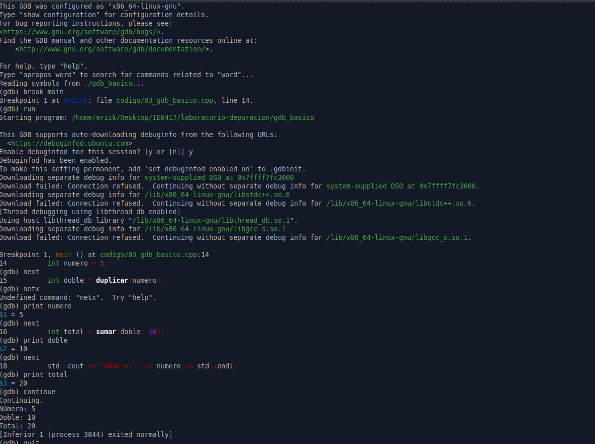

# Parte 3: Introducción a gdb

## 3.1 Objetivo

Usar `gdb` para ejecutar un programa paso a paso, detenerlo en una función e inspeccionar variables durante la ejecución.

En esta parte se trabajó con un programa sencillo en C++ que utiliza dos funciones: una para duplicar un número y otra para sumar dos valores. El objetivo fue observar cómo cambia el estado del programa usando comandos básicos de `gdb`.

---

## 3.2 Código base

El archivo trabajado fue:

```bash
codigo/03_gdb_basico.cpp
```

El código utilizado fue el siguiente:

```cpp
#include <iostream>

int duplicar(int x) {
    int resultado = x * 2;
    return resultado;
}

int sumar(int a, int b) {
    int resultado = a + b;
    return resultado;
}

int main() {
    int numero = 5;
    int doble = duplicar(numero);
    int total = sumar(doble, 10);

    std::cout << "Número: " << numero << std::endl;
    std::cout << "Doble: " << doble << std::endl;
    std::cout << "Total: " << total << std::endl;

    return 0;
}
```

---

## 3.3 Compilación del programa

El programa se compiló con símbolos de depuración usando la opción `-g`:

```bash
g++ -g -o gdb_basico codigo/03_gdb_basico.cpp
```

No se obtuvo ningún mensaje de error, por lo que la compilación fue exitosa.

---

## 3.4 Ejecución normal del programa

Antes de usar `gdb`, se ejecutó el programa normalmente:

```bash
./gdb_basico
```

Resultado obtenido:

```bash
Número: 5
Doble: 10
Total: 20
```

El programa funciona correctamente. Primero define el valor `numero = 5`, luego calcula el doble de ese número y finalmente suma `10` al resultado.

---

## 3.5 Ejecución con gdb

Después de verificar la ejecución normal del programa, se abrió el ejecutable con `gdb`:

```bash
gdb ./gdb_basico
```

Luego, dentro de `gdb`, se usaron varios comandos para detener el programa en `main`, avanzar línea por línea e inspeccionar variables.

---

## 3.6 Comandos utilizados en gdb

### Comando `break main`

Se usó el comando:

```gdb
break main
```

Resultado obtenido:

```gdb
Breakpoint 1 at 0x11cb: file codigo/03_gdb_basico.cpp, line 14.
```

Este comando crea un breakpoint al inicio de la función `main`. Esto significa que el programa se va a detener cuando llegue a esa función.

---

### Comando `run`

Se usó el comando:

```gdb
run
```

Resultado obtenido:

```gdb
Starting program: /home/erick/Desktop/IE0417/laboratorio-depuracion/gdb_basico
```

Luego el programa se detuvo en el breakpoint definido:

```gdb
Breakpoint 1, main () at codigo/03_gdb_basico.cpp:14
14	    int numero = 5;
```

El comando `run` inicia la ejecución del programa dentro de `gdb`.

---

### Comando `next`

Se usó el comando:

```gdb
next
```

Este comando permite avanzar a la siguiente línea del programa sin entrar dentro de las funciones llamadas en esa línea.

Por ejemplo, al avanzar desde la línea donde se define `numero`, `gdb` pasó a la siguiente instrucción:

```gdb
15	    int doble = duplicar(numero);
```

Después se volvió a usar `next` para avanzar a la siguiente instrucción:

```gdb
16	    int total = sumar(doble, 10);
```

---

### Error al escribir un comando

Durante la depuración se escribió accidentalmente:

```gdb
netx
```

Resultado obtenido:

```gdb
Undefined command: "netx".  Try "help".
```

Este mensaje indica que `gdb` no reconoce el comando porque fue escrito incorrectamente. El comando correcto era:

```gdb
next
```

Este error no afecta el programa, solamente muestra que `gdb` espera comandos válidos.

---

### Comando `print`

Se usó el comando `print` para inspeccionar el valor de las variables.

Primero se revisó el valor de `numero`:

```gdb
print numero
```

Resultado obtenido:

```gdb
$1 = 5
```

Luego se revisó el valor de `doble`:

```gdb
print doble
```

Resultado obtenido:

```gdb
$2 = 10
```

Después se revisó el valor de `total`:

```gdb
print total
```

Resultado obtenido:

```gdb
$3 = 20
```

El comando `print` permite ver el valor actual de una variable mientras el programa está detenido.

---

### Comando `continue`

Al finalizar la inspección de variables, se usó:

```gdb
continue
```

Resultado obtenido:

```gdb
Continuing.
Número: 5
Doble: 10
Total: 20
[Inferior 1 (process 3844) exited normally]
```

El comando `continue` reanuda la ejecución del programa hasta el siguiente breakpoint o hasta que el programa termine.

En este caso, el programa terminó normalmente.

---

### Comando `quit`

Finalmente, se salió de `gdb` con:

```gdb
quit
```

Después de esto, se regresó a la terminal normal.

---

## 3.7 Valores observados durante la depuración

Durante la ejecución paso a paso se observaron los siguientes valores:

| Variable | Valor observado | Explicación |
|---|---:|---|
| `numero` | 5 | Es el valor inicial definido en `main`. |
| `doble` | 10 | Es el resultado de llamar a `duplicar(numero)`, es decir, `5 * 2`. |
| `total` | 20 | Es el resultado de llamar a `sumar(doble, 10)`, es decir, `10 + 10`. |

Estos valores coinciden con la salida final del programa.

---

## 3.8 Evidencia de terminal

A continuación se muestra la salida completa obtenida durante la compilación, ejecución normal y depuración con `gdb`:

```bash
erick@Argentina:~/Desktop/IE0417/laboratorio-depuracion$ g++ -g -o gdb_basico codigo/03_gdb_basico.cpp
erick@Argentina:~/Desktop/IE0417/laboratorio-depuracion$ ./gdb_basico
Número: 5
Doble: 10
Total: 20
erick@Argentina:~/Desktop/IE0417/laboratorio-depuracion$ gdb ./gdb_basico
GNU gdb (Ubuntu 15.1-1ubuntu1~24.04.1) 15.1
Copyright (C) 2024 Free Software Foundation, Inc.
License GPLv3+: GNU GPL version 3 or later <http://gnu.org/licenses/gpl.html>
This is free software: you are free to change and redistribute it.
There is NO WARRANTY, to the extent permitted by law.
Type "show copying" and "show warranty" for details.
This GDB was configured as "x86_64-linux-gnu".
Type "show configuration" for configuration details.
For bug reporting instructions, please see:
<https://www.gnu.org/software/gdb/bugs/>.
Find the GDB manual and other documentation resources online at:
    <http://www.gnu.org/software/gdb/documentation/>.

For help, type "help".
Type "apropos word" to search for commands related to "word"...
Reading symbols from ./gdb_basico...
(gdb) break main
Breakpoint 1 at 0x11cb: file codigo/03_gdb_basico.cpp, line 14.
(gdb) run
Starting program: /home/erick/Desktop/IE0417/laboratorio-depuracion/gdb_basico 

This GDB supports auto-downloading debuginfo from the following URLs:
  <https://debuginfod.ubuntu.com>
Enable debuginfod for this session? (y or [n]) y
Debuginfod has been enabled.
To make this setting permanent, add 'set debuginfod enabled on' to .gdbinit.
Downloading separate debug info for system-supplied DSO at 0x7ffff7fc3000
Download failed: Connection refused.  Continuing without separate debug info for system-supplied DSO at 0x7ffff7fc3000.
Downloading separate debug info for /lib/x86_64-linux-gnu/libstdc++.so.6
Download failed: Connection refused.  Continuing without separate debug info for /lib/x86_64-linux-gnu/libstdc++.so.6.
[Thread debugging using libthread_db enabled]
Using host libthread_db library "/lib/x86_64-linux-gnu/libthread_db.so.1".
Downloading separate debug info for /lib/x86_64-linux-gnu/libgcc_s.so.1
Download failed: Connection refused.  Continuing without separate debug info for /lib/x86_64-linux-gnu/libgcc_s.so.1.

Breakpoint 1, main () at codigo/03_gdb_basico.cpp:14
14	    int numero = 5;
(gdb) next
15	    int doble = duplicar(numero);
(gdb) netx
Undefined command: "netx".  Try "help".
(gdb) print numero
$1 = 5
(gdb) next
16	    int total = sumar(doble, 10);
(gdb) print doble
$2 = 10
(gdb) next
18	    std::cout << "Número: " << numero << std::endl;
(gdb) print total
$3 = 20
(gdb) continue
Continuing.
Número: 5
Doble: 10
Total: 20
[Inferior 1 (process 3844) exited normally]
(gdb) quit
erick@Argentina:~/Desktop/IE0417/laboratorio-depuracion$
```

---

## 3.9 Evidencia en imagen

La siguiente imagen muestra la ejecución del programa y el uso de `gdb` en la terminal.



---

## 3.10 Explicación de la opción `-g`

La opción `-g` se usa al compilar para agregar símbolos de depuración al ejecutable.

Estos símbolos permiten que `gdb` pueda relacionar el archivo ejecutable con el código fuente original. Gracias a esto, durante la depuración se pueden ver líneas de código, nombres de funciones y nombres de variables.

Sin `-g`, el programa podría ejecutarse, pero `gdb` tendría menos información para mostrar y la depuración sería más difícil.

---

## 3.11 Explicación de los comandos utilizados

### ¿Qué hace `break main`?

El comando `break main` coloca un breakpoint al inicio de la función `main`.

Esto permite que el programa se detenga justo cuando empieza a ejecutar la función principal.

---

### ¿Qué hace `run`?

El comando `run` inicia la ejecución del programa dentro de `gdb`.

Si existe un breakpoint, el programa se detiene al llegar a ese punto.

---

### ¿Qué hace `next`?

El comando `next` ejecuta la línea actual y avanza a la siguiente línea del programa.

Si la línea actual llama a una función, `next` ejecuta esa función completa sin entrar a revisar sus instrucciones internas.

---

### ¿Qué hace `print`?

El comando `print` muestra el valor actual de una variable o expresión.

Por ejemplo:

```gdb
print numero
```

mostró:

```gdb
$1 = 5
```

---

## 3.12 Preguntas de reflexión

### 1. ¿Qué es un breakpoint?

Un breakpoint es un punto de interrupción que se coloca en una línea o función del programa.

Cuando el programa llega a ese punto durante la ejecución, se detiene temporalmente. Esto permite inspeccionar variables, revisar el flujo del programa y avanzar paso a paso.

---

### 2. ¿Qué diferencia hay entre ejecutar el programa normalmente y ejecutarlo dentro de `gdb`?

Al ejecutar el programa normalmente, este corre de inicio a fin sin detenerse, a menos que ocurra un error o finalice por sí mismo.

En cambio, al ejecutarlo dentro de `gdb`, se puede controlar su ejecución. Es posible detenerlo en puntos específicos, avanzar línea por línea, revisar variables y entender mejor qué está ocurriendo internamente.

---

### 3. ¿Qué ventaja tiene inspeccionar variables mientras el programa se ejecuta?

Inspeccionar variables durante la ejecución permite verificar si el programa está calculando los valores esperados en cada paso.

Esto ayuda a encontrar errores lógicos, porque se puede observar en qué momento una variable toma un valor incorrecto o inesperado.

---

### 4. ¿Por qué `next` no entra dentro de las funciones?

`next` no entra dentro de las funciones porque su propósito es avanzar a la siguiente línea del contexto actual.

Si la línea actual contiene una llamada a función, `next` ejecuta esa función completa y luego se detiene en la siguiente línea del mismo nivel. Para entrar dentro de una función se debe usar el comando `step`.

---

## 3.13 Reflexión breve

Esta parte permitió observar cómo `gdb` facilita el análisis de un programa mientras se ejecuta. Aunque el programa funcionaba correctamente, el uso de `gdb` permitió revisar el valor de las variables paso a paso y confirmar cómo se calculaban los resultados.

También se comprobó la utilidad de los breakpoints, ya que permiten detener el programa en una parte específica. Además, se entendió que `next` es útil cuando se quiere avanzar sin entrar en funciones, mientras que otros comandos como `step` serían necesarios para revisar el interior de una función.

Finalmente, esta práctica mostró que depurar no solo sirve cuando un programa falla, sino también para entender mejor cómo se ejecuta un programa y cómo cambian sus variables.