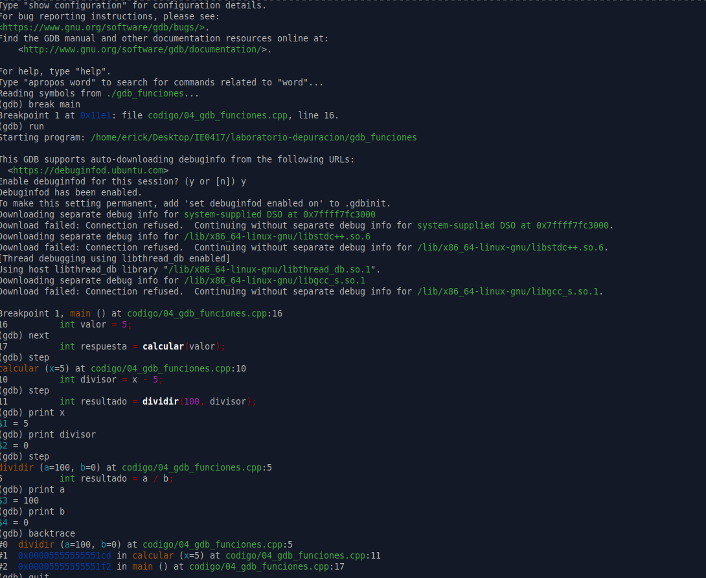

# Parte 4: step, next y backtrace

## 4.1 Objetivo

Comprender la diferencia entre avanzar línea por línea sin entrar en funciones y entrar dentro de funciones. Además, usar `backtrace` para revisar la pila de llamadas y encontrar la causa de un error de ejecución.

En esta parte se trabajó con un programa que contiene una división entre cero. El objetivo fue usar `gdb` para seguir la ejecución del programa, inspeccionar variables y observar cómo la pila de llamadas ayuda a encontrar el origen del problema.

---

## 4.2 Código base

El archivo trabajado fue:

```bash
codigo/04_gdb_funciones.cpp
```

El código base del ejercicio fue el siguiente:

```cpp
#include <iostream>

int dividir(int a, int b) {
    int resultado = a / b;
    return resultado;
}

int calcular(int x) {
    int divisor = x - 5;
    int resultado = dividir(100, divisor);
    return resultado;
}

int main() {
    int valor = 5;
    int respuesta = calcular(valor);

    std::cout << "Respuesta: " << respuesta << std::endl;

    return 0;
}
```

---

## 4.3 Compilación del programa

El programa se compiló con símbolos de depuración usando la opción `-g`:

```bash
g++ -g -o gdb_funciones codigo/04_gdb_funciones.cpp
```

La opción `-g` permite que `gdb` pueda mostrar información del código fuente, como líneas, variables y funciones.

---

## 4.4 Ejecución normal del programa

El programa se puede ejecutar normalmente con:

```bash
./gdb_funciones
```

El problema de este código es que intenta dividir entre cero. En la función `calcular`, se define:

```cpp
int divisor = x - 5;
```

Como en `main` se llama a la función con `valor = 5`, entonces:

```text
divisor = 5 - 5 = 0
```

Luego se llama a:

```cpp
dividir(100, divisor);
```

Esto equivale a:

```cpp
dividir(100, 0);
```

Por esa razón, el programa presenta un error de ejecución.

---

## 4.5 Ejecución con gdb

Se abrió el ejecutable con `gdb` usando el siguiente comando:

```bash
gdb ./gdb_funciones
```

Luego se colocó un breakpoint en la función `main`:

```gdb
break main
```

Resultado obtenido:

```gdb
Breakpoint 1 at 0x11e1: file codigo/04_gdb_funciones.cpp, line 16.
```

Después se inició la ejecución:

```gdb
run
```

El programa se detuvo en la línea 16:

```gdb
Breakpoint 1, main () at codigo/04_gdb_funciones.cpp:16
16	    int valor = 5;
```

---

## 4.6 Uso de `next` y `step`

Primero se usó:

```gdb
next
```

Resultado:

```gdb
17	    int respuesta = calcular(valor);
```

El comando `next` avanzó a la siguiente línea dentro de `main`, sin entrar en funciones.

Luego se usó:

```gdb
step
```

Resultado:

```gdb
calcular (x=5) at codigo/04_gdb_funciones.cpp:10
10	    int divisor = x - 5;
```

En este caso, `step` sí entró dentro de la función `calcular`.

Después se ejecutó otro `step`:

```gdb
step
```

Resultado:

```gdb
11	    int resultado = dividir(100, divisor);
```

Esto permitió avanzar dentro de la función y llegar a la línea donde se llama a `dividir`.

---

## 4.7 Inspección de variables

Dentro de la función `calcular`, se inspeccionó el valor de `x`:

```gdb
print x
```

Resultado:

```gdb
$1 = 5
```

Luego se inspeccionó el valor de `divisor`:

```gdb
print divisor
```

Resultado:

```gdb
$2 = 0
```

Este resultado fue importante porque mostró que el divisor tenía valor `0`.

Luego se usó `step` para entrar a la función `dividir`:

```gdb
step
```

Resultado:

```gdb
dividir (a=100, b=0) at codigo/04_gdb_funciones.cpp:5
5	    int resultado = a / b;
```

Dentro de la función `dividir`, se inspeccionaron los valores de `a` y `b`:

```gdb
print a
```

Resultado:

```gdb
$3 = 100
```

```gdb
print b
```

Resultado:

```gdb
$4 = 0
```

Con esto se confirmó que el programa intentaba ejecutar la operación:

```cpp
100 / 0
```

---

## 4.8 Uso de `backtrace`

Se utilizó el comando:

```gdb
backtrace
```

Resultado obtenido:

```gdb
#0  dividir (a=100, b=0) at codigo/04_gdb_funciones.cpp:5
#1  0x00005555555551cd in calcular (x=5) at codigo/04_gdb_funciones.cpp:11
#2  0x00005555555551f2 in main () at codigo/04_gdb_funciones.cpp:17
```

El `backtrace` muestra la pila de llamadas del programa. En este caso, se observa lo siguiente:

1. El programa estaba detenido en la función `dividir`, en la línea 5.
2. La función `dividir` fue llamada desde `calcular`, en la línea 11.
3. La función `calcular` fue llamada desde `main`, en la línea 17.

Esto permite entender el camino que siguió el programa hasta llegar al error.

---

## 4.9 Evidencia completa de terminal

A continuación se muestra la salida obtenida durante la sesión de `gdb`:

```bash
Free Software Foundation, Inc.
License GPLv3+: GNU GPL version 3 or later <http://gnu.org/licenses/gpl.html>
This is free software: you are free to change and redistribute it.
There is NO WARRANTY, to the extent permitted by law.
Type "show copying" and "show warranty" for details.
This GDB was configured as "x86_64-linux-gnu".
Type "show configuration" for configuration details.
For bug reporting instructions, please see:
<https://www.gnu.org/software/gdb/bugs/>.
Find the GDB manual and other documentation resources online at:
    <http://www.gnu.org/software/gdb/documentation/>.

For help, type "help".
Type "apropos word" to search for commands related to "word"...
Reading symbols from ./gdb_funciones...
(gdb) break main
Breakpoint 1 at 0x11e1: file codigo/04_gdb_funciones.cpp, line 16.
(gdb) run
Starting program: /home/erick/Desktop/IE0417/laboratorio-depuracion/gdb_funciones 

This GDB supports auto-downloading debuginfo from the following URLs:
  <https://debuginfod.ubuntu.com>
Enable debuginfod for this session? (y or [n]) y
Debuginfod has been enabled.
To make this setting permanent, add 'set debuginfod enabled on' to .gdbinit.
Downloading separate debug info for system-supplied DSO at 0x7ffff7fc3000
Download failed: Connection refused.  Continuing without separate debug info for system-supplied DSO at 0x7ffff7fc3000.
Downloading separate debug info for /lib/x86_64-linux-gnu/libstdc++.so.6
Download failed: Connection refused.  Continuing without separate debug info for /lib/x86_64-linux-gnu/libstdc++.so.6.
[Thread debugging using libthread_db enabled]
Using host libthread_db library "/lib/x86_64-linux-gnu/libthread_db.so.1".
Downloading separate debug info for /lib/x86_64-linux-gnu/libgcc_s.so.1
Download failed: Connection refused.  Continuing without separate debug info for /lib/x86_64-linux-gnu/libgcc_s.so.1.

Breakpoint 1, main () at codigo/04_gdb_funciones.cpp:16
16	    int valor = 5;
(gdb) next
17	    int respuesta = calcular(valor);
(gdb) step
calcular (x=5) at codigo/04_gdb_funciones.cpp:10
10	    int divisor = x - 5;
(gdb) step
11	    int resultado = dividir(100, divisor);
(gdb) print x
$1 = 5
(gdb) print divisor
$2 = 0
(gdb) step
dividir (a=100, b=0) at codigo/04_gdb_funciones.cpp:5
5	    int resultado = a / b;
(gdb) print a
$3 = 100
(gdb) print b
$4 = 0
(gdb) backtrace
#0  dividir (a=100, b=0) at codigo/04_gdb_funciones.cpp:5
#1  0x00005555555551cd in calcular (x=5) at codigo/04_gdb_funciones.cpp:11
#2  0x00005555555551f2 in main () at codigo/04_gdb_funciones.cpp:17
(gdb) quit
A debugging session is active.

	Inferior 1 [process 4030] will be killed.

Quit anyway? (y or n) y
erick@Argentina:~/Desktop/IE0417/laboratorio-depuracion$
```

---

## 4.10 Evidencia en imagen

La siguiente imagen muestra la sesión de depuración con `gdb`, donde se inspeccionaron las variables y se usó `backtrace`.



---

## 4.11 Error encontrado usando gdb

Usando `gdb`, se encontró que el error ocurre porque la variable `divisor` tiene valor `0`.

La secuencia fue la siguiente:

```text
valor = 5
x = 5
divisor = x - 5
divisor = 5 - 5
divisor = 0
```

Después, ese valor se pasa como segundo argumento a la función `dividir`:

```cpp
dividir(100, divisor);
```

Por eso, dentro de `dividir`, los valores fueron:

```text
a = 100
b = 0
```

La línea problemática fue:

```cpp
int resultado = a / b;
```

Esto genera una división entre cero.

---

## 4.12 Código corregido

Para evitar la división entre cero, se agregó una validación dentro de la función `dividir`.

El código corregido fue el siguiente:

```cpp
#include <iostream>

int dividir(int a, int b) {
    if (b == 0) {
        std::cout << "Error: no se puede dividir entre cero." << std::endl;
        return 0;
    }

    int resultado = a / b;
    return resultado;
}

int calcular(int x) {
    int divisor = x - 5;
    int resultado = dividir(100, divisor);
    return resultado;
}

int main() {
    int valor = 5;
    int respuesta = calcular(valor);

    std::cout << "Respuesta: " << respuesta << std::endl;

    return 0;
}
```

---

## 4.13 Compilación del código corregido

Después de corregir el programa, se compiló nuevamente:

```bash
g++ -g -o gdb_funciones codigo/04_gdb_funciones.cpp
```

---

## 4.14 Resultado final esperado

Al ejecutar el programa corregido:

```bash
./gdb_funciones
```

El resultado esperado es:

```bash
Error: no se puede dividir entre cero.
Respuesta: 0
```

Este resultado muestra que el programa ya no intenta realizar una división inválida. En su lugar, detecta el caso problemático, muestra un mensaje de error y retorna un valor controlado.

---

## 4.15 Diferencia entre `next` y `step`

La diferencia principal entre `next` y `step` está en cómo manejan las llamadas a funciones.

El comando `next` ejecuta la línea actual y avanza a la siguiente línea del mismo nivel. Si esa línea contiene una llamada a función, `next` ejecuta la función completa sin entrar en ella.

El comando `step`, en cambio, sí entra dentro de la función llamada. Por eso, cuando se usó `step` sobre la línea:

```cpp
int respuesta = calcular(valor);
```

`gdb` entró dentro de la función `calcular`.

Esta diferencia es útil porque a veces se quiere revisar el detalle de una función y otras veces solo se quiere avanzar sin entrar en ella.

---

## 4.16 Explicación de `backtrace`

El comando `backtrace` muestra la pila de llamadas del programa.

En este ejercicio, el resultado fue:

```gdb
#0  dividir (a=100, b=0) at codigo/04_gdb_funciones.cpp:5
#1  0x00005555555551cd in calcular (x=5) at codigo/04_gdb_funciones.cpp:11
#2  0x00005555555551f2 in main () at codigo/04_gdb_funciones.cpp:17
```

Esto permite ver que `main` llamó a `calcular`, y luego `calcular` llamó a `dividir`.

Gracias a esta información, fue más fácil entender cómo llegó el programa hasta la división entre cero.

---

## 4.17 Preguntas de reflexión

### 1. ¿Qué diferencia observó entre `next` y `step`?

La diferencia observada fue que `next` avanza a la siguiente línea sin entrar en las funciones llamadas, mientras que `step` sí entra dentro de la función.

En este ejercicio, `next` permitió avanzar dentro de `main`, pero `step` permitió entrar a la función `calcular` y luego a la función `dividir`.

---

### 2. ¿Para qué sirve `backtrace`?

`backtrace` sirve para ver la pila de llamadas del programa.

Esto permite conocer qué funciones fueron llamadas antes de llegar al punto actual de ejecución. Es útil para entender el recorrido del programa y encontrar desde dónde se originó un error.

---

### 3. ¿Cuál fue la causa del error?

La causa del error fue una división entre cero.

La variable `valor` tenía el valor `5`. Al llamar a `calcular(valor)`, se ejecutó:

```cpp
int divisor = x - 5;
```

Como `x` era `5`, el resultado fue:

```text
divisor = 0
```

Luego el programa intentó dividir:

```cpp
100 / 0
```

Esto produce un error de ejecución.

---

### 4. ¿Por qué este error es de tiempo de ejecución?

Este error es de tiempo de ejecución porque el código compila correctamente, pero falla cuando el programa se está ejecutando.

El compilador no puede saber siempre qué valores tendrán las variables durante la ejecución. En este caso, el problema aparece cuando `b` toma el valor `0` dentro de la función `dividir`.

---

### 5. ¿Cómo podría prevenirse este tipo de error desde el diseño del programa?

Este tipo de error puede prevenirse validando los datos antes de realizar operaciones peligrosas.

En este caso, antes de dividir, se debe revisar si el divisor es cero:

```cpp
if (b == 0) {
    std::cout << "Error: no se puede dividir entre cero." << std::endl;
    return 0;
}
```

También se podría diseñar la función para devolver un valor especial, lanzar una excepción o evitar que se llamen funciones con argumentos inválidos.

---

## 4.18 Reflexión breve

Esta parte permitió entender mejor cómo `gdb` ayuda a encontrar errores de ejecución. Aunque el programa compilaba correctamente, tenía un problema que solo aparecía al ejecutarse: una división entre cero.

El uso de `step` permitió entrar en las funciones y revisar cómo se calculaba el divisor. Además, `print` permitió confirmar los valores de las variables, y `backtrace` mostró la secuencia de llamadas que llevó hasta el error.

Este ejercicio demuestra que la depuración no consiste solo en ver dónde falla el programa, sino en entender cómo llegó a ese punto. También muestra la importancia de validar condiciones críticas, como evitar divisiones entre cero.