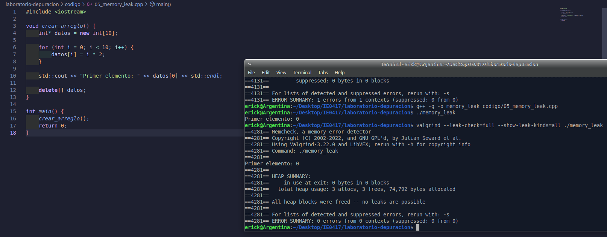
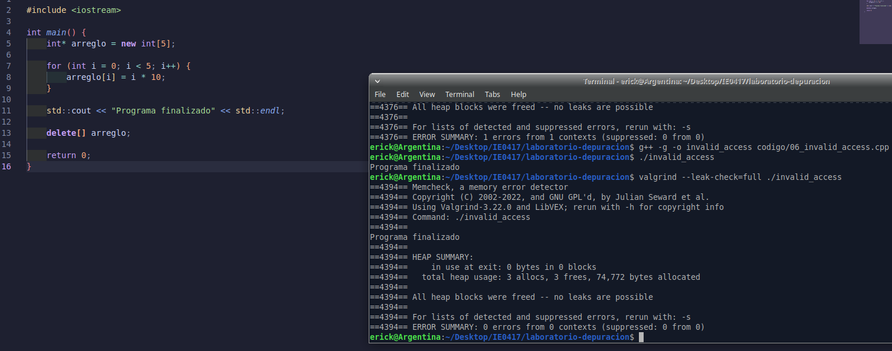

# Parte 5: Análisis de memoria con valgrind

## 5.1 Objetivo

Usar `valgrind` para detectar pérdidas de memoria y errores relacionados con el manejo de memoria dinámica en programas escritos en C++.

En esta parte se analizó un programa que reserva memoria dinámica usando `new[]`, pero inicialmente no libera esa memoria. Para encontrar el problema se utilizó `valgrind`, específicamente la herramienta Memcheck.

---

## 5.2 Ejercicio 1: Pérdida de memoria

### Código original

El archivo trabajado fue:

```bash
codigo/05_memory_leak.cpp
```

El código original del programa era el siguiente:

```cpp
#include <iostream>

void crear_arreglo() {
    int* datos = new int[10];

    for (int i = 0; i < 10; i++) {
        datos[i] = i * 2;
    }

    std::cout << "Primer elemento: " << datos[0] << std::endl;
}

int main() {
    crear_arreglo();
    return 0;
}
```

Este programa crea un arreglo dinámico de 10 enteros usando `new int[10]`. Luego llena el arreglo con valores y muestra el primer elemento.

El problema es que la memoria reservada dinámicamente no se libera antes de que termine la función `crear_arreglo`.

---

## 5.3 Compilación del programa

El programa se compiló con símbolos de depuración usando la opción `-g`:

```bash
g++ -g -o memory_leak codigo/05_memory_leak.cpp
```

La compilación fue exitosa, ya que no se obtuvo ningún mensaje de error.

---

## 5.4 Ejecución normal del programa

El programa se ejecutó normalmente con:

```bash
./memory_leak
```

Resultado obtenido:

```bash
Primer elemento: 0
```

A simple vista, el programa parece funcionar correctamente porque imprime el valor esperado. Sin embargo, esto no significa que el programa esté libre de errores de memoria.

---

## 5.5 Análisis con valgrind

Luego se analizó el programa con `valgrind` usando el siguiente comando:

```bash
valgrind --leak-check=yes ./memory_leak
```

Resultado obtenido:

```bash
==4130== Memcheck, a memory error detector
==4130== Copyright (C) 2002-2022, and GNU GPL'd, by Julian Seward et al.
==4130== Using Valgrind-3.22.0 and LibVEX; rerun with -h for copyright info
==4130== Command: ./memory_leak
==4130== 
Primer elemento: 0
==4130== 
==4130== HEAP SUMMARY:
==4130==     in use at exit: 40 bytes in 1 blocks
==4130==   total heap usage: 3 allocs, 2 frees, 74,792 bytes allocated
==4130== 
==4130== 40 bytes in 1 blocks are definitely lost in loss record 1 of 1
==4130==    at 0x48485C3: operator new[](unsigned long) (in /usr/libexec/valgrind/vgpreload_memcheck-amd64-linux.so)
==4130==    by 0x1091BE: crear_arreglo() (05_memory_leak.cpp:5)
==4130==    by 0x10923E: main (05_memory_leak.cpp:15)
==4130== 
==4130== LEAK SUMMARY:
==4130==    definitely lost: 40 bytes in 1 blocks
==4130==    indirectly lost: 0 bytes in 0 blocks
==4130==      possibly lost: 0 bytes in 0 blocks
==4130==    still reachable: 0 bytes in 0 blocks
==4130==         suppressed: 0 bytes in 0 blocks
==4130== 
==4130== For lists of detected and suppressed errors, rerun with: -s
==4130== ERROR SUMMARY: 1 errors from 1 contexts (suppressed: 0 from 0)
```

También se usó una versión más detallada del análisis:

```bash
valgrind --leak-check=full --show-leak-kinds=all ./memory_leak
```

Resultado obtenido:

```bash
==4131== Memcheck, a memory error detector
==4131== Copyright (C) 2002-2022, and GNU GPL'd, by Julian Seward et al.
==4131== Using Valgrind-3.22.0 and LibVEX; rerun with -h for copyright info
==4131== Command: ./memory_leak
==4131== 
Primer elemento: 0
==4131== 
==4131== HEAP SUMMARY:
==4131==     in use at exit: 40 bytes in 1 blocks
==4131==   total heap usage: 3 allocs, 2 frees, 74,792 bytes allocated
==4131== 
==4131== 40 bytes in 1 blocks are definitely lost in loss record 1 of 1
==4131==    at 0x48485C3: operator new[](unsigned long) (in /usr/libexec/valgrind/vgpreload_memcheck-amd64-linux.so)
==4131==    by 0x1091BE: crear_arreglo() (05_memory_leak.cpp:5)
==4131==    by 0x10923E: main (05_memory_leak.cpp:15)
==4131== 
==4131== LEAK SUMMARY:
==4131==    definitely lost: 40 bytes in 1 blocks
==4131==    indirectly lost: 0 bytes in 0 blocks
==4131==      possibly lost: 0 bytes in 0 blocks
==4131==    still reachable: 0 bytes in 0 blocks
==4131==         suppressed: 0 bytes in 0 blocks
==4131== 
==4131== For lists of detected and suppressed errors, rerun with: -s
==4131== ERROR SUMMARY: 1 errors from 1 contexts (suppressed: 0 from 0)
```

---

## 5.6 Error reportado por valgrind

El mensaje más importante del reporte fue:

```bash
40 bytes in 1 blocks are definitely lost in loss record 1 of 1
```

También se observó:

```bash
definitely lost: 40 bytes in 1 blocks
```

Esto significa que el programa reservó memoria dinámica, pero perdió la referencia a esa memoria sin liberarla.

En este caso, el arreglo fue creado en la línea 5:

```cpp
int* datos = new int[10];
```

Como cada `int` ocupa 4 bytes, el arreglo de 10 enteros ocupa:

```text
10 * 4 bytes = 40 bytes
```

Por eso `valgrind` reportó una pérdida de 40 bytes.

---

## 5.7 ¿Qué significa `definitely lost`?

`definitely lost` significa que el programa reservó memoria en el heap, pero al finalizar ya no existe ninguna referencia válida para acceder a esa memoria y liberarla.

En otras palabras, la memoria quedó perdida porque el programa nunca ejecutó una instrucción para liberarla.

Este tipo de problema se conoce como pérdida de memoria o `memory leak`.

---

## 5.8 Explicación del problema

El problema ocurre porque el programa usa memoria dinámica con:

```cpp
int* datos = new int[10];
```

Cuando se usa `new[]`, la memoria queda reservada en el heap y debe liberarse manualmente cuando ya no se necesita.

En el código original, la función termina después de imprimir el primer elemento, pero nunca libera el arreglo. Al finalizar la función `crear_arreglo`, la variable local `datos` desaparece, pero la memoria reservada sigue ocupada.

Por eso `valgrind` detecta que hay memoria perdida al terminar el programa.

---

## 5.9 Corrección realizada

La corrección consistió en liberar la memoria dinámica antes de salir de la función `crear_arreglo`.

Como el arreglo fue reservado con `new[]`, se debe liberar con:

```cpp
delete[] datos;
```

El `delete[]` debe colocarse después de utilizar el arreglo y antes de que termine la función.

---

## 5.10 Código corregido

El código corregido fue el siguiente:

```cpp
#include <iostream>

void crear_arreglo() {
    int* datos = new int[10];

    for (int i = 0; i < 10; i++) {
        datos[i] = i * 2;
    }

    std::cout << "Primer elemento: " << datos[0] << std::endl;

    delete[] datos;
}

int main() {
    crear_arreglo();
    return 0;
}
```

---

## 5.11 Evidencia del código corregido

La siguiente imagen muestra el código corregido en el editor:



---

## 5.12 Compilación después de corregir

Después de corregir el programa, se compiló nuevamente:

```bash
g++ -g -o memory_leak codigo/05_memory_leak.cpp
```

Luego se ejecutó:

```bash
./memory_leak
```

Resultado obtenido:

```bash
Primer elemento: 0
```

El programa sigue funcionando igual desde el punto de vista del usuario, pero ahora libera correctamente la memoria dinámica.

---

## 5.13 Análisis con valgrind después de corregir

Después de agregar `delete[] datos;`, se volvió a ejecutar `valgrind`:

```bash
valgrind --leak-check=full --show-leak-kinds=all ./memory_leak
```

Resultado obtenido:

```bash
==4281== Memcheck, a memory error detector
==4281== Copyright (C) 2002-2022, and GNU GPL'd, by Julian Seward et al.
==4281== Using Valgrind-3.22.0 and LibVEX; rerun with -h for copyright info
==4281== Command: ./memory_leak
==4281== 
Primer elemento: 0
==4281== 
==4281== HEAP SUMMARY:
==4281==     in use at exit: 0 bytes in 0 blocks
==4281==   total heap usage: 3 allocs, 3 frees, 74,792 bytes allocated
==4281== 
==4281== All heap blocks were freed -- no leaks are possible
==4281== 
==4281== For lists of detected and suppressed errors, rerun with: -s
==4281== ERROR SUMMARY: 0 errors from 0 contexts (suppressed: 0 from 0)
```

El mensaje más importante fue:

```bash
All heap blocks were freed -- no leaks are possible
```

También se observó:

```bash
ERROR SUMMARY: 0 errors from 0 contexts
```

Esto confirma que la pérdida de memoria fue corregida.

---

## 5.14 Evidencia completa de terminal

A continuación se muestra la salida completa obtenida durante la compilación, ejecución, análisis con `valgrind`, corrección y verificación final:

```bash
erick@Argentina:~/Desktop/IE0417/laboratorio-depuracion$ g++ -g -o memory_leak codigo/05_memory_leak.cpp
erick@Argentina:~/Desktop/IE0417/laboratorio-depuracion$ ./memory_leak
Primer elemento: 0
erick@Argentina:~/Desktop/IE0417/laboratorio-depuracion$ valgrind --leak-check=yes ./memory_leak
==4130== Memcheck, a memory error detector
==4130== Copyright (C) 2002-2022, and GNU GPL'd, by Julian Seward et al.
==4130== Using Valgrind-3.22.0 and LibVEX; rerun with -h for copyright info
==4130== Command: ./memory_leak
==4130== 
Primer elemento: 0
==4130== 
==4130== HEAP SUMMARY:
==4130==     in use at exit: 40 bytes in 1 blocks
==4130==   total heap usage: 3 allocs, 2 frees, 74,792 bytes allocated
==4130== 
==4130== 40 bytes in 1 blocks are definitely lost in loss record 1 of 1
==4130==    at 0x48485C3: operator new[](unsigned long) (in /usr/libexec/valgrind/vgpreload_memcheck-amd64-linux.so)
==4130==    by 0x1091BE: crear_arreglo() (05_memory_leak.cpp:5)
==4130==    by 0x10923E: main (05_memory_leak.cpp:15)
==4130== 
==4130== LEAK SUMMARY:
==4130==    definitely lost: 40 bytes in 1 blocks
==4130==    indirectly lost: 0 bytes in 0 blocks
==4130==      possibly lost: 0 bytes in 0 blocks
==4130==    still reachable: 0 bytes in 0 blocks
==4130==         suppressed: 0 bytes in 0 blocks
==4130== 
==4130== For lists of detected and suppressed errors, rerun with: -s
==4130== ERROR SUMMARY: 1 errors from 1 contexts (suppressed: 0 from 0)
erick@Argentina:~/Desktop/IE0417/laboratorio-depuracion$ valgrind --leak-check=full --show-leak-kinds=all ./memory_leak
==4131== Memcheck, a memory error detector
==4131== Copyright (C) 2002-2022, and GNU GPL'd, by Julian Seward et al.
==4131== Using Valgrind-3.22.0 and LibVEX; rerun with -h for copyright info
==4131== Command: ./memory_leak
==4131== 
Primer elemento: 0
==4131== 
==4131== HEAP SUMMARY:
==4131==     in use at exit: 40 bytes in 1 blocks
==4131==   total heap usage: 3 allocs, 2 frees, 74,792 bytes allocated
==4131== 
==4131== 40 bytes in 1 blocks are definitely lost in loss record 1 of 1
==4131==    at 0x48485C3: operator new[](unsigned long) (in /usr/libexec/valgrind/vgpreload_memcheck-amd64-linux.so)
==4131==    by 0x1091BE: crear_arreglo() (05_memory_leak.cpp:5)
==4131==    by 0x10923E: main (05_memory_leak.cpp:15)
==4131== 
==4131== LEAK SUMMARY:
==4131==    definitely lost: 40 bytes in 1 blocks
==4131==    indirectly lost: 0 bytes in 0 blocks
==4131==      possibly lost: 0 bytes in 0 blocks
==4131==    still reachable: 0 bytes in 0 blocks
==4131==         suppressed: 0 bytes in 0 blocks
==4131== 
==4131== For lists of detected and suppressed errors, rerun with: -s
==4131== ERROR SUMMARY: 1 errors from 1 contexts (suppressed: 0 from 0)
erick@Argentina:~/Desktop/IE0417/laboratorio-depuracion$ g++ -g -o memory_leak codigo/05_memory_leak.cpp
erick@Argentina:~/Desktop/IE0417/laboratorio-depuracion$ ./memory_leak
Primer elemento: 0
erick@Argentina:~/Desktop/IE0417/laboratorio-depuracion$ valgrind --leak-check=full --show-leak-kinds=all ./memory_leak
==4281== Memcheck, a memory error detector
==4281== Copyright (C) 2002-2022, and GNU GPL'd, by Julian Seward et al.
==4281== Using Valgrind-3.22.0 and LibVEX; rerun with -h for copyright info
==4281== Command: ./memory_leak
==4281== 
Primer elemento: 0
==4281== 
==4281== HEAP SUMMARY:
==4281==     in use at exit: 0 bytes in 0 blocks
==4281==   total heap usage: 3 allocs, 3 frees, 74,792 bytes allocated
==4281== 
==4281== All heap blocks were freed -- no leaks are possible
==4281== 
==4281== For lists of detected and suppressed errors, rerun with: -s
==4281== ERROR SUMMARY: 0 errors from 0 contexts (suppressed: 0 from 0)
erick@Argentina:~/Desktop/IE0417/laboratorio-depuracion$
```

---

## 5.15 Preguntas de reflexión

### 1. ¿Qué es una pérdida de memoria?

Una pérdida de memoria ocurre cuando un programa reserva memoria dinámica, pero no la libera cuando ya no la necesita.

En C++, esto puede pasar cuando se usa `new` o `new[]` y no se usa luego `delete` o `delete[]`.

---

### 2. ¿Por qué el programa puede terminar aparentemente bien aunque tenga una pérdida de memoria?

El programa puede terminar aparentemente bien porque la pérdida de memoria no siempre causa un fallo inmediato.

En este caso, el programa imprimió correctamente:

```bash
Primer elemento: 0
```

Sin embargo, internamente dejó memoria sin liberar. En programas pequeños esto puede no notarse, pero en programas grandes o de larga duración puede causar consumo excesivo de memoria.

---

### 3. ¿Qué significa liberar memoria dinámica?

Liberar memoria dinámica significa devolver al sistema la memoria que fue reservada durante la ejecución del programa.

Si la memoria se reservó con `new`, se debe liberar con `delete`. Si se reservó con `new[]`, se debe liberar con `delete[]`.

---

### 4. ¿Por qué se usa `delete[]` y no solo `delete`?

Se usa `delete[]` porque la memoria fue reservada como un arreglo con:

```cpp
new int[10]
```

Cuando se reserva un arreglo dinámico, se debe liberar usando `delete[]`.

Usar solo `delete` en un arreglo reservado con `new[]` es incorrecto, porque no corresponde con la forma en que se reservó la memoria.

---

### 5. ¿Qué tipo de problemas podrían aparecer en programas grandes si no se libera memoria?

En programas grandes, no liberar memoria puede provocar que el programa consuma cada vez más recursos.

Esto puede causar lentitud, agotamiento de memoria disponible o incluso que el sistema operativo cierre el programa. También dificulta el mantenimiento del código, porque los errores de memoria suelen ser difíciles de detectar si no se usan herramientas como `valgrind`.

---

## 5.16 Reflexión breve

Este ejercicio permitió comprobar que un programa puede ejecutarse correctamente desde el punto de vista del usuario, pero aun así tener errores internos de memoria.

Al ejecutar el programa normalmente, solo se observó el mensaje:

```bash
Primer elemento: 0
```

Sin embargo, al usar `valgrind`, se detectó que había 40 bytes de memoria definitivamente perdidos. Esto mostró la importancia de usar herramientas de análisis de memoria, especialmente en C++.

Después de agregar `delete[] datos;`, `valgrind` confirmó que todos los bloques de memoria fueron liberados correctamente y que no había errores. Esto demuestra que liberar la memoria dinámica es una parte fundamental al trabajar con punteros y arreglos dinámicos.


---

## 5.17 Ejercicio 2: Acceso fuera de límites

### Código original

El archivo trabajado fue:

```bash
codigo/06_invalid_access.cpp
```

El código original del programa era el siguiente:

```cpp
#include <iostream>

int main() {
    int* arreglo = new int[5];

    for (int i = 0; i <= 5; i++) {
        arreglo[i] = i * 10;
    }

    std::cout << "Programa finalizado" << std::endl;

    delete[] arreglo;

    return 0;
}
```

Este programa reserva memoria dinámica para un arreglo de 5 enteros. Sin embargo, el ciclo `for` intenta escribir en una posición fuera del arreglo.

---

## 5.18 Compilación del programa

El programa se compiló con el siguiente comando:

```bash
g++ -g -o invalid_access codigo/06_invalid_access.cpp
```

La compilación fue exitosa, ya que no se obtuvo ningún mensaje de error.

---

## 5.19 Ejecución normal del programa

El programa se ejecutó normalmente con:

```bash
./invalid_access
```

Resultado obtenido:

```bash
Programa finalizado
```

A simple vista, el programa parece ejecutarse correctamente porque imprime el mensaje final y no se detiene con un error visible. Sin embargo, esto no significa que el programa esté correcto.

---

## 5.20 Análisis con valgrind

Luego se analizó el programa con `valgrind` usando el siguiente comando:

```bash
valgrind --leak-check=full ./invalid_access
```

Resultado obtenido:

```bash
==4351== Memcheck, a memory error detector
==4351== Copyright (C) 2002-2022, and GNU GPL'd, by Julian Seward et al.
==4351== Using Valgrind-3.22.0 and LibVEX; rerun with -h for copyright info
==4351== Command: ./invalid_access
==4351== 
==4351== Invalid write of size 4
==4351==    at 0x1091ED: main (06_invalid_access.cpp:8)
==4351==  Address 0x4e2b094 is 0 bytes after a block of size 20 alloc'd
==4351==    at 0x48485C3: operator new[](unsigned long) (in /usr/libexec/valgrind/vgpreload_memcheck-amd64-linux.so)
==4351==    by 0x1091BE: main (06_invalid_access.cpp:5)
==4351== 
Programa finalizado
==4351== 
==4351== HEAP SUMMARY:
==4351==     in use at exit: 0 bytes in 0 blocks
==4351==   total heap usage: 3 allocs, 3 frees, 74,772 bytes allocated
==4351== 
==4351== All heap blocks were freed -- no leaks are possible
==4351== 
==4351== For lists of detected and suppressed errors, rerun with: -s
==4351== ERROR SUMMARY: 1 errors from 1 contexts (suppressed: 0 from 0)
```

El mensaje más importante fue:

```bash
Invalid write of size 4
```

Esto indica que el programa escribió en una dirección de memoria que no correspondía al espacio reservado para el arreglo.

---

## 5.21 Línea donde ocurre el problema

`valgrind` indicó que el problema ocurre en la línea 8 del archivo:

```bash
at 0x1091ED: main (06_invalid_access.cpp:8)
```

La línea problemática corresponde al acceso al arreglo dentro del ciclo:

```cpp
arreglo[i] = i * 10;
```

El problema no está exactamente en la asignación, sino en el valor que puede tomar `i` debido a la condición del ciclo:

```cpp
for (int i = 0; i <= 5; i++)
```

---

## 5.22 Explicación del error

El arreglo fue reservado con 5 posiciones:

```cpp
int* arreglo = new int[5];
```

En C++, los índices válidos para este arreglo son:

```text
0, 1, 2, 3, 4
```

Sin embargo, el ciclo original usa la condición:

```cpp
i <= 5
```

Esto hace que el ciclo se ejecute también cuando `i` vale `5`.

Cuando `i = 5`, el programa intenta acceder a:

```cpp
arreglo[5]
```

Esa posición no existe dentro del arreglo, porque el último índice válido es `4`.

Por eso `valgrind` reportó:

```bash
Invalid write of size 4
```

Además, el reporte indica:

```bash
Address 0x4e2b094 is 0 bytes after a block of size 20 alloc'd
```

Esto significa que el programa escribió justo después del bloque de memoria reservado. Como el arreglo tiene 5 enteros y cada entero ocupa 4 bytes, el bloque reservado tiene:

```text
5 * 4 bytes = 20 bytes
```

---

## 5.23 ¿Qué significa `Invalid write`?

`Invalid write` significa que el programa intentó escribir en una posición de memoria que no le pertenecía.

En este caso, el programa escribió fuera de los límites del arreglo dinámico. Aunque el programa no falló al ejecutarse normalmente, el comportamiento es incorrecto y puede causar errores difíciles de encontrar.

---

## 5.24 Corrección realizada

La corrección consistió en quitar el signo igual de la condición del ciclo.

Código original:

```cpp
for (int i = 0; i <= 5; i++) {
    arreglo[i] = i * 10;
}
```

Código corregido:

```cpp
for (int i = 0; i < 5; i++) {
    arreglo[i] = i * 10;
}
```

Con esta corrección, el ciclo solo recorre los índices válidos del arreglo:

```text
0, 1, 2, 3, 4
```

---

## 5.25 Código corregido

El código corregido fue el siguiente:

```cpp
#include <iostream>

int main() {
    int* arreglo = new int[5];

    for (int i = 0; i < 5; i++) {
        arreglo[i] = i * 10;
    }

    std::cout << "Programa finalizado" << std::endl;

    delete[] arreglo;

    return 0;
}
```

---

## 5.26 Evidencia del código corregido

La siguiente imagen muestra el código corregido en el editor:



---

## 5.27 Resultado después de corregir

Después de corregir el ciclo, el programa se compiló nuevamente:

```bash
g++ -g -o invalid_access codigo/06_invalid_access.cpp
```

Luego se ejecutó:

```bash
./invalid_access
```

Resultado obtenido:

```bash
Programa finalizado
```

Después se volvió a analizar con `valgrind`:

```bash
valgrind --leak-check=full ./invalid_access
```

Resultado obtenido:

```bash
==4394== Memcheck, a memory error detector
==4394== Copyright (C) 2002-2022, and GNU GPL'd, by Julian Seward et al.
==4394== Using Valgrind-3.22.0 and LibVEX; rerun with -h for copyright info
==4394== Command: ./invalid_access
==4394== 
Programa finalizado
==4394== 
==4394== HEAP SUMMARY:
==4394==     in use at exit: 0 bytes in 0 blocks
==4394==   total heap usage: 3 allocs, 3 frees, 74,772 bytes allocated
==4394== 
==4394== All heap blocks were freed -- no leaks are possible
==4394== 
==4394== For lists of detected and suppressed errors, rerun with: -s
==4394== ERROR SUMMARY: 0 errors from 0 contexts (suppressed: 0 from 0)
```

El mensaje más importante fue:

```bash
ERROR SUMMARY: 0 errors from 0 contexts
```

Esto confirma que el acceso inválido fue corregido.

---

## 5.28 Evidencia completa de terminal

A continuación se muestra la salida obtenida durante la compilación, ejecución, análisis con `valgrind`, corrección y verificación final:

```bash
erick@Argentina:~/Desktop/IE0417/laboratorio-depuracion$ g++ -g -o invalid_access codigo/06_invalid_access.cpp
erick@Argentina:~/Desktop/IE0417/laboratorio-depuracion$ ./invalid_access
Programa finalizado
erick@Argentina:~/Desktop/IE0417/laboratorio-depuracion$ valgrind --leak-check=full ./invalid_access
==4351== Memcheck, a memory error detector
==4351== Copyright (C) 2002-2022, and GNU GPL'd, by Julian Seward et al.
==4351== Using Valgrind-3.22.0 and LibVEX; rerun with -h for copyright info
==4351== Command: ./invalid_access
==4351== 
==4351== Invalid write of size 4
==4351==    at 0x1091ED: main (06_invalid_access.cpp:8)
==4351==  Address 0x4e2b094 is 0 bytes after a block of size 20 alloc'd
==4351==    at 0x48485C3: operator new[](unsigned long) (in /usr/libexec/valgrind/vgpreload_memcheck-amd64-linux.so)
==4351==    by 0x1091BE: main (06_invalid_access.cpp:5)
==4351== 
Programa finalizado
==4351== 
==4351== HEAP SUMMARY:
==4351==     in use at exit: 0 bytes in 0 blocks
==4351==   total heap usage: 3 allocs, 3 frees, 74,772 bytes allocated
==4351== 
==4351== All heap blocks were freed -- no leaks are possible
==4351== 
==4351== For lists of detected and suppressed errors, rerun with: -s
==4351== ERROR SUMMARY: 1 errors from 1 contexts (suppressed: 0 from 0)

erick@Argentina:~/Desktop/IE0417/laboratorio-depuracion$ g++ -g -o invalid_access codigo/06_invalid_access.cpp
erick@Argentina:~/Desktop/IE0417/laboratorio-depuracion$ ./invalid_access
Programa finalizado
erick@Argentina:~/Desktop/IE0417/laboratorio-depuracion$ valgrind --leak-check=full ./invalid_access
==4376== Memcheck, a memory error detector
==4376== Copyright (C) 2002-2022, and GNU GPL'd, by Julian Seward et al.
==4376== Using Valgrind-3.22.0 and LibVEX; rerun with -h for copyright info
==4376== Command: ./invalid_access
==4376== 
==4376== Invalid write of size 4
==4376==    at 0x1091ED: main (06_invalid_access.cpp:8)
==4376==  Address 0x4e2b094 is 0 bytes after a block of size 20 alloc'd
==4376==    at 0x48485C3: operator new[](unsigned long) (in /usr/libexec/valgrind/vgpreload_memcheck-amd64-linux.so)
==4376==    by 0x1091BE: main (06_invalid_access.cpp:5)
==4376== 
Programa finalizado
==4376== 
==4376== HEAP SUMMARY:
==4376==     in use at exit: 0 bytes in 0 blocks
==4376==   total heap usage: 3 allocs, 3 frees, 74,772 bytes allocated
==4376== 
==4376== All heap blocks were freed -- no leaks are possible
==4376== 
==4376== For lists of detected and suppressed errors, rerun with: -s
==4376== ERROR SUMMARY: 1 errors from 1 contexts (suppressed: 0 from 0)

erick@Argentina:~/Desktop/IE0417/laboratorio-depuracion$ g++ -g -o invalid_access codigo/06_invalid_access.cpp
erick@Argentina:~/Desktop/IE0417/laboratorio-depuracion$ ./invalid_access
Programa finalizado
erick@Argentina:~/Desktop/IE0417/laboratorio-depuracion$ valgrind --leak-check=full ./invalid_access
==4394== Memcheck, a memory error detector
==4394== Copyright (C) 2002-2022, and GNU GPL'd, by Julian Seward et al.
==4394== Using Valgrind-3.22.0 and LibVEX; rerun with -h for copyright info
==4394== Command: ./invalid_access
==4394== 
Programa finalizado
==4394== 
==4394== HEAP SUMMARY:
==4394==     in use at exit: 0 bytes in 0 blocks
==4394==   total heap usage: 3 allocs, 3 frees, 74,772 bytes allocated
==4394== 
==4394== All heap blocks were freed -- no leaks are possible
==4394== 
==4394== For lists of detected and suppressed errors, rerun with: -s
==4394== ERROR SUMMARY: 0 errors from 0 contexts (suppressed: 0 from 0)
```

---

## 5.29 Preguntas de reflexión

### 1. ¿Por qué el programa podría no fallar aunque acceda fuera del arreglo?

El programa podría no fallar porque acceder fuera del arreglo produce comportamiento indefinido. Esto significa que el resultado no está garantizado.

A veces el programa puede terminar normalmente, como ocurrió en este caso. Sin embargo, eso no significa que el acceso sea correcto. El programa puede estar escribiendo en una zona de memoria cercana sin que el sistema lo detenga inmediatamente.

---

### 2. ¿Qué significa escribir fuera de los límites de un arreglo?

Significa acceder a una posición que no pertenece al arreglo.

Por ejemplo, si se reserva un arreglo de 5 elementos:

```cpp
int* arreglo = new int[5];
```

Los índices válidos son:

```text
0, 1, 2, 3, 4
```

Escribir en `arreglo[5]` está fuera de los límites, porque esa posición no fue reservada para el arreglo.

---

### 3. ¿Por qué este tipo de error es peligroso?

Este error es peligroso porque puede modificar memoria que pertenece a otra parte del programa.

Esto puede causar resultados incorrectos, fallos intermitentes o errores difíciles de reproducir. Además, el programa puede parecer funcionar bien, aunque internamente esté escribiendo en memoria inválida.

---

### 4. ¿Qué diferencia hay entre un error visible y un comportamiento indefinido?

Un error visible es un problema que se manifiesta claramente, por ejemplo, cuando el programa se detiene, muestra un mensaje de error o produce una salida evidentemente incorrecta.

El comportamiento indefinido ocurre cuando el programa hace algo que el lenguaje no garantiza. Puede parecer funcionar, puede fallar inmediatamente o puede fallar después. En este ejercicio, el programa imprimió `Programa finalizado`, pero `valgrind` mostró que había un acceso inválido.

---

## 5.30 Reflexión breve

Este ejercicio permitió comprobar que no todos los errores de memoria producen fallos visibles. El programa se ejecutó normalmente y mostró el mensaje esperado, pero `valgrind` detectó que se estaba escribiendo fuera de los límites del arreglo.

El error estaba en la condición del ciclo `for`, ya que usaba `i <= 5` en lugar de `i < 5`. Al quitar el signo igual, el ciclo dejó de acceder a la posición inválida `arreglo[5]`.

Después de corregir el código, `valgrind` mostró `ERROR SUMMARY: 0 errors from 0 contexts`, lo cual confirmó que el problema fue corregido. Este ejercicio demuestra la importancia de usar herramientas de análisis de memoria, porque algunos errores no se detectan con una ejecución normal del programa.