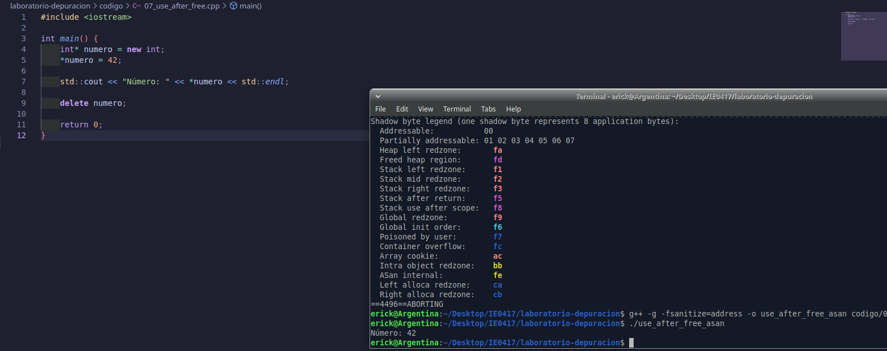

# Parte 6: AddressSanitizer

## 6.1 Objetivo

Usar AddressSanitizer para detectar errores de memoria durante la ejecución de un programa en C++.

En esta parte se analizó un programa que reserva memoria dinámica, libera esa memoria y luego intenta usarla nuevamente. Este tipo de error se conoce como `use-after-free`.

---

## 6.2 Código base

El archivo trabajado fue:

```bash
codigo/07_use_after_free.cpp
```

El código original del programa era el siguiente:

```cpp
#include <iostream>

int main() {
    int* numero = new int;
    *numero = 42;

    delete numero;

    std::cout << "Número: " << *numero << std::endl;

    return 0;
}
```

El programa reserva memoria dinámica para un entero, guarda el valor `42`, libera la memoria con `delete` y después intenta imprimir el valor usando el mismo puntero.

---

## 6.3 Compilación normal del programa

Primero se compiló el programa sin AddressSanitizer:

```bash
g++ -g -o use_after_free codigo/07_use_after_free.cpp
```

La compilación fue exitosa, ya que no se obtuvo ningún mensaje de error.

---

## 6.4 Ejecución sin sanitizer

El programa se ejecutó normalmente con:

```bash
./use_after_free
```

Resultado obtenido:

```bash
Número: 115098467
```

Este resultado es incorrecto. Se esperaba imprimir el valor `42`, pero se imprimió un número aparentemente aleatorio.

Esto ocurre porque el programa está usando memoria que ya fue liberada. Aunque el programa no falló inmediatamente, el valor mostrado no es confiable.

---

## 6.5 Compilación con AddressSanitizer

Luego se compiló el programa usando AddressSanitizer:

```bash
g++ -g -fsanitize=address -o use_after_free_asan codigo/07_use_after_free.cpp
```

La opción `-fsanitize=address` activa AddressSanitizer, una herramienta que detecta errores de memoria durante la ejecución del programa.

---

## 6.6 Ejecución con AddressSanitizer

Después de compilar con AddressSanitizer, se ejecutó:

```bash
./use_after_free_asan
```

Resultado obtenido:

```bash
=================================================================
==4496==ERROR: AddressSanitizer: heap-use-after-free on address 0x502000000010 at pc 0x5724ea77034e bp 0x7ffcf3d8d740 sp 0x7ffcf3d8d730
READ of size 4 at 0x502000000010 thread T0
    #0 0x5724ea77034d in main codigo/07_use_after_free.cpp:10
    #1 0x7dbe8d22a1c9 in __libc_start_call_main ../sysdeps/nptl/libc_start_call_main.h:58
    #2 0x7dbe8d22a28a in __libc_start_main_impl ../csu/libc-start.c:360
    #3 0x5724ea7701c4 in _start (/home/erick/Desktop/IE0417/laboratorio-depuracion/use_after_free_asan+0x11c4)

0x502000000010 is located 0 bytes inside of 4-byte region [0x502000000010,0x502000000014)
freed by thread T0 here:
    #0 0x7dbe8daff5e8 in operator delete(void*, unsigned long) ../../../../src/libsanitizer/asan/asan_new_delete.cpp:164
    #1 0x5724ea7702f9 in main codigo/07_use_after_free.cpp:8
    #2 0x7dbe8d22a1c9 in __libc_start_call_main ../sysdeps/nptl/libc_start_call_main.h:58
    #3 0x7dbe8d22a28a in __libc_start_main_impl ../csu/libc-start.c:360
    #4 0x5724ea7701c4 in _start (/home/erick/Desktop/IE0417/laboratorio-depuracion/use_after_free_asan+0x11c4)

previously allocated by thread T0 here:
    #0 0x7dbe8dafe548 in operator new(unsigned long) ../../../../src/libsanitizer/asan/asan_new_delete.cpp:95
    #1 0x5724ea77029e in main codigo/07_use_after_free.cpp:5
    #2 0x7dbe8d22a1c9 in __libc_start_call_main ../sysdeps/nptl/libc_start_call_main.h:58
    #3 0x7dbe8d22a28a in __libc_start_main_impl ../csu/libc-start.c:360
    #4 0x5724ea7701c4 in _start (/home/erick/Desktop/IE0417/laboratorio-depuracion/use_after_free_asan+0x11c4)

SUMMARY: AddressSanitizer: heap-use-after-free codigo/07_use_after_free.cpp:10 in main
==4496==ABORTING
```

El mensaje principal fue:

```bash
ERROR: AddressSanitizer: heap-use-after-free
```

Esto confirma que el programa intentó usar memoria del heap después de haberla liberado.

---

## 6.7 Error reportado por AddressSanitizer

AddressSanitizer reportó el siguiente error:

```bash
heap-use-after-free
```

Este error significa que el programa intentó acceder a una región de memoria que ya había sido liberada con `delete`.

El reporte también indica que el acceso incorrecto ocurrió en la línea 10:

```bash
SUMMARY: AddressSanitizer: heap-use-after-free codigo/07_use_after_free.cpp:10 in main
```

La línea problemática era:

```cpp
std::cout << "Número: " << *numero << std::endl;
```

---

## 6.8 Línea donde se liberó la memoria

AddressSanitizer también indicó que la memoria fue liberada en la línea 8:

```bash
freed by thread T0 here:
    #1 0x5724ea7702f9 in main codigo/07_use_after_free.cpp:8
```

La línea correspondiente era:

```cpp
delete numero;
```

Esto muestra que el programa liberó la memoria antes de imprimir el valor almacenado.

---

## 6.9 Línea donde se reservó la memoria

El reporte también muestra que la memoria fue reservada inicialmente en la línea 5:

```bash
previously allocated by thread T0 here:
    #1 0x5724ea77029e in main codigo/07_use_after_free.cpp:5
```

La línea correspondiente era:

```cpp
int* numero = new int;
```

Por lo tanto, AddressSanitizer permitió ver tres puntos importantes:

```text
1. Dónde se reservó la memoria.
2. Dónde se liberó la memoria.
3. Dónde se intentó usar después de liberarla.
```

---

## 6.10 Explicación del problema

El problema ocurre porque el programa libera la memoria antes de terminar de usarla.

Primero se reserva memoria dinámica:

```cpp
int* numero = new int;
```

Luego se guarda el valor `42`:

```cpp
*numero = 42;
```

Después se libera la memoria:

```cpp
delete numero;
```

Pero luego se intenta acceder nuevamente a esa memoria:

```cpp
std::cout << "Número: " << *numero << std::endl;
```

Una vez que se ejecuta `delete`, el puntero ya no debe usarse para leer o escribir datos. Aunque el puntero todavía contiene una dirección, esa dirección ya no pertenece de forma válida al programa.

---

## 6.11 Corrección realizada

La corrección consistió en mover el `delete` después de usar el valor de `numero`.

Código original incorrecto:

```cpp
delete numero;

std::cout << "Número: " << *numero << std::endl;
```

Código corregido:

```cpp
std::cout << "Número: " << *numero << std::endl;

delete numero;
```

De esta manera, el programa primero utiliza el valor almacenado y luego libera la memoria dinámica.

---

## 6.12 Código corregido

El código corregido fue el siguiente:

```cpp
#include <iostream>

int main() {
    int* numero = new int;
    *numero = 42;

    std::cout << "Número: " << *numero << std::endl;

    delete numero;

    return 0;
}
```

---

## 6.13 Evidencia del código corregido

La siguiente imagen muestra el código corregido en el editor:



---

## 6.14 Verificación después de corregir

Después de corregir el programa, se compiló nuevamente con AddressSanitizer:

```bash
g++ -g -fsanitize=address -o use_after_free_asan codigo/07_use_after_free.cpp
```

Luego se ejecutó:

```bash
./use_after_free_asan
```

Resultado obtenido:

```bash
Número: 42
```

El programa ya no reportó errores de AddressSanitizer y mostró el valor correcto.

---

## 6.15 Evidencia completa de terminal

A continuación se muestra la salida obtenida durante la compilación, ejecución, análisis con AddressSanitizer, corrección y verificación final:

```bash
erick@Argentina:~/Desktop/IE0417/laboratorio-depuracion$ g++ -g -o use_after_free codigo/07_use_after_free.cpp
erick@Argentina:~/Desktop/IE0417/laboratorio-depuracion$ ./use_after_free
Número: 115098467

erick@Argentina:~/Desktop/IE0417/laboratorio-depuracion$ g++ -g -fsanitize=address -o use_after_free_asan codigo/07_use_after_free.cpp
erick@Argentina:~/Desktop/IE0417/laboratorio-depuracion$ ./use_after_free_asan
=================================================================
==4496==ERROR: AddressSanitizer: heap-use-after-free on address 0x502000000010 at pc 0x5724ea77034e bp 0x7ffcf3d8d740 sp 0x7ffcf3d8d730
READ of size 4 at 0x502000000010 thread T0
    #0 0x5724ea77034d in main codigo/07_use_after_free.cpp:10
    #1 0x7dbe8d22a1c9 in __libc_start_call_main ../sysdeps/nptl/libc_start_call_main.h:58
    #2 0x7dbe8d22a28a in __libc_start_main_impl ../csu/libc-start.c:360
    #3 0x5724ea7701c4 in _start (/home/erick/Desktop/IE0417/laboratorio-depuracion/use_after_free_asan+0x11c4)

0x502000000010 is located 0 bytes inside of 4-byte region [0x502000000010,0x502000000014)
freed by thread T0 here:
    #0 0x7dbe8daff5e8 in operator delete(void*, unsigned long) ../../../../src/libsanitizer/asan/asan_new_delete.cpp:164
    #1 0x5724ea7702f9 in main codigo/07_use_after_free.cpp:8
    #2 0x7dbe8d22a1c9 in __libc_start_call_main ../sysdeps/nptl/libc_start_call_main.h:58
    #3 0x7dbe8d22a28a in __libc_start_main_impl ../csu/libc-start.c:360
    #4 0x5724ea7701c4 in _start (/home/erick/Desktop/IE0417/laboratorio-depuracion/use_after_free_asan+0x11c4)

previously allocated by thread T0 here:
    #0 0x7dbe8dafe548 in operator new(unsigned long) ../../../../src/libsanitizer/asan/asan_new_delete.cpp:95
    #1 0x5724ea77029e in main codigo/07_use_after_free.cpp:5
    #2 0x7dbe8d22a1c9 in __libc_start_call_main ../sysdeps/nptl/libc_start_call_main.h:58
    #3 0x7dbe8d22a28a in __libc_start_main_impl ../csu/libc-start.c:360
    #4 0x5724ea7701c4 in _start (/home/erick/Desktop/IE0417/laboratorio-depuracion/use_after_free_asan+0x11c4)

SUMMARY: AddressSanitizer: heap-use-after-free codigo/07_use_after_free.cpp:10 in main
Shadow bytes around the buggy address:
  0x501ffffffd80: 00 00 00 00 00 00 00 00 00 00 00 00 00 00 00 00
  0x501ffffffe00: 00 00 00 00 00 00 00 00 00 00 00 00 00 00 00 00
  0x501ffffffe80: 00 00 00 00 00 00 00 00 00 00 00 00 00 00 00 00
  0x501fffffff00: 00 00 00 00 00 00 00 00 00 00 00 00 00 00 00 00
  0x501fffffff80: 00 00 00 00 00 00 00 00 00 00 00 00 00 00 00 00
=>0x502000000000: fa fa[fd]fa fa fa fa fa fa fa fa fa fa fa fa fa
  0x502000000080: fa fa fa fa fa fa fa fa fa fa fa fa fa fa fa fa
  0x502000000100: fa fa fa fa fa fa fa fa fa fa fa fa fa fa fa fa
  0x502000000180: fa fa fa fa fa fa fa fa fa fa fa fa fa fa fa fa
  0x502000000200: fa fa fa fa fa fa fa fa fa fa fa fa fa fa fa fa
  0x502000000280: fa fa fa fa fa fa fa fa fa fa fa fa fa fa fa fa
Shadow byte legend (one shadow byte represents 8 application bytes):
  Addressable:           00
  Partially addressable: 01 02 03 04 05 06 07
  Heap left redzone:       fa
  Freed heap region:       fd
  Stack left redzone:      f1
  Stack mid redzone:       f2
  Stack right redzone:     f3
  Stack after return:      f5
  Stack use after scope:   f8
  Global redzone:          f9
  Global init order:       f6
  Poisoned by user:        f7
  Container overflow:      fc
  Array cookie:            ac
  Intra object redzone:    bb
  ASan internal:           fe
  Left alloca redzone:     ca
  Right alloca redzone:    cb
==4496==ABORTING

erick@Argentina:~/Desktop/IE0417/laboratorio-depuracion$ g++ -g -fsanitize=address -o use_after_free_asan codigo/07_use_after_free.cpp
erick@Argentina:~/Desktop/IE0417/laboratorio-depuracion$ ./use_after_free_asan
Número: 42
```

---

## 6.16 Preguntas de reflexión

### 1. ¿Qué significa usar memoria después de liberarla?

Usar memoria después de liberarla significa acceder a una región de memoria que ya fue devuelta al sistema mediante `delete` o `delete[]`.

En este caso, el programa liberaba la memoria con:

```cpp
delete numero;
```

y luego intentaba leer el valor con:

```cpp
*numero
```

Ese acceso ya no es válido.

---

### 2. ¿Por qué este error puede ser difícil de detectar sin herramientas?

Este error puede ser difícil de detectar porque el programa no siempre falla. En la ejecución normal, el programa imprimió:

```bash
Número: 115098467
```

Aunque ese valor era incorrecto, el programa terminó sin detenerse. Esto puede hacer que el error pase desapercibido si no se revisa con una herramienta especializada.

---

### 3. ¿Qué ventaja tiene AddressSanitizer sobre ejecutar el programa normalmente?

AddressSanitizer detecta el acceso inválido a memoria y muestra información detallada sobre el problema.

En este caso, indicó que había un `heap-use-after-free`, mostró la línea donde ocurrió el acceso incorrecto, la línea donde se liberó la memoria y la línea donde se había reservado originalmente.

Esto permite encontrar el error mucho más rápido que solo observando la salida normal del programa.

---

### 4. ¿Qué diferencia observó entre el reporte de `valgrind` y el reporte de AddressSanitizer?

En este ejercicio se usó AddressSanitizer, que mostró el error directamente al ejecutar el programa instrumentado con `-fsanitize=address`.

Comparado con `valgrind`, AddressSanitizer suele mostrar reportes muy directos durante la ejecución y detiene el programa cuando encuentra el error. Además, indica claramente el tipo de problema, como `heap-use-after-free`.

`valgrind` también es útil para errores de memoria, pero normalmente se ejecuta como una herramienta externa sobre el programa ya compilado. AddressSanitizer, en cambio, se activa desde la compilación.

---

### 5. ¿Por qué es buena práctica asignar `nullptr` después de liberar un puntero?

Asignar `nullptr` después de liberar un puntero es buena práctica porque evita que el puntero siga apuntando a una dirección de memoria que ya no es válida.

Por ejemplo:

```cpp
delete numero;
numero = nullptr;
```

De esta forma, si por error se intenta usar el puntero después, es más fácil identificar que ya no apunta a un objeto válido.

En el código corregido de este ejercicio, la solución principal fue mover el `delete` después de usar el valor. También podría asignarse `nullptr` después de liberar la memoria como una medida adicional de seguridad.

---

## 6.17 Reflexión breve

Este ejercicio permitió observar que un programa puede compilar y ejecutarse, pero aun así tener errores graves de memoria.

Al ejecutar el programa sin sanitizer, se imprimió un valor incorrecto en lugar de `42`. Esto ocurrió porque el programa intentaba usar memoria después de haberla liberado.

AddressSanitizer permitió identificar claramente el problema mediante el mensaje `heap-use-after-free`. Además, mostró la línea donde se usó la memoria liberada, la línea donde se ejecutó `delete` y la línea donde se reservó la memoria.

La corrección consistió en mover el `delete` después de imprimir el valor. Después de este cambio, el programa mostró correctamente:

```bash
Número: 42
```

y no se reportaron errores de AddressSanitizer.