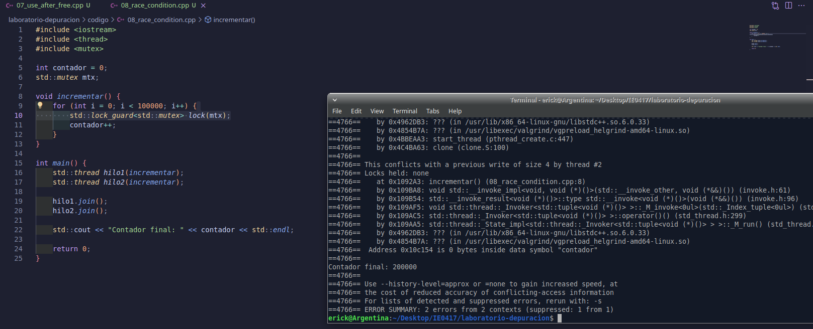

# Parte 7: Análisis de hilos y condiciones de carrera

## 7.1 Objetivo

Identificar una condición de carrera en un programa multihilo usando herramientas de análisis como ThreadSanitizer y Helgrind.

En esta parte se trabajó con un programa que crea dos hilos. Ambos hilos ejecutan la misma función e incrementan una variable global llamada `contador`. El objetivo fue observar que, al compartir una variable entre hilos sin sincronización, el resultado puede ser incorrecto o no determinista.

---

## 7.2 Código base con condición de carrera

El archivo trabajado fue:

```bash
codigo/08_race_condition.cpp
```

El código original fue el siguiente:

```cpp
#include <iostream>
#include <thread>

int contador = 0;

void incrementar() {
    for (int i = 0; i < 100000; i++) {
        contador++;
    }
}

int main() {
    std::thread hilo1(incrementar);
    std::thread hilo2(incrementar);

    hilo1.join();
    hilo2.join();

    std::cout << "Contador final: " << contador << std::endl;

    return 0;
}
```

Este programa tiene una condición de carrera porque los dos hilos modifican la variable global `contador` al mismo tiempo, sin usar ningún mecanismo de sincronización.

---

## 7.3 Compilación del programa original

El programa original se compiló con soporte para hilos usando la opción `-pthread`:

```bash
g++ -g -pthread -o race_condition codigo/08_race_condition.cpp
```

La compilación fue exitosa, ya que no se obtuvo ningún mensaje de error.

---

## 7.4 Ejecución del programa original

El programa se ejecutó varias veces:

```bash
./race_condition
./race_condition
./race_condition
```

Resultados obtenidos:

```bash
Contador final: 200000
Contador final: 145439
Contador final: 200000
```

El resultado esperado era:

```bash
Contador final: 200000
```

Esto se debe a que cada hilo incrementa el contador 100000 veces. Como hay dos hilos, el valor final correcto debería ser:

```text
100000 + 100000 = 200000
```

Sin embargo, en una de las ejecuciones se obtuvo:

```bash
Contador final: 145439
```

Esto demuestra que el programa no siempre produce el mismo resultado.

---

## 7.5 Explicación del resultado incorrecto

El resultado incorrecto ocurre porque la operación:

```cpp
contador++;
```

parece una sola operación, pero internamente no lo es. En realidad, implica varios pasos:

```text
1. Leer el valor actual de contador.
2. Sumar 1.
3. Escribir el nuevo valor en memoria.
```

Cuando dos hilos hacen esto al mismo tiempo, puede ocurrir que ambos lean el mismo valor antes de que alguno escriba el resultado actualizado. Por eso algunos incrementos se pierden.

Por ejemplo, si ambos hilos leen `contador = 10`, ambos calculan `11` y ambos escriben `11`. En lugar de aumentar dos veces, el contador solo aumenta una vez.

---

## 7.6 Análisis con ThreadSanitizer

Se compiló el programa con ThreadSanitizer usando:

```bash
g++ -g -fsanitize=thread -pthread -o race_condition_tsan codigo/08_race_condition.cpp
```

Luego se ejecutó:

```bash
./race_condition_tsan
```

En una primera ejecución se obtuvo:

```bash
Segmentation fault (core dumped)
```

Después se volvió a compilar y ejecutar:

```bash
g++ -g -fsanitize=thread -pthread -o race_condition_tsan codigo/08_race_condition.cpp
./race_condition_tsan
```

Resultado obtenido:

```bash
Contador final: 200000
```

En este caso, ThreadSanitizer no mostró un reporte claro en la terminal. Sin embargo, el comportamiento observado en la ejecución normal ya mostraba que existía un problema, porque el valor del contador no siempre fue consistente.

Por esta razón, también se utilizó Helgrind para analizar el programa.

---

## 7.7 Análisis con Helgrind

Se ejecutó Helgrind con el siguiente comando:

```bash
valgrind --tool=helgrind ./race_condition
```

Helgrind reportó una posible condición de carrera:

```bash
Possible data race during read of size 4 at 0x10C154 by thread #3
Locks held: none
    at 0x10929A: incrementar() (08_race_condition.cpp:8)
```

También reportó una escritura conflictiva desde otro hilo:

```bash
This conflicts with a previous write of size 4 by thread #2
Locks held: none
    at 0x1092A3: incrementar() (08_race_condition.cpp:8)
```

Además, Helgrind indicó que la dirección corresponde a la variable `contador`:

```bash
Address 0x10c154 is 0 bytes inside data symbol "contador"
```

El resumen final fue:

```bash
ERROR SUMMARY: 2 errors from 2 contexts
```

Esto confirma que el problema está relacionado con accesos simultáneos a la variable compartida `contador`.

---

## 7.8 Evidencia completa de terminal del programa original

```bash
erick@Argentina:~/Desktop/IE0417/laboratorio-depuracion$ g++ -g -pthread -o race_condition codigo/08_race_condition.cpp
erick@Argentina:~/Desktop/IE0417/laboratorio-depuracion$ ./race_condition
Contador final: 200000
erick@Argentina:~/Desktop/IE0417/laboratorio-depuracion$ ./race_condition
Contador final: 145439
erick@Argentina:~/Desktop/IE0417/laboratorio-depuracion$ ./race_condition
Contador final: 200000
erick@Argentina:~/Desktop/IE0417/laboratorio-depuracion$ g++ -g -fsanitize=thread -pthread -o race_condition_tsan codigo/08_race_condition.cpp
erick@Argentina:~/Desktop/IE0417/laboratorio-depuracion$ ./race_condition_tsan
Segmentation fault (core dumped)
erick@Argentina:~/Desktop/IE0417/laboratorio-depuracion$ valgrind --tool=helgrind ./race_condition
==4732== Helgrind, a thread error detector
==4732== Copyright (C) 2007-2017, and GNU GPL'd, by OpenWorks LLP et al.
==4732== Using Valgrind-3.22.0 and LibVEX; rerun with -h for copyright info
==4732== Command: ./race_condition
==4732== 
==4732== Possible data race during read of size 4 at 0x10C154 by thread #3
==4732== Locks held: none
==4732==    at 0x10929A: incrementar() (08_race_condition.cpp:8)
==4732== 
==4732== This conflicts with a previous write of size 4 by thread #2
==4732== Locks held: none
==4732==    at 0x1092A3: incrementar() (08_race_condition.cpp:8)
==4732==  Address 0x10c154 is 0 bytes inside data symbol "contador"
==4732== 
==4732== Possible data race during write of size 4 at 0x10C154 by thread #3
==4732== Locks held: none
==4732==    at 0x1092A3: incrementar() (08_race_condition.cpp:8)
==4732== 
==4732== This conflicts with a previous write of size 4 by thread #2
==4732== Locks held: none
==4732==    at 0x1092A3: incrementar() (08_race_condition.cpp:8)
==4732==  Address 0x10c154 is 0 bytes inside data symbol "contador"
==4732== 
Contador final: 200000
==4732== 
==4732== ERROR SUMMARY: 2 errors from 2 contexts (suppressed: 2 from 2)
```

---

## 7.9 Evidencia en imagen

La siguiente imagen muestra la ejecución del programa y el análisis con herramientas de hilos.



---

## 7.10 ¿Qué es una condición de carrera?

Una condición de carrera ocurre cuando dos o más hilos acceden al mismo recurso compartido al mismo tiempo, y al menos uno de esos accesos modifica el recurso.

En este caso, los dos hilos acceden a la variable global:

```cpp
int contador = 0;
```

y ambos la modifican dentro de la función:

```cpp
contador++;
```

Como no existe un mecanismo de protección, el orden en que ocurren las operaciones depende de la planificación del sistema operativo. Por eso el resultado puede variar entre ejecuciones.

---

## 7.11 Corrección usando std::mutex

Para corregir la condición de carrera, se utilizó `std::mutex`.

Un `mutex` permite proteger una sección crítica del programa. En este caso, la sección crítica es el incremento de la variable compartida `contador`.

El archivo corregido fue:

```bash
codigo/09_race_condition_corregido.cpp
```

---

## 7.12 Código corregido

El código corregido fue el siguiente:

```cpp
#include <iostream>
#include <thread>
#include <mutex>

int contador = 0;
std::mutex mtx;

void incrementar() {
    for (int i = 0; i < 100000; i++) {
        std::lock_guard<std::mutex> lock(mtx);
        contador++;
    }
}

int main() {
    std::thread hilo1(incrementar);
    std::thread hilo2(incrementar);

    hilo1.join();
    hilo2.join();

    std::cout << "Contador final: " << contador << std::endl;

    return 0;
}
```

---

## 7.13 Explicación de la corrección

La corrección consistió en agregar:

```cpp
#include <mutex>
```

Luego se declaró un mutex global:

```cpp
std::mutex mtx;
```

Dentro de la función `incrementar`, se protegió el acceso a `contador` con:

```cpp
std::lock_guard<std::mutex> lock(mtx);
contador++;
```

Esto hace que solo un hilo pueda ejecutar el incremento a la vez. Cuando un hilo entra a esa sección, bloquea el mutex. El otro hilo debe esperar hasta que el primero termine y libere el mutex.

De esta forma se evita que ambos hilos lean y escriban `contador` simultáneamente.

---

## 7.14 Compilación del programa corregido

El programa corregido se compila con:

```bash
g++ -g -pthread -o race_condition_corregido codigo/09_race_condition_corregido.cpp
```

---

## 7.15 Ejecución del programa corregido

El programa corregido se ejecuta con:

```bash
./race_condition_corregido
```

Resultado esperado:

```bash
Contador final: 200000
```

Este resultado indica que los dos hilos incrementaron correctamente la variable compartida.

---

## 7.16 Análisis del programa corregido con Helgrind

El programa corregido se puede analizar con Helgrind usando:

```bash
valgrind --tool=helgrind ./race_condition_corregido
```

Resultado esperado:

```bash
Contador final: 200000
ERROR SUMMARY: 0 errors from 0 contexts
```

Esto indicaría que Helgrind ya no detecta una condición de carrera sobre la variable `contador`.

---

## 7.17 Análisis del programa corregido con ThreadSanitizer

También se puede compilar el programa corregido con ThreadSanitizer:

```bash
g++ -g -fsanitize=thread -pthread -o race_condition_corregido_tsan codigo/09_race_condition_corregido.cpp
```

Luego se ejecuta con:

```bash
./race_condition_corregido_tsan
```

Resultado esperado:

```bash
Contador final: 200000
```

Si no aparece un reporte de `data race`, significa que la herramienta no detectó accesos simultáneos inseguros sobre `contador`.

---

## 7.18 Preguntas de reflexión

### 1. ¿Por qué `contador++` no es una operación segura entre varios hilos?

`contador++` no es segura entre varios hilos porque no ocurre como una sola operación indivisible. Internamente, el programa debe leer el valor de `contador`, sumarle uno y escribir el resultado de nuevo.

Si dos hilos hacen eso al mismo tiempo, pueden leer el mismo valor y sobrescribir el resultado del otro. Por eso algunos incrementos se pierden.

---

### 2. ¿Qué significa que dos hilos accedan a la misma variable compartida?

Significa que dos hilos usan la misma variable en memoria. En este caso, ambos hilos acceden a:

```cpp
contador
```

El problema aparece porque ambos hilos no solo leen la variable, sino que también la modifican. Cuando una variable compartida se modifica desde varios hilos, se debe proteger el acceso.

---

### 3. ¿Qué problema resuelve `std::mutex`?

`std::mutex` resuelve el problema de acceso simultáneo a una sección crítica.

En este ejercicio, el `mutex` evita que dos hilos modifiquen `contador` al mismo tiempo. Solo un hilo puede entrar a la sección protegida, mientras el otro espera.

---

### 4. ¿Qué hace `std::lock_guard`?

`std::lock_guard` bloquea automáticamente un `mutex` cuando se crea y lo libera automáticamente cuando sale de su alcance.

En este caso:

```cpp
std::lock_guard<std::mutex> lock(mtx);
contador++;
```

protege el incremento de `contador`. Cuando termina esa iteración del ciclo, el `lock_guard` sale de alcance y libera el mutex.

---

### 5. ¿Por qué los errores de concurrencia pueden ser difíciles de reproducir?

Los errores de concurrencia pueden ser difíciles de reproducir porque dependen del orden en que el sistema operativo ejecuta los hilos.

Ese orden puede cambiar entre ejecuciones. Por eso una vez el programa puede mostrar:

```bash
Contador final: 200000
```

y en otra ejecución puede mostrar:

```bash
Contador final: 145439
```

Esto hace que los errores de concurrencia sean intermitentes y difíciles de detectar sin herramientas especializadas.

---

### 6. ¿Cuál herramienta le pareció más clara para analizar este caso: ThreadSanitizer o Helgrind?

En este caso, Helgrind fue la herramienta más clara, porque mostró directamente que había una posible condición de carrera sobre la variable `contador`.

El reporte indicó lecturas y escrituras conflictivas en la línea del incremento:

```cpp
contador++;
```

Además, señaló que no había ningún bloqueo activo:

```bash
Locks held: none
```

ThreadSanitizer no mostró un reporte claro en la primera ejecución, ya que produjo un `Segmentation fault`. Por eso, para este caso específico, Helgrind fue más útil para interpretar el problema.

---

## 7.19 Reflexión breve

Esta parte permitió observar que un programa multihilo puede compilar y ejecutarse, pero aun así producir resultados incorrectos o no deterministas.

El programa original debía producir siempre:

```bash
Contador final: 200000
```

Sin embargo, en una ejecución produjo:

```bash
Contador final: 145439
```

Esto mostró que algunos incrementos se perdieron debido a una condición de carrera.

Helgrind permitió confirmar el problema al reportar accesos conflictivos sobre la variable `contador`. La corrección consistió en proteger el incremento con `std::mutex` y `std::lock_guard`.

Con esta solución, el programa asegura que solo un hilo modifique `contador` a la vez, evitando la condición de carrera.

## 7.14 Compilación del programa corregido

El programa corregido se compiló con el siguiente comando:

```bash
g++ -g -pthread -o race_condition_corregido codigo/09_race_condition_corregido.cpp
```

La compilación fue exitosa, ya que no se obtuvo ningún mensaje de error.

---

## 7.15 Ejecución del programa corregido

Después de compilar, se ejecutó el programa corregido:

```bash
./race_condition_corregido
```

Resultado obtenido:

```bash
Contador final: 200000
```

Este resultado coincide con el valor esperado, ya que cada hilo incrementa el contador 100000 veces. Como se ejecutan dos hilos, el resultado correcto es:

```text
100000 + 100000 = 200000
```

---

## 7.16 Análisis del programa corregido con Helgrind

Luego se analizó el programa corregido con Helgrind:

```bash
valgrind --tool=helgrind ./race_condition_corregido
```

Resultado obtenido:

```bash
==4882== Helgrind, a thread error detector
==4882== Copyright (C) 2007-2017, and GNU GPL'd, by OpenWorks LLP et al.
==4882== Using Valgrind-3.22.0 and LibVEX; rerun with -h for copyright info
==4882== Command: ./race_condition_corregido
==4882== 
Contador final: 200000
==4882== 
==4882== Use --history-level=approx or =none to gain increased speed, at
==4882== the cost of reduced accuracy of conflicting-access information
==4882== For lists of detected and suppressed errors, rerun with: -s
==4882== ERROR SUMMARY: 0 errors from 0 contexts (suppressed: 494152 from 8)
```

El mensaje más importante fue:

```bash
ERROR SUMMARY: 0 errors from 0 contexts
```

Esto confirma que Helgrind no detectó errores de concurrencia en el programa corregido.

Aunque el reporte muestra una cantidad de eventos suprimidos:

```bash
suppressed: 494152 from 8
```

esto no representa errores del programa. Lo importante para este análisis es que el resumen indica cero errores.

---

## 7.17 Análisis del programa corregido con ThreadSanitizer

También se compiló el programa corregido usando ThreadSanitizer:

```bash
g++ -g -fsanitize=thread -pthread -o race_condition_corregido_tsan codigo/09_race_condition_corregido.cpp
```

Luego se ejecutó:

```bash
./race_condition_corregido_tsan
```

Resultado obtenido:

```bash
Segmentation fault (core dumped)
```

En este caso, ThreadSanitizer no permitió obtener un reporte útil del programa corregido, ya que la ejecución terminó con un `Segmentation fault`.

Por esta razón, para verificar la corrección se tomó como evidencia principal el análisis con Helgrind, el cual sí se ejecutó correctamente y reportó:

```bash
ERROR SUMMARY: 0 errors from 0 contexts
```

Esto indica que la condición de carrera fue corregida correctamente usando `std::mutex`.

---

## 7.18 Evidencia completa de terminal del programa corregido

```bash
erick@Argentina:~/Desktop/IE0417/laboratorio-depuracion$ g++ -g -pthread -o race_condition_corregido codigo/09_race_condition_corregido.cpp
erick@Argentina:~/Desktop/IE0417/laboratorio-depuracion$ ./race_condition_corregido
Contador final: 200000
erick@Argentina:~/Desktop/IE0417/laboratorio-depuracion$ valgrind --tool=helgrind ./race_condition_corregido
==4882== Helgrind, a thread error detector
==4882== Copyright (C) 2007-2017, and GNU GPL'd, by OpenWorks LLP et al.
==4882== Using Valgrind-3.22.0 and LibVEX; rerun with -h for copyright info
==4882== Command: ./race_condition_corregido
==4882== 
Contador final: 200000
==4882== 
==4882== Use --history-level=approx or =none to gain increased speed, at
==4882== the cost of reduced accuracy of conflicting-access information
==4882== For lists of detected and suppressed errors, rerun with: -s
==4882== ERROR SUMMARY: 0 errors from 0 contexts (suppressed: 494152 from 8)
erick@Argentina:~/Desktop/IE0417/laboratorio-depuracion$ g++ -g -fsanitize=thread -pthread -o race_condition_corregido_tsan codigo/09_race_condition_corregido.cpp
erick@Argentina:~/Desktop/IE0417/laboratorio-depuracion$ ./race_condition_corregido_tsan
Segmentation fault (core dumped)
erick@Argentina:~/Desktop/IE0417/laboratorio-depuracion$
```