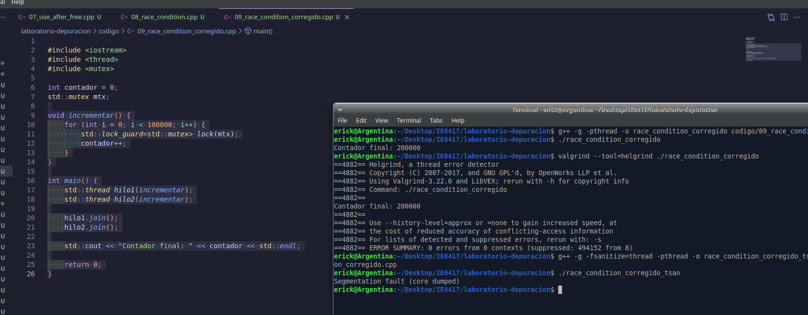

# Parte 8: Mini reto de depuración y reflexión final

## Mini reto de depuración

## 8.1 Objetivo

Aplicar lo aprendido durante el laboratorio en un programa con varios errores pequeños. Para este reto se usaron diferentes herramientas de análisis y depuración, como ejecución normal, `valgrind`, AddressSanitizer y `gdb`.

El programa original tenía varios problemas:

- Error lógico en el cálculo del mayor.
- Acceso fuera de límites.
- Pérdida de memoria.
- Error en el cálculo del promedio.

---

## 8.2 Código original

El archivo trabajado fue:

```bash
codigo/10_reto.cpp
```

El código original del reto era el siguiente:

```cpp
#include <iostream>

int obtener_mayor(int* datos, int tamano) {
    int mayor = 0;

    for (int i = 0; i <= tamano; i++) {
        if (datos[i] > mayor) {
            mayor = datos[i];
        }
    }

    return mayor;
}

double calcular_promedio(int* datos, int tamano) {
    int suma = 0;

    for (int i = 0; i < tamano; i++) {
        suma += datos[i];
    }

    return suma;
}

int main() {
    int tamano = 5;
    int* datos = new int[tamano];

    datos[0] = -10;
    datos[1] = -20;
    datos[2] = -5;
    datos[3] = -30;
    datos[4] = -15;

    int mayor = obtener_mayor(datos, tamano);
    double promedio = calcular_promedio(datos, tamano);

    std::cout << "Mayor: " << mayor << std::endl;
    std::cout << "Promedio: " << promedio << std::endl;

    return 0;
}
```

---

## 8.3 Compilación inicial

Se compiló el programa con el siguiente comando:

```bash
g++ -g -o reto codigo/10_reto.cpp
```

La compilación fue exitosa, ya que no apareció ningún mensaje de error.

---

## 8.4 Ejecución inicial del programa

Se ejecutó el programa con:

```bash
./reto
```

Resultado obtenido:

```bash
Mayor: 0
Promedio: -80
```

Este resultado es incorrecto.

El arreglo contiene los siguientes valores:

```text
-10, -20, -5, -30, -15
```

El mayor valor correcto es:

```text
-5
```

La suma de los datos es:

```text
-10 + -20 + -5 + -30 + -15 = -80
```

El promedio correcto es:

```text
-80 / 5 = -16
```

Por lo tanto, el resultado esperado era:

```bash
Mayor: -5
Promedio: -16
```

---

## 8.5 Análisis con valgrind

Se analizó el programa con `valgrind` usando:

```bash
valgrind --leak-check=full ./reto
```

Resultado obtenido:

```bash
==4998== Memcheck, a memory error detector
==4998== Copyright (C) 2002-2022, and GNU GPL'd, by Julian Seward et al.
==4998== Using Valgrind-3.22.0 and LibVEX; rerun with -h for copyright info
==4998== Command: ./reto
==4998== 
==4998== Invalid read of size 4
==4998==    at 0x10921C: obtener_mayor(int*, int) (10_reto.cpp:7)
==4998==    by 0x10932C: main (10_reto.cpp:35)
==4998==  Address 0x4e2b094 is 0 bytes after a block of size 20 alloc'd
==4998==    at 0x48485C3: operator new[](unsigned long) (in /usr/libexec/valgrind/vgpreload_memcheck-amd64-linux.so)
==4998==    by 0x1092D5: main (10_reto.cpp:27)
==4998== 
Mayor: 0
Promedio: -80
==4998== 
==4998== HEAP SUMMARY:
==4998==     in use at exit: 20 bytes in 1 blocks
==4998==   total heap usage: 3 allocs, 2 frees, 74,772 bytes allocated
==4998== 
==4998== 20 bytes in 1 blocks are definitely lost in loss record 1 of 1
==4998==    at 0x48485C3: operator new[](unsigned long) (in /usr/libexec/valgrind/vgpreload_memcheck-amd64-linux.so)
==4998==    by 0x1092D5: main (10_reto.cpp:27)
==4998== 
==4998== LEAK SUMMARY:
==4998==    definitely lost: 20 bytes in 1 blocks
==4998==    indirectly lost: 0 bytes in 0 blocks
==4998==      possibly lost: 0 bytes in 0 blocks
==4998==    still reachable: 0 bytes in 0 blocks
==4998==         suppressed: 0 bytes in 0 blocks
==4998== 
==4998== ERROR SUMMARY: 2 errors from 2 contexts (suppressed: 0 from 0)
```

`valgrind` detectó dos problemas principales:

1. Un acceso inválido a memoria.
2. Una pérdida de memoria.

---

## 8.6 Error 1: acceso fuera de límites

El reporte de `valgrind` indicó:

```bash
Invalid read of size 4
```

También señaló la función donde ocurría el problema:

```bash
obtener_mayor(int*, int) (10_reto.cpp:7)
```

El problema estaba en el ciclo de la función `obtener_mayor`:

```cpp
for (int i = 0; i <= tamano; i++) {
```

Si `tamano = 5`, los índices válidos del arreglo son:

```text
0, 1, 2, 3, 4
```

Pero la condición `i <= tamano` permite que `i` llegue hasta `5`. Entonces el programa intenta leer:

```cpp
datos[5]
```

Esa posición está fuera del arreglo.

La corrección fue cambiar la condición del ciclo a:

```cpp
for (int i = 1; i < tamano; i++) {
```

Además, se inició el mayor con el primer elemento del arreglo:

```cpp
int mayor = datos[0];
```

---

## 8.7 Error 2: cálculo incorrecto del mayor

El programa original inicializaba la variable `mayor` con cero:

```cpp
int mayor = 0;
```

Esto es incorrecto para este caso porque todos los números del arreglo son negativos.

Si `mayor` empieza en `0`, ningún número negativo será mayor que cero. Por eso el programa imprimía:

```bash
Mayor: 0
```

Pero el arreglo no contiene ningún `0`. El mayor valor real del arreglo es:

```text
-5
```

La corrección fue inicializar `mayor` con el primer valor del arreglo:

```cpp
int mayor = datos[0];
```

Luego el ciclo empieza en `i = 1`, porque `datos[0]` ya fue usado como valor inicial:

```cpp
for (int i = 1; i < tamano; i++) {
```

---

## 8.8 Error 3: cálculo incorrecto del promedio

La función original `calcular_promedio` sumaba correctamente los valores, pero devolvía la suma total:

```cpp
return suma;
```

Por eso el programa imprimía:

```bash
Promedio: -80
```

Pero ese valor corresponde a la suma, no al promedio.

La corrección fue dividir la suma entre el tamaño del arreglo:

```cpp
return static_cast<double>(suma) / tamano;
```

Se usó `static_cast<double>` para que la división se realice como división decimal y la función devuelva correctamente un valor tipo `double`.

---

## 8.9 Error 4: pérdida de memoria

El programa original reservaba memoria dinámica con:

```cpp
int* datos = new int[tamano];
```

Pero nunca liberaba esa memoria.

`valgrind` reportó:

```bash
20 bytes in 1 blocks are definitely lost
```

El arreglo tiene 5 enteros. Si cada entero ocupa 4 bytes:

```text
5 * 4 bytes = 20 bytes
```

Por eso `valgrind` indicó que se perdieron 20 bytes.

La corrección fue liberar la memoria antes de terminar `main`:

```cpp
delete[] datos;
```

---

## 8.10 Análisis con AddressSanitizer

También se compiló el programa usando AddressSanitizer:

```bash
g++ -g -fsanitize=address -o reto_asan codigo/10_reto.cpp
```

Luego se ejecutó:

```bash
./reto_asan
```

Resultado obtenido:

```bash
=================================================================
==5081==ERROR: AddressSanitizer: heap-buffer-overflow on address 0x503000000054 at pc 0x603a008e533b bp 0x7ffefa81a5f0 sp 0x7ffefa81a5e0
READ of size 4 at 0x503000000054 thread T0
    #0 0x603a008e533a in obtener_mayor(int*, int) codigo/10_reto.cpp:7
    #1 0x603a008e55db in main codigo/10_reto.cpp:35
    #2 0x7fdc22c2a1c9 in __libc_start_call_main ../sysdeps/nptl/libc_start_call_main.h:58
    #3 0x7fdc22c2a28a in __libc_start_main_impl ../csu/libc-start.c:360
    #4 0x603a008e5204 in _start (/home/erick/Desktop/IE0417/laboratorio-depuracion/reto_asan+0x1204)

0x503000000054 is located 0 bytes after 20-byte region [0x503000000040,0x503000000054)
allocated by thread T0 here:
    #0 0x7fdc234fe6c8 in operator new[](unsigned long) ../../../../src/libsanitizer/asan/asan_new_delete.cpp:98
    #1 0x603a008e5465 in main codigo/10_reto.cpp:27

SUMMARY: AddressSanitizer: heap-buffer-overflow codigo/10_reto.cpp:7 in obtener_mayor(int*, int)
==5081==ABORTING
```

AddressSanitizer reportó:

```bash
heap-buffer-overflow
```

Esto confirma el acceso fuera de los límites del arreglo en la función `obtener_mayor`.

---

## 8.11 Análisis con gdb

También se usó `gdb` para depurar el programa:

```bash
gdb ./reto
```

Dentro de `gdb`, se colocó un breakpoint en `main`:

```gdb
break main
```

Luego se inició la ejecución:

```gdb
run
```

También se intentó crear un breakpoint en la función `obtener_mayor`, pero primero se escribió mal el nombre:

```gdb
break obtner_mayor
```

Resultado:

```gdb
Function "obtner_mayor" not defined.
```

Luego se corrigió el nombre de la función:

```gdb
break obtener_mayor
```

Resultado:

```gdb
Breakpoint 2 at 0x5555555551f8: file codigo/10_reto.cpp, line 4.
```

Después se continuó la ejecución:

```gdb
continue
```

El programa se detuvo en la función `obtener_mayor`.

---

## 8.12 Información observada con gdb

Dentro de `gdb`, se inspeccionó el tamaño del arreglo:

```gdb
print tamano
```

Resultado:

```gdb
$1 = 5
```

Luego, al revisar el ciclo, se observó que `i` aún no tenía un valor válido antes de iniciar correctamente el ciclo:

```gdb
print i
```

Resultado:

```gdb
$2 = 32767
```

Después se intentó acceder a:

```gdb
print datos[i]
```

Resultado:

```gdb
Cannot access memory at address 0x55555558b2ac
```

Esto mostró que se estaba intentando acceder a una dirección de memoria inválida.

También se usó:

```gdb
backtrace
```

Resultado:

```gdb
#0  obtener_mayor (datos=0x55555556b2b0, tamano=5) at codigo/10_reto.cpp:6
#1  0x000055555555532d in main () at codigo/10_reto.cpp:35
```

Esto muestra que `main` llamó a `obtener_mayor`, y que el problema estaba dentro de esa función.

---

## 8.13 Código corregido

El código corregido fue el siguiente:

```cpp
#include <iostream>

int obtener_mayor(int* datos, int tamano) {
    int mayor = datos[0];

    for (int i = 1; i < tamano; i++) {
        if (datos[i] > mayor) {
            mayor = datos[i];
        }
    }

    return mayor;
}

double calcular_promedio(int* datos, int tamano) {
    int suma = 0;

    for (int i = 0; i < tamano; i++) {
        suma += datos[i];
    }

    return static_cast<double>(suma) / tamano;
}

int main() {
    int tamano = 5;
    int* datos = new int[tamano];

    datos[0] = -10;
    datos[1] = -20;
    datos[2] = -5;
    datos[3] = -30;
    datos[4] = -15;

    int mayor = obtener_mayor(datos, tamano);
    double promedio = calcular_promedio(datos, tamano);

    std::cout << "Mayor: " << mayor << std::endl;
    std::cout << "Promedio: " << promedio << std::endl;

    delete[] datos;

    return 0;
}
```

---

## 8.14 Evidencia del código corregido

La siguiente imagen muestra el código corregido en el editor:



---

## 8.15 Compilación y ejecución final

Después de corregir el programa, se compiló nuevamente:

```bash
g++ -g -o reto codigo/10_reto.cpp
```

Luego se ejecutó:

```bash
./reto
```

Resultado final obtenido:

```bash
Mayor: -5
Promedio: -16
```

Este resultado coincide con el resultado esperado.

---

## 8.16 Evidencia completa de terminal

```bash
erick@Argentina:~/Desktop/IE0417/laboratorio-depuracion$ g++ -g -o reto codigo/10_reto.cpp
erick@Argentina:~/Desktop/IE0417/laboratorio-depuracion$ ./reto
Mayor: 0
Promedio: -80
erick@Argentina:~/Desktop/IE0417/laboratorio-depuracion$ valgrind --leak-check=full ./reto
==4998== Memcheck, a memory error detector
==4998== Copyright (C) 2002-2022, and GNU GPL'd, by Julian Seward et al.
==4998== Using Valgrind-3.22.0 and LibVEX; rerun with -h for copyright info
==4998== Command: ./reto
==4998== 
==4998== Invalid read of size 4
==4998==    at 0x10921C: obtener_mayor(int*, int) (10_reto.cpp:7)
==4998==    by 0x10932C: main (10_reto.cpp:35)
==4998==  Address 0x4e2b094 is 0 bytes after a block of size 20 alloc'd
==4998==    at 0x48485C3: operator new[](unsigned long) (in /usr/libexec/valgrind/vgpreload_memcheck-amd64-linux.so)
==4998==    by 0x1092D5: main (10_reto.cpp:27)
==4998== 
Mayor: 0
Promedio: -80
==4998== 
==4998== HEAP SUMMARY:
==4998==     in use at exit: 20 bytes in 1 blocks
==4998==   total heap usage: 3 allocs, 2 frees, 74,772 bytes allocated
==4998== 
==4998== 20 bytes in 1 blocks are definitely lost in loss record 1 of 1
==4998==    at 0x48485C3: operator new[](unsigned long) (in /usr/libexec/valgrind/vgpreload_memcheck-amd64-linux.so)
==4998==    by 0x1092D5: main (10_reto.cpp:27)
==4998== 
==4998== LEAK SUMMARY:
==4998==    definitely lost: 20 bytes in 1 blocks
==4998==    indirectly lost: 0 bytes in 0 blocks
==4998==      possibly lost: 0 bytes in 0 blocks
==4998==    still reachable: 0 bytes in 0 blocks
==4998==         suppressed: 0 bytes in 0 blocks
==4998== 
==4998== ERROR SUMMARY: 2 errors from 2 contexts (suppressed: 0 from 0)
erick@Argentina:~/Desktop/IE0417/laboratorio-depuracion$ g++ -g -fsanitize=address -o reto_asan codigo/10_reto.cpp
erick@Argentina:~/Desktop/IE0417/laboratorio-depuracion$ ./reto_asan
=================================================================
==5081==ERROR: AddressSanitizer: heap-buffer-overflow on address 0x503000000054 at pc 0x603a008e533b bp 0x7ffefa81a5f0 sp 0x7ffefa81a5e0
READ of size 4 at 0x503000000054 thread T0
    #0 0x603a008e533a in obtener_mayor(int*, int) codigo/10_reto.cpp:7
    #1 0x603a008e55db in main codigo/10_reto.cpp:35
SUMMARY: AddressSanitizer: heap-buffer-overflow codigo/10_reto.cpp:7 in obtener_mayor(int*, int)
==5081==ABORTING
erick@Argentina:~/Desktop/IE0417/laboratorio-depuracion$ gdb ./reto
Reading symbols from ./reto...
(gdb) break main
Breakpoint 1 at 0x12a8: file codigo/10_reto.cpp, line 26.
(gdb) run
Starting program: /home/erick/Desktop/IE0417/laboratorio-depuracion/reto
Breakpoint 1, main () at codigo/10_reto.cpp:26
26	    int tamano = 5;
(gdb) next
27	    int* datos = new int[tamano];
(gdb) next
29	    datos[0] = -10;
(gdb) break obtner_mayor
Function "obtner_mayor" not defined.
Make breakpoint pending on future shared library load? (y or [n]) n
(gdb) break obtener_mayor
Breakpoint 2 at 0x5555555551f8: file codigo/10_reto.cpp, line 4.
(gdb) continue
Continuing.
Breakpoint 2, obtener_mayor (datos=0x55555556b2b0, tamano=5) at codigo/10_reto.cpp:4
4	    int mayor = 0;
(gdb) print tamano
$1 = 5
(gdb) next
6	    for (int i = 0; i <= tamano; i++) {
(gdb) print i
$2 = 32767
(gdb) print datos[i]
Cannot access memory at address 0x55555558b2ac
(gdb) backtrace
#0  obtener_mayor (datos=0x55555556b2b0, tamano=5) at codigo/10_reto.cpp:6
#1  0x000055555555532d in main () at codigo/10_reto.cpp:35
(gdb) quit
A debugging session is active.

	Inferior 1 [process 5242] will be killed.

Quit anyway? (y or n) y
erick@Argentina:~/Desktop/IE0417/laboratorio-depuracion$ g++ -g -o reto codigo/10_reto.cpp
erick@Argentina:~/Desktop/IE0417/laboratorio-depuracion$ ./reto
Mayor: -5
Promedio: -16
```

---

## 8.17 Herramienta más útil

La herramienta más útil para este reto fue `valgrind`, porque permitió encontrar dos errores importantes en una sola ejecución:

- El acceso fuera de límites.
- La pérdida de memoria.

AddressSanitizer también fue útil porque mostró claramente el `heap-buffer-overflow`. Por otro lado, `gdb` permitió inspeccionar el flujo de ejecución y revisar cómo el programa llegaba a la función `obtener_mayor`.

En conjunto, las tres herramientas ayudaron a entender mejor el problema, pero `valgrind` fue la más completa para este caso.

---

## 8.18 Reflexión del mini reto

Este reto permitió integrar varios conceptos vistos durante el laboratorio. El programa compilaba y se ejecutaba, pero tenía errores importantes que afectaban el resultado y el manejo de memoria.

La ejecución normal permitió observar que los resultados no tenían sentido. Luego, `valgrind` y AddressSanitizer mostraron errores de memoria. Finalmente, `gdb` ayudó a revisar el flujo de ejecución y confirmar que el problema principal estaba en la función `obtener_mayor`.

La corrección final resolvió los cuatro problemas: se evitó el acceso fuera de límites, se calculó correctamente el mayor, se calculó correctamente el promedio y se liberó la memoria dinámica.

---

# Reflexión final

## 1. ¿Qué entiende ahora por depuración?

Ahora entiendo la depuración como un proceso ordenado para encontrar, analizar y corregir errores en un programa.

No se trata solo de cambiar código hasta que funcione, sino de observar el comportamiento del programa, reproducir el error, usar herramientas adecuadas, identificar la causa y verificar que la corrección realmente funciona.

---

## 2. ¿Por qué no basta con que un programa compile?

No basta con que un programa compile porque la compilación solo confirma que el código cumple con las reglas básicas del lenguaje.

Un programa puede compilar correctamente y aun así tener errores lógicos, errores de ejecución, accesos inválidos a memoria, pérdidas de memoria o condiciones de carrera.

---

## 3. ¿Cuál fue la diferencia entre un error de sintaxis y un error lógico?

Un error de sintaxis ocurre cuando el código no cumple las reglas del lenguaje, por ejemplo, cuando falta un punto y coma o hay una función mal escrita. Este tipo de error suele ser detectado por el compilador.

Un error lógico ocurre cuando el programa compila y se ejecuta, pero produce un resultado incorrecto. En este caso, el problema está en el razonamiento o algoritmo utilizado.

---

## 4. ¿Qué ventaja tiene usar `gdb`?

`gdb` permite ejecutar un programa paso a paso, colocar breakpoints, inspeccionar variables y revisar la pila de llamadas.

Su principal ventaja es que permite observar el estado interno del programa mientras se ejecuta, lo cual ayuda a entender dónde y por qué ocurre un error.

---

## 5. ¿Qué ventaja tiene usar `valgrind`?

`valgrind` permite detectar errores de memoria que no siempre son visibles al ejecutar el programa normalmente.

Es útil para encontrar pérdidas de memoria, accesos fuera de límites y uso incorrecto de memoria dinámica.

---

## 6. ¿Qué ventaja tiene usar AddressSanitizer?

AddressSanitizer permite detectar errores de memoria durante la ejecución del programa.

Una ventaja importante es que muestra reportes claros sobre el tipo de error, la línea donde ocurre y, en algunos casos, dónde se reservó o liberó la memoria relacionada con el problema.

---

## 7. ¿Qué aprendió sobre errores de memoria?

Aprendí que los errores de memoria pueden existir aunque el programa parezca funcionar bien.

Un programa puede imprimir resultados, terminar normalmente y aun así tener accesos inválidos, pérdidas de memoria o uso de memoria liberada. Por eso es importante usar herramientas como `valgrind` y AddressSanitizer.

---

## 8. ¿Qué aprendió sobre errores de concurrencia?

Aprendí que los errores de concurrencia pueden ser difíciles de detectar porque no siempre aparecen en todas las ejecuciones.

En el caso de la condición de carrera, el programa a veces imprimía el resultado correcto y otras veces no. Esto ocurre porque el resultado depende del orden en que el sistema operativo ejecuta los hilos.

---

## 9. ¿Cuál fue el error más fácil de encontrar?

El error más fácil de encontrar fue el error de sintaxis, porque el compilador muestra un mensaje de error antes de ejecutar el programa.

Este tipo de error suele ser más directo porque normalmente está relacionado con una línea específica del código.

---

## 10. ¿Cuál fue el error más difícil de entender?

El error más difícil de entender fue la condición de carrera, porque el programa no siempre fallaba.

A veces el resultado era correcto y otras veces no. Esto hace que sea más complicado identificar el problema sin herramientas como Helgrind.

---

## 11. ¿Qué herramienta usaría primero si un programa produce un resultado incorrecto?

Primero ejecutaría el programa normalmente y compararía el resultado obtenido con el resultado esperado.

Después usaría `gdb` para revisar el valor de las variables y entender en qué punto el programa empieza a producir un resultado incorrecto.

---

## 12. ¿Qué herramienta usaría primero si un programa falla con segmentation fault?

Si un programa falla con `segmentation fault`, usaría primero `gdb` para identificar en qué línea ocurre el fallo.

También usaría AddressSanitizer o `valgrind` si sospecho que el problema está relacionado con memoria.

---

## 13. ¿Qué herramienta usaría primero si sospecha una pérdida de memoria?

Si sospecho una pérdida de memoria, usaría primero `valgrind` con:

```bash
valgrind --leak-check=full ./programa
```

Esta herramienta muestra si hay memoria perdida y en qué parte del código se reservó.

---

## 14. ¿Qué herramienta usaría primero si sospecha un problema con hilos?

Si sospecho un problema con hilos, usaría Helgrind o ThreadSanitizer.

En este laboratorio, Helgrind fue más claro porque mostró directamente la condición de carrera sobre la variable compartida `contador`.

---

## 15. ¿Cómo aplicaría estas herramientas en proyectos futuros?

Aplicaría estas herramientas como parte normal del proceso de desarrollo.

Primero compilaría con `-g` para facilitar la depuración. Si el programa produce resultados incorrectos, usaría `gdb`. Si el programa maneja memoria dinámica, usaría `valgrind` o AddressSanitizer. Si el programa utiliza hilos, usaría Helgrind o ThreadSanitizer.

De esta forma, los errores se pueden encontrar antes y el código puede ser más confiable.