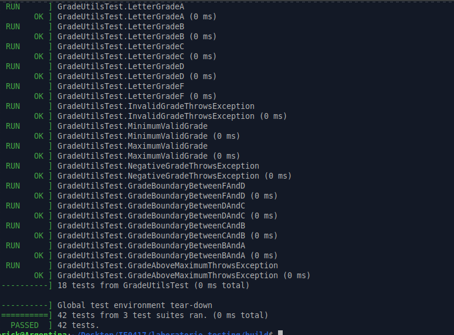

# Parte 1: Plan de pruebas y preparación del proyecto

## 1.1 Objetivo

Crear la estructura base del proyecto de pruebas en C++ usando CMake y Google Test.

En esta parte se preparó el proyecto `laboratorio-testing`, se crearon las carpetas principales y se agregó el archivo `CMakeLists.txt`, que permite configurar la compilación del código fuente y de las pruebas unitarias.

---

## 1.2 ¿Qué es CMake?

CMake es una herramienta que permite configurar y generar archivos de compilación para proyectos de software.

En un proyecto de C++, CMake ayuda a organizar el proceso de compilación, definir qué archivos fuente se deben compilar, qué librerías se deben enlazar y qué ejecutables se deben generar.

En este laboratorio, CMake se utiliza para:

- Definir el estándar de C++ usado en el proyecto.
- Compilar los archivos fuente ubicados en `src/`.
- Incluir los archivos de encabezado ubicados en `include/`.
- Descargar y configurar Google Test.
- Crear el ejecutable de pruebas `run_tests`.
- Permitir la ejecución de pruebas con `ctest`.
- Activar opciones de cobertura de código cuando sea necesario.

El archivo principal de configuración es:

```bash
CMakeLists.txt
```

---

## 1.3 ¿Para qué sirve Google Test?

Google Test es una biblioteca de pruebas unitarias para C++.

Sirve para escribir pruebas automatizadas que verifican si una función produce el resultado esperado. En lugar de revisar manualmente la salida del programa cada vez que se hace un cambio, Google Test permite definir casos de prueba y ejecutarlos automáticamente.

Por ejemplo, una prueba puede verificar que una función de suma funcione correctamente:

```cpp
EXPECT_EQ(add(2, 3), 5);
```

En este laboratorio, Google Test se usa para probar funciones relacionadas con:

- Operaciones matemáticas.
- Manejo de cadenas de texto.
- Cálculo y validación de notas.

Google Test también permite usar diferentes tipos de aserciones, como:

```cpp
EXPECT_EQ
EXPECT_TRUE
EXPECT_FALSE
ASSERT_EQ
ASSERT_THROW
```

Estas aserciones permiten comparar resultados esperados contra resultados obtenidos.

---

## 1.4 ¿Qué significa automatizar pruebas?

Automatizar pruebas significa crear pruebas que se puedan ejecutar sin intervención manual.

En lugar de probar una función escribiendo datos a mano o revisando visualmente la salida del programa, las pruebas automatizadas ejecutan casos definidos previamente y verifican si el resultado es correcto.

Por ejemplo, si se tiene una función:

```cpp
int add(int a, int b);
```

se puede automatizar una prueba así:

```cpp
EXPECT_EQ(add(2, 3), 5);
```

Esto permite ejecutar muchas pruebas con un solo comando:

```bash
./run_tests
```

Automatizar pruebas es útil porque permite detectar errores rápidamente cuando se modifica el código. También ayuda a evitar que cambios nuevos rompan funciones que ya estaban funcionando.

---

## 1.5 ¿Qué significa que las pruebas sean repetibles?

Que las pruebas sean repetibles significa que se pueden ejecutar muchas veces bajo las mismas condiciones y deben producir el mismo resultado.

Una prueba repetible no depende de factores externos difíciles de controlar. Por ejemplo, no debería depender de que una persona escriba manualmente una entrada cada vez, ni de valores aleatorios sin control.

Esto es importante porque permite comparar resultados entre diferentes ejecuciones. Si una prueba pasa hoy, debería pasar mañana si el código no cambió. Si deja de pasar, entonces probablemente hubo una modificación que introdujo un error.

En este laboratorio, las pruebas deben ser repetibles porque se ejecutarán localmente y también en GitHub Actions.

---

## 1.6 Archivos y carpetas creadas

Se creó la carpeta principal del laboratorio:

```bash
laboratorio-testing
```

Dentro de esa carpeta se creó la siguiente estructura:

```text
laboratorio-testing/
├── README.md
├── CMakeLists.txt
├── include/
│   ├── calculator.h
│   ├── string_utils.h
│   └── grade_utils.h
├── src/
│   ├── calculator.cpp
│   ├── string_utils.cpp
│   └── grade_utils.cpp
├── tests/
│   ├── test_calculator.cpp
│   ├── test_string_utils.cpp
│   └── test_grade_utils.cpp
├── docs/
│   ├── parte1-plan-pruebas.md
│   ├── parte2-pruebas-unitarias.md
│   ├── parte3-pruebas-fallidas.md
│   ├── parte4-casos-borde.md
│   ├── parte5-cobertura.md
│   ├── parte6-github-actions.md
│   └── reflexion-final.md
└── .github/
    └── workflows/
        └── testing.yml
```

---

## 1.7 Descripción de las carpetas

### Carpeta `include/`

La carpeta `include/` contiene los archivos de encabezado `.h`.

Estos archivos declaran las funciones que serán implementadas en los archivos `.cpp`. Sirven para indicar qué funciones existen y cómo pueden ser utilizadas por otros archivos del proyecto.

Archivos creados:

```text
calculator.h
string_utils.h
grade_utils.h
```

---

### Carpeta `src/`

La carpeta `src/` contiene el código fuente principal del proyecto.

Aquí se implementan las funciones declaradas en los archivos `.h`.

Archivos creados:

```text
calculator.cpp
string_utils.cpp
grade_utils.cpp
```

---

### Carpeta `tests/`

La carpeta `tests/` contiene las pruebas unitarias escritas con Google Test.

Cada archivo de prueba se enfoca en probar un módulo específico del proyecto.

Archivos creados:

```text
test_calculator.cpp
test_string_utils.cpp
test_grade_utils.cpp
```

---

### Carpeta `docs/`

La carpeta `docs/` contiene la documentación del laboratorio en formato Markdown.

Aquí se documentan las actividades realizadas, comandos ejecutados, resultados obtenidos, errores encontrados, correcciones y reflexiones.

Archivos creados:

```text
parte1-plan-pruebas.md
parte2-pruebas-unitarias.md
parte3-pruebas-fallidas.md
parte4-casos-borde.md
parte5-cobertura.md
parte6-github-actions.md
reflexion-final.md
```

---

### Carpeta `.github/workflows/`

Esta carpeta contiene el archivo de configuración para GitHub Actions.

El archivo `testing.yml` permite ejecutar las pruebas automáticamente cuando se suben cambios al repositorio.

Archivo creado:

```text
testing.yml
```

---

## 1.8 Archivo `CMakeLists.txt`

Se creó el archivo:

```bash
CMakeLists.txt
```

Este archivo define cómo se compila el proyecto y cómo se configuran las pruebas.

El archivo permite:

- Definir el nombre del proyecto.
- Usar C++17.
- Descargar Google Test mediante `FetchContent`.
- Crear una biblioteca con el código fuente del proyecto.
- Crear el ejecutable `run_tests`.
- Enlazar las pruebas con Google Test.
- Registrar las pruebas para poder ejecutarlas con `ctest`.
- Activar cobertura de código mediante la opción `ENABLE_COVERAGE`.

---

# 1.9 Preguntas de reflexión

## 1. ¿Por qué conviene separar el código fuente de las pruebas?

Conviene separar el código fuente de las pruebas porque cada parte tiene un propósito diferente.

El código fuente contiene la lógica principal del programa. En cambio, las pruebas contienen código diseñado para verificar que esa lógica funcione correctamente.

Separarlos permite tener un proyecto más ordenado y fácil de mantener. También facilita modificar las pruebas sin afectar directamente el código principal del programa.

Por ejemplo, en este laboratorio el código fuente se guarda en:

```bash
src/
```

y las pruebas se guardan en:

```bash
tests/
```

Esta separación hace que sea más claro qué archivos pertenecen al programa y cuáles pertenecen al proceso de verificación.

---

## 2. ¿Qué ventaja tiene usar CMake en un proyecto de C++?

Usar CMake tiene la ventaja de que permite organizar la compilación del proyecto de forma clara y repetible.

En lugar de compilar cada archivo manualmente con comandos largos de `g++`, CMake permite definir la configuración del proyecto una sola vez en el archivo:

```bash
CMakeLists.txt
```

Luego, el proyecto se puede configurar y compilar con comandos generales como:

```bash
cmake ..
make
```

Además, CMake facilita el uso de bibliotecas externas como Google Test y permite trabajar con proyectos que tienen varios archivos fuente, carpetas y pruebas.

---

## 3. ¿Por qué es útil que las pruebas se puedan ejecutar con un solo comando?

Es útil porque facilita ejecutar todas las pruebas de forma rápida y constante.

Si las pruebas se pueden ejecutar con un solo comando, es más probable que se usen frecuentemente durante el desarrollo. Esto ayuda a detectar errores justo después de hacer cambios en el código.

En este laboratorio, las pruebas se pueden ejecutar con:

```bash
./run_tests
```

o también con:

```bash
ctest --output-on-failure
```

Esto permite verificar el estado del proyecto sin tener que probar cada función manualmente.

---

## 4. ¿Qué diferencia hay entre probar manualmente y probar automáticamente?

Probar manualmente significa que una persona ejecuta el programa, ingresa datos y revisa visualmente si el resultado parece correcto.

Probar automáticamente significa que los casos de prueba ya están definidos en código y se ejecutan con una herramienta como Google Test.

La prueba manual puede ser útil al inicio, pero es más lenta y propensa a errores humanos. En cambio, la prueba automática es más rápida, repetible y confiable.

Por ejemplo, una prueba automática puede verificar una suma así:

```cpp
EXPECT_EQ(add(2, 3), 5);
```

Esto permite que la herramienta indique directamente si la prueba pasó o falló.

---

## 1.10 Reflexión breve

En esta primera parte se preparó la estructura base del laboratorio y se creó la organización principal del proyecto.

También se comprendió la importancia de usar herramientas como CMake y Google Test. CMake permite configurar y compilar el proyecto de forma ordenada, mientras que Google Test permite escribir pruebas automatizadas para verificar el comportamiento del código.


---

# Parte 9: Pruebas funcionales sencillas

## 9.1 Objetivo

Diseñar pruebas desde el punto de vista del comportamiento esperado del sistema, no solamente desde la implementación interna del código.

En esta parte se trabajó con el requisito funcional relacionado con la conversión de una nota numérica a una letra de calificación. El objetivo fue revisar si los casos funcionales estaban cubiertos por las pruebas existentes y agregar los que hicieran falta.

---

## 9.2 Requisito funcional

El requisito analizado fue el siguiente:

> El sistema debe convertir una nota numérica entre 0 y 100 a una letra de calificación. Las notas entre 90 y 100 son A, entre 80 y 89 son B, entre 70 y 79 son C, entre 60 y 69 son D, y menores a 60 son F. Si la nota está fuera del rango permitido, el sistema debe rechazarla.

Este requisito se verifica mediante la función:

```cpp
char letter_grade(int grade);
```

Esta función pertenece al módulo:

```bash
grade_utils
```

---

## 9.3 Tabla de casos funcionales

| ID | Requisito | Entrada | Resultado esperado | Tipo de caso |
|---|---|---:|---|---|
| TC-001 | Convertir nota excelente | 95 | A | Normal |
| TC-002 | Límite inferior de A | 90 | A | Borde |
| TC-003 | Límite superior de B | 89 | B | Borde |
| TC-004 | Nota inválida baja | -1 | Excepción | Inválido |
| TC-005 | Nota inválida alta | 101 | Excepción | Inválido |
| TC-006 | Límite inferior de B | 80 | B | Borde |
| TC-007 | Límite superior de C | 79 | C | Borde |
| TC-008 | Límite inferior de C | 70 | C | Borde |
| TC-009 | Límite superior de D | 69 | D | Borde |
| TC-010 | Límite inferior de D | 60 | D | Borde |
| TC-011 | Límite superior de F | 59 | F | Borde |
| TC-012 | Nota mínima válida | 0 | F | Borde |
| TC-013 | Nota máxima válida | 100 | A | Borde |

---

## 9.4 Casos que ya estaban cubiertos

Al revisar el archivo:

```bash
tests/test_grade_utils.cpp
```

se observó que varios casos funcionales ya estaban cubiertos por pruebas existentes.

| ID | Prueba relacionada | Estado |
|---|---|---|
| TC-001 | `GradeUtilsTest.LetterGradeA` | Cubierto |
| TC-002 | `GradeUtilsTest.GradeBoundaryBetweenBAndA` | Cubierto |
| TC-003 | `GradeUtilsTest.GradeBoundaryBetweenBAndA` | Cubierto |
| TC-004 | `GradeUtilsTest.NegativeGradeThrowsException` | Cubierto |
| TC-006 | `GradeUtilsTest.GradeBoundaryBetweenCAndB` | Cubierto |
| TC-007 | `GradeUtilsTest.GradeBoundaryBetweenCAndB` | Cubierto |
| TC-008 | `GradeUtilsTest.GradeBoundaryBetweenDAndC` | Cubierto |
| TC-009 | `GradeUtilsTest.GradeBoundaryBetweenDAndC` | Cubierto |
| TC-010 | `GradeUtilsTest.GradeBoundaryBetweenFAndD` | Cubierto |
| TC-011 | `GradeUtilsTest.GradeBoundaryBetweenFAndD` | Cubierto |
| TC-012 | `GradeUtilsTest.MinimumValidGrade` | Cubierto |
| TC-013 | `GradeUtilsTest.MaximumValidGrade` | Cubierto |

---

## 9.5 Caso que se tuvo que agregar

El caso que faltaba cubrir de forma específica era:

| ID | Requisito | Entrada | Resultado esperado | Tipo de caso |
|---|---|---:|---|---|
| TC-005 | Nota inválida alta | 101 | Excepción | Inválido |

Aunque ya existía una prueba para una nota inválida alta usando `120`, se agregó una prueba específica con `101`, porque es el primer valor fuera del rango permitido por encima de `100`.

La prueba agregada fue:

```cpp
TEST(GradeUtilsTest, GradeAboveMaximumThrowsException) {
    EXPECT_THROW(letter_grade(101), std::invalid_argument);
}
```

Esta prueba verifica que el sistema rechace correctamente una nota mayor al máximo permitido.

---

## 9.6 Comandos ejecutados

Después de agregar la prueba, se compiló el proyecto desde la carpeta `build`:

```bash
make
```

Luego se ejecutaron las pruebas con:

```bash
./run_tests
```

Durante la compilación apareció el siguiente mensaje:

```bash
libgcov profiling error:/home/erick/Desktop/IE0417/laboratorio-testing/build/CMakeFiles/run_tests.dir/tests/test_grade_utils.cpp.gcda:overwriting an existing profile data with a different checksum
```

Este mensaje está relacionado con archivos de cobertura generados previamente. No impidió la compilación ni la ejecución de las pruebas.

---

## 9.7 Resultado obtenido

Después de agregar la prueba `GradeAboveMaximumThrowsException`, se ejecutaron 42 pruebas en total:

```bash
[==========] Running 42 tests from 3 test suites.
```

La nueva prueba apareció dentro del conjunto `GradeUtilsTest`:

```bash
[ RUN      ] GradeUtilsTest.GradeAboveMaximumThrowsException
[       OK ] GradeUtilsTest.GradeAboveMaximumThrowsException (0 ms)
```

El resumen final fue:

```bash
[==========] 42 tests from 3 test suites ran. (0 ms total)
[  PASSED  ] 42 tests.
```

Esto confirma que todas las pruebas pasaron correctamente.

---

## 9.8 Evidencia completa de terminal

```bash
make
[ 25%] Built target project_lib
[ 37%] Built target gtest
[ 50%] Built target gtest_main
[ 56%] Building CXX object CMakeFiles/run_tests.dir/tests/test_grade_utils.cpp.o
[ 62%] Linking CXX executable run_tests
libgcov profiling error:/home/erick/Desktop/IE0417/laboratorio-testing/build/CMakeFiles/run_tests.dir/tests/test_grade_utils.cpp.gcda:overwriting an existing profile data with a different checksum
[ 75%] Built target run_tests
[ 87%] Built target gmock
[100%] Built target gmock_main

erick@Argentina:~/Desktop/IE0417/laboratorio-testing/build$ ./run_tests
Running main() from /home/erick/Desktop/IE0417/laboratorio-testing/build/_deps/googletest-src/googletest/src/gtest_main.cc
[==========] Running 42 tests from 3 test suites.
[----------] Global test environment set-up.
[----------] 14 tests from CalculatorTest
[----------] 10 tests from StringUtilsTest
[----------] 18 tests from GradeUtilsTest
[ RUN      ] GradeUtilsTest.GradeAboveMaximumThrowsException
[       OK ] GradeUtilsTest.GradeAboveMaximumThrowsException (0 ms)
[----------] Global test environment tear-down
[==========] 42 tests from 3 test suites ran. (0 ms total)
[  PASSED  ] 42 tests.
```

---

## 9.9 Evidencia en imagen

La siguiente imagen muestra la ejecución de las pruebas funcionales después de agregar el caso para la nota inválida alta.



---

## 9.10 ¿Por qué estas pruebas se consideran funcionales?

Estas pruebas se consideran funcionales porque se diseñaron a partir de un requisito del sistema.

El requisito indica cómo debe comportarse el sistema al recibir una nota numérica. Por eso, las pruebas no se enfocan en cómo está implementada internamente la función `letter_grade`, sino en verificar que el comportamiento final sea el correcto.

Por ejemplo, el requisito dice que una nota de `95` debe ser `A`, que una nota de `89` debe ser `B`, y que una nota de `101` debe ser rechazada. Las pruebas verifican exactamente esos comportamientos.

---

# 9.11 Preguntas de reflexión

## 1. ¿Qué diferencia hay entre una prueba unitaria y una prueba funcional?

Una prueba unitaria verifica una función o unidad pequeña de código de forma aislada.

Una prueba funcional verifica que el sistema cumpla con un requisito o comportamiento esperado. En este caso, aunque se llama directamente a la función `letter_grade`, la prueba se considera funcional porque está basada en el requisito de convertir una nota numérica en una letra.

---

## 2. ¿Por qué una prueba funcional se relaciona con requisitos?

Porque una prueba funcional busca comprobar que el sistema haga lo que el requisito indica.

En este caso, el requisito define los rangos de calificación y qué debe pasar con notas inválidas. La tabla de casos funcionales permite conectar cada entrada con el resultado esperado.

---

## 3. ¿Qué significa pensar desde la perspectiva del usuario o del sistema?

Significa enfocarse en el comportamiento esperado y no en los detalles internos del código.

Desde la perspectiva del sistema, si se ingresa `95`, se espera obtener `A`. Si se ingresa `101`, se espera que el sistema rechace la entrada. No importa si internamente se usan `if`, `else if` u otra estructura.

---

## 4. ¿Por qué la documentación de casos de prueba ayuda al equipo?

La documentación de casos de prueba ayuda porque permite saber qué requisitos ya están cubiertos y cuáles faltan.

También facilita que otras personas entiendan qué se está probando, por qué se está probando y qué resultado se espera. Esto mejora el mantenimiento del proyecto y ayuda a evitar que se olviden casos importantes.

---

## 9.12 Reflexión breve

Esta parte permitió relacionar las pruebas con un requisito funcional específico.

Al construir la tabla de casos funcionales, se verificó que la mayoría de casos ya estaban cubiertos por pruebas existentes. Sin embargo, se agregó una prueba específica para el caso `101`, ya que representa el primer valor inválido por encima del máximo permitido.

Después de agregar esa prueba, se ejecutaron 42 pruebas y todas pasaron correctamente. Esto confirma que el comportamiento funcional de la conversión de notas está cubierto para casos normales, casos borde e inválidos.

Esta organización será útil para las siguientes partes del laboratorio, ya que permite separar el código fuente, las pruebas, la documentación y la configuración de integración continua.