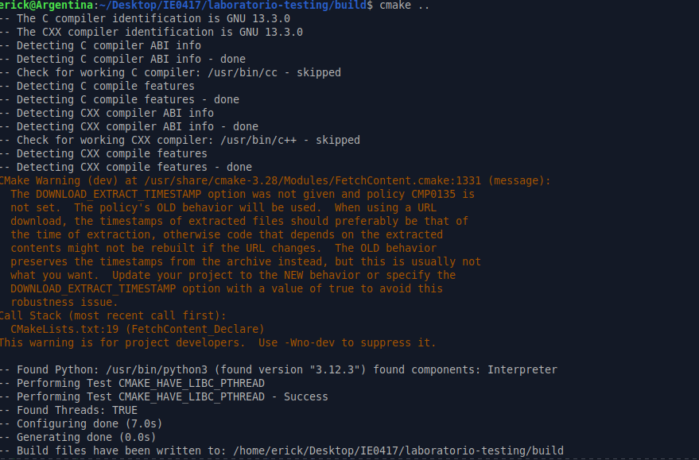
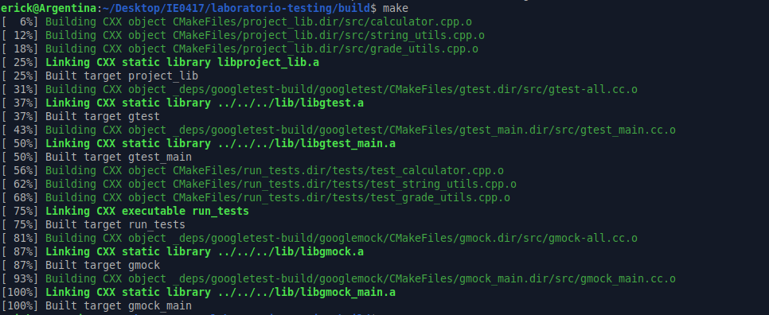
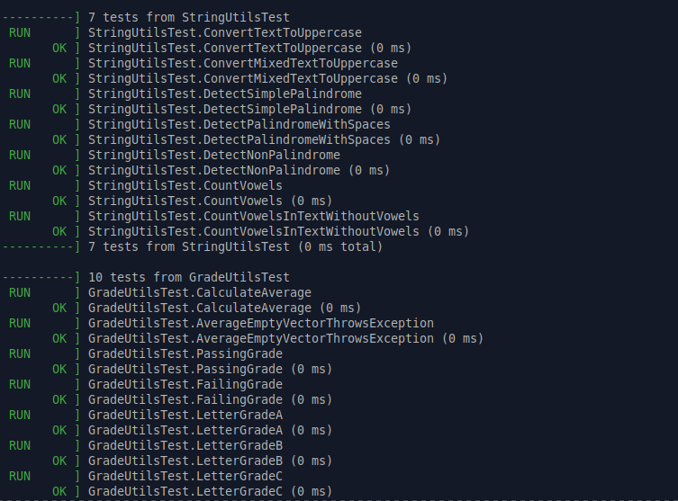
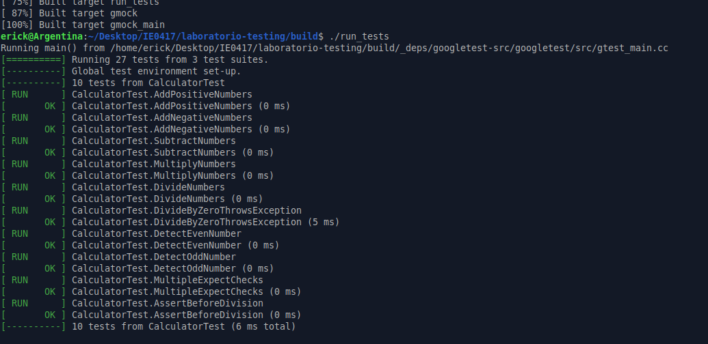
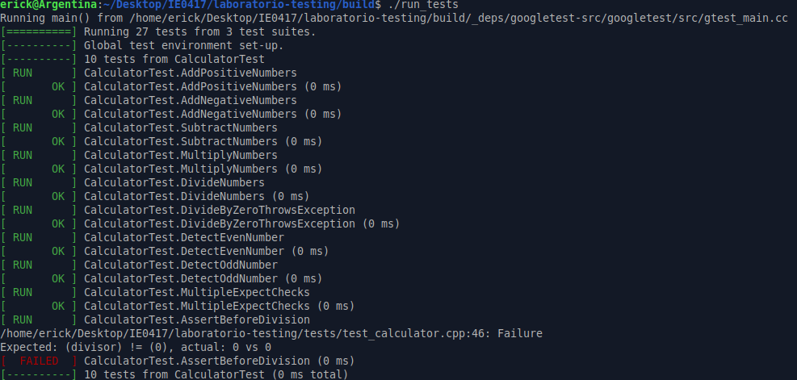

# Parte 2: Implementación inicial del código y pruebas unitarias

## 2.1 Objetivo

Crear funciones sencillas en C++ que luego serán verificadas mediante pruebas unitarias con Google Test.

En esta parte se implementaron tres módulos principales:

- `calculator`
- `string_utils`
- `grade_utils`

Cada módulo tiene un archivo de encabezado `.h`, donde se declaran las funciones, y un archivo fuente `.cpp`, donde se implementa la lógica de esas funciones.

---

## 2.2 Módulos creados

Se crearon tres módulos principales dentro del proyecto:

```text
calculator
string_utils
grade_utils
```

Cada módulo agrupa funciones relacionadas entre sí. Esto permite mantener el código más ordenado y facilita la creación de pruebas unitarias para cada parte del programa.

---

## 2.3 Módulo `calculator`

El módulo `calculator` contiene funciones matemáticas básicas.

Archivos creados:

```text
include/calculator.h
src/calculator.cpp
```

### Funciones implementadas

```cpp
int add(int a, int b);
int subtract(int a, int b);
int multiply(int a, int b);
int divide(int a, int b);
bool is_even(int number);
```

### Descripción de las funciones

La función `add` recibe dos números enteros y retorna su suma.

La función `subtract` recibe dos números enteros y retorna la resta del primero menos el segundo.

La función `multiply` recibe dos números enteros y retorna el producto entre ambos.

La función `divide` recibe dos números enteros y retorna la división entera del primero entre el segundo. Si el divisor es cero, lanza una excepción de tipo `std::invalid_argument`.

La función `is_even` recibe un número entero y retorna `true` si el número es par, o `false` si el número es impar.

---

## 2.4 Módulo `string_utils`

El módulo `string_utils` contiene funciones para trabajar con cadenas de texto.

Archivos creados:

```text
include/string_utils.h
src/string_utils.cpp
```

### Funciones implementadas

```cpp
std::string to_uppercase(const std::string& text);
bool is_palindrome(const std::string& text);
int count_vowels(const std::string& text);
```

### Descripción de las funciones

La función `to_uppercase` recibe una cadena de texto y retorna una nueva cadena con todos sus caracteres convertidos a mayúscula.

La función `is_palindrome` recibe una cadena de texto y verifica si es un palíndromo. Para esto, elimina espacios y compara el texto normalizado con su versión invertida.

La función `count_vowels` recibe una cadena de texto y cuenta cuántas vocales contiene. Para realizar la comparación, convierte cada carácter a minúscula.

---

## 2.5 Módulo `grade_utils`

El módulo `grade_utils` contiene funciones relacionadas con notas o calificaciones.

Archivos creados:

```text
include/grade_utils.h
src/grade_utils.cpp
```

### Funciones implementadas

```cpp
double average(const std::vector<int>& grades);
bool is_passing(int grade);
char letter_grade(int grade);
```

### Descripción de las funciones

La función `average` recibe un vector de notas enteras y retorna el promedio como un valor de tipo `double`. Si el vector está vacío, lanza una excepción de tipo `std::invalid_argument`.

La función `is_passing` recibe una nota entera y retorna `true` si la nota es mayor o igual a `70`. En caso contrario, retorna `false`.

La función `letter_grade` recibe una nota entera y retorna una letra según el rango de calificación:

```text
90 - 100: A
80 - 89 : B
70 - 79 : C
60 - 69 : D
0  - 59 : F
```

Si la nota está fuera del rango de `0` a `100`, lanza una excepción de tipo `std::invalid_argument`.

---

## 2.6 Función de los archivos `.h`

Los archivos `.h` son archivos de encabezado. Su función principal es declarar las funciones que estarán disponibles para ser usadas por otros archivos del proyecto.

En este laboratorio, los archivos `.h` indican qué funciones existen, qué parámetros reciben y qué tipo de dato retornan.

Por ejemplo, en `calculator.h` se declara:

```cpp
int add(int a, int b);
```

Esto permite que otros archivos, como las pruebas unitarias, puedan usar la función `add` sin conocer directamente todos los detalles de su implementación.

Los archivos de encabezado creados fueron:

```text
include/calculator.h
include/string_utils.h
include/grade_utils.h
```

---

## 2.7 Función de los archivos `.cpp`

Los archivos `.cpp` contienen la implementación real de las funciones declaradas en los archivos `.h`.

Por ejemplo, en `calculator.h` se declara la función:

```cpp
int add(int a, int b);
```

y en `calculator.cpp` se implementa:

```cpp
int add(int a, int b) {
    return a + b;
}
```

Esto permite separar la interfaz del módulo de su implementación.

Los archivos fuente creados fueron:

```text
src/calculator.cpp
src/string_utils.cpp
src/grade_utils.cpp
```

---

## 2.8 Relación entre archivos `.h` y `.cpp`

Cada archivo `.h` tiene su archivo `.cpp` correspondiente:

```text
include/calculator.h      -> src/calculator.cpp
include/string_utils.h    -> src/string_utils.cpp
include/grade_utils.h     -> src/grade_utils.cpp
```

El archivo `.h` indica qué funciones ofrece el módulo, mientras que el archivo `.cpp` define cómo funcionan esas funciones internamente.

Esta separación ayuda a mantener el proyecto organizado y facilita la escritura de pruebas, porque los archivos de prueba pueden incluir los `.h` y llamar las funciones directamente.

---

## 2.9 Casos normales, casos borde y casos inválidos

Para diseñar buenas pruebas unitarias, es importante identificar distintos tipos de casos:

- Casos normales.
- Casos borde.
- Casos inválidos.

Un caso normal es una entrada común que representa el uso esperado de la función.

Un caso borde es una entrada que se encuentra justo en el límite de un rango o condición importante.

Un caso inválido es una entrada que la función no debería aceptar o que debería manejar mediante una excepción.

---

## 2.10 Casos para `calculator`

### Función `add`

Casos normales:

```cpp
add(2, 3)
add(-2, -3)
add(10, -5)
```

Casos borde:

```cpp
add(0, 0)
add(0, 5)
```

No tiene un caso inválido evidente en este laboratorio, porque la función puede sumar enteros positivos, negativos o cero.

---

### Función `subtract`

Casos normales:

```cpp
subtract(10, 4)
subtract(5, 10)
```

Casos borde:

```cpp
subtract(0, 0)
subtract(0, 5)
```

No tiene un caso inválido evidente dentro del alcance del laboratorio.

---

### Función `multiply`

Casos normales:

```cpp
multiply(3, 4)
multiply(-2, 5)
```

Casos borde:

```cpp
multiply(0, 10)
multiply(1, 100)
```

No tiene un caso inválido evidente dentro del alcance del laboratorio.

---

### Función `divide`

Casos normales:

```cpp
divide(10, 2)
divide(-10, -2)
divide(10, -2)
```

Casos borde:

```cpp
divide(0, 5)
divide(5, 1)
```

Caso inválido:

```cpp
divide(10, 0)
```

Este caso es inválido porque no se puede dividir entre cero. La función debe lanzar una excepción.

---

### Función `is_even`

Casos normales:

```cpp
is_even(8)
is_even(7)
```

Casos borde:

```cpp
is_even(0)
```

No tiene un caso inválido evidente en este laboratorio, porque cualquier entero puede evaluarse como par o impar.

---

## 2.11 Casos para `string_utils`

### Función `to_uppercase`

Casos normales:

```cpp
to_uppercase("hola")
to_uppercase("HoLa123")
```

Casos borde:

```cpp
to_uppercase("")
to_uppercase("a")
```

No tiene un caso inválido evidente dentro del alcance del laboratorio, porque puede recibir cualquier cadena de texto.

---

### Función `is_palindrome`

Casos normales:

```cpp
is_palindrome("radar")
is_palindrome("software")
```

Casos borde:

```cpp
is_palindrome("")
is_palindrome("a")
```

También es importante probar frases con espacios:

```cpp
is_palindrome("anita lava la tina")
```

No tiene un caso inválido evidente dentro del alcance del laboratorio.

---

### Función `count_vowels`

Casos normales:

```cpp
count_vowels("murcielago")
count_vowels("hola")
```

Casos borde:

```cpp
count_vowels("")
count_vowels("xyz")
```

No tiene un caso inválido evidente dentro del alcance del laboratorio, porque puede recibir cualquier cadena de texto.

---

## 2.12 Casos para `grade_utils`

### Función `average`

Casos normales:

```cpp
average({80, 90, 100})
average({70, 80})
```

Casos borde:

```cpp
average({100})
average({0})
```

Caso inválido:

```cpp
average({})
```

Este caso es inválido porque no se puede calcular el promedio de una lista vacía. La función debe lanzar una excepción.

---

### Función `is_passing`

Casos normales:

```cpp
is_passing(80)
is_passing(50)
```

Casos borde:

```cpp
is_passing(70)
is_passing(69)
```

Estos casos son importantes porque `70` es el mínimo para aprobar y `69` es justo el valor anterior.

---

### Función `letter_grade`

Casos normales:

```cpp
letter_grade(95)
letter_grade(85)
letter_grade(75)
letter_grade(65)
letter_grade(50)
```

Casos borde:

```cpp
letter_grade(0)
letter_grade(100)
letter_grade(59)
letter_grade(60)
letter_grade(69)
letter_grade(70)
letter_grade(79)
letter_grade(80)
letter_grade(89)
letter_grade(90)
```

Casos inválidos:

```cpp
letter_grade(-1)
letter_grade(101)
letter_grade(120)
```

Estos casos son inválidos porque la nota debe estar entre `0` y `100`.

---

## 2.13 Resumen de módulos y funciones

| Módulo | Archivo `.h` | Archivo `.cpp` | Funciones principales |
|---|---|---|---|
| `calculator` | `calculator.h` | `calculator.cpp` | `add`, `subtract`, `multiply`, `divide`, `is_even` |
| `string_utils` | `string_utils.h` | `string_utils.cpp` | `to_uppercase`, `is_palindrome`, `count_vowels` |
| `grade_utils` | `grade_utils.h` | `grade_utils.cpp` | `average`, `is_passing`, `letter_grade` |

---

## 2.14 Reflexión breve

En esta parte se creó la base funcional del proyecto. Los módulos implementados son sencillos, pero permiten probar diferentes tipos de comportamiento.

El módulo `calculator` permite probar operaciones matemáticas y casos inválidos como la división entre cero. El módulo `string_utils` permite probar transformaciones y análisis de cadenas de texto. El módulo `grade_utils` permite probar condiciones, rangos, excepciones y casos borde relacionados con calificaciones.

Separar las funciones en módulos facilita la escritura de pruebas unitarias, porque cada archivo de prueba puede enfocarse en un grupo específico de funciones.

---

# Parte 3: Primeras pruebas unitarias con Google Test

## 3.1 Objetivo

Escribir y ejecutar pruebas unitarias sencillas para validar funciones individuales del proyecto usando Google Test.

En esta parte se probaron funciones de los módulos:

- `calculator`
- `string_utils`
- `grade_utils`

Las pruebas fueron ejecutadas primero usando el ejecutable `run_tests` y luego usando `ctest`.

---

## 3.2 Comandos usados para compilar

Primero se ingresó a la carpeta `build` del proyecto:

```bash
cd build
```

Luego se configuró el proyecto con CMake:

```bash
cmake ..
```

El comando `cmake ..` permitió buscar el archivo `CMakeLists.txt` en la carpeta anterior, es decir, en la raíz de `laboratorio-testing`.

Resultado relevante:

```bash
-- Configuring done (7.0s)
-- Generating done (0.0s)
-- Build files have been written to: /home/erick/Desktop/IE0417/laboratorio-testing/build
```

Después se compiló el proyecto con:

```bash
make
```

Resultado relevante:

```bash
[ 25%] Built target project_lib
[ 37%] Built target gtest
[ 50%] Built target gtest_main
[ 75%] Built target run_tests
[100%] Built target gmock_main
```

Esto indica que se compiló correctamente la biblioteca del proyecto, Google Test y el ejecutable de pruebas `run_tests`.

---

## 3.3 Comandos usados para ejecutar las pruebas

Las pruebas se ejecutaron primero con:

```bash
./run_tests
```

Luego se ejecutaron usando `ctest`:

```bash
ctest --output-on-failure
```

El comando `./run_tests` ejecuta directamente el binario generado por Google Test.

El comando `ctest --output-on-failure` ejecuta las pruebas registradas por CMake y muestra detalles si alguna prueba falla.

---

## 3.4 Resultado de `./run_tests`

Al ejecutar:

```bash
./run_tests
```

se obtuvo el siguiente resumen:

```bash
[==========] Running 25 tests from 3 test suites.
[----------] 8 tests from CalculatorTest
[----------] 7 tests from StringUtilsTest
[----------] 10 tests from GradeUtilsTest
[==========] 25 tests from 3 test suites ran. (8 ms total)
[  PASSED  ] 25 tests.
```

Esto indica que se ejecutaron 25 pruebas en total, agrupadas en 3 conjuntos de pruebas.

Los conjuntos de pruebas fueron:

```text
CalculatorTest
StringUtilsTest
GradeUtilsTest
```

Todas las pruebas pasaron correctamente.

---

## 3.5 Resultado de `ctest --output-on-failure`

Al ejecutar:

```bash
ctest --output-on-failure
```

se obtuvo el siguiente resumen:

```bash
100% tests passed, 0 tests failed out of 25

Total Test time (real) =   0.35 sec
```

Esto confirma que CTest también ejecutó correctamente las 25 pruebas.

El resultado indica:

```text
25 pruebas ejecutadas
25 pruebas exitosas
0 pruebas fallidas
```

---

## 3.6 Cantidad de pruebas ejecutadas

La cantidad total de pruebas ejecutadas fue:

```text
25 pruebas
```

Distribuidas de la siguiente manera:

| Conjunto de pruebas | Cantidad de pruebas |
|---|---:|
| `CalculatorTest` | 8 |
| `StringUtilsTest` | 7 |
| `GradeUtilsTest` | 10 |
| **Total** | **25** |

---

## 3.7 Cantidad de pruebas exitosas

La cantidad de pruebas exitosas fue:

```text
25 pruebas exitosas
```

No se registraron pruebas fallidas:

```text
0 pruebas fallidas
```

Esto se confirmó tanto con `./run_tests` como con `ctest --output-on-failure`.

---

## 3.8 Evidencia completa de terminal

```bash
erick@Argentina:~/Desktop/IE0417/laboratorio-testing/build$ cmake ..
-- The C compiler identification is GNU 13.3.0
-- The CXX compiler identification is GNU 13.3.0
-- Detecting C compiler ABI info
-- Detecting C compiler ABI info - done
-- Check for working C compiler: /usr/bin/cc - skipped
-- Detecting C compile features
-- Detecting C compile features - done
-- Detecting CXX compiler ABI info
-- Detecting CXX compiler ABI info - done
-- Check for working CXX compiler: /usr/bin/c++ - skipped
-- Detecting CXX compile features
-- Detecting CXX compile features - done
CMake Warning (dev) at /usr/share/cmake-3.28/Modules/FetchContent.cmake:1331 (message):
  The DOWNLOAD_EXTRACT_TIMESTAMP option was not given and policy CMP0135 is
  not set.
Call Stack (most recent call first):
  CMakeLists.txt:19 (FetchContent_Declare)
This warning is for project developers.  Use -Wno-dev to suppress it.

-- Found Python: /usr/bin/python3 (found version "3.12.3") found components: Interpreter
-- Performing Test CMAKE_HAVE_LIBC_PTHREAD
-- Performing Test CMAKE_HAVE_LIBC_PTHREAD - Success
-- Found Threads: TRUE
-- Configuring done (7.0s)
-- Generating done (0.0s)
-- Build files have been written to: /home/erick/Desktop/IE0417/laboratorio-testing/build

erick@Argentina:~/Desktop/IE0417/laboratorio-testing/build$ make
[  6%] Building CXX object CMakeFiles/project_lib.dir/src/calculator.cpp.o
[ 12%] Building CXX object CMakeFiles/project_lib.dir/src/string_utils.cpp.o
[ 18%] Building CXX object CMakeFiles/project_lib.dir/src/grade_utils.cpp.o
[ 25%] Linking CXX static library libproject_lib.a
[ 25%] Built target project_lib
[ 31%] Building CXX object _deps/googletest-build/googletest/CMakeFiles/gtest.dir/src/gtest-all.cc.o
[ 37%] Linking CXX static library ../../../lib/libgtest.a
[ 37%] Built target gtest
[ 43%] Building CXX object _deps/googletest-build/googletest/CMakeFiles/gtest_main.dir/src/gtest_main.cc.o
[ 50%] Linking CXX static library ../../../lib/libgtest_main.a
[ 50%] Built target gtest_main
[ 56%] Building CXX object CMakeFiles/run_tests.dir/tests/test_calculator.cpp.o
[ 62%] Building CXX object CMakeFiles/run_tests.dir/tests/test_string_utils.cpp.o
[ 68%] Building CXX object CMakeFiles/run_tests.dir/tests/test_grade_utils.cpp.o
[ 75%] Linking CXX executable run_tests
[ 75%] Built target run_tests
[ 81%] Building CXX object _deps/googletest-build/googlemock/CMakeFiles/gmock.dir/src/gmock-all.cc.o
[ 87%] Linking CXX static library ../../../lib/libgmock.a
[ 87%] Built target gmock
[ 93%] Building CXX object _deps/googletest-build/googlemock/CMakeFiles/gmock_main.dir/src/gmock_main.cc.o
[100%] Linking CXX static library ../../../lib/libgmock_main.a
[100%] Built target gmock_main

erick@Argentina:~/Desktop/IE0417/laboratorio-testing/build$ ./run_tests
Running main() from /home/erick/Desktop/IE0417/laboratorio-testing/build/_deps/googletest-src/googletest/src/gtest_main.cc
[==========] Running 25 tests from 3 test suites.
[----------] Global test environment set-up.
[----------] 8 tests from CalculatorTest
[ RUN      ] CalculatorTest.AddPositiveNumbers
[       OK ] CalculatorTest.AddPositiveNumbers (0 ms)
[ RUN      ] CalculatorTest.AddNegativeNumbers
[       OK ] CalculatorTest.AddNegativeNumbers (0 ms)
[ RUN      ] CalculatorTest.SubtractNumbers
[       OK ] CalculatorTest.SubtractNumbers (0 ms)
[ RUN      ] CalculatorTest.MultiplyNumbers
[       OK ] CalculatorTest.MultiplyNumbers (0 ms)
[ RUN      ] CalculatorTest.DivideNumbers
[       OK ] CalculatorTest.DivideNumbers (0 ms)
[ RUN      ] CalculatorTest.DivideByZeroThrowsException
[       OK ] CalculatorTest.DivideByZeroThrowsException (7 ms)
[ RUN      ] CalculatorTest.DetectEvenNumber
[       OK ] CalculatorTest.DetectEvenNumber (0 ms)
[ RUN      ] CalculatorTest.DetectOddNumber
[       OK ] CalculatorTest.DetectOddNumber (0 ms)
[----------] 8 tests from CalculatorTest (7 ms total)

[----------] 7 tests from StringUtilsTest
[ RUN      ] StringUtilsTest.ConvertTextToUppercase
[       OK ] StringUtilsTest.ConvertTextToUppercase (0 ms)
[ RUN      ] StringUtilsTest.ConvertMixedTextToUppercase
[       OK ] StringUtilsTest.ConvertMixedTextToUppercase (0 ms)
[ RUN      ] StringUtilsTest.DetectSimplePalindrome
[       OK ] StringUtilsTest.DetectSimplePalindrome (0 ms)
[ RUN      ] StringUtilsTest.DetectPalindromeWithSpaces
[       OK ] StringUtilsTest.DetectPalindromeWithSpaces (0 ms)
[ RUN      ] StringUtilsTest.DetectNonPalindrome
[       OK ] StringUtilsTest.DetectNonPalindrome (0 ms)
[ RUN      ] StringUtilsTest.CountVowels
[       OK ] StringUtilsTest.CountVowels (0 ms)
[ RUN      ] StringUtilsTest.CountVowelsInTextWithoutVowels
[       OK ] StringUtilsTest.CountVowelsInTextWithoutVowels (0 ms)
[----------] 7 tests from StringUtilsTest (0 ms total)

[----------] 10 tests from GradeUtilsTest
[ RUN      ] GradeUtilsTest.CalculateAverage
[       OK ] GradeUtilsTest.CalculateAverage (0 ms)
[ RUN      ] GradeUtilsTest.AverageEmptyVectorThrowsException
[       OK ] GradeUtilsTest.AverageEmptyVectorThrowsException (0 ms)
[ RUN      ] GradeUtilsTest.PassingGrade
[       OK ] GradeUtilsTest.PassingGrade (0 ms)
[ RUN      ] GradeUtilsTest.FailingGrade
[       OK ] GradeUtilsTest.FailingGrade (0 ms)
[ RUN      ] GradeUtilsTest.LetterGradeA
[       OK ] GradeUtilsTest.LetterGradeA (0 ms)
[ RUN      ] GradeUtilsTest.LetterGradeB
[       OK ] GradeUtilsTest.LetterGradeB (0 ms)
[ RUN      ] GradeUtilsTest.LetterGradeC
[       OK ] GradeUtilsTest.LetterGradeC (0 ms)
[ RUN      ] GradeUtilsTest.LetterGradeD
[       OK ] GradeUtilsTest.LetterGradeD (0 ms)
[ RUN      ] GradeUtilsTest.LetterGradeF
[       OK ] GradeUtilsTest.LetterGradeF (0 ms)
[ RUN      ] GradeUtilsTest.InvalidGradeThrowsException
[       OK ] GradeUtilsTest.InvalidGradeThrowsException (0 ms)
[----------] 10 tests from GradeUtilsTest (0 ms total)

[----------] Global test environment tear-down
[==========] 25 tests from 3 test suites ran. (8 ms total)
[  PASSED  ] 25 tests.

erick@Argentina:~/Desktop/IE0417/laboratorio-testing/build$ ctest --output-on-failure
Test project /home/erick/Desktop/IE0417/laboratorio-testing/build
      Start  1: CalculatorTest.AddPositiveNumbers
 1/25 Test  #1: CalculatorTest.AddPositiveNumbers ..................   Passed    0.01 sec
      Start  2: CalculatorTest.AddNegativeNumbers
 2/25 Test  #2: CalculatorTest.AddNegativeNumbers ..................   Passed    0.01 sec
      Start  3: CalculatorTest.SubtractNumbers
 3/25 Test  #3: CalculatorTest.SubtractNumbers .....................   Passed    0.01 sec
      Start  4: CalculatorTest.MultiplyNumbers
 4/25 Test  #4: CalculatorTest.MultiplyNumbers .....................   Passed    0.01 sec
      Start  5: CalculatorTest.DivideNumbers
 5/25 Test  #5: CalculatorTest.DivideNumbers .......................   Passed    0.01 sec
      Start  6: CalculatorTest.DivideByZeroThrowsException
 6/25 Test  #6: CalculatorTest.DivideByZeroThrowsException .........   Passed    0.01 sec
      Start  7: CalculatorTest.DetectEvenNumber
 7/25 Test  #7: CalculatorTest.DetectEvenNumber ....................   Passed    0.01 sec
      Start  8: CalculatorTest.DetectOddNumber
 8/25 Test  #8: CalculatorTest.DetectOddNumber .....................   Passed    0.01 sec
      Start  9: StringUtilsTest.ConvertTextToUppercase
 9/25 Test  #9: StringUtilsTest.ConvertTextToUppercase .............   Passed    0.01 sec
      Start 10: StringUtilsTest.ConvertMixedTextToUppercase
10/25 Test #10: StringUtilsTest.ConvertMixedTextToUppercase ........   Passed    0.01 sec
      Start 11: StringUtilsTest.DetectSimplePalindrome
11/25 Test #11: StringUtilsTest.DetectSimplePalindrome .............   Passed    0.01 sec
      Start 12: StringUtilsTest.DetectPalindromeWithSpaces
12/25 Test #12: StringUtilsTest.DetectPalindromeWithSpaces .........   Passed    0.01 sec
      Start 13: StringUtilsTest.DetectNonPalindrome
13/25 Test #13: StringUtilsTest.DetectNonPalindrome ................   Passed    0.01 sec
      Start 14: StringUtilsTest.CountVowels
14/25 Test #14: StringUtilsTest.CountVowels ........................   Passed    0.01 sec
      Start 15: StringUtilsTest.CountVowelsInTextWithoutVowels
15/25 Test #15: StringUtilsTest.CountVowelsInTextWithoutVowels .....   Passed    0.01 sec
      Start 16: GradeUtilsTest.CalculateAverage
16/25 Test #16: GradeUtilsTest.CalculateAverage ....................   Passed    0.01 sec
      Start 17: GradeUtilsTest.AverageEmptyVectorThrowsException
17/25 Test #17: GradeUtilsTest.AverageEmptyVectorThrowsException ...   Passed    0.01 sec
      Start 18: GradeUtilsTest.PassingGrade
18/25 Test #18: GradeUtilsTest.PassingGrade ........................   Passed    0.01 sec
      Start 19: GradeUtilsTest.FailingGrade
19/25 Test #19: GradeUtilsTest.FailingGrade ........................   Passed    0.01 sec
      Start 20: GradeUtilsTest.LetterGradeA
20/25 Test #20: GradeUtilsTest.LetterGradeA ........................   Passed    0.01 sec
      Start 21: GradeUtilsTest.LetterGradeB
21/25 Test #21: GradeUtilsTest.LetterGradeB ........................   Passed    0.01 sec
      Start 22: GradeUtilsTest.LetterGradeC
22/25 Test #22: GradeUtilsTest.LetterGradeC ........................   Passed    0.01 sec
      Start 23: GradeUtilsTest.LetterGradeD
23/25 Test #23: GradeUtilsTest.LetterGradeD ........................   Passed    0.01 sec
      Start 24: GradeUtilsTest.LetterGradeF
24/25 Test #24: GradeUtilsTest.LetterGradeF ........................   Passed    0.01 sec
      Start 25: GradeUtilsTest.InvalidGradeThrowsException
25/25 Test #25: GradeUtilsTest.InvalidGradeThrowsException .........   Passed    0.01 sec

100% tests passed, 0 tests failed out of 25

Total Test time (real) =   0.35 sec
```

---

## 3.9 Evidencia en imágenes

A continuación se muestran las capturas correspondientes al proceso de configuración, compilación y ejecución de pruebas del laboratorio.

### Configuración con CMake

La siguiente imagen muestra la ejecución del comando:

```bash
cmake ..
```

Este comando configuró el proyecto y generó los archivos necesarios para compilar dentro de la carpeta `build`.



---

### Compilación con make

La siguiente imagen muestra la ejecución del comando:

```bash
make
```

Este comando compiló el código fuente, Google Test y el ejecutable de pruebas `run_tests`.



---

### Ejecución de pruebas con run_tests

La siguiente imagen muestra la ejecución del comando:

```bash
./run_tests
```

En esta ejecución se observa que las pruebas unitarias fueron ejecutadas correctamente con Google Test.



---

### Ejecución de pruebas con ctest

La siguiente imagen muestra la ejecución del comando:

```bash
ctest --output-on-failure
```

El resultado indica que el 100% de las pruebas pasaron correctamente.


---

## 3.10 Explicación de pruebas implementadas

### 1. Prueba `CalculatorTest.AddPositiveNumbers`

```cpp
TEST(CalculatorTest, AddPositiveNumbers) {
    EXPECT_EQ(add(2, 3), 5);
}
```

Esta prueba verifica que la función `add` sume correctamente dos números positivos.

El resultado esperado es:

```text
2 + 3 = 5
```

Si la función devuelve `5`, la prueba pasa.

---

### 2. Prueba `CalculatorTest.DivideByZeroThrowsException`

```cpp
TEST(CalculatorTest, DivideByZeroThrowsException) {
    EXPECT_THROW(divide(10, 0), std::invalid_argument);
}
```

Esta prueba verifica un caso inválido: división entre cero.

La función `divide` debe lanzar una excepción de tipo `std::invalid_argument` cuando el divisor es cero. Si lanza esa excepción, la prueba pasa.

---

### 3. Prueba `CalculatorTest.DetectEvenNumber`

```cpp
TEST(CalculatorTest, DetectEvenNumber) {
    EXPECT_TRUE(is_even(8));
}
```

Esta prueba verifica que la función `is_even` reconozca correctamente un número par.

Como `8` es par, se espera que la función retorne `true`.

---

### 4. Prueba `StringUtilsTest.ConvertTextToUppercase`

```cpp
TEST(StringUtilsTest, ConvertTextToUppercase) {
    EXPECT_EQ(to_uppercase("hola"), "HOLA");
}
```

Esta prueba verifica que la función `to_uppercase` convierta correctamente una cadena en minúscula a mayúscula.

El resultado esperado es:

```text
"hola" -> "HOLA"
```

---

### 5. Prueba `StringUtilsTest.DetectPalindromeWithSpaces`

```cpp
TEST(StringUtilsTest, DetectPalindromeWithSpaces) {
    EXPECT_TRUE(is_palindrome("anita lava la tina"));
}
```

Esta prueba verifica que la función `is_palindrome` pueda reconocer un palíndromo aunque tenga espacios.

La función debe ignorar los espacios y comparar el texto normalizado con su versión invertida.

---

### 6. Prueba `StringUtilsTest.CountVowels`

```cpp
TEST(StringUtilsTest, CountVowels) {
    EXPECT_EQ(count_vowels("murcielago"), 5);
}
```

Esta prueba verifica que la función `count_vowels` cuente correctamente las vocales en una palabra.

La palabra `"murcielago"` contiene cinco vocales:

```text
u, i, e, a, o
```

Por eso el resultado esperado es `5`.

---

### 7. Prueba `GradeUtilsTest.CalculateAverage`

```cpp
TEST(GradeUtilsTest, CalculateAverage) {
    std::vector<int> grades = {80, 90, 100};
    EXPECT_DOUBLE_EQ(average(grades), 90.0);
}
```

Esta prueba verifica que la función `average` calcule correctamente el promedio de un vector de notas.

El cálculo esperado es:

```text
(80 + 90 + 100) / 3 = 90
```

---

### 8. Prueba `GradeUtilsTest.AverageEmptyVectorThrowsException`

```cpp
TEST(GradeUtilsTest, AverageEmptyVectorThrowsException) {
    std::vector<int> grades = {};
    EXPECT_THROW(average(grades), std::invalid_argument);
}
```

Esta prueba verifica un caso inválido.

No se puede calcular el promedio de una lista vacía, por lo que la función debe lanzar una excepción de tipo `std::invalid_argument`.

---

### 9. Prueba `GradeUtilsTest.PassingGrade`

```cpp
TEST(GradeUtilsTest, PassingGrade) {
    EXPECT_TRUE(is_passing(70));
}
```

Esta prueba verifica el valor mínimo para aprobar.

Como la función considera aprobada una nota mayor o igual a `70`, el resultado esperado para `70` es `true`.

---

### 10. Prueba `GradeUtilsTest.InvalidGradeThrowsException`

```cpp
TEST(GradeUtilsTest, InvalidGradeThrowsException) {
    EXPECT_THROW(letter_grade(120), std::invalid_argument);
}
```

Esta prueba verifica que la función `letter_grade` rechace una nota fuera del rango permitido.

Como `120` no está entre `0` y `100`, la función debe lanzar una excepción.

---

# 3.11 Preguntas de reflexión

## 1. ¿Qué significa que una prueba pase?

Que una prueba pase significa que el resultado obtenido por la función coincide con el resultado esperado definido en la prueba.

Por ejemplo, si se prueba:

```cpp
EXPECT_EQ(add(2, 3), 5);
```

y la función retorna `5`, entonces la prueba pasa.

Esto indica que, para ese caso específico, la función se comportó correctamente.

---

## 2. ¿Qué significa que una prueba falle?

Que una prueba falle significa que el resultado obtenido no coincide con el resultado esperado, o que ocurrió un comportamiento distinto al definido en la prueba.

Por ejemplo, si una prueba espera que `add(2, 3)` devuelva `5`, pero la función devuelve `4`, la prueba falla.

Una prueba fallida no siempre significa que la prueba está mal. Muchas veces indica que hay un error en la implementación del código.

---

## 3. ¿Qué diferencia hay entre probar una función manualmente y probarla con Google Test?

Probar manualmente implica ejecutar el programa y revisar visualmente si el resultado parece correcto.

Probar con Google Test implica escribir casos de prueba automatizados que comparan directamente el resultado esperado con el resultado obtenido.

La prueba manual puede ser más lenta y depende de la revisión de una persona. En cambio, Google Test permite ejecutar muchas pruebas de forma rápida, repetible y automática.

Además, Google Test muestra claramente cuáles pruebas pasaron y cuáles fallaron.

---

## 4. ¿Por qué las pruebas unitarias deben ser rápidas?

Las pruebas unitarias deben ser rápidas porque se ejecutan muchas veces durante el desarrollo.

Si las pruebas tardan poco, es más fácil ejecutarlas después de cada cambio en el código. Esto permite detectar errores rápidamente y corregirlos antes de que se acumulen.

En este caso, las 25 pruebas se ejecutaron en pocos milisegundos con `./run_tests` y en menos de un segundo con `ctest`.

---

## 5. ¿Por qué las pruebas unitarias deben ser deterministas?

Las pruebas unitarias deben ser deterministas porque deben producir el mismo resultado cada vez que se ejecutan bajo las mismas condiciones.

Si una prueba a veces pasa y a veces falla sin que el código cambie, se vuelve difícil saber si el problema está en la función, en la prueba o en el ambiente.

Una prueba determinista permite confiar en los resultados y facilita encontrar errores cuando una modificación rompe el comportamiento esperado.

---

## 3.12 Reflexión breve

En esta parte se implementaron y ejecutaron las primeras pruebas unitarias del laboratorio usando Google Test.

Se verificaron funciones matemáticas, funciones de texto y funciones relacionadas con notas. Las pruebas incluyeron casos normales y casos inválidos, como la división entre cero o el promedio de una lista vacía.

El resultado fue exitoso: se ejecutaron 25 pruebas y todas pasaron correctamente. Esto demuestra que las funciones implementadas cumplen con los comportamientos esperados para los casos definidos hasta este punto.

También se observó la utilidad de ejecutar pruebas con `./run_tests` y con `ctest --output-on-failure`, ya que ambas herramientas permiten verificar de forma rápida el estado del proyecto.


---

# Parte 4: EXPECT vs ASSERT

## 4.1 Objetivo

Comprender la diferencia entre las verificaciones `EXPECT_` y `ASSERT_` dentro de Google Test.

En esta parte se agregaron dos pruebas nuevas al archivo:

```bash
tests/test_calculator.cpp
```

Las pruebas agregadas fueron:

```cpp
TEST(CalculatorTest, MultipleExpectChecks) {
    EXPECT_EQ(add(1, 1), 2);
    EXPECT_EQ(add(2, 2), 4);
    EXPECT_EQ(add(3, 3), 6);
}
```

y:

```cpp
TEST(CalculatorTest, AssertBeforeDivision) {
    int divisor = 2;

    ASSERT_NE(divisor, 0);

    EXPECT_EQ(divide(10, divisor), 5);
}
```

La primera prueba usa varias verificaciones con `EXPECT_EQ`. La segunda prueba usa `ASSERT_NE` antes de realizar una división, para evitar dividir entre cero.

---

## 4.2 Comandos ejecutados

Desde la carpeta `build`, se ejecutaron los siguientes comandos:

```bash
make
```

Luego se ejecutaron las pruebas con:

```bash
./run_tests
```

Después se modificó temporalmente el valor de `divisor` de `2` a `0` en la prueba `AssertBeforeDivision`, se volvió a compilar y se ejecutaron nuevamente las pruebas.

---

## 4.3 Resultado cuando `divisor` era `2`

Con el valor correcto:

```cpp
int divisor = 2;
```

la prueba quedó así:

```cpp
TEST(CalculatorTest, AssertBeforeDivision) {
    int divisor = 2;

    ASSERT_NE(divisor, 0);

    EXPECT_EQ(divide(10, divisor), 5);
}
```

Al compilar y ejecutar las pruebas, se obtuvo el siguiente resultado:

```bash
[==========] Running 27 tests from 3 test suites.
[----------] 10 tests from CalculatorTest
[ RUN      ] CalculatorTest.MultipleExpectChecks
[       OK ] CalculatorTest.MultipleExpectChecks (0 ms)
[ RUN      ] CalculatorTest.AssertBeforeDivision
[       OK ] CalculatorTest.AssertBeforeDivision (0 ms)
[----------] 10 tests from CalculatorTest (6 ms total)

[==========] 27 tests from 3 test suites ran. (6 ms total)
[  PASSED  ] 27 tests.
```

Esto indica que las dos pruebas nuevas pasaron correctamente.

La prueba `AssertBeforeDivision` pasó porque `divisor` era distinto de cero. Por lo tanto, la instrucción:

```cpp
ASSERT_NE(divisor, 0);
```

se cumplió y la prueba continuó con la división:

```cpp
EXPECT_EQ(divide(10, divisor), 5);
```

Como `10 / 2 = 5`, el resultado fue correcto.

---

## 4.4 Resultado cuando `divisor` era `0`

Luego se modificó temporalmente la prueba para usar:

```cpp
int divisor = 0;
```

La prueba quedó así:

```cpp
TEST(CalculatorTest, AssertBeforeDivision) {
    int divisor = 0;

    ASSERT_NE(divisor, 0);

    EXPECT_EQ(divide(10, divisor), 5);
}
```

Después de compilar nuevamente con:

```bash
make
```

y ejecutar:

```bash
./run_tests
```

se obtuvo el siguiente resultado:

```bash
[ RUN      ] CalculatorTest.AssertBeforeDivision
/home/erick/Desktop/IE0417/laboratorio-testing/tests/test_calculator.cpp:46: Failure
Expected: (divisor) != (0), actual: 0 vs 0
[  FAILED  ] CalculatorTest.AssertBeforeDivision (0 ms)
```

Al final de la ejecución se mostró:

```bash
[==========] 27 tests from 3 test suites ran. (0 ms total)
[  PASSED  ] 26 tests.
[  FAILED  ] 1 test, listed below:
[  FAILED  ] CalculatorTest.AssertBeforeDivision

 1 FAILED TEST
```

Esto indica que se ejecutaron 27 pruebas, de las cuales 26 pasaron y 1 falló.

La prueba fallida fue:

```text
CalculatorTest.AssertBeforeDivision
```

---

## 4.5 ¿Por qué `ASSERT_NE` detuvo la prueba?

La instrucción:

```cpp
ASSERT_NE(divisor, 0);
```

significa que se espera que `divisor` sea diferente de `0`.

Cuando `divisor` tenía el valor `0`, la condición falló:

```bash
Expected: (divisor) != (0), actual: 0 vs 0
```

Como se usó `ASSERT_NE`, Google Test detuvo inmediatamente esa prueba. Por eso no se ejecutó la siguiente línea:

```cpp
EXPECT_EQ(divide(10, divisor), 5);
```

Esto es importante porque si esa línea se hubiera ejecutado con `divisor = 0`, se habría intentado realizar una división entre cero.

En este caso, `ASSERT_NE` funcionó como una validación previa para evitar continuar con una condición inválida.

---

## 4.6 Diferencia entre `EXPECT_` y `ASSERT_`

La diferencia principal es que `EXPECT_` permite que la prueba continúe aunque una verificación falle, mientras que `ASSERT_` detiene inmediatamente la prueba si la verificación falla.

Por ejemplo:

```cpp
EXPECT_EQ(add(1, 1), 2);
EXPECT_EQ(add(2, 2), 4);
EXPECT_EQ(add(3, 3), 6);
```

Si una de estas verificaciones falla, Google Test puede seguir revisando las demás dentro de la misma prueba.

En cambio:

```cpp
ASSERT_NE(divisor, 0);
EXPECT_EQ(divide(10, divisor), 5);
```

si `ASSERT_NE` falla, la prueba se detiene y no se ejecuta la división.

Por eso, `ASSERT_` se usa cuando una condición es necesaria para continuar de forma segura. `EXPECT_` se usa cuando se quieren revisar varios resultados aunque alguno falle.

---

## 4.7 Evidencia completa de terminal

```bash
erick@Argentina:~/Desktop/IE0417/laboratorio-testing$ cd build/
erick@Argentina:~/Desktop/IE0417/laboratorio-testing/build$ make
[ 25%] Built target project_lib
[ 37%] Built target gtest
[ 50%] Built target gtest_main
[ 56%] Building CXX object CMakeFiles/run_tests.dir/tests/test_calculator.cpp.o
[ 62%] Linking CXX executable run_tests
[ 75%] Built target run_tests
[ 87%] Built target gmock
[100%] Built target gmock_main

erick@Argentina:~/Desktop/IE0417/laboratorio-testing/build$ ./run_tests
Running main() from /home/erick/Desktop/IE0417/laboratorio-testing/build/_deps/googletest-src/googletest/src/gtest_main.cc
[==========] Running 27 tests from 3 test suites.
[----------] Global test environment set-up.
[----------] 10 tests from CalculatorTest
[ RUN      ] CalculatorTest.AddPositiveNumbers
[       OK ] CalculatorTest.AddPositiveNumbers (0 ms)
[ RUN      ] CalculatorTest.AddNegativeNumbers
[       OK ] CalculatorTest.AddNegativeNumbers (0 ms)
[ RUN      ] CalculatorTest.SubtractNumbers
[       OK ] CalculatorTest.SubtractNumbers (0 ms)
[ RUN      ] CalculatorTest.MultiplyNumbers
[       OK ] CalculatorTest.MultiplyNumbers (0 ms)
[ RUN      ] CalculatorTest.DivideNumbers
[       OK ] CalculatorTest.DivideNumbers (0 ms)
[ RUN      ] CalculatorTest.DivideByZeroThrowsException
[       OK ] CalculatorTest.DivideByZeroThrowsException (5 ms)
[ RUN      ] CalculatorTest.DetectEvenNumber
[       OK ] CalculatorTest.DetectEvenNumber (0 ms)
[ RUN      ] CalculatorTest.DetectOddNumber
[       OK ] CalculatorTest.DetectOddNumber (0 ms)
[ RUN      ] CalculatorTest.MultipleExpectChecks
[       OK ] CalculatorTest.MultipleExpectChecks (0 ms)
[ RUN      ] CalculatorTest.AssertBeforeDivision
[       OK ] CalculatorTest.AssertBeforeDivision (0 ms)
[----------] 10 tests from CalculatorTest (6 ms total)

[----------] 7 tests from StringUtilsTest
[----------] 10 tests from GradeUtilsTest

[==========] 27 tests from 3 test suites ran. (6 ms total)
[  PASSED  ] 27 tests.

erick@Argentina:~/Desktop/IE0417/laboratorio-testing/build$ make
[ 25%] Built target project_lib
[ 37%] Built target gtest
[ 50%] Built target gtest_main
[ 56%] Building CXX object CMakeFiles/run_tests.dir/tests/test_calculator.cpp.o
[ 62%] Linking CXX executable run_tests
[ 75%] Built target run_tests
[ 87%] Built target gmock
[100%] Built target gmock_main

erick@Argentina:~/Desktop/IE0417/laboratorio-testing/build$ ./run_tests
Running main() from /home/erick/Desktop/IE0417/laboratorio-testing/build/_deps/googletest-src/googletest/src/gtest_main.cc
[==========] Running 27 tests from 3 test suites.
[----------] 10 tests from CalculatorTest
[ RUN      ] CalculatorTest.AddPositiveNumbers
[       OK ] CalculatorTest.AddPositiveNumbers (0 ms)
[ RUN      ] CalculatorTest.AddNegativeNumbers
[       OK ] CalculatorTest.AddNegativeNumbers (0 ms)
[ RUN      ] CalculatorTest.SubtractNumbers
[       OK ] CalculatorTest.SubtractNumbers (0 ms)
[ RUN      ] CalculatorTest.MultiplyNumbers
[       OK ] CalculatorTest.MultiplyNumbers (0 ms)
[ RUN      ] CalculatorTest.DivideNumbers
[       OK ] CalculatorTest.DivideNumbers (0 ms)
[ RUN      ] CalculatorTest.DivideByZeroThrowsException
[       OK ] CalculatorTest.DivideByZeroThrowsException (0 ms)
[ RUN      ] CalculatorTest.DetectEvenNumber
[       OK ] CalculatorTest.DetectEvenNumber (0 ms)
[ RUN      ] CalculatorTest.DetectOddNumber
[       OK ] CalculatorTest.DetectOddNumber (0 ms)
[ RUN      ] CalculatorTest.MultipleExpectChecks
[       OK ] CalculatorTest.MultipleExpectChecks (0 ms)
[ RUN      ] CalculatorTest.AssertBeforeDivision
/home/erick/Desktop/IE0417/laboratorio-testing/tests/test_calculator.cpp:46: Failure
Expected: (divisor) != (0), actual: 0 vs 0
[  FAILED  ] CalculatorTest.AssertBeforeDivision (0 ms)

[----------] 7 tests from StringUtilsTest
[----------] 10 tests from GradeUtilsTest

[==========] 27 tests from 3 test suites ran. (0 ms total)
[  PASSED  ] 26 tests.
[  FAILED  ] 1 test, listed below:
[  FAILED  ] CalculatorTest.AssertBeforeDivision

 1 FAILED TEST
```

---

## 4.8 Evidencia en imágenes

A continuación se muestran las capturas de la ejecución de pruebas con `EXPECT_` y `ASSERT_`.

### Pruebas exitosas con `divisor = 2`

La siguiente imagen muestra la ejecución de las pruebas cuando `divisor` tenía el valor correcto de `2`.



---

### Prueba fallida con `divisor = 0`

La siguiente imagen muestra la ejecución de las pruebas cuando se modificó temporalmente `divisor` a `0`.



---

## 4.9 Corrección final

Después de observar el fallo con `divisor = 0`, se devolvió la prueba a su estado correcto:

```cpp
TEST(CalculatorTest, AssertBeforeDivision) {
    int divisor = 2;

    ASSERT_NE(divisor, 0);

    EXPECT_EQ(divide(10, divisor), 5);
}
```

Esta corrección permite que la prueba vuelva a pasar correctamente y evita que se intente realizar una división entre cero.

---

# 4.10 Preguntas de reflexión

## 1. ¿Cuándo conviene usar `EXPECT_`?

Conviene usar `EXPECT_` cuando se quieren hacer una o varias verificaciones, pero no es necesario detener toda la prueba si una de ellas falla.

Por ejemplo, en una prueba con varias sumas:

```cpp
EXPECT_EQ(add(1, 1), 2);
EXPECT_EQ(add(2, 2), 4);
EXPECT_EQ(add(3, 3), 6);
```

si una comparación falla, las demás todavía pueden ejecutarse. Esto ayuda a obtener más información en una sola ejecución.

---

## 2. ¿Cuándo conviene usar `ASSERT_`?

Conviene usar `ASSERT_` cuando una condición es necesaria para que el resto de la prueba tenga sentido o sea segura.

Por ejemplo:

```cpp
ASSERT_NE(divisor, 0);
EXPECT_EQ(divide(10, divisor), 5);
```

En este caso, si `divisor` es cero, no tiene sentido continuar con la división. Por eso se usa `ASSERT_NE` para detener la prueba antes de llegar a una operación inválida.

---

## 3. ¿Qué podría pasar si se usa `EXPECT_` cuando en realidad se necesitaba detener la prueba?

Si se usa `EXPECT_` cuando se necesitaba detener la prueba, el programa podría continuar ejecutando instrucciones que ya no son seguras o válidas.

Por ejemplo, si se usara:

```cpp
EXPECT_NE(divisor, 0);
EXPECT_EQ(divide(10, divisor), 5);
```

y `divisor` fuera `0`, la primera verificación fallaría, pero la prueba podría continuar y tratar de ejecutar la división entre cero.

Esto podría generar un error adicional o hacer que el resultado sea más difícil de interpretar.

---

## 4. ¿Qué podría pasar si se usa `ASSERT_` en exceso?

Si se usa `ASSERT_` en exceso, las pruebas pueden detenerse demasiado pronto.

Esto puede ocultar otros errores que también sería útil conocer. En algunos casos, conviene usar `EXPECT_` para revisar varias condiciones dentro de la misma prueba y obtener más información de una sola ejecución.

Por eso, `ASSERT_` debe usarse cuando realmente no tenga sentido continuar si la condición falla.

---

## 4.11 Reflexión breve

Esta parte permitió observar de forma práctica la diferencia entre `EXPECT_` y `ASSERT_`.

Cuando `divisor` tenía el valor `2`, la prueba pasó correctamente porque se cumplía la condición de que el divisor no fuera cero. Sin embargo, cuando se cambió temporalmente a `0`, la prueba falló en `ASSERT_NE` y se detuvo antes de ejecutar la división.

Esto demuestra que `ASSERT_` es útil para validar condiciones necesarias antes de continuar. También se observó que Google Test muestra claramente qué prueba falló, cuál era el valor esperado y cuál fue el valor obtenido.
