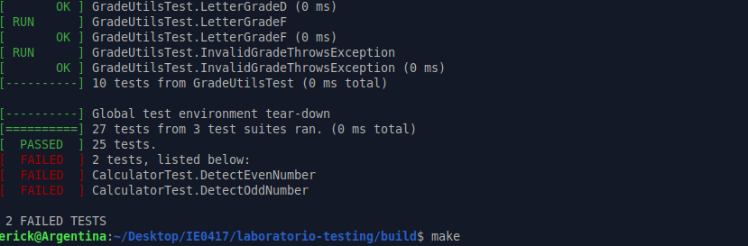
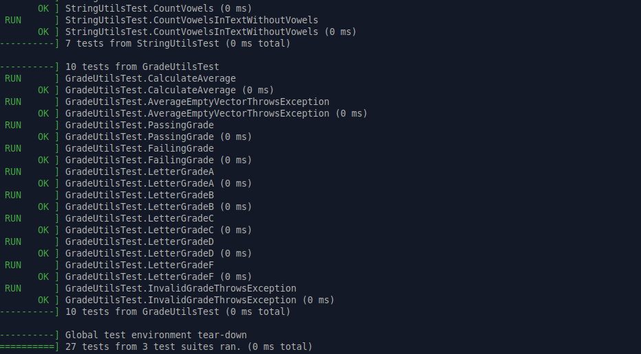

# Parte 5: Pruebas fallidas y corrección de errores

## 5.1 Objetivo

Observar cómo una prueba automatizada ayuda a encontrar errores en el código.

En esta parte se modificó intencionalmente la función `is_even` para que produjera un resultado incorrecto. Luego se ejecutaron las pruebas unitarias con Google Test para observar cuáles fallaban, interpretar el mensaje de error y corregir la función.

---

## 5.2 Cambio incorrecto realizado

El archivo modificado fue:

```bash
src/calculator.cpp
```

La función original correcta era:

```cpp
bool is_even(int number) {
    return number % 2 == 0;
}
```

Para provocar un fallo intencional, se modificó temporalmente de la siguiente manera:

```cpp
bool is_even(int number) {
    return number % 2 == 1;
}
```

Este cambio es incorrecto porque hace que la función retorne `true` cuando el número es impar y `false` cuando el número es par.

---

## 5.3 Comandos ejecutados

Después de modificar la función, se compiló nuevamente el proyecto desde la carpeta `build`:

```bash
make
```

Luego se ejecutaron las pruebas:

```bash
./run_tests
```

---

## 5.4 Pruebas que fallaron

Después de introducir el error, fallaron dos pruebas:

```text
CalculatorTest.DetectEvenNumber
CalculatorTest.DetectOddNumber
```

El resumen final indicó:

```bash
[  PASSED  ] 25 tests.
[  FAILED  ] 2 tests, listed below:
[  FAILED  ] CalculatorTest.DetectEvenNumber
[  FAILED  ] CalculatorTest.DetectOddNumber

 2 FAILED TESTS
```

Esto muestra que Google Test ejecutó 27 pruebas en total. De esas, 25 pasaron y 2 fallaron.

---

## 5.5 Mensaje de error mostrado por Google Test

La primera prueba fallida fue:

```bash
[ RUN      ] CalculatorTest.DetectEvenNumber
/home/erick/Desktop/IE0417/laboratorio-testing/tests/test_calculator.cpp:30: Failure
Value of: is_even(8)
  Actual: false
Expected: true
[  FAILED  ] CalculatorTest.DetectEvenNumber (0 ms)
```

La prueba esperaba que `is_even(8)` retornara `true`, porque `8` es un número par. Sin embargo, la función retornó `false`.

La segunda prueba fallida fue:

```bash
[ RUN      ] CalculatorTest.DetectOddNumber
/home/erick/Desktop/IE0417/laboratorio-testing/tests/test_calculator.cpp:34: Failure
Value of: is_even(7)
  Actual: true
Expected: false
[  FAILED  ] CalculatorTest.DetectOddNumber (0 ms)
```

La prueba esperaba que `is_even(7)` retornara `false`, porque `7` es un número impar. Sin embargo, la función retornó `true`.

---

## 5.6 Qué esperaba la prueba

La prueba `DetectEvenNumber` esperaba que un número par fuera identificado correctamente:

```cpp
TEST(CalculatorTest, DetectEvenNumber) {
    EXPECT_TRUE(is_even(8));
}
```

Como `8` es par, el resultado esperado era:

```text
true
```

La prueba `DetectOddNumber` esperaba que un número impar fuera identificado correctamente:

```cpp
TEST(CalculatorTest, DetectOddNumber) {
    EXPECT_FALSE(is_even(7));
}
```

Como `7` es impar, el resultado esperado era:

```text
false
```

---

## 5.7 Qué obtuvo realmente

Al modificar incorrectamente la función, los resultados se invirtieron.

Para el número `8`, la función retornó:

```text
false
```

cuando debía retornar:

```text
true
```

Para el número `7`, la función retornó:

```text
true
```

cuando debía retornar:

```text
false
```

Esto ocurrió porque la condición usada fue:

```cpp
number % 2 == 1
```

Esa condición identifica números impares, no números pares.

---

## 5.8 Corrección realizada

La corrección consistió en devolver la función `is_even` a su lógica correcta:

```cpp
bool is_even(int number) {
    return number % 2 == 0;
}
```

Esta condición verifica si el residuo de dividir el número entre `2` es `0`. Si el residuo es `0`, entonces el número es par.

---

## 5.9 Resultado final después de corregir

Después de corregir la función, se volvió a compilar el proyecto:

```bash
make
```

Luego se ejecutaron nuevamente las pruebas:

```bash
./run_tests
```

Resultado final:

```bash
[==========] 27 tests from 3 test suites ran. (0 ms total)
[  PASSED  ] 27 tests.
```

Esto indica que todas las pruebas pasaron correctamente después de corregir la función.

---

## 5.10 Evidencia completa de terminal

```bash
erick@Argentina:~/Desktop/IE0417/laboratorio-testing/build$ make
[  6%] Building CXX object CMakeFiles/project_lib.dir/src/calculator.cpp.o
[ 12%] Linking CXX static library libproject_lib.a
[ 25%] Built target project_lib
[ 37%] Built target gtest
[ 50%] Built target gtest_main
[ 56%] Building CXX object CMakeFiles/run_tests.dir/tests/test_calculator.cpp.o
[ 62%] Linking CXX executable run_tests
[ 75%] Built target run_tests
[ 87%] Built target gmock
[100%] Built target gmock_main

erick@Argentina:~/Desktop/IE0417/laboratorio-testing/build$ ./run_tests
Running main() from /home/erick/Desktop/IE0417/laboratorio-testing/build/_deps/googletest-src/googletest/src/gtest_main.cc
[==========] Running 27 tests from 3 test suites.
[----------] Global test environment set-up.
[----------] 10 tests from CalculatorTest
[ RUN      ] CalculatorTest.AddPositiveNumbers
[       OK ] CalculatorTest.AddPositiveNumbers (0 ms)
[ RUN      ] CalculatorTest.AddNegativeNumbers
[       OK ] CalculatorTest.AddNegativeNumbers (0 ms)
[ RUN      ] CalculatorTest.SubtractNumbers
[       OK ] CalculatorTest.SubtractNumbers (0 ms)
[ RUN      ] CalculatorTest.MultiplyNumbers
[       OK ] CalculatorTest.MultiplyNumbers (0 ms)
[ RUN      ] CalculatorTest.DivideNumbers
[       OK ] CalculatorTest.DivideNumbers (0 ms)
[ RUN      ] CalculatorTest.DivideByZeroThrowsException
[       OK ] CalculatorTest.DivideByZeroThrowsException (0 ms)
[ RUN      ] CalculatorTest.DetectEvenNumber
/home/erick/Desktop/IE0417/laboratorio-testing/tests/test_calculator.cpp:30: Failure
Value of: is_even(8)
  Actual: false
Expected: true
[  FAILED  ] CalculatorTest.DetectEvenNumber (0 ms)
[ RUN      ] CalculatorTest.DetectOddNumber
/home/erick/Desktop/IE0417/laboratorio-testing/tests/test_calculator.cpp:34: Failure
Value of: is_even(7)
  Actual: true
Expected: false
[  FAILED  ] CalculatorTest.DetectOddNumber (0 ms)
[ RUN      ] CalculatorTest.MultipleExpectChecks
[       OK ] CalculatorTest.MultipleExpectChecks (0 ms)
[ RUN      ] CalculatorTest.AssertBeforeDivision
[       OK ] CalculatorTest.AssertBeforeDivision (0 ms)
[----------] 10 tests from CalculatorTest (0 ms total)

[----------] 7 tests from StringUtilsTest
[ RUN      ] StringUtilsTest.ConvertTextToUppercase
[       OK ] StringUtilsTest.ConvertTextToUppercase (0 ms)
[ RUN      ] StringUtilsTest.ConvertMixedTextToUppercase
[       OK ] StringUtilsTest.ConvertMixedTextToUppercase (0 ms)
[ RUN      ] StringUtilsTest.DetectSimplePalindrome
[       OK ] StringUtilsTest.DetectSimplePalindrome (0 ms)
[ RUN      ] StringUtilsTest.DetectPalindromeWithSpaces
[       OK ] StringUtilsTest.DetectPalindromeWithSpaces (0 ms)
[ RUN      ] StringUtilsTest.DetectNonPalindrome
[       OK ] StringUtilsTest.DetectNonPalindrome (0 ms)
[ RUN      ] StringUtilsTest.CountVowels
[       OK ] StringUtilsTest.CountVowels (0 ms)
[ RUN      ] StringUtilsTest.CountVowelsInTextWithoutVowels
[       OK ] StringUtilsTest.CountVowelsInTextWithoutVowels (0 ms)
[----------] 7 tests from StringUtilsTest (0 ms total)

[----------] 10 tests from GradeUtilsTest
[ RUN      ] GradeUtilsTest.CalculateAverage
[       OK ] GradeUtilsTest.CalculateAverage (0 ms)
[ RUN      ] GradeUtilsTest.AverageEmptyVectorThrowsException
[       OK ] GradeUtilsTest.AverageEmptyVectorThrowsException (0 ms)
[ RUN      ] GradeUtilsTest.PassingGrade
[       OK ] GradeUtilsTest.PassingGrade (0 ms)
[ RUN      ] GradeUtilsTest.FailingGrade
[       OK ] GradeUtilsTest.FailingGrade (0 ms)
[ RUN      ] GradeUtilsTest.LetterGradeA
[       OK ] GradeUtilsTest.LetterGradeA (0 ms)
[ RUN      ] GradeUtilsTest.LetterGradeB
[       OK ] GradeUtilsTest.LetterGradeB (0 ms)
[ RUN      ] GradeUtilsTest.LetterGradeC
[       OK ] GradeUtilsTest.LetterGradeC (0 ms)
[ RUN      ] GradeUtilsTest.LetterGradeD
[       OK ] GradeUtilsTest.LetterGradeD (0 ms)
[ RUN      ] GradeUtilsTest.LetterGradeF
[       OK ] GradeUtilsTest.LetterGradeF (0 ms)
[ RUN      ] GradeUtilsTest.InvalidGradeThrowsException
[       OK ] GradeUtilsTest.InvalidGradeThrowsException (0 ms)
[----------] 10 tests from GradeUtilsTest (0 ms total)

[----------] Global test environment tear-down
[==========] 27 tests from 3 test suites ran. (0 ms total)
[  PASSED  ] 25 tests.
[  FAILED  ] 2 tests, listed below:
[  FAILED  ] CalculatorTest.DetectEvenNumber
[  FAILED  ] CalculatorTest.DetectOddNumber

 2 FAILED TESTS

erick@Argentina:~/Desktop/IE0417/laboratorio-testing/build$ make
[  6%] Building CXX object CMakeFiles/project_lib.dir/src/calculator.cpp.o
[ 12%] Linking CXX static library libproject_lib.a
[ 25%] Built target project_lib
[ 37%] Built target gtest
[ 50%] Built target gtest_main
[ 56%] Linking CXX executable run_tests
[ 75%] Built target run_tests
[ 87%] Built target gmock
[100%] Built target gmock_main

erick@Argentina:~/Desktop/IE0417/laboratorio-testing/build$ ./run_tests
Running main() from /home/erick/Desktop/IE0417/laboratorio-testing/build/_deps/googletest-src/googletest/src/gtest_main.cc
[==========] Running 27 tests from 3 test suites.
[----------] Global test environment set-up.
[----------] 10 tests from CalculatorTest
[ RUN      ] CalculatorTest.AddPositiveNumbers
[       OK ] CalculatorTest.AddPositiveNumbers (0 ms)
[ RUN      ] CalculatorTest.AddNegativeNumbers
[       OK ] CalculatorTest.AddNegativeNumbers (0 ms)
[ RUN      ] CalculatorTest.SubtractNumbers
[       OK ] CalculatorTest.SubtractNumbers (0 ms)
[ RUN      ] CalculatorTest.MultiplyNumbers
[       OK ] CalculatorTest.MultiplyNumbers (0 ms)
[ RUN      ] CalculatorTest.DivideNumbers
[       OK ] CalculatorTest.DivideNumbers (0 ms)
[ RUN      ] CalculatorTest.DivideByZeroThrowsException
[       OK ] CalculatorTest.DivideByZeroThrowsException (0 ms)
[ RUN      ] CalculatorTest.DetectEvenNumber
[       OK ] CalculatorTest.DetectEvenNumber (0 ms)
[ RUN      ] CalculatorTest.DetectOddNumber
[       OK ] CalculatorTest.DetectOddNumber (0 ms)
[ RUN      ] CalculatorTest.MultipleExpectChecks
[       OK ] CalculatorTest.MultipleExpectChecks (0 ms)
[ RUN      ] CalculatorTest.AssertBeforeDivision
[       OK ] CalculatorTest.AssertBeforeDivision (0 ms)
[----------] 10 tests from CalculatorTest (0 ms total)

[----------] 7 tests from StringUtilsTest
[ RUN      ] StringUtilsTest.ConvertTextToUppercase
[       OK ] StringUtilsTest.ConvertTextToUppercase (0 ms)
[ RUN      ] StringUtilsTest.ConvertMixedTextToUppercase
[       OK ] StringUtilsTest.ConvertMixedTextToUppercase (0 ms)
[ RUN      ] StringUtilsTest.DetectSimplePalindrome
[       OK ] StringUtilsTest.DetectSimplePalindrome (0 ms)
[ RUN      ] StringUtilsTest.DetectPalindromeWithSpaces
[       OK ] StringUtilsTest.DetectPalindromeWithSpaces (0 ms)
[ RUN      ] StringUtilsTest.DetectNonPalindrome
[       OK ] StringUtilsTest.DetectNonPalindrome (0 ms)
[ RUN      ] StringUtilsTest.CountVowels
[       OK ] StringUtilsTest.CountVowels (0 ms)
[ RUN      ] StringUtilsTest.CountVowelsInTextWithoutVowels
[       OK ] StringUtilsTest.CountVowelsInTextWithoutVowels (0 ms)
[----------] 7 tests from StringUtilsTest (0 ms total)

[----------] 10 tests from GradeUtilsTest
[ RUN      ] GradeUtilsTest.CalculateAverage
[       OK ] GradeUtilsTest.CalculateAverage (0 ms)
[ RUN      ] GradeUtilsTest.AverageEmptyVectorThrowsException
[       OK ] GradeUtilsTest.AverageEmptyVectorThrowsException (0 ms)
[ RUN      ] GradeUtilsTest.PassingGrade
[       OK ] GradeUtilsTest.PassingGrade (0 ms)
[ RUN      ] GradeUtilsTest.FailingGrade
[       OK ] GradeUtilsTest.FailingGrade (0 ms)
[ RUN      ] GradeUtilsTest.LetterGradeA
[       OK ] GradeUtilsTest.LetterGradeA (0 ms)
[ RUN      ] GradeUtilsTest.LetterGradeB
[       OK ] GradeUtilsTest.LetterGradeB (0 ms)
[ RUN      ] GradeUtilsTest.LetterGradeC
[       OK ] GradeUtilsTest.LetterGradeC (0 ms)
[ RUN      ] GradeUtilsTest.LetterGradeD
[       OK ] GradeUtilsTest.LetterGradeD (0 ms)
[ RUN      ] GradeUtilsTest.LetterGradeF
[       OK ] GradeUtilsTest.LetterGradeF (0 ms)
[ RUN      ] GradeUtilsTest.InvalidGradeThrowsException
[       OK ] GradeUtilsTest.InvalidGradeThrowsException (0 ms)
[----------] 10 tests from GradeUtilsTest (0 ms total)

[----------] Global test environment tear-down
[==========] 27 tests from 3 test suites ran. (0 ms total)
[  PASSED  ] 27 tests.
```

---

## 5.11 Evidencia en imágenes

A continuación se muestran las capturas correspondientes al fallo intencional y a la corrección del programa.

### Pruebas fallidas

La siguiente imagen muestra la ejecución de `./run_tests` después de modificar incorrectamente la función `is_even`.



---

### Pruebas corregidas

La siguiente imagen muestra la ejecución de `./run_tests` después de corregir la función `is_even`.



---

# 5.12 Preguntas de reflexión

## 1. ¿Cómo ayudó Google Test a identificar el error?

Google Test ayudó a identificar el error mostrando exactamente cuáles pruebas fallaron y qué valores se esperaban.

En este caso, indicó que fallaron:

```text
CalculatorTest.DetectEvenNumber
CalculatorTest.DetectOddNumber
```

Además, mostró que `is_even(8)` retornó `false` cuando se esperaba `true`, y que `is_even(7)` retornó `true` cuando se esperaba `false`.

Esto permitió ubicar rápidamente el problema en la función `is_even`.

---

## 2. ¿Qué información útil muestra una prueba fallida?

Una prueba fallida muestra información muy útil, como:

- Nombre de la prueba que falló.
- Archivo donde está la prueba.
- Línea donde ocurrió el fallo.
- Valor esperado.
- Valor obtenido.
- Resumen de cuántas pruebas pasaron y cuántas fallaron.

En este ejercicio, Google Test mostró:

```bash
Value of: is_even(8)
  Actual: false
Expected: true
```

y también:

```bash
Value of: is_even(7)
  Actual: true
Expected: false
```

Con eso se pudo entender claramente que la lógica de paridad estaba invertida.

---

## 3. ¿Por qué es importante ejecutar pruebas después de modificar código?

Es importante ejecutar pruebas después de modificar código porque cualquier cambio puede introducir errores nuevos.

Aunque el cambio parezca pequeño, como modificar una condición, puede afectar el comportamiento de una función. En este caso, cambiar:

```cpp
number % 2 == 0
```

por:

```cpp
number % 2 == 1
```

provocó que la función identificara incorrectamente números pares e impares.

Las pruebas permiten detectar este tipo de errores inmediatamente.

---

## 4. ¿Qué riesgo existe si se cambia código y no se ejecutan las pruebas?

Si se cambia código y no se ejecutan las pruebas, existe el riesgo de dejar errores sin detectar.

El programa podría compilar correctamente, pero comportarse de forma incorrecta. Esto puede afectar otras partes del sistema y hacer que el error se encuentre más tarde, cuando sea más difícil corregirlo.

Por eso, ejecutar las pruebas después de cada cambio importante ayuda a mantener la calidad del software.

---

## 5.13 Reflexión breve

Esta parte permitió observar cómo una prueba automatizada puede detectar rápidamente un error introducido en el código.

La función `is_even` fue modificada de forma incorrecta y Google Test mostró que las pruebas relacionadas con números pares e impares fallaron. Los mensajes indicaron claramente qué se esperaba y qué se obtuvo realmente.

Después de corregir la función, se ejecutaron nuevamente las pruebas y todas pasaron correctamente. Esto demuestra que las pruebas automatizadas son útiles para validar cambios y evitar que errores simples lleguen a etapas posteriores del desarrollo.