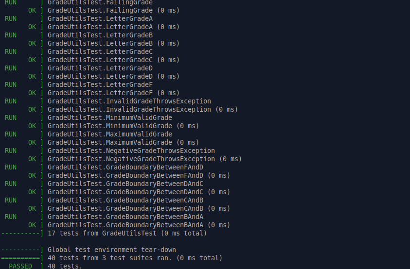
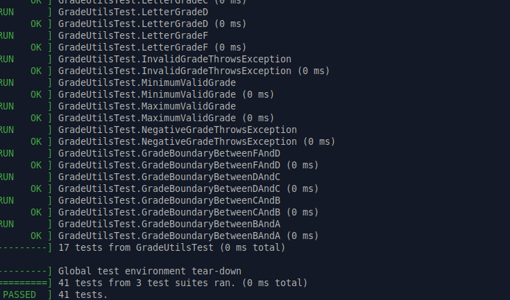
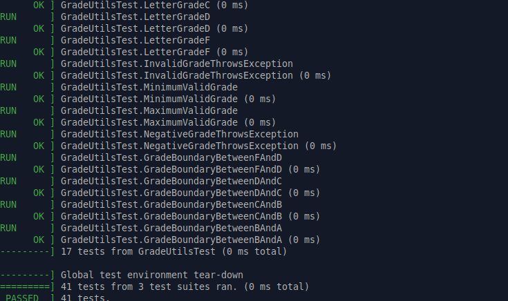

# Parte 6: Diseño de casos borde

## 6.1 Objetivo

Diseñar pruebas que no solo verifiquen casos normales, sino también límites o casos especiales.

En esta parte se agregaron pruebas adicionales para verificar el comportamiento del programa en casos borde. Estos casos son importantes porque muchos errores aparecen justamente en los límites de una condición, por ejemplo en valores como `0`, `60`, `70`, `80`, `90` o `100`.

---

## 6.2 ¿Qué es un caso borde?

Un caso borde es una entrada que se encuentra justo en el límite de una condición importante del programa.

Por ejemplo, si una función clasifica una nota como aprobada a partir de `70`, entonces los valores `69` y `70` son casos borde. Probar esos valores permite verificar si la condición fue implementada correctamente.

En este laboratorio se agregaron casos borde para funciones matemáticas, cadenas de texto y calificaciones.

---

## 6.3 Casos borde agregados

### Casos borde en `test_calculator.cpp`

Se agregaron pruebas para división con números negativos y para verificar que el cero sea considerado par:

```cpp
TEST(CalculatorTest, DivideNegativeNumbers) {
    EXPECT_EQ(divide(-10, -2), 5);
}

TEST(CalculatorTest, DividePositiveByNegative) {
    EXPECT_EQ(divide(10, -2), -5);
}

TEST(CalculatorTest, ZeroIsEven) {
    EXPECT_TRUE(is_even(0));
}
```

Estas pruebas son importantes porque verifican que la división funciona correctamente con signos negativos y que la función `is_even` maneja correctamente el valor `0`.

---

### Casos borde en `test_string_utils.cpp`

Se agregaron pruebas para cadenas vacías y cadenas de un solo carácter:

```cpp
TEST(StringUtilsTest, EmptyStringToUppercase) {
    EXPECT_EQ(to_uppercase(""), "");
}

TEST(StringUtilsTest, EmptyStringIsPalindrome) {
    EXPECT_TRUE(is_palindrome(""));
}

TEST(StringUtilsTest, SingleLetterIsPalindrome) {
    EXPECT_TRUE(is_palindrome("a"));
}
```

Estas pruebas son importantes porque una cadena vacía o una cadena de un solo carácter pueden comportarse distinto a una cadena normal. Además, ayudan a comprobar que las funciones no fallen con entradas mínimas.

---

### Casos borde en `test_grade_utils.cpp`

Se agregaron pruebas para los límites de las calificaciones:

```cpp
TEST(GradeUtilsTest, MinimumValidGrade) {
    EXPECT_EQ(letter_grade(0), 'F');
}

TEST(GradeUtilsTest, MaximumValidGrade) {
    EXPECT_EQ(letter_grade(100), 'A');
}

TEST(GradeUtilsTest, NegativeGradeThrowsException) {
    EXPECT_THROW(letter_grade(-1), std::invalid_argument);
}

TEST(GradeUtilsTest, GradeBoundaryBetweenFAndD) {
    EXPECT_EQ(letter_grade(59), 'F');
    EXPECT_EQ(letter_grade(60), 'D');
}

TEST(GradeUtilsTest, GradeBoundaryBetweenDAndC) {
    EXPECT_EQ(letter_grade(69), 'D');
    EXPECT_EQ(letter_grade(70), 'C');
}

TEST(GradeUtilsTest, GradeBoundaryBetweenCAndB) {
    EXPECT_EQ(letter_grade(79), 'C');
    EXPECT_EQ(letter_grade(80), 'B');
}

TEST(GradeUtilsTest, GradeBoundaryBetweenBAndA) {
    EXPECT_EQ(letter_grade(89), 'B');
    EXPECT_EQ(letter_grade(90), 'A');
}
```

Estas pruebas revisan los cambios de categoría entre letras de calificación. Son importantes porque un error en el uso de `>` o `>=` podría clasificar incorrectamente una nota justo en el límite.

---

## 6.4 Resultado de las pruebas

Después de agregar los casos borde, se compiló el proyecto desde la carpeta `build`:

```bash
make
```

Luego se ejecutaron las pruebas con:

```bash
./run_tests
```

El resultado mostró que se ejecutaron 40 pruebas en total:

```bash
[==========] Running 40 tests from 3 test suites.
```

Las pruebas se distribuyeron así:

```text
13 pruebas en CalculatorTest
10 pruebas en StringUtilsTest
17 pruebas en GradeUtilsTest
```

El resultado final fue exitoso:

```bash
[==========] 40 tests from 3 test suites ran. (0 ms total)
[  PASSED  ] 40 tests.
```

Esto indica que todas las pruebas pasaron correctamente después de agregar los casos borde.

---

## 6.5 Evidencia completa de terminal

```bash
erick@Argentina:~/Desktop/IE0417/laboratorio-testing/build$ make
[ 25%] Built target project_lib
[ 37%] Built target gtest
[ 50%] Built target gtest_main
[ 56%] Building CXX object CMakeFiles/run_tests.dir/tests/test_calculator.cpp.o
[ 62%] Building CXX object CMakeFiles/run_tests.dir/tests/test_string_utils.cpp.o
[ 68%] Building CXX object CMakeFiles/run_tests.dir/tests/test_grade_utils.cpp.o
[ 75%] Linking CXX executable run_tests
[ 75%] Built target run_tests
[ 87%] Built target gmock
[100%] Built target gmock_main

erick@Argentina:~/Desktop/IE0417/laboratorio-testing/build$ ./run_tests
Running main() from /home/erick/Desktop/IE0417/laboratorio-testing/build/_deps/googletest-src/googletest/src/gtest_main.cc
[==========] Running 40 tests from 3 test suites.
[----------] Global test environment set-up.
[----------] 13 tests from CalculatorTest
[ RUN      ] CalculatorTest.AddPositiveNumbers
[       OK ] CalculatorTest.AddPositiveNumbers (0 ms)
[ RUN      ] CalculatorTest.AddNegativeNumbers
[       OK ] CalculatorTest.AddNegativeNumbers (0 ms)
[ RUN      ] CalculatorTest.SubtractNumbers
[       OK ] CalculatorTest.SubtractNumbers (0 ms)
[ RUN      ] CalculatorTest.MultiplyNumbers
[       OK ] CalculatorTest.MultiplyNumbers (0 ms)
[ RUN      ] CalculatorTest.DivideNumbers
[       OK ] CalculatorTest.DivideNumbers (0 ms)
[ RUN      ] CalculatorTest.DivideByZeroThrowsException
[       OK ] CalculatorTest.DivideByZeroThrowsException (0 ms)
[ RUN      ] CalculatorTest.DetectEvenNumber
[       OK ] CalculatorTest.DetectEvenNumber (0 ms)
[ RUN      ] CalculatorTest.DetectOddNumber
[       OK ] CalculatorTest.DetectOddNumber (0 ms)
[ RUN      ] CalculatorTest.MultipleExpectChecks
[       OK ] CalculatorTest.MultipleExpectChecks (0 ms)
[ RUN      ] CalculatorTest.AssertBeforeDivision
[       OK ] CalculatorTest.AssertBeforeDivision (0 ms)
[ RUN      ] CalculatorTest.DivideNegativeNumbers
[       OK ] CalculatorTest.DivideNegativeNumbers (0 ms)
[ RUN      ] CalculatorTest.DividePositiveByNegative
[       OK ] CalculatorTest.DividePositiveByNegative (0 ms)
[ RUN      ] CalculatorTest.ZeroIsEven
[       OK ] CalculatorTest.ZeroIsEven (0 ms)
[----------] 13 tests from CalculatorTest (0 ms total)

[----------] 10 tests from StringUtilsTest
[ RUN      ] StringUtilsTest.ConvertTextToUppercase
[       OK ] StringUtilsTest.ConvertTextToUppercase (0 ms)
[ RUN      ] StringUtilsTest.ConvertMixedTextToUppercase
[       OK ] StringUtilsTest.ConvertMixedTextToUppercase (0 ms)
[ RUN      ] StringUtilsTest.DetectSimplePalindrome
[       OK ] StringUtilsTest.DetectSimplePalindrome (0 ms)
[ RUN      ] StringUtilsTest.DetectPalindromeWithSpaces
[       OK ] StringUtilsTest.DetectPalindromeWithSpaces (0 ms)
[ RUN      ] StringUtilsTest.DetectNonPalindrome
[       OK ] StringUtilsTest.DetectNonPalindrome (0 ms)
[ RUN      ] StringUtilsTest.CountVowels
[       OK ] StringUtilsTest.CountVowels (0 ms)
[ RUN      ] StringUtilsTest.CountVowelsInTextWithoutVowels
[       OK ] StringUtilsTest.CountVowelsInTextWithoutVowels (0 ms)
[ RUN      ] StringUtilsTest.EmptyStringToUppercase
[       OK ] StringUtilsTest.EmptyStringToUppercase (0 ms)
[ RUN      ] StringUtilsTest.EmptyStringIsPalindrome
[       OK ] StringUtilsTest.EmptyStringIsPalindrome (0 ms)
[ RUN      ] StringUtilsTest.SingleLetterIsPalindrome
[       OK ] StringUtilsTest.SingleLetterIsPalindrome (0 ms)
[----------] 10 tests from StringUtilsTest (0 ms total)

[----------] 17 tests from GradeUtilsTest
[ RUN      ] GradeUtilsTest.CalculateAverage
[       OK ] GradeUtilsTest.CalculateAverage (0 ms)
[ RUN      ] GradeUtilsTest.AverageEmptyVectorThrowsException
[       OK ] GradeUtilsTest.AverageEmptyVectorThrowsException (0 ms)
[ RUN      ] GradeUtilsTest.PassingGrade
[       OK ] GradeUtilsTest.PassingGrade (0 ms)
[ RUN      ] GradeUtilsTest.FailingGrade
[       OK ] GradeUtilsTest.FailingGrade (0 ms)
[ RUN      ] GradeUtilsTest.LetterGradeA
[       OK ] GradeUtilsTest.LetterGradeA (0 ms)
[ RUN      ] GradeUtilsTest.LetterGradeB
[       OK ] GradeUtilsTest.LetterGradeB (0 ms)
[ RUN      ] GradeUtilsTest.LetterGradeC
[       OK ] GradeUtilsTest.LetterGradeC (0 ms)
[ RUN      ] GradeUtilsTest.LetterGradeD
[       OK ] GradeUtilsTest.LetterGradeD (0 ms)
[ RUN      ] GradeUtilsTest.LetterGradeF
[       OK ] GradeUtilsTest.LetterGradeF (0 ms)
[ RUN      ] GradeUtilsTest.InvalidGradeThrowsException
[       OK ] GradeUtilsTest.InvalidGradeThrowsException (0 ms)
[ RUN      ] GradeUtilsTest.MinimumValidGrade
[       OK ] GradeUtilsTest.MinimumValidGrade (0 ms)
[ RUN      ] GradeUtilsTest.MaximumValidGrade
[       OK ] GradeUtilsTest.MaximumValidGrade (0 ms)
[ RUN      ] GradeUtilsTest.NegativeGradeThrowsException
[       OK ] GradeUtilsTest.NegativeGradeThrowsException (0 ms)
[ RUN      ] GradeUtilsTest.GradeBoundaryBetweenFAndD
[       OK ] GradeUtilsTest.GradeBoundaryBetweenFAndD (0 ms)
[ RUN      ] GradeUtilsTest.GradeBoundaryBetweenDAndC
[       OK ] GradeUtilsTest.GradeBoundaryBetweenDAndC (0 ms)
[ RUN      ] GradeUtilsTest.GradeBoundaryBetweenCAndB
[       OK ] GradeUtilsTest.GradeBoundaryBetweenCAndB (0 ms)
[ RUN      ] GradeUtilsTest.GradeBoundaryBetweenBAndA
[       OK ] GradeUtilsTest.GradeBoundaryBetweenBAndA (0 ms)
[----------] 17 tests from GradeUtilsTest (0 ms total)

[----------] Global test environment tear-down
[==========] 40 tests from 3 test suites ran. (0 ms total)
[  PASSED  ] 40 tests.
```

---

## 6.6 Evidencia en imágenes

A continuación se muestran las capturas correspondientes a la compilación y ejecución de los casos borde.

### Compilación después de agregar casos borde

La siguiente imagen muestra la ejecución de:

```bash
make
```


---

### Ejecución de pruebas de casos borde

La siguiente imagen muestra la ejecución de:

```bash
./run_tests
```

En la salida se observa que se ejecutaron 40 pruebas y todas pasaron correctamente.



---

# 6.7 Preguntas de reflexión

## 1. ¿Por qué no basta con probar casos normales?

No basta con probar casos normales porque muchos errores aparecen en los límites o en entradas especiales.

Por ejemplo, una función puede funcionar bien con una nota como `85`, pero fallar con notas justo en los límites como `59`, `60`, `69`, `70`, `89` o `90`.

Los casos normales verifican usos comunes, pero los casos borde ayudan a encontrar errores que pueden pasar desapercibidos.

---

## 2. ¿Qué es un caso borde?

Un caso borde es una entrada que se encuentra justo en el límite de una condición importante del programa.

Por ejemplo, en la función `letter_grade`, los valores `60`, `70`, `80` y `90` son casos borde porque representan el cambio entre una letra y otra.

También valores como `0` y `100` son casos borde porque son los límites mínimo y máximo permitidos.

---

## 3. ¿Qué es un caso inválido?

Un caso inválido es una entrada que la función no debería aceptar.

Por ejemplo, en la función `letter_grade`, una nota menor que `0` o mayor que `100` es inválida.

En este laboratorio se probó:

```cpp
EXPECT_THROW(letter_grade(-1), std::invalid_argument);
```

Esto verifica que la función rechace correctamente una nota fuera del rango permitido.

---

## 4. ¿Qué diferencia hay entre probar `85` y probar exactamente `80`, `90` o `70`?

Probar `85` es un caso normal, porque está dentro del rango de una calificación `B`.

En cambio, probar `80`, `90` o `70` es más importante para revisar los límites entre categorías.

Por ejemplo:

```text
70 es el inicio de C
80 es el inicio de B
90 es el inicio de A
```

Si la condición del código estuviera mal escrita, por ejemplo usando `>` en lugar de `>=`, estos valores podrían clasificarse incorrectamente.

---

## 5. ¿Cómo puede un caso borde revelar errores ocultos?

Un caso borde puede revelar errores ocultos porque prueba justo donde cambia el comportamiento del programa.

Por ejemplo, si una función debe retornar `'C'` para notas desde `70`, pero el código usa una condición incorrecta, una prueba con `70` puede mostrar el error.

Sin probar casos borde, el programa podría parecer correcto con valores normales, pero fallar en valores límite.

---

## 6.8 Reflexión breve

Esta parte permitió reforzar la importancia de probar más allá de los casos normales.

Al agregar casos borde, se verificó que las funciones funcionan correctamente con valores límite, cadenas vacías, cadenas de un solo carácter, divisiones con números negativos y límites de calificaciones.

Después de ejecutar las pruebas, el resultado fue exitoso: las 40 pruebas pasaron correctamente. Esto muestra que el código respondió bien tanto a casos normales como a casos borde e inválidos.


---

# Parte 7: Uso de semillas en pruebas

## 7.1 Objetivo

Comprender por qué una semilla permite reproducir pruebas que usan valores aleatorios.

En esta parte se agregó una prueba con números aleatorios controlados mediante una semilla fija. Esto permite que los valores generados sean los mismos en cada ejecución, haciendo que la prueba sea repetible y útil para depuración.

---

## 7.2 Prueba agregada

En el archivo:

```bash
tests/test_calculator.cpp
```

se agregó la librería:

```cpp
#include <random>
```

Luego se agregó la siguiente prueba:

```cpp
TEST(CalculatorTest, RandomAdditionsWithFixedSeed) {
    std::mt19937 generator(12345);
    std::uniform_int_distribution<int> distribution(-100, 100);

    for (int i = 0; i < 10; i++) {
        int a = distribution(generator);
        int b = distribution(generator);

        EXPECT_EQ(add(a, b), a + b);
    }
}
```

Esta prueba genera diez pares de números aleatorios entre `-100` y `100`, y verifica que la función `add` retorne correctamente la suma de cada par.

---

## 7.3 ¿Qué hace la semilla?

La semilla es el valor inicial que se le da al generador de números aleatorios.

En este caso, la semilla usada fue:

```cpp
std::mt19937 generator(12345);
```

Esto significa que cada vez que se ejecute la prueba, el generador producirá la misma secuencia de números.

Aunque la prueba usa valores aleatorios, la semilla fija hace que esos valores sean reproducibles. Esto es importante porque, si una prueba falla, se puede volver a ejecutar bajo las mismas condiciones para analizar el error.

---

## 7.4 ¿Por qué se usa una semilla fija?

Se usa una semilla fija para que la prueba sea determinista.

Una prueba determinista produce el mismo resultado cada vez que se ejecuta bajo las mismas condiciones. Esto es importante en software testing porque permite confiar en los resultados.

Si se usaran números aleatorios sin controlar, una prueba podría pasar una vez y fallar en otra ejecución, aunque el código no haya cambiado. Eso haría más difícil saber si el problema está en el código o en los datos generados.

Con una semilla fija como `12345`, la prueba siempre usa la misma secuencia de valores. Esto facilita repetir el escenario exacto si ocurre un fallo.

---

## 7.5 ¿Qué pasó al cambiar la semilla?

Como actividad experimental, se cambió temporalmente la semilla:

```cpp
std::mt19937 generator(54321);
```

Al cambiar la semilla, el generador produjo una secuencia diferente de números aleatorios. Sin embargo, la prueba siguió pasando porque la función `add` debe funcionar correctamente con cualquier par de enteros dentro del rango probado.

Después de la prueba, se regresó a la semilla original:

```cpp
std::mt19937 generator(12345);
```

Esto se hizo para mantener la prueba reproducible y documentada.

---

## 7.6 ¿Por qué esto ayuda en debugging?

El uso de una semilla fija ayuda en debugging porque permite repetir exactamente los mismos valores de prueba.

Si una prueba con números aleatorios falla, la semilla permite volver a generar la misma secuencia y analizar el problema con mayor facilidad.

Sin una semilla fija, el error podría aparecer una vez y luego desaparecer en la siguiente ejecución, haciendo más difícil encontrar la causa.

---

## 7.7 Comandos ejecutados

Desde la carpeta `build`, se compiló el proyecto con:

```bash
make
```

Luego se ejecutaron las pruebas con:

```bash
./run_tests
```

---

## 7.8 Resultado de las pruebas

Después de agregar la prueba con semilla fija, se ejecutaron 41 pruebas en total:

```bash
[==========] Running 41 tests from 3 test suites.
```

La prueba nueva apareció dentro del conjunto `CalculatorTest`:

```bash
[ RUN      ] CalculatorTest.RandomAdditionsWithFixedSeed
[       OK ] CalculatorTest.RandomAdditionsWithFixedSeed (0 ms)
```

El resumen final fue:

```bash
[==========] 41 tests from 3 test suites ran. (0 ms total)
[  PASSED  ] 41 tests.
```

Esto indica que todas las pruebas pasaron correctamente.

---

## 7.9 Evidencia completa de terminal

```bash
erick@Argentina:~/Desktop/IE0417/laboratorio-testing/build$ make
[ 25%] Built target project_lib
[ 37%] Built target gtest
[ 50%] Built target gtest_main
[ 56%] Building CXX object CMakeFiles/run_tests.dir/tests/test_calculator.cpp.o
[ 62%] Linking CXX executable run_tests
[ 75%] Built target run_tests
[ 87%] Built target gmock
[100%] Built target gmock_main

erick@Argentina:~/Desktop/IE0417/laboratorio-testing/build$ ./run_tests
Running main() from /home/erick/Desktop/IE0417/laboratorio-testing/build/_deps/googletest-src/googletest/src/gtest_main.cc
[==========] Running 41 tests from 3 test suites.
[----------] Global test environment set-up.
[----------] 14 tests from CalculatorTest
[ RUN      ] CalculatorTest.AddPositiveNumbers
[       OK ] CalculatorTest.AddPositiveNumbers (0 ms)
[ RUN      ] CalculatorTest.AddNegativeNumbers
[       OK ] CalculatorTest.AddNegativeNumbers (0 ms)
[ RUN      ] CalculatorTest.SubtractNumbers
[       OK ] CalculatorTest.SubtractNumbers (0 ms)
[ RUN      ] CalculatorTest.MultiplyNumbers
[       OK ] CalculatorTest.MultiplyNumbers (0 ms)
[ RUN      ] CalculatorTest.DivideNumbers
[       OK ] CalculatorTest.DivideNumbers (0 ms)
[ RUN      ] CalculatorTest.DivideByZeroThrowsException
[       OK ] CalculatorTest.DivideByZeroThrowsException (0 ms)
[ RUN      ] CalculatorTest.DetectEvenNumber
[       OK ] CalculatorTest.DetectEvenNumber (0 ms)
[ RUN      ] CalculatorTest.DetectOddNumber
[       OK ] CalculatorTest.DetectOddNumber (0 ms)
[ RUN      ] CalculatorTest.MultipleExpectChecks
[       OK ] CalculatorTest.MultipleExpectChecks (0 ms)
[ RUN      ] CalculatorTest.AssertBeforeDivision
[       OK ] CalculatorTest.AssertBeforeDivision (0 ms)
[ RUN      ] CalculatorTest.DivideNegativeNumbers
[       OK ] CalculatorTest.DivideNegativeNumbers (0 ms)
[ RUN      ] CalculatorTest.DividePositiveByNegative
[       OK ] CalculatorTest.DividePositiveByNegative (0 ms)
[ RUN      ] CalculatorTest.ZeroIsEven
[       OK ] CalculatorTest.ZeroIsEven (0 ms)
[ RUN      ] CalculatorTest.RandomAdditionsWithFixedSeed
[       OK ] CalculatorTest.RandomAdditionsWithFixedSeed (0 ms)
[----------] 14 tests from CalculatorTest (0 ms total)

[----------] 10 tests from StringUtilsTest
[ RUN      ] StringUtilsTest.ConvertTextToUppercase
[       OK ] StringUtilsTest.ConvertTextToUppercase (0 ms)
[ RUN      ] StringUtilsTest.ConvertMixedTextToUppercase
[       OK ] StringUtilsTest.ConvertMixedTextToUppercase (0 ms)
[ RUN      ] StringUtilsTest.DetectSimplePalindrome
[       OK ] StringUtilsTest.DetectSimplePalindrome (0 ms)
[ RUN      ] StringUtilsTest.DetectPalindromeWithSpaces
[       OK ] StringUtilsTest.DetectPalindromeWithSpaces (0 ms)
[ RUN      ] StringUtilsTest.DetectNonPalindrome
[       OK ] StringUtilsTest.DetectNonPalindrome (0 ms)
[ RUN      ] StringUtilsTest.CountVowels
[       OK ] StringUtilsTest.CountVowels (0 ms)
[ RUN      ] StringUtilsTest.CountVowelsInTextWithoutVowels
[       OK ] StringUtilsTest.CountVowelsInTextWithoutVowels (0 ms)
[ RUN      ] StringUtilsTest.EmptyStringToUppercase
[       OK ] StringUtilsTest.EmptyStringToUppercase (0 ms)
[ RUN      ] StringUtilsTest.EmptyStringIsPalindrome
[       OK ] StringUtilsTest.EmptyStringIsPalindrome (0 ms)
[ RUN      ] StringUtilsTest.SingleLetterIsPalindrome
[       OK ] StringUtilsTest.SingleLetterIsPalindrome (0 ms)
[----------] 10 tests from StringUtilsTest (0 ms total)

[----------] 17 tests from GradeUtilsTest
[ RUN      ] GradeUtilsTest.CalculateAverage
[       OK ] GradeUtilsTest.CalculateAverage (0 ms)
[ RUN      ] GradeUtilsTest.AverageEmptyVectorThrowsException
[       OK ] GradeUtilsTest.AverageEmptyVectorThrowsException (0 ms)
[ RUN      ] GradeUtilsTest.PassingGrade
[       OK ] GradeUtilsTest.PassingGrade (0 ms)
[ RUN      ] GradeUtilsTest.FailingGrade
[       OK ] GradeUtilsTest.FailingGrade (0 ms)
[ RUN      ] GradeUtilsTest.LetterGradeA
[       OK ] GradeUtilsTest.LetterGradeA (0 ms)
[ RUN      ] GradeUtilsTest.LetterGradeB
[       OK ] GradeUtilsTest.LetterGradeB (0 ms)
[ RUN      ] GradeUtilsTest.LetterGradeC
[       OK ] GradeUtilsTest.LetterGradeC (0 ms)
[ RUN      ] GradeUtilsTest.LetterGradeD
[       OK ] GradeUtilsTest.LetterGradeD (0 ms)
[ RUN      ] GradeUtilsTest.LetterGradeF
[       OK ] GradeUtilsTest.LetterGradeF (0 ms)
[ RUN      ] GradeUtilsTest.InvalidGradeThrowsException
[       OK ] GradeUtilsTest.InvalidGradeThrowsException (0 ms)
[ RUN      ] GradeUtilsTest.MinimumValidGrade
[       OK ] GradeUtilsTest.MinimumValidGrade (0 ms)
[ RUN      ] GradeUtilsTest.MaximumValidGrade
[       OK ] GradeUtilsTest.MaximumValidGrade (0 ms)
[ RUN      ] GradeUtilsTest.NegativeGradeThrowsException
[       OK ] GradeUtilsTest.NegativeGradeThrowsException (0 ms)
[ RUN      ] GradeUtilsTest.GradeBoundaryBetweenFAndD
[       OK ] GradeUtilsTest.GradeBoundaryBetweenFAndD (0 ms)
[ RUN      ] GradeUtilsTest.GradeBoundaryBetweenDAndC
[       OK ] GradeUtilsTest.GradeBoundaryBetweenDAndC (0 ms)
[ RUN      ] GradeUtilsTest.GradeBoundaryBetweenCAndB
[       OK ] GradeUtilsTest.GradeBoundaryBetweenCAndB (0 ms)
[ RUN      ] GradeUtilsTest.GradeBoundaryBetweenBAndA
[       OK ] GradeUtilsTest.GradeBoundaryBetweenBAndA (0 ms)
[----------] 17 tests from GradeUtilsTest (0 ms total)

[----------] Global test environment tear-down
[==========] 41 tests from 3 test suites ran. (0 ms total)
[  PASSED  ] 41 tests.
```

---

## 7.10 Evidencia en imágenes

A continuación se muestran las capturas correspondientes a la prueba con semilla fija.

### Compilación después de agregar la prueba con semilla

La siguiente imagen muestra la ejecución de:

```bash
make
```



---

### Ejecución de pruebas con semilla fija

La siguiente imagen muestra la ejecución de:

```bash
./run_tests
```

En la salida se observa la prueba `RandomAdditionsWithFixedSeed` y el resultado final de 41 pruebas exitosas.



---

# 7.11 Preguntas de reflexión

## 1. ¿Por qué las pruebas con datos aleatorios pueden ser peligrosas si no se controlan?

Las pruebas con datos aleatorios pueden ser peligrosas si no se controlan porque cada ejecución podría usar entradas diferentes.

Esto puede hacer que una prueba pase una vez y falle en otra, aunque el código no haya cambiado. Cuando ocurre eso, es más difícil saber si el problema está en el programa, en la prueba o en los datos generados.

Por eso, si se usan valores aleatorios, es recomendable controlar la generación mediante una semilla fija.

---

## 2. ¿Qué ventaja tiene usar una semilla fija?

La ventaja de usar una semilla fija es que permite generar siempre la misma secuencia de números aleatorios.

Esto hace que la prueba sea repetible y determinista. Es decir, cada vez que se ejecuta bajo las mismas condiciones, usa los mismos valores y debería producir el mismo resultado.

---

## 3. ¿Cómo ayuda la semilla a reproducir errores?

La semilla ayuda a reproducir errores porque permite repetir exactamente la misma secuencia de datos que provocó el fallo.

Si una prueba falla usando una semilla específica, se puede volver a ejecutar con esa misma semilla para analizar el problema paso a paso y corregirlo.

Sin una semilla fija, puede ser difícil volver a generar los mismos datos que causaron el error.

---

## 4. ¿Por qué es importante documentar la semilla usada?

Es importante documentar la semilla usada porque permite que otras personas puedan reproducir la prueba bajo las mismas condiciones.

En este caso, la semilla documentada fue:

```cpp
std::mt19937 generator(12345);
```

Si alguien más ejecuta la prueba con esa semilla, debería obtener la misma secuencia de valores aleatorios. Esto facilita la colaboración, la revisión del código y el debugging.

---

## 7.12 Reflexión breve

Esta parte permitió entender que las pruebas con valores aleatorios pueden ser útiles, pero deben controlarse para que sean repetibles.

Al usar una semilla fija, se logró que la prueba `RandomAdditionsWithFixedSeed` generara siempre la misma secuencia de números. Esto permite ejecutar la prueba varias veces y obtener resultados consistentes.

Después de agregar esta prueba, se ejecutaron 41 pruebas en total y todas pasaron correctamente. Esto demuestra que la función `add` respondió correctamente para varios pares de números generados automáticamente.