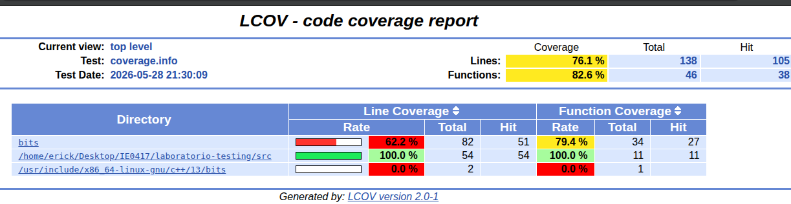

# Parte 8: Cobertura de código

## 8.1 Objetivo

Medir qué partes del código fueron ejecutadas durante las pruebas automatizadas.

La cobertura de código permite identificar qué líneas, funciones o ramas del programa fueron utilizadas por las pruebas. Esto ayuda a detectar partes del código que todavía no están siendo verificadas.

En esta parte se usó `lcov` para capturar la información de cobertura y `genhtml` para generar un reporte visual en formato HTML.

---

## 8.2 ¿Qué es cobertura de código?

La cobertura de código es una métrica que indica qué porcentaje del código fuente fue ejecutado durante las pruebas.

Por ejemplo, si una función nunca se ejecuta durante las pruebas, esa función tendrá baja cobertura. Esto no significa necesariamente que el código esté mal, pero sí indica que falta diseñar pruebas que verifiquen esa parte.

La cobertura puede medirse de diferentes formas:

- Cobertura de líneas.
- Cobertura de funciones.
- Cobertura de ramas.
- Cobertura de condiciones.

En este laboratorio se revisó principalmente la cobertura de líneas y de funciones.

---

## 8.3 Comandos utilizados

Primero se limpió la compilación anterior:

```bash
rm -rf build
mkdir build
cd build
```

Luego se configuró el proyecto con cobertura habilitada:

```bash
cmake -DENABLE_COVERAGE=ON ..
```

Después se compiló el proyecto:

```bash
make
```

Luego se ejecutaron las pruebas:

```bash
./run_tests
```

Las pruebas pasaron correctamente:

```bash
[==========] 41 tests from 3 test suites ran. (0 ms total)
[  PASSED  ] 41 tests.
```

---

## 8.4 Problema encontrado al generar el reporte con lcov

Inicialmente se intentó generar el reporte con:

```bash
lcov --capture --directory . --output-file coverage.info
```

Sin embargo, apareció el siguiente error:

```bash
geninfo: ERROR: mismatched end line for _ZN43StringUtilsTest_ConvertTextToUppercase_Test8TestBodyEv at /home/erick/Desktop/IE0417/laboratorio-testing/tests/test_string_utils.cpp:5: 5 -> 7
```

Después, al intentar filtrar el archivo de cobertura, también apareció:

```bash
lcov: ERROR: no valid records found in tracefile coverage.info
```

Y al intentar generar el reporte HTML:

```bash
genhtml: ERROR: cannot read file coverage_filtered.info!
```

Este error no significaba que las pruebas estuvieran fallando. Las 41 pruebas sí habían pasado correctamente. El problema estaba relacionado con el procesamiento de archivos de cobertura, incluyendo archivos de pruebas y dependencias internas.

---

## 8.5 Corrección realizada

Para corregir el problema, se volvió a generar la cobertura enfocándose en los archivos fuente del proyecto.

Se usaron los siguientes comandos:

```bash
lcov --capture --directory CMakeFiles/project_lib.dir/src --output-file coverage.info --ignore-errors mismatch,gcov
```

Luego se generó el reporte HTML con:

```bash
genhtml coverage.info --output-directory coverage_report
```

Finalmente, se abrió el reporte con:

```bash
xdg-open coverage_report/index.html
```

Con esta corrección se evitó procesar archivos internos de Google Test y archivos de prueba, enfocando el reporte en el código implementado en `src/`.

---

## 8.6 Resultado del reporte de cobertura

El reporte generado por LCOV mostró los siguientes resultados generales:

```text
Cobertura de líneas: 76.1 %
Líneas totales: 138
Líneas ejecutadas: 105

Cobertura de funciones: 82.6 %
Funciones totales: 46
Funciones ejecutadas: 38
```

También se observó que la carpeta principal del código fuente del laboratorio tuvo cobertura completa:

```text
/home/erick/Desktop/IE0417/laboratorio-testing/src
Cobertura de líneas: 100.0 %
Cobertura de funciones: 100.0 %
```

Esto significa que las funciones implementadas en los archivos fuente del proyecto fueron ejecutadas por las pruebas.

El reporte también mostró otras carpetas relacionadas con librerías del sistema, como:

```text
bits
/usr/include/x86_64-linux-gnu/c++/13/bits
```

Estas carpetas pertenecen a archivos internos de C++ y no al código propio del laboratorio. Por eso, para la interpretación principal se tomó como referencia la cobertura de la carpeta `src`.

---

## 8.7 Archivos con mayor cobertura

El código fuente propio del laboratorio, ubicado en:

```text
/home/erick/Desktop/IE0417/laboratorio-testing/src
```

obtuvo:

```text
100.0 % de cobertura de líneas
100.0 % de cobertura de funciones
```

Esto indica que las funciones de los módulos:

```text
calculator
string_utils
grade_utils
```

fueron ejecutadas por las pruebas unitarias.

---

## 8.8 Archivos con menor cobertura

El reporte mostró menor cobertura en carpetas externas o internas del sistema, por ejemplo:

```text
bits
/usr/include/x86_64-linux-gnu/c++/13/bits
```

Estas carpetas no corresponden directamente al código desarrollado en el laboratorio, sino a archivos de la biblioteca estándar de C++ o dependencias usadas durante la compilación.

Por esa razón, no se consideran como el foco principal del análisis de cobertura del proyecto.

---

## 8.9 Líneas o ramas que no fueron cubiertas

En el reporte general se observó que no todo el contenido analizado alcanzó el 100 % de cobertura, debido a que se incluyeron rutas externas como `bits`.

Sin embargo, dentro de la carpeta `src`, que contiene el código propio del laboratorio, se obtuvo cobertura del 100 %.

Esto indica que las funciones principales implementadas sí fueron ejecutadas por las pruebas.

---

## 8.10 Evidencia del reporte HTML

La siguiente imagen muestra el reporte generado por LCOV:



En el reporte se observa:

```text
Lines: 76.1 %
Functions: 82.6 %
```

y también se observa que la carpeta `src` tiene:

```text
Line Coverage: 100.0 %
Function Coverage: 100.0 %
```

---

## 8.11 Pruebas adicionales que podrían aumentar o mejorar la cobertura

Aunque la carpeta `src` aparece con 100 % de cobertura, todavía se podrían agregar pruebas para aumentar la confianza en el código.

### Prueba adicional 1: promedio con una sola nota

Se podría agregar una prueba para verificar que `average` funcione correctamente cuando el vector tiene un solo elemento:

```cpp
TEST(GradeUtilsTest, AverageSingleGrade) {
    std::vector<int> grades = {85};
    EXPECT_DOUBLE_EQ(average(grades), 85.0);
}
```

Esta prueba es útil porque verifica un caso borde: calcular el promedio de una lista con un solo valor.

---

### Prueba adicional 2: conteo de vocales con mayúsculas

Se podría agregar una prueba para verificar que `count_vowels` cuente correctamente vocales en mayúscula:

```cpp
TEST(StringUtilsTest, CountUppercaseVowels) {
    EXPECT_EQ(count_vowels("AEIOU"), 5);
}
```

Esta prueba es útil porque la función convierte cada carácter a minúscula antes de comparar. Por lo tanto, debería contar correctamente tanto vocales minúsculas como mayúsculas.

---

### Prueba adicional 3: división de cero entre un número válido

También se podría agregar una prueba para verificar que dividir cero entre un número distinto de cero retorne cero:

```cpp
TEST(CalculatorTest, DivideZeroByNumber) {
    EXPECT_EQ(divide(0, 5), 0);
}
```

Esta prueba ayuda a cubrir un caso matemático importante.

---

# 8.12 Preguntas de reflexión

## 1. ¿Qué significa tener 100% de cobertura?

Tener 100 % de cobertura significa que todas las líneas o funciones consideradas en el reporte fueron ejecutadas al menos una vez durante las pruebas.

En este caso, la carpeta `src` tuvo 100 % de cobertura de líneas y funciones, lo que indica que el código propio del laboratorio fue ejecutado por las pruebas.

---

## 2. ¿Tener 100% de cobertura garantiza que el programa no tiene errores?

No. Tener 100 % de cobertura no garantiza que el programa no tenga errores.

La cobertura solo indica que el código fue ejecutado, pero no garantiza que se hayan probado todos los escenarios posibles ni que las pruebas sean correctas.

Por ejemplo, una línea puede ejecutarse una vez con un caso normal, pero no probarse con casos borde o entradas inválidas.

---

## 3. ¿Qué diferencia hay entre cobertura de líneas y cobertura de ramas?

La cobertura de líneas mide cuántas líneas del código fueron ejecutadas durante las pruebas.

La cobertura de ramas mide si se ejecutaron las distintas alternativas de una decisión, por ejemplo, el camino verdadero y el camino falso de un `if`.

Por ejemplo:

```cpp
if (grade >= 70) {
    return true;
} else {
    return false;
}
```

La cobertura de líneas podría indicar que el bloque fue ejecutado, pero la cobertura de ramas verifica si se probaron ambos casos: cuando la condición es verdadera y cuando es falsa.

---

## 4. ¿Por qué una línea ejecutada no necesariamente significa que fue bien probada?

Porque ejecutar una línea solo demuestra que el programa pasó por esa instrucción, pero no necesariamente que se verificó su comportamiento de forma completa.

Por ejemplo, una función puede ejecutarse con una entrada normal, pero no con valores límite o inválidos.

Por eso, la cobertura debe interpretarse como una ayuda para mejorar las pruebas, no como una garantía absoluta de calidad.

---

## 5. ¿Cómo puede ayudar la cobertura a mejorar las pruebas?

La cobertura ayuda a identificar qué partes del código no han sido ejecutadas por las pruebas.

Si una función, línea o rama no aparece cubierta, se pueden diseñar nuevas pruebas para verificar ese comportamiento.

También ayuda a revisar si las pruebas actuales están cubriendo casos normales, casos borde y casos inválidos. De esta forma, la cobertura sirve como una guía para fortalecer el conjunto de pruebas.

---

## 8.13 Reflexión breve

Esta parte permitió medir la cobertura del proyecto usando `lcov` y `genhtml`.

Aunque inicialmente apareció un error al generar el reporte, se corrigió capturando la cobertura sobre los archivos fuente del proyecto. Después de esto, se logró generar el reporte HTML correctamente.

El resultado mostró una cobertura general de 76.1 % en líneas y 82.6 % en funciones. Además, el código propio del laboratorio en la carpeta `src` obtuvo 100 % de cobertura de líneas y funciones.

Esto demuestra que las pruebas ejecutan las funciones principales del proyecto. Sin embargo, también se aprendió que una cobertura alta no garantiza por sí sola que el programa esté libre de errores. Es necesario seguir diseñando buenas pruebas con casos normales, borde e inválidos.