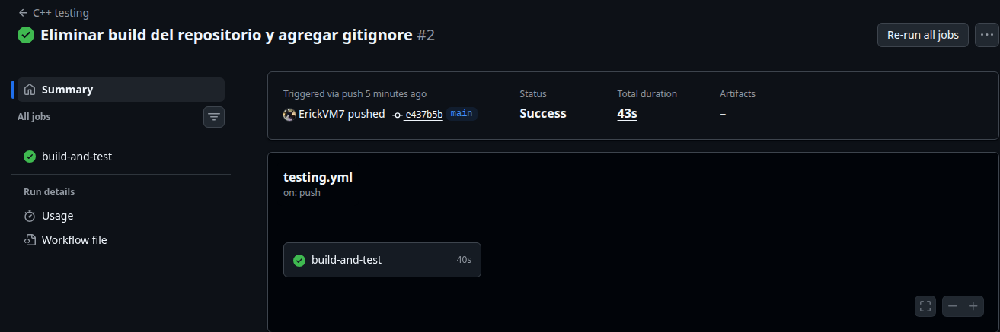
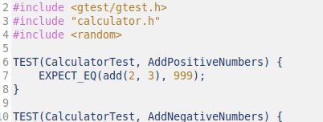
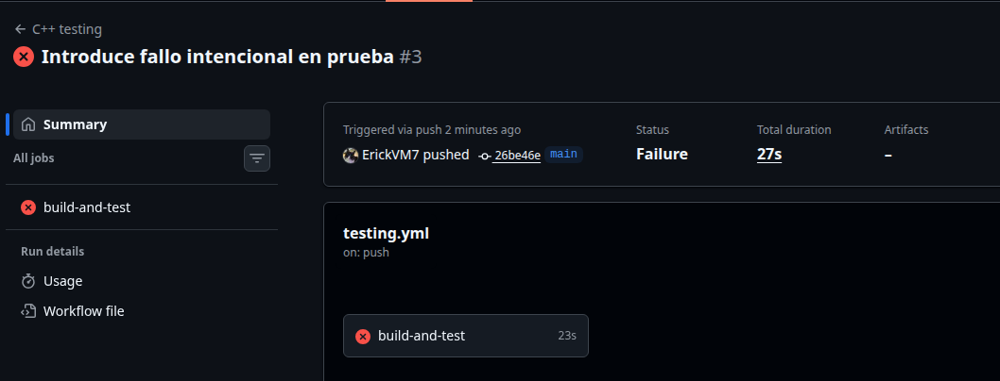
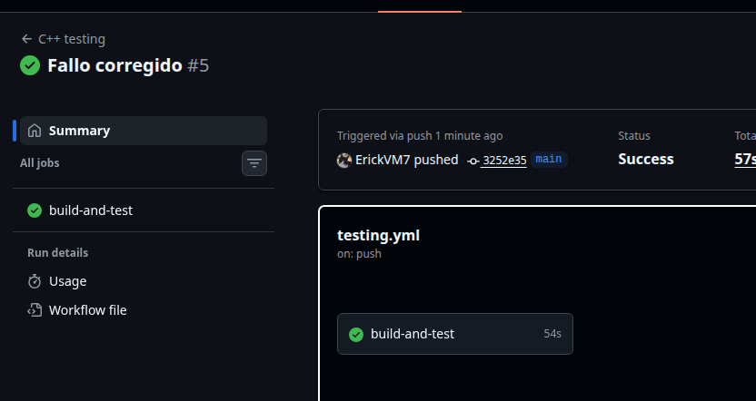

# Parte 10: Integración continua con GitHub Actions

## 10.1 Objetivo

Configurar integración continua para ejecutar automáticamente las pruebas del proyecto cada vez que se suben cambios al repositorio.

En esta parte se configuró un workflow de GitHub Actions para compilar el proyecto de C++ y ejecutar las pruebas unitarias. Esto permite verificar que el código funcione correctamente no solo en la computadora local, sino también en un ambiente limpio dentro de GitHub.

---

## 10.2 ¿Qué es integración continua?

La integración continua, o CI por sus siglas en inglés, es una práctica de desarrollo de software donde los cambios realizados en el código se verifican automáticamente.

Cada vez que se suben cambios al repositorio, el sistema ejecuta una serie de pasos definidos, como instalar dependencias, compilar el proyecto y correr las pruebas.

La idea principal es detectar errores lo antes posible. Si una prueba falla, el equipo puede saber rápidamente que el cambio introdujo un problema antes de integrarlo completamente al proyecto.

---

## 10.3 Archivo `testing.yml`

Para configurar GitHub Actions se creó el archivo:

```bash
.github/workflows/testing.yml
```

Este archivo define el workflow encargado de compilar el proyecto y ejecutar las pruebas.

El archivo se colocó en la raíz del repositorio, dentro de la carpeta `.github/workflows/`, porque GitHub Actions solo detecta workflows ubicados en esa ruta.

---

## 10.4 ¿Qué hace el archivo `testing.yml`?

El archivo `testing.yml` le indica a GitHub qué debe hacer automáticamente cuando se suben cambios al repositorio.

En este laboratorio, el workflow realiza las siguientes tareas:

1. Descarga el repositorio.
2. Instala las dependencias necesarias.
3. Configura el proyecto con CMake.
4. Compila el proyecto.
5. Ejecuta las pruebas con `./run_tests`.
6. Ejecuta las pruebas con `ctest --output-on-failure`.

De esta forma, GitHub verifica automáticamente que el laboratorio compile y que las pruebas pasen correctamente.

---

## 10.5 Eventos que ejecutan el workflow

El workflow se ejecuta cuando ocurre alguno de estos eventos:

```yaml
on:
  push:
    branches: [ "main" ]
  pull_request:
    branches: [ "main" ]
```

Esto significa que el workflow se ejecuta cuando se hace un `push` a la rama `main` o cuando se abre un `pull request` hacia la rama `main`.

En este caso, el workflow se ejecutó después de subir cambios al repositorio mediante `push`.

---

## 10.6 Pasos que ejecuta el workflow

El workflow ejecuta un trabajo llamado:

```text
build-and-test
```

Este trabajo corre en:

```yaml
runs-on: ubuntu-latest
```

Esto significa que GitHub utiliza una máquina virtual con Ubuntu para ejecutar el proyecto.

Los pasos principales son los siguientes:

### Checkout repository

Este paso descarga el contenido del repositorio para que GitHub Actions pueda trabajar con los archivos del proyecto.

```yaml
- name: Checkout repository
  uses: actions/checkout@v4
```

### Install dependencies

Este paso instala las herramientas necesarias para compilar y probar el proyecto.

```yaml
- name: Install dependencies
  run: |
    sudo apt update
    sudo apt install -y build-essential cmake lcov
```

### Configure CMake

Este paso entra a la carpeta del laboratorio, crea la carpeta `build` y configura el proyecto con CMake.

```yaml
- name: Configure CMake
  run: |
    cd laboratorio-testing
    rm -rf build
    mkdir build
    cd build
    cmake ..
```

Se agregó `rm -rf build` para evitar errores con archivos de compilación anteriores, como `CMakeCache.txt`.

### Build project

Este paso compila el proyecto.

```yaml
- name: Build project
  run: |
    cd laboratorio-testing/build
    make
```

### Run tests

Este paso ejecuta las pruebas usando el ejecutable de Google Test.

```yaml
- name: Run tests
  run: |
    cd laboratorio-testing/build
    ./run_tests
```

### Run CTest

Este paso ejecuta las pruebas registradas por CMake usando CTest.

```yaml
- name: Run CTest
  run: |
    cd laboratorio-testing/build
    ctest --output-on-failure
```

---

## 10.7 Problema encontrado y corrección

Inicialmente, GitHub Actions no detectaba el workflow porque la carpeta se había creado como:

```text
github/workflows
```

Luego se corrigió a:

```text
.github/workflows
```

También se observó que el workflow no debía estar dentro de `laboratorio-testing`, sino en la raíz del repositorio:

```text
IE0417/.github/workflows/testing.yml
```

Después apareció un error relacionado con `CMakeCache.txt`, porque la carpeta `build` había sido subida al repositorio. El error indicaba que el caché de CMake había sido generado en otra ruta local:

```text
/home/erick/Desktop/IE0417/laboratorio-testing
```

pero GitHub Actions estaba ejecutando el proyecto en otra ruta:

```text
/home/runner/work/IE0417/IE0417/laboratorio-testing
```

La solución fue eliminar `build` del repositorio y agregarlo al `.gitignore`:

```bash
echo "build/" >> .gitignore
echo "laboratorio-testing/build/" >> .gitignore
git rm -r --cached laboratorio-testing/build
```

Luego se actualizó el workflow para borrar y crear nuevamente la carpeta `build` durante la ejecución:

```yaml
rm -rf build
mkdir build
```

Con esto, GitHub Actions pudo configurar el proyecto desde cero sin usar archivos de compilación generados localmente.

---

## 10.8 Resultado del workflow

Después de corregir la ubicación del workflow y eliminar la carpeta `build` del repositorio, GitHub Actions ejecutó correctamente el flujo de trabajo.

El workflow finalizó con estado:

```text
Success
```

También se observó que el trabajo:

```text
build-and-test
```

pasó correctamente.

La ejecución fue activada por un `push` a la rama `main` y tuvo una duración aproximada de:

```text
43 s
```

---

## 10.9 Evidencia del workflow exitoso

La siguiente imagen muestra la ejecución exitosa del workflow en GitHub Actions.



En la captura se observa que el workflow terminó con estado `Success` y que el job `build-and-test` aparece con un check verde.

---

## 10.10 ¿Qué pasaría si una prueba falla en GitHub Actions?

Si una prueba falla en GitHub Actions, el workflow aparecería en rojo y su estado sería `Failure`.

En ese caso, GitHub Actions mostraría cuál paso falló. Por ejemplo, si falla una prueba, el error aparecería en el paso:

```text
Run tests
```

o en:

```text
Run CTest
```

Además, se podría abrir el detalle del paso fallido para revisar la salida de terminal. Ahí se mostraría el nombre de la prueba que falló, el valor esperado y el valor obtenido.

Esto permite identificar rápidamente qué cambio rompió el proyecto.

---

# 10.11 Preguntas de reflexión

## 1. ¿Por qué es útil ejecutar pruebas automáticamente en GitHub?

Es útil porque permite verificar el proyecto cada vez que se suben cambios al repositorio.

Así no depende solo de que una persona recuerde ejecutar las pruebas manualmente en su computadora. GitHub Actions se encarga de compilar y probar el proyecto en un ambiente limpio.

Esto ayuda a detectar errores antes de que los cambios se integren definitivamente.

---

## 2. ¿Qué problema resuelve la integración continua?

La integración continua resuelve el problema de integrar cambios sin saber si el proyecto sigue funcionando.

Cuando varias personas trabajan en un proyecto, cada cambio puede afectar partes del código que ya estaban funcionando. CI permite detectar esos problemas automáticamente.

Si algo falla, el equipo puede corregirlo antes de avanzar.

---

## 3. ¿Por qué conviene ejecutar pruebas antes de integrar cambios?

Conviene porque las pruebas ayudan a confirmar que los cambios no rompieron el comportamiento esperado del sistema.

Si se integran cambios sin probar, un error puede llegar al repositorio principal y afectar a todo el equipo.

Ejecutar pruebas antes de integrar cambios reduce ese riesgo.

---

## 4. ¿Qué información proporciona GitHub Actions cuando un workflow falla?

GitHub Actions muestra información como:

- El workflow que falló.
- El job que falló.
- El paso exacto donde ocurrió el error.
- La salida de terminal del comando ejecutado.
- El código de salida del proceso.
- El commit que activó la ejecución.

Esta información ayuda a encontrar rápidamente la causa del fallo.

---

## 5. ¿Cómo ayuda CI a mejorar la colaboración en equipo?

CI ayuda porque da una verificación automática y común para todo el equipo.

Cada persona puede subir cambios sabiendo que GitHub ejecutará las mismas pruebas. Esto reduce discusiones sobre si el código funciona solo en una computadora específica.

Además, permite detectar errores temprano y mantiene el repositorio en un estado más confiable.

---

## 10.12 Reflexión breve

Esta parte permitió configurar un flujo de integración continua usando GitHub Actions.

Aunque al inicio hubo errores por la ubicación del workflow y por haber subido la carpeta `build`, se corrigieron esos problemas moviendo el archivo `testing.yml` a la raíz del repositorio y eliminando `build` del control de versiones.
Finalmente, el workflow se ejecutó correctamente y terminó con estado `Success`. Esto demuestra que el proyecto puede compilarse y probarse automáticamente desde GitHub cada vez que se suben cambios.


---

## Fallo intencional en CI

## 11.1 Objetivo

Comprobar qué ocurre cuando una prueba falla dentro del flujo de integración continua.

En esta parte se provocó un fallo intencional en una prueba para observar cómo responde GitHub Actions cuando el proyecto no pasa todas las pruebas. Luego se corrigió el error y se verificó que el workflow volviera a ejecutarse correctamente.

---

## 11.2 Cambio realizado para provocar el fallo

Se modificó intencionalmente una prueba del módulo `calculator`.

La prueba afectada fue:

```cpp
CalculatorTest.AddPositiveNumbers
```

Originalmente, esta prueba verificaba que la suma de dos números positivos fuera correcta. Para provocar el fallo, se cambió temporalmente el resultado esperado por un valor incorrecto.

Por ejemplo, una prueba correcta sería:

```cpp
TEST(CalculatorTest, AddPositiveNumbers) {
    EXPECT_EQ(add(2, 3), 5);
}
```

Para provocar el fallo, se cambió el valor esperado:

```cpp
TEST(CalculatorTest, AddPositiveNumbers) {
    EXPECT_EQ(add(2, 3), 6);
}
```

Este cambio hace que la prueba falle porque la función `add(2, 3)` retorna `5`, no `6`.

---

## 11.3 Qué pasó localmente

Después de introducir el fallo, se ejecutaron las pruebas localmente con:

```bash
./run_tests
```

El resultado mostró que se ejecutaron 42 pruebas, pero una falló:

```bash
[==========] 42 tests from 3 test suites ran. (9 ms total)
[  PASSED  ] 41 tests.
[  FAILED  ] 1 test, listed below:
[  FAILED  ] CalculatorTest.AddPositiveNumbers

1 FAILED TEST
```

Esto confirma que el error fue detectado localmente antes de revisar GitHub Actions.

---

## 11.4 Qué pasó en GitHub Actions

Luego se subió el cambio al repositorio con el fallo intencional.

GitHub Actions ejecutó automáticamente el workflow definido en:

```bash
.github/workflows/testing.yml
```

El workflow se ejecutó después del `push`, pero terminó con estado:

```text
Failure
```

En la pestaña **Actions** se observó que el job:

```text
build-and-test
```

falló. Esto indica que el proyecto no pasó correctamente el proceso de integración continua.

---

## 11.5 Mensaje mostrado por el workflow

El workflow mostró que la ejecución falló debido a una prueba fallida.

La prueba que falló fue:

```text
CalculatorTest.AddPositiveNumbers
```

El resumen local mostró:

```bash
[  PASSED  ] 41 tests.
[  FAILED  ] 1 test, listed below:
[  FAILED  ] CalculatorTest.AddPositiveNumbers
```

En GitHub Actions, el workflow apareció en rojo y con estado:

```text
Failure
```

Esto permitió identificar que el cambio subido al repositorio rompió una prueba del proyecto.

---

## 11.6 Corrección realizada

Para corregir el problema, se devolvió la prueba a su valor esperado correcto.

La prueba corregida fue:

```cpp
TEST(CalculatorTest, AddPositiveNumbers) {
    EXPECT_EQ(add(2, 3), 5);
}
```

Después de corregir el archivo, se volvieron a ejecutar las pruebas localmente para confirmar que el problema se resolvió:

```bash
make
./run_tests
```

Luego se subió la corrección al repositorio:

```bash
git add .
git commit -m "Corregir prueba fallida intencional"
git push
```

Después del `push`, GitHub Actions ejecutó nuevamente el workflow.

---

## 11.7 Evidencia del fallo en CI

La siguiente imagen muestra que el workflow falló en GitHub Actions después de subir el cambio intencional.



La siguiente imagen muestra el detalle del fallo, donde se observa que el workflow terminó con estado `Failure`.



---

## 11.8 Evidencia del workflow exitoso después de corregir

Después de corregir la prueba y volver a subir los cambios, el workflow se ejecutó nuevamente.

El resultado esperado es que GitHub Actions muestre el estado:

```text
Success
```

y que el job:

```text
build-and-test
```

aparezca con un check verde.



---

# 11.9 Preguntas de reflexión

## 1. ¿Por qué es útil ver una prueba fallar al menos una vez?

Es útil porque permite comprobar que las pruebas realmente están verificando el comportamiento del código.

Si una prueba nunca falla, incluso cuando se introduce un error intencional, podría significar que la prueba no está bien diseñada o que no está revisando lo que debería.

En este caso, al cambiar el resultado esperado de la suma, la prueba `CalculatorTest.AddPositiveNumbers` falló correctamente. Esto confirma que la prueba sí detecta errores.

---

## 2. ¿Qué diferencia hay entre una prueba fallando localmente y una prueba fallando en CI?

Cuando una prueba falla localmente, el error se detecta en la computadora del desarrollador.

Cuando una prueba falla en CI, el error se detecta en un ambiente automático dentro de GitHub Actions. Esto es importante porque confirma que el proyecto también falla fuera de la computadora local.

La ventaja de CI es que todos los cambios subidos al repositorio son revisados automáticamente, aunque el desarrollador haya olvidado ejecutar las pruebas localmente.

---

## 3. ¿Por qué no se debería dejar código con pruebas fallidas en la rama principal?

No se debería dejar código con pruebas fallidas en la rama principal porque esa rama representa la versión principal del proyecto.

Si se deja una prueba fallida, otras personas podrían trabajar sobre una base incorrecta. También puede ocultar errores nuevos, porque ya existiría un fallo previo sin resolver.

Mantener la rama principal con pruebas exitosas ayuda a que el proyecto sea más confiable.

---

## 4. ¿Qué aporta CI a la calidad del software?

CI aporta calidad porque automatiza la verificación del proyecto.

Cada vez que se suben cambios, GitHub Actions compila el código y ejecuta las pruebas. Esto ayuda a detectar errores temprano, antes de que lleguen a etapas más avanzadas.

También mejora la confianza en el código, porque cada cambio debe pasar por el mismo proceso de validación.

---

## 11.10 Reflexión breve

Esta parte permitió observar el comportamiento de GitHub Actions cuando una prueba falla.

Al introducir un fallo intencional, el workflow pasó de `Success` a `Failure`, mostrando que la integración continua detecta errores automáticamente. Luego, al corregir la prueba, el workflow volvió a ejecutarse correctamente.

Esto demuestra que CI es una herramienta útil para mantener la calidad del proyecto, ya que permite detectar errores cada vez que se suben cambios al repositorio.