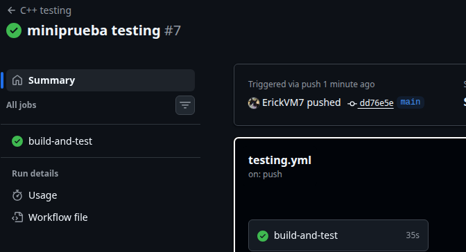

# Reflexión final

## Mini reto de testing

## 12.1 Función implementada

Para el mini reto se implementó la función:

```cpp
bool is_valid_grade(int grade);
```

Esta función se agregó al módulo `grade_utils`.

La función verifica si una nota es válida según el rango permitido de `0` a `100`.

La implementación fue:

```cpp
bool is_valid_grade(int grade) {
    return grade >= 0 && grade <= 100;
}
```

También se agregó su declaración en el archivo de encabezado:

```cpp
bool is_valid_grade(int grade);
```

Esta función permite validar una nota antes de clasificarla o utilizarla en otras operaciones del programa.

---

## 12.2 Casos de prueba diseñados

Se agregaron seis pruebas en el archivo:

```bash
tests/test_grade_utils.cpp
```

Las pruebas agregadas fueron:

```cpp
TEST(GradeUtilsTest, ValidGradeNormalValue) {
    EXPECT_TRUE(is_valid_grade(85));
}

TEST(GradeUtilsTest, InvalidGradeNormalValue) {
    EXPECT_FALSE(is_valid_grade(120));
}

TEST(GradeUtilsTest, ValidGradeLowerBoundary) {
    EXPECT_TRUE(is_valid_grade(0));
}

TEST(GradeUtilsTest, ValidGradeUpperBoundary) {
    EXPECT_TRUE(is_valid_grade(100));
}

TEST(GradeUtilsTest, InvalidGradeBelowLowerBoundary) {
    EXPECT_FALSE(is_valid_grade(-1));
}

TEST(GradeUtilsTest, InvalidGradeAboveUpperBoundary) {
    EXPECT_FALSE(is_valid_grade(101));
}
```

---

## 12.3 Tabla de casos de prueba

| ID | Entrada | Resultado esperado | Tipo de caso |
|---|---:|---|---|
| TC-001 | 85 | `true` | Normal válido |
| TC-002 | 120 | `false` | Normal inválido |
| TC-003 | 0 | `true` | Borde inferior válido |
| TC-004 | 100 | `true` | Borde superior válido |
| TC-005 | -1 | `false` | Justo debajo del borde inferior |
| TC-006 | 101 | `false` | Justo encima del borde superior |

---

## 12.4 Por qué se escogieron esos casos

Se escogieron esos casos porque permiten verificar el comportamiento de la función en situaciones normales, bordes del rango permitido y valores inválidos.

El valor `85` representa una nota normal válida, ya que está dentro del rango permitido.

El valor `120` representa una nota inválida común, porque está claramente fuera del rango.

Los valores `0` y `100` son importantes porque son los límites válidos del sistema. Una nota de `0` todavía debe considerarse válida, igual que una nota de `100`.

Los valores `-1` y `101` son casos borde inválidos, porque están justo fuera del rango permitido. Estos valores ayudan a confirmar que la función no acepte notas menores a `0` ni mayores a `100`.

---

## 12.5 Resultado de las pruebas

Después de agregar la función y las pruebas, se compiló el proyecto y se ejecutaron las pruebas.

El resultado fue exitoso. Las pruebas pasaron correctamente después de corregir un error de sintaxis en `grade_utils.cpp`.

El error inicial ocurrió porque la función `letter_grade` había quedado dentro de `is_valid_grade` por falta de una llave de cierre. Después de corregir la estructura del archivo, el proyecto compiló correctamente.

El workflow de GitHub Actions también se ejecutó correctamente después de subir los cambios.

---

## 12.6 Cambios subidos a GitHub

Los cambios fueron subidos al repositorio en GitHub.

Se agregaron o modificaron los siguientes archivos:

```text
include/grade_utils.h
src/grade_utils.cpp
tests/test_grade_utils.cpp
docs/reflexion-final.md
```

También se verificó que la carpeta `build` no se subiera al repositorio, ya que contiene archivos generados localmente por CMake.

---

## 12.7 Resultado en GitHub Actions

Después de corregir el error y subir los cambios, GitHub Actions ejecutó el workflow automáticamente.

El workflow finalizó con estado:

```text
Success
```

El job:

```text
build-and-test
```

también terminó correctamente.

La ejecución tuvo una duración aproximada de:

```text
38 s
```

Esto confirma que el proyecto compiló y que las pruebas se ejecutaron correctamente en el ambiente de integración continua.

---

## 12.8 Evidencia del workflow exitoso

La siguiente imagen muestra el workflow exitoso después de subir el mini reto de testing:



---

# 12.9 Preguntas de reflexión

## 1. ¿Cuál fue el caso más obvio de probar?

El caso más obvio fue probar una nota válida normal, como `85`.

Este caso es fácil de entender porque `85` está claramente dentro del rango permitido de `0` a `100`. Por eso, la función debía retornar `true`.

```cpp
EXPECT_TRUE(is_valid_grade(85));
```

---

## 2. ¿Cuál fue el caso borde más importante?

Los casos borde más importantes fueron `0` y `100`, porque representan los límites exactos del rango válido.

La función debía aceptar ambos valores:

```cpp
EXPECT_TRUE(is_valid_grade(0));
EXPECT_TRUE(is_valid_grade(100));
```

Estos casos son importantes porque un error común sería usar condiciones como `grade > 0` o `grade < 100`, lo cual dejaría fuera valores que sí deberían ser válidos.

---

## 3. ¿Qué error podría aparecer si no se prueban los valores `0` y `100`?

Si no se prueban los valores `0` y `100`, podría quedar oculto un error en las condiciones de la función.

Por ejemplo, si la función se implementara así:

```cpp
return grade > 0 && grade < 100;
```

entonces `0` y `100` serían rechazados incorrectamente.

Por eso es importante probar los límites exactos del rango permitido.

---

## 4. ¿Qué diferencia hay entre probar un valor como `50` y probar valores como `-1`, `0`, `100` y `101`?

Probar `50` verifica un caso normal dentro del rango válido.

En cambio, probar `-1`, `0`, `100` y `101` permite revisar el comportamiento en los límites y justo fuera de ellos.

Los valores `0` y `100` verifican que los bordes válidos sean aceptados. Los valores `-1` y `101` verifican que los valores fuera del rango sean rechazados.

Estos casos son más fuertes porque ayudan a detectar errores en las condiciones de comparación.

---

## 5. ¿Qué aprendió sobre diseñar pruebas?

Aprendí que diseñar pruebas no consiste solo en probar valores comunes.

También es necesario pensar en casos borde, valores inválidos y situaciones donde el programa podría fallar. Una función puede parecer correcta con valores normales, pero comportarse mal en los límites.

También aprendí que las pruebas automatizadas ayudan a detectar errores rápidamente, tanto de forma local como en GitHub Actions. Esto hace que el desarrollo sea más ordenado y confiable.

---

## 12.10 Reflexión breve

El mini reto permitió aplicar lo aprendido durante el laboratorio en una función nueva.

La función `is_valid_grade` es sencilla, pero sirve para practicar el diseño de pruebas con casos normales, casos borde y casos inválidos. Además, el error encontrado en GitHub Actions demostró la utilidad de la integración continua, ya que permitió detectar un problema de compilación en el repositorio.

Después de corregir el código, el workflow se ejecutó correctamente y terminó con estado exitoso. Esto confirma que las pruebas y la configuración de CI ayudan a mantener la calidad del proyecto.


---

## Reflexión final

### 1. ¿Qué es software testing?

El software testing es el proceso de probar un programa para verificar si funciona como se espera. Consiste en ejecutar partes del software con entradas conocidas y comparar el resultado obtenido con el resultado esperado.

En este laboratorio, el testing se aplicó usando pruebas automatizadas con Google Test para validar funciones de cálculo, manejo de texto y calificaciones.

---

### 2. ¿Por qué el testing mejora la calidad del software?

El testing mejora la calidad del software porque ayuda a encontrar errores antes de que el programa sea usado en un ambiente real.

También permite comprobar que los cambios nuevos no dañen funcionalidades que ya estaban funcionando. Por ejemplo, cuando se modificó la función `is_even`, las pruebas detectaron rápidamente que el comportamiento estaba incorrecto.

Además, las pruebas hacen que el proyecto sea más confiable, porque no se depende solo de revisar manualmente los resultados.

---

### 3. ¿Cuál es la diferencia entre verificación y validación?

La verificación busca comprobar si el software fue construido correctamente según lo especificado. Es decir, revisa si el código cumple con los requisitos técnicos definidos.

La validación busca comprobar si el software resuelve realmente el problema esperado o si cumple con lo que el usuario necesita.

En palabras simples, la verificación pregunta: “¿Lo estamos construyendo bien?”.  
La validación pregunta: “¿Estamos construyendo lo correcto?”.

---

### 4. ¿Qué es una prueba unitaria?

Una prueba unitaria es una prueba que revisa una parte pequeña del programa, normalmente una función individual.

Por ejemplo:

```cpp
EXPECT_EQ(add(2, 3), 5);
```

Esta prueba verifica únicamente que la función `add` retorne el resultado correcto para esa entrada.

Las pruebas unitarias son útiles porque permiten detectar errores en funciones específicas sin tener que probar todo el sistema completo.

---

### 5. ¿Qué es una prueba funcional?

Una prueba funcional verifica si el sistema cumple con un comportamiento esperado o con un requisito.

Por ejemplo, en este laboratorio se trabajó con el requisito de convertir una nota numérica a una letra. Una prueba funcional verifica que una entrada como `95` produzca `A`, o que una nota inválida como `101` sea rechazada.

La diferencia principal es que la prueba funcional se enfoca más en el comportamiento esperado del sistema que en la implementación interna.

---

### 6. ¿Qué diferencia hay entre `EXPECT_` y `ASSERT_`?

La diferencia principal es que `EXPECT_` permite que la prueba continúe aunque una verificación falle, mientras que `ASSERT_` detiene la prueba inmediatamente si la condición falla.

Por ejemplo, `EXPECT_EQ` es útil cuando se quieren revisar varias condiciones en una misma prueba:

```cpp
EXPECT_EQ(add(1, 1), 2);
EXPECT_EQ(add(2, 2), 4);
```

En cambio, `ASSERT_` se usa cuando una condición es necesaria para continuar de forma segura:

```cpp
ASSERT_NE(divisor, 0);
EXPECT_EQ(divide(10, divisor), 5);
```

Si el divisor es cero, la prueba se detiene antes de intentar una división inválida.

---

### 7. ¿Por qué las pruebas deben ser deterministas?

Las pruebas deben ser deterministas porque deben producir el mismo resultado cada vez que se ejecutan bajo las mismas condiciones.

Si una prueba a veces pasa y a veces falla sin que el código cambie, se vuelve difícil confiar en ella. También se vuelve más complicado encontrar la causa del error.

Una prueba determinista permite saber que, si falla, probablemente hubo un cambio en el código o en el ambiente que debe revisarse.

---

### 8. ¿Por qué puede ser útil una semilla en pruebas con valores aleatorios?

Una semilla es útil porque permite controlar la generación de valores aleatorios.

En el laboratorio se usó una semilla fija con `std::mt19937`, lo cual permitió generar la misma secuencia de números aleatorios en cada ejecución.

Esto es importante porque, si una prueba falla, se puede repetir exactamente el mismo caso y analizar el error. Sin una semilla fija, los datos cambiarían en cada ejecución y el fallo podría ser más difícil de reproducir.

---

### 9. ¿Qué es cobertura de código?

La cobertura de código es una métrica que indica qué partes del código fueron ejecutadas durante las pruebas.

Puede medir líneas ejecutadas, funciones ejecutadas o ramas recorridas dentro del programa.

En este laboratorio se usó `lcov` para generar un reporte de cobertura. El reporte permitió observar qué tanto del código fuente estaba siendo probado por las pruebas automatizadas.

---

### 10. ¿Por qué una cobertura alta no garantiza ausencia de errores?

Una cobertura alta no garantiza que el programa esté libre de errores porque solo indica que el código fue ejecutado, no que haya sido probado correctamente en todos los casos posibles.

Por ejemplo, una función puede ejecutarse una vez con un caso normal, pero no probarse con casos borde o entradas inválidas.

Por eso, la cobertura es una herramienta útil, pero debe acompañarse de buenas pruebas. No basta con ejecutar líneas de código; también hay que revisar que los resultados sean correctos.

---

### 11. ¿Qué ventaja tiene ejecutar pruebas en GitHub Actions?

La ventaja de ejecutar pruebas en GitHub Actions es que el proyecto se verifica automáticamente cada vez que se suben cambios al repositorio.

Esto permite saber si el código compila y si las pruebas pasan en un ambiente limpio, diferente al de la computadora local.

También ayuda a detectar errores antes de integrar cambios a la rama principal. Si una prueba falla, GitHub Actions muestra el workflow en rojo y permite revisar en qué paso ocurrió el problema.

---

### 12. ¿Qué parte del laboratorio le pareció más útil?

La parte más útil fue la integración con GitHub Actions, porque permitió ver cómo las pruebas pueden ejecutarse automáticamente después de subir cambios al repositorio.

También fue útil provocar un fallo intencional, ya que permitió observar cómo se ve una prueba fallida localmente y cómo se refleja ese mismo fallo en GitHub Actions.

Esto ayuda a entender mejor la importancia de la integración continua en proyectos reales.

---

### 13. ¿Qué parte le pareció más difícil?

La parte más difícil fue la configuración de GitHub Actions y el manejo de la carpeta `build`.

Al inicio hubo errores porque la carpeta `build` contenía archivos generados localmente por CMake, como `CMakeCache.txt`. Estos archivos no debían subirse al repositorio porque tienen rutas específicas de la computadora local.

También fue necesario corregir la ubicación del workflow, ya que GitHub Actions solo detecta archivos dentro de:

```text
.github/workflows/
```

en la raíz del repositorio.

---

### 14. ¿Cómo aplicaría pruebas automatizadas en un proyecto futuro?

Aplicaría pruebas automatizadas desde el inicio del proyecto, especialmente para funciones importantes o que puedan fallar con casos borde.

Primero diseñaría pruebas unitarias para validar funciones individuales. Luego agregaría pruebas funcionales para verificar requisitos del sistema. También usaría casos normales, casos borde e inválidos.

Además, configuraría GitHub Actions para ejecutar las pruebas automáticamente cada vez que se suban cambios. De esa forma, sería más fácil detectar errores temprano y mantener el proyecto en un estado confiable.

---

### Reflexión general

Este laboratorio permitió entender la importancia del testing en el desarrollo de software. Se trabajó con pruebas unitarias, pruebas funcionales, casos borde, pruebas fallidas, cobertura de código e integración continua.

También se observó que las pruebas no solo sirven para confirmar que algo funciona, sino también para detectar errores cuando se modifica el código.

El uso de Google Test, CMake y GitHub Actions permitió crear un flujo de trabajo más ordenado, donde el código puede compilarse y probarse automáticamente. Esto es útil para proyectos académicos y también para proyectos profesionales, donde la calidad y la confiabilidad del software son importantes.