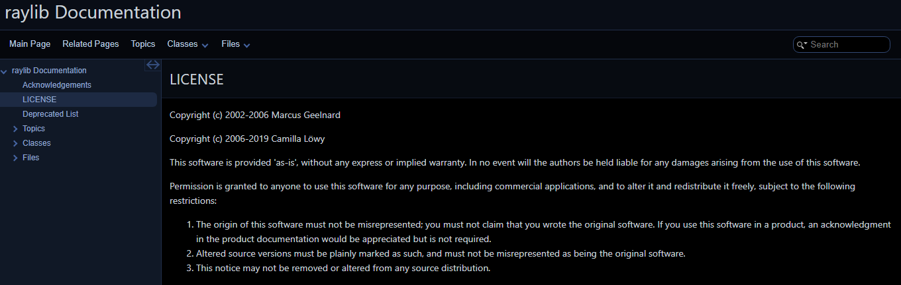
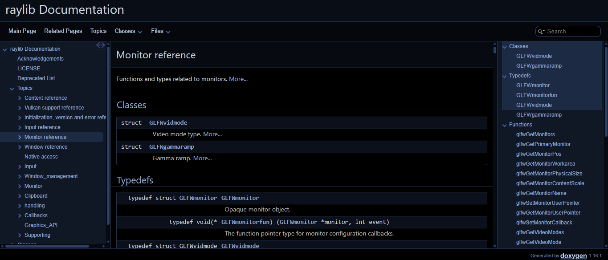
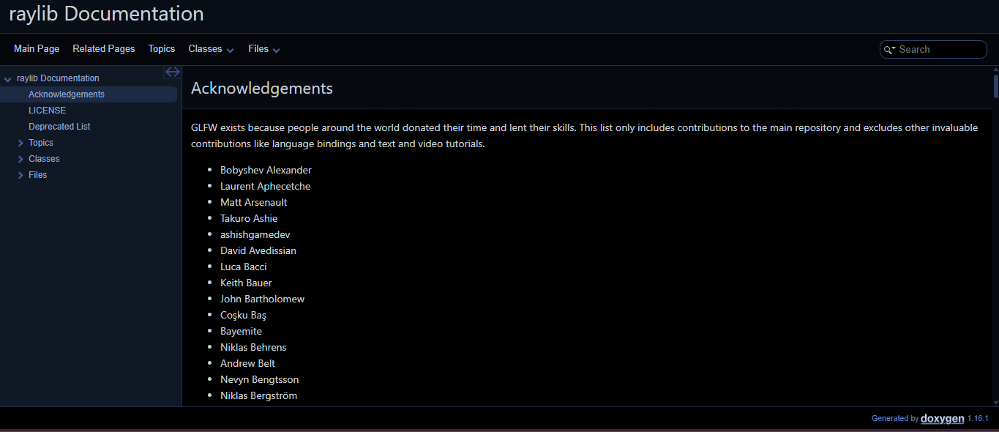
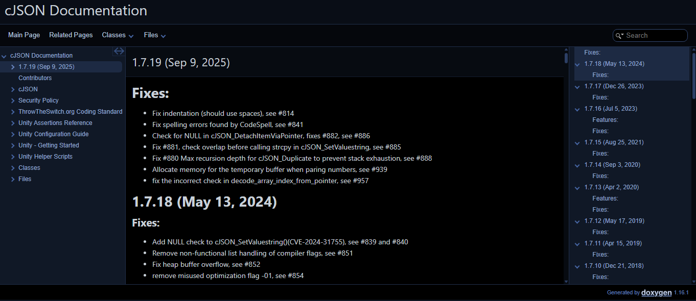
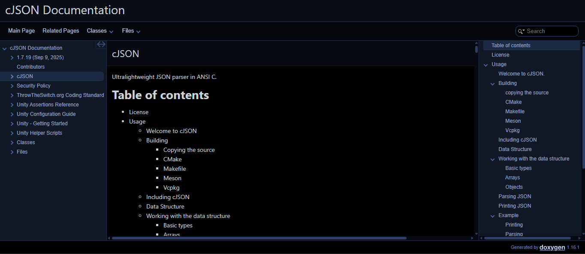
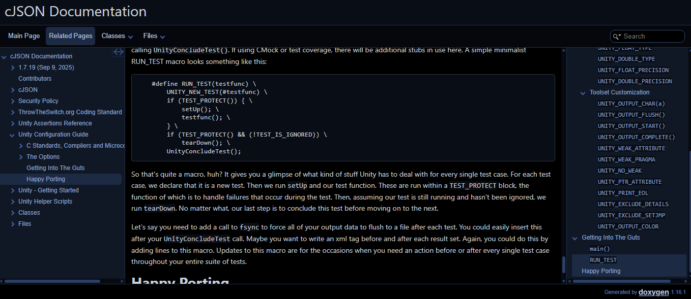

## Laboratorio 1 — Control de versiones (Git)  
Curso: IE0417 – Diseño de Software para Ingeniería  
Estudiante: Erick Vargas Monge C08215  
Profesor: Rafael Esteban Badilla Alvarado  
Periodo: I-2026  

---

# Parte 2. Documentación de proyectos de software

# Repositorios seleccionados

Se seleccionaron los siguientes repositorios públicos de GitHub:

### 1. raylib  
https://github.com/raysan5/raylib  

raylib es una biblioteca en lenguaje C enfocada en el desarrollo de videojuegos. Proporciona funcionalidades para manejo de gráficos, entrada de usuario, audio y renderizado. Es un proyecto de tamaño considerable y con buena documentación interna, lo que lo hace adecuado para generar documentación con Doxygen.

---

### 2. cJSON  
https://github.com/DaveGamble/cJSON  

cJSON es una biblioteca ligera en lenguaje C utilizada para el manejo y parsing de datos en formato JSON. Es un proyecto pequeño y simple, ideal para observar cómo Doxygen funciona en sistemas compactos.

---

# Herramienta utilizada

Se utilizó la herramienta **Doxygen** para la generación automática de la documentación a partir de comentarios en el código fuente.

---

# Pasos realizados

1. Se clonaron los repositorios utilizando Git:

   git clone https://github.com/raysan5/raylib.git  
   git clone https://github.com/DaveGamble/cJSON.git  

2. Se accedió a cada carpeta del proyecto:

   cd raylib  
   cd cJSON  

3. Se generó el archivo de configuración de Doxygen:

   doxygen -g  

4. Se configuró el archivo `Doxyfile`, modificando parámetros como:

   - PROJECT_NAME  
   - INPUT  
   - RECURSIVE = YES  
   - GENERATE_HTML = YES  
   - GENERATE_LATEX = NO  

5. Se ejecutó Doxygen para generar la documentación:

   doxygen Doxyfile  

6. Se abrió el archivo `html/index.html` para visualizar la documentación generada.

---

# Verificación de la documentación

La documentación generada cumple con los siguientes aspectos:

- Es navegable mediante un menú estructurado.
- Incluye funciones, archivos y estructuras del proyecto.
- Presenta una organización clara por módulos y archivos.
- Permite explorar el código de forma más comprensible.

### raylib

  
  
  

---

### cJSON

  
  
  

---

# Problemas encontrados

Durante el desarrollo se presentaron algunos inconvenientes:

- Configuración incorrecta del parámetro `INPUT`, lo que impedía que Doxygen detectara archivos.
- Diferencias en la estructura de los proyectos, ya que raylib es más grande y organizado en carpetas, mientras que cJSON es más compacto.
- Necesidad de activar la opción `RECURSIVE` para incluir todos los archivos.

---

# Documentación publicada

- Raylib:  
https://documentacioraylib.netlify.app/

- cJSON:  
https://documentationcjson.netlify.app/

---

La generación automática de documentación mediante herramientas como Doxygen facilita significativamente la comprensión tanto de proyectos grandes como pequeños. En el caso de raylib, se observó cómo la documentación ayuda a navegar un sistema más complejo, mientras que en cJSON permite entender rápidamente un proyecto compacto. Esto demuestra que la documentación es una herramienta clave en el desarrollo de software, ya que mejora la mantenibilidad, la comprensión del código y la colaboración entre desarrolladores.