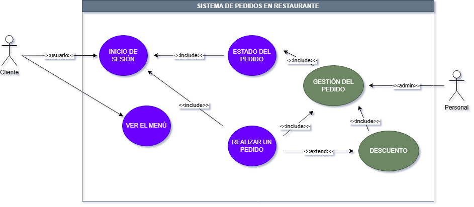

## Tarea 2 — Análisis de requerimientos y modelado de casos de uso

# Esceneario seleccionado

El esceneario escogido fue la plataforma de pedidos para un restaurante. La idea general es facilitar la interacción entre clientes y el restaurante mediante un sistema digital. El objetivo principal es permitir a los consumidores ver el menú y realizar pedidos sin necesidad de llamar o esperar a que respondan un mensaje. Los roles que actúan son el personal del restaurante y los clientes. Los primeros reciben  y gestionan el pedido de los usuarios, además puede ver el historial de ventas y recibos. Estos también tiene la posibilidad de actualizar el menú o poner ofertas especiales. Por otro lado, los clientes explorar los productos disponibles, comprar y pagar pedidos indicando detalles como dirección de entrega o comentarios para la comida. Una vez realizado este flujo, el restaurante envía su conductor designado para hacer la entrega. El sistema buscar mejorar la eficiencia operativa del restaurante, reducir errores en la toma de pedidos y ofrecer una mejor experiencia al cliente. Así como tener más ventas al poder realizar pedidos desde cualquier lugar. Todo esto se apoya en una interfaz accesible y en mecanismos que garanticen la seguridad y disponibilidad del sistema.

# Lista de requerimentos

### Requerimientos funcionales 

- El sistema debe permitir a los clientes registrarse e iniciar sesión. Así como tener guardada la tarjeta de crédito como metodo de pago para futuras compras.

- El sistema debe mostrar el menú del restaurante con precios y descripciones.

- El sistema debe permitir a los clientes agregar uno o varios productos al carrito.

- El sistema debe permitir realizar pedidos indicando dirección y método de pago.

- El sistema debe permitir al restaurante gestionar pedidos (aceptar, preparar, entregar).

- El sistema debe permitir a los clientes ver el estado de su pedido en tiempo real. Es decir si se encuentra preparando o si ya viene de camino

- El sistema debe dar la opción de dejar reseñas o comentarios para que el personal del restaurante vea como estuvo el pedido.

- El sistema debe permitir al restuarante manejar los productos que ponen en el sistema. También el personal del restaurante debe poder "abrir" o "cerrar" el restaurante para evitar que lleguen pedidos cuando el local ya se encuentra cerrado.

### Requerimientos no funcionales

- El sistema debe garantizar la seguridad de los datos del usuario mediante autenticación y cifrado. Tanto para los datos personales (nombre, número, dirección, etc) así como los datos de pago.

- El sistema debe estar disponible el 95 % del tiempo que el restaurante esté abierto.

- El sistema debe responder a las solicitudes en menos de 10 segundos en el 95% de los casos.

### Requerimientos de interfaz 

- Se requiere un cifrado HTTPS (Hypertext Transfer Protocol Secure) para proteger la información y permitir una comuniación segura.

### Requerimientos técnicos 

- Debe desarrollarse usando PostgreSQL.

# Casos de uso

### Realizar pedido

Actor Principal: Usuario o cliente

- Interesados y objetivos:
    1) Usuario: quiere pedir un producto o comida 
    2) Restaurante: necesita saber el pedido y el método de entrega

- Precondiciones: 
   1) El cliente está registrado e inició sesión.
   2) El sistema está disponible.

- Postcondiciones:
   1) El pedido queda registrado en el sistema.
   2) Se envía la orden al restaurante.

- Flujo principal:
    1) El cliente accede al menú.
    2) Selecciona productos.
    3) Agrega productos al carrito.
    4) Confirma el pedido.
    5) Ingresa dirección y método de pago. Ya sea efectivo o tarjeta y si es de recoger o envio a domicilio.
    6) El sistema valida la información.
    7) El sistema registra el pedido.
    8) El sistema muestra confirmación.

- Flujo alternativos:
    6a) Datos inválidos: El sistema muestra error y el cliente corrige los datos.
    2a) Producto no disponible: El sistema notifica al cliente y este escoge otro producto.

- Comentarios: El usuario en el paso 5) puede agregar comentarios por si quiere su pedido de forma específica.

### Gestionar pedido

Actor Principal: Administrador (restaurante)

- Interesados y objetivos:
    1) Usuario: quiere le llegue el pedido que pidió. 
    2) Restaurante: necesita saber el pedido y el método de entrega. Así como  si se realizó correctamente el pago

- Precondiciones: 
   1) El administrador inició sesión y el sistema está encendido.
   2) Existen pedidos pendientes.

- Postcondiciones:
   1) El pedido se actualiza como entregado y guarda este en el historial.

- Flujo principal:
    1) El administrador accede al sistema.
    2) Visualiza pedidos pendientes.
    3) Selecciona un pedido.
    4) Cambia el estado (aceptado, en preparación, enviado).
    5) El sistema actualiza el estado.
    6) El cliente recibe notificación.
    7) Prepara el pedido 
    8) Envia o entrega el pedido

- Flujo alternativos:
    3a) Pedido cancelado: El sistema elimina o marca el pedido como cancelado.
    8a) Producto no pudo ser entregado: El sistema notifica al cliente que nadie pudo recibir el pedido o nadie lo recogio. 

# Diagrama UML

